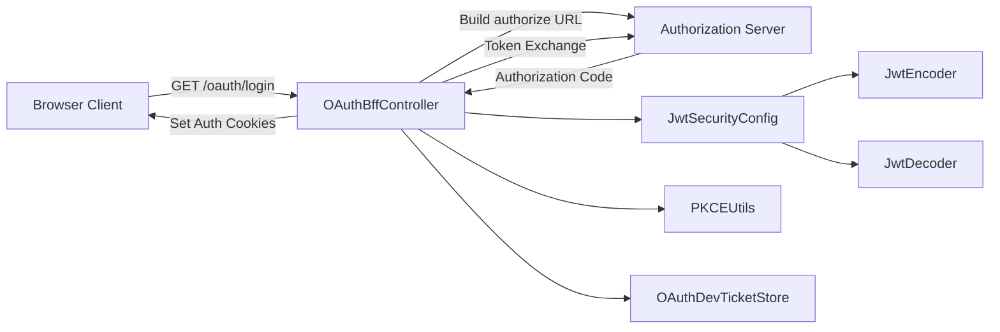
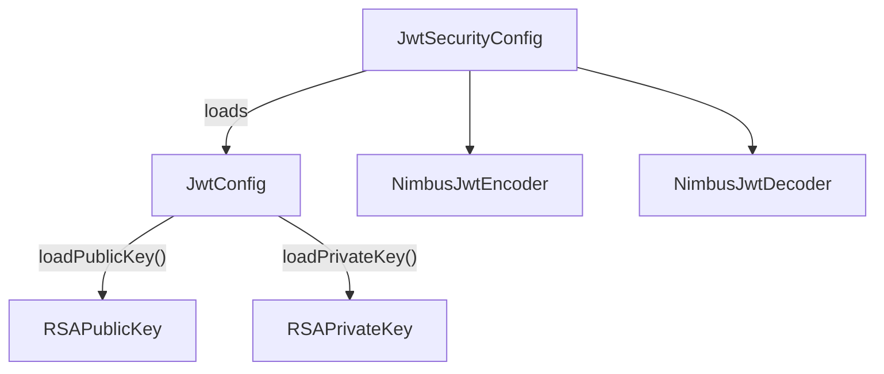
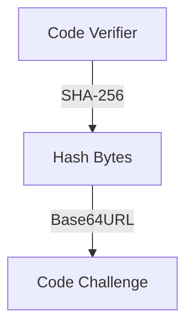
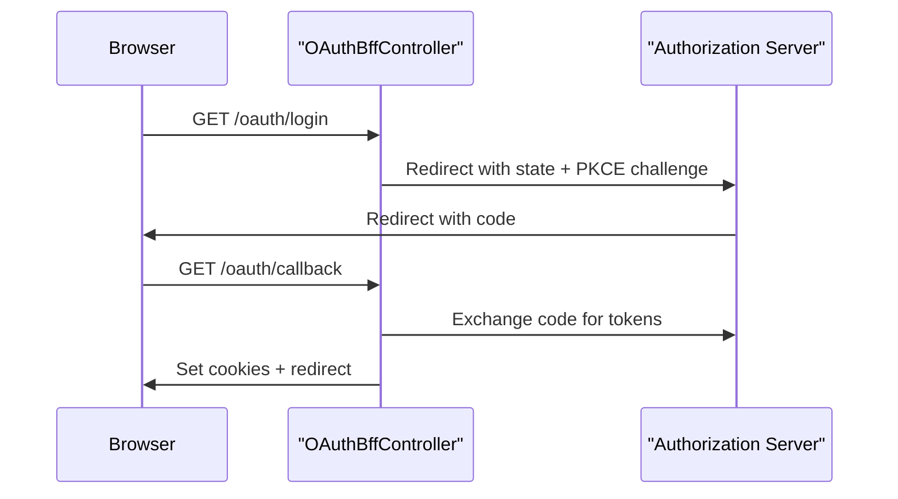
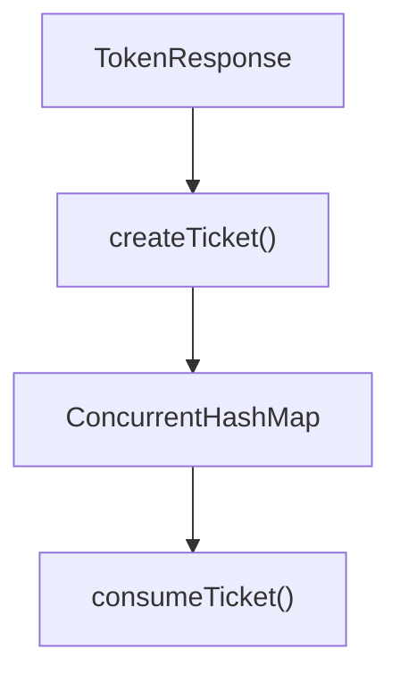
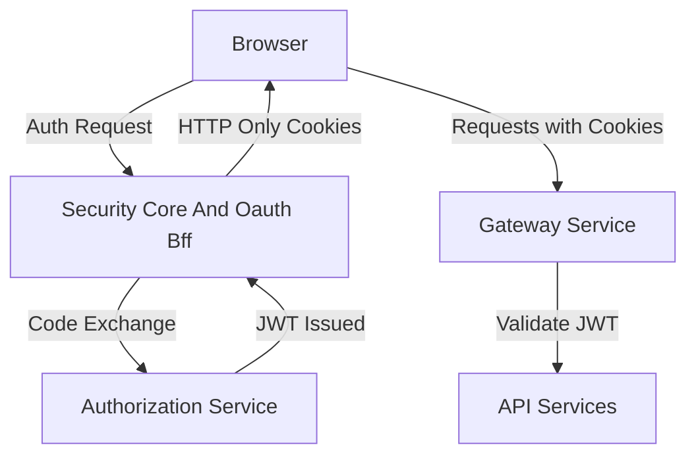

# Security Core And Oauth Bff

## Overview

The **Security Core And Oauth Bff** module provides the foundational security primitives and OAuth2 Backend-for-Frontend (BFF) capabilities for the OpenFrame platform. It is responsible for:

- JWT key management, encoding, and decoding
- PKCE utilities for secure OAuth2 flows
- Centralized security constants
- OAuth2 login, callback, refresh, and logout orchestration
- Secure cookie handling for browser-based authentication
- Development ticket exchange for local/dev workflows

This module acts as the bridge between:

- The Authorization Server (see `authorization-service-core`)
- The Gateway layer (see `gateway-service-core`)
- Browser-based frontend applications

It encapsulates both **cryptographic primitives** (JWT, PKCE) and **BFF orchestration logic** for OAuth2 flows.

---

## High-Level Architecture



### Core Responsibilities

1. **JWT Infrastructure** – Key loading, encoding, and decoding.
2. **PKCE Support** – Secure OAuth2 authorization code flow.
3. **OAuth BFF Flow Management** – Login, callback, refresh, logout.
4. **Secure Cookie Management** – Token transport via HTTP-only cookies.
5. **Development Utilities** – Dev ticket exchange for debugging and local testing.

---

## Internal Components

The module is logically divided into two areas:

### 1. Security Core

Provides cryptographic primitives and shared security utilities.

| Component | Responsibility |
|------------|----------------|
| `JwtSecurityConfig` | Configures `JwtEncoder` and `JwtDecoder` beans |
| `JwtConfig` | Loads RSA public/private keys and JWT properties |
| `SecurityConstants` | Shared token/header/cookie constants |
| `PKCEUtils` | PKCE state, verifier, challenge generation |

---

### 2. OAuth BFF Layer

Implements the OAuth2 browser-based flow orchestration.

| Component | Responsibility |
|------------|----------------|
| `OAuthBffController` | REST endpoints for login, callback, refresh, logout |
| `InMemoryOAuthDevTicketStore` | Temporary dev ticket store |
| `DefaultRedirectTargetResolver` | Determines safe redirect target |
| `NoopForwardedHeadersContributor` | Default no-op forwarded headers strategy |

---

# Security Core

## JWT Configuration

### JwtSecurityConfig

Registers Spring Security JWT infrastructure:

- `JwtEncoder` using `NimbusJwtEncoder`
- `JwtDecoder` using `NimbusJwtDecoder`
- Backed by RSA keys from `JwtConfig`



### JwtConfig

Configured via Spring Boot properties:

```text
jwt.public-key.value
jwt.private-key.value
jwt.issuer
jwt.audience
```

Responsibilities:

- Strip PEM headers
- Base64 decode key material
- Generate `RSAPrivateKey` using `PKCS8EncodedKeySpec`
- Provide `RSAPublicKey`

This ensures the platform can:

- Issue signed JWTs
- Validate inbound JWTs
- Maintain consistent issuer/audience validation

---

## PKCE Utilities

### PKCEUtils

Implements RFC 7636 (Proof Key for Code Exchange).

Functions:

- `generateState()` – 128-bit CSRF protection value
- `generateCodeVerifier()` – 256-bit random verifier
- `generateCodeChallenge()` – SHA-256 hash of verifier
- Base64URL encoding (no padding)



Security guarantees:

- Prevents authorization code interception
- Protects against CSRF
- Eliminates reliance on client secrets in public clients

---

## Security Constants

`SecurityConstants` centralizes:

- `ACCESS_TOKEN`
- `REFRESH_TOKEN`
- `ACCESS_TOKEN_HEADER`
- `REFRESH_TOKEN_HEADER`
- `AUTHORIZATION_QUERY_PARAM`

This avoids duplication and ensures consistent header/cookie naming across gateway and services.

---

# OAuth BFF Layer

The OAuth BFF pattern keeps tokens out of browser storage and instead stores them in secure HTTP-only cookies.

## OAuthBffController

Enabled via:

```text
openframe.gateway.oauth.enable=true
```

Base path:

```text
/oauth
```

### Endpoints

| Endpoint | Purpose |
|----------|----------|
| `GET /login` | Start OAuth2 authorization flow |
| `GET /continue` | Continue flow after SSO finalization |
| `GET /callback` | Handle authorization code exchange |
| `POST /refresh` | Refresh access token |
| `GET /logout` | Revoke refresh token + clear cookies |
| `GET /dev-exchange` | Development ticket exchange |

---

## OAuth Login Flow



### Key Security Steps

1. Generate `state` (CSRF protection).
2. Generate PKCE `code_verifier` + `code_challenge`.
3. Store state in secure cookie (TTL configurable).
4. Validate state on callback.
5. Exchange authorization code for tokens.
6. Set HTTP-only auth cookies.
7. Clear state cookie.

---

## Token Refresh

`POST /oauth/refresh`

Behavior:

- Reads refresh token from:
  - Cookie (`refresh_token`)
  - Header (`Refresh-Token`)
- Calls OAuth service to refresh
- Sets new cookies
- Returns `401` if invalid

Supports both:

- Tenant-aware refresh
- Lookup-based refresh

---

## Logout Flow

`GET /oauth/logout`

Steps:

1. Clear auth cookies.
2. Revoke refresh token.
3. Return `204 No Content`.

Ensures both client and server state are invalidated.

---

## Development Ticket Mode

Enabled via:

```text
openframe.gateway.oauth.dev-ticket-enabled=true
```

Purpose:

- Allow token retrieval via one-time dev tickets
- Useful for local frontend debugging

### InMemoryOAuthDevTicketStore

- Stores `TokenResponse` in `ConcurrentHashMap`
- Generates UUID ticket
- `consumeTicket()` removes entry (one-time use)



In production, this can be replaced with a distributed store implementation.

---

## Redirect Target Resolution

### DefaultRedirectTargetResolver

Determines safe redirect target using priority:

1. Explicit `redirectTo` parameter
2. `Referer` header
3. `/` fallback

This prevents null or unsafe redirect handling while remaining flexible.

---

## Forwarded Headers Strategy

### NoopForwardedHeadersContributor

Default no-op implementation.

Allows customization for:

- Reverse proxy environments
- X-Forwarded-* header propagation
- Custom gateway setups

A custom `ForwardedHeadersContributor` can override this behavior.

---

# Integration With Other Modules

Security Core And Oauth Bff integrates closely with:

- `authorization-service-core` – Token issuance and OAuth authorization server
- `gateway-service-core` – Edge authentication and JWT validation
- `mongo-persistence-layer` – OAuth client and token persistence
- `api-service-core-controllers-and-graphql` – Secured business APIs

This module does not persist tokens itself; it delegates issuance and revocation to the authorization layer.

---

# Security Model Summary



### Key Principles

- ✅ No tokens in localStorage
- ✅ HTTP-only secure cookies
- ✅ PKCE enforced
- ✅ CSRF protection via state
- ✅ Refresh token rotation support
- ✅ Tenant-aware flows
- ✅ Pluggable header and redirect strategies

---

# Configuration Summary

```text
jwt.public-key.value
jwt.private-key.value
jwt.issuer
jwt.audience

openframe.gateway.oauth.enable
openframe.gateway.oauth.state-cookie-ttl-seconds
openframe.gateway.oauth.dev-ticket-enabled
```

---

# Conclusion

The **Security Core And Oauth Bff** module provides the cryptographic backbone and browser-safe OAuth orchestration required for a secure, multi-tenant, modern SaaS platform.

It cleanly separates:

- Token issuance (Authorization Service)
- Token validation (Gateway)
- Browser flow orchestration (BFF)
- Cryptographic key management (Security Core)

By combining PKCE, JWT infrastructure, cookie-based token storage, and flexible redirect handling, this module ensures OpenFrame’s authentication model remains secure, extensible, and production-ready.