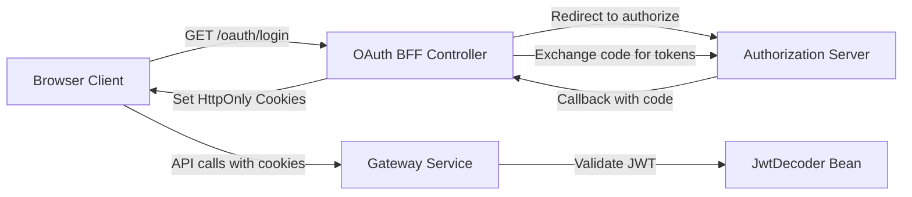
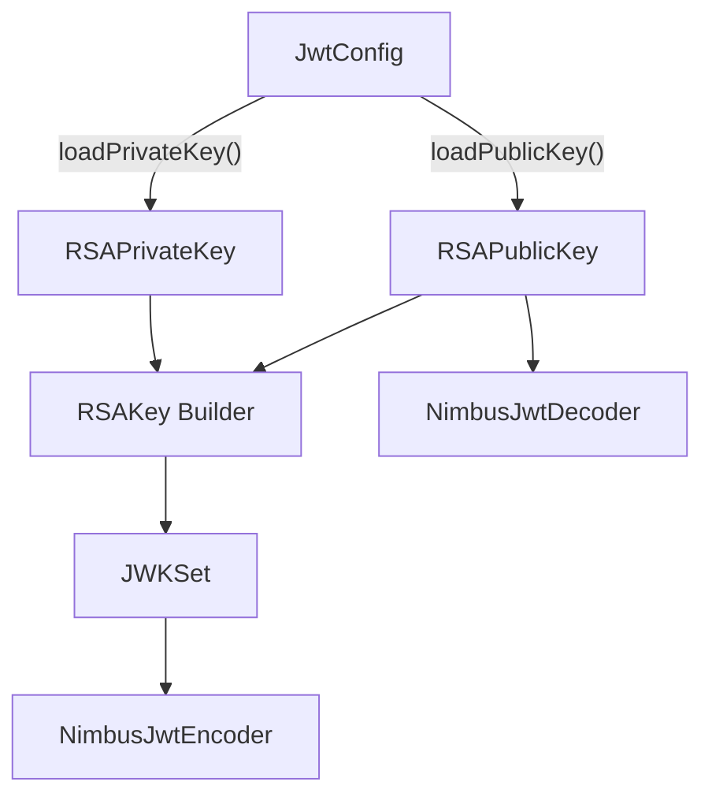
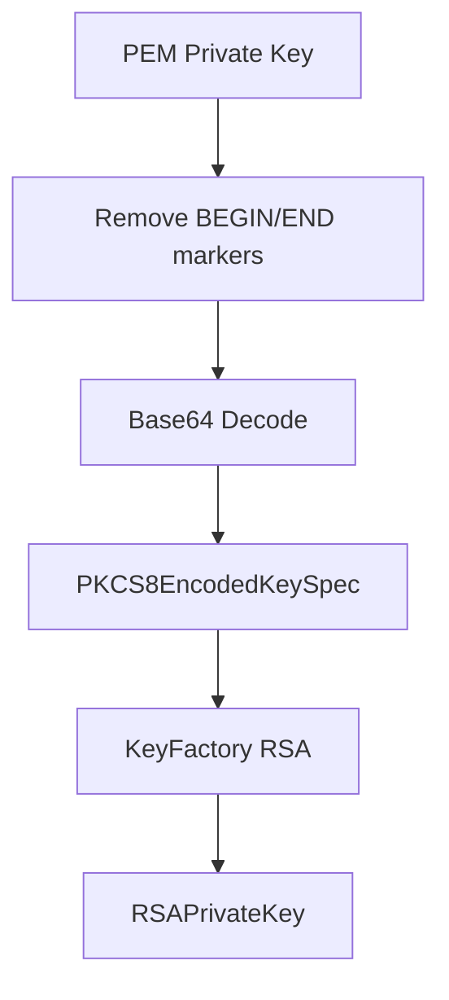
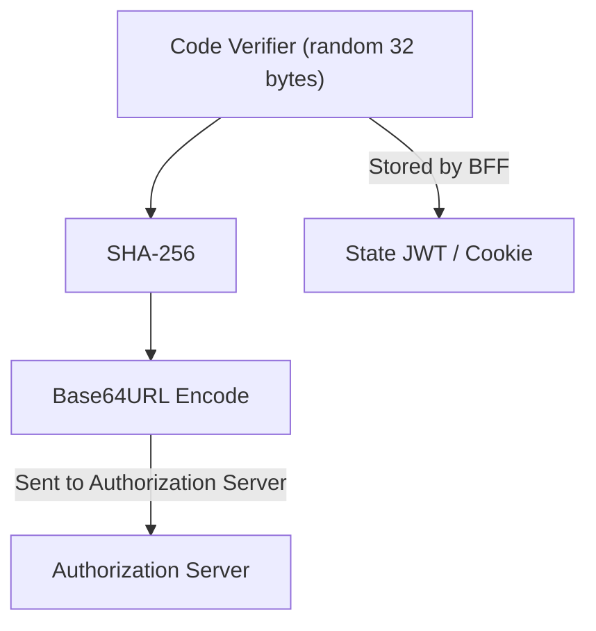
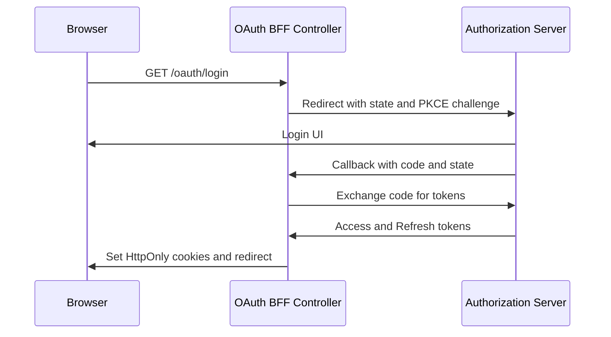
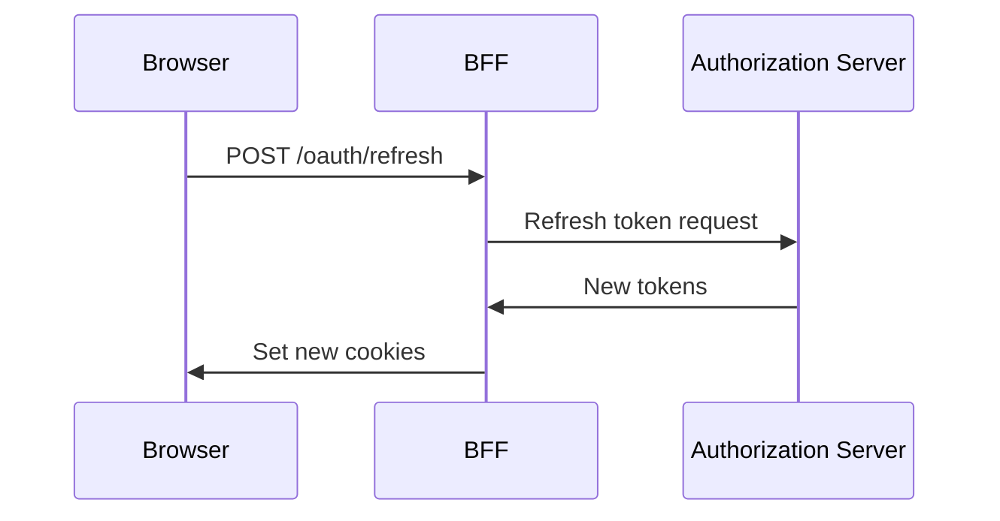
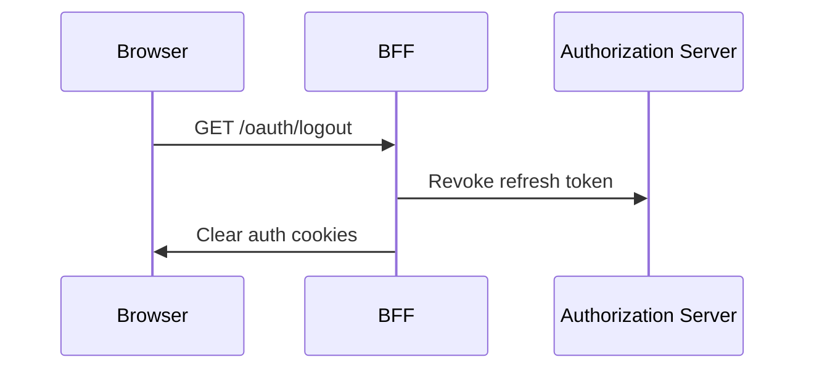
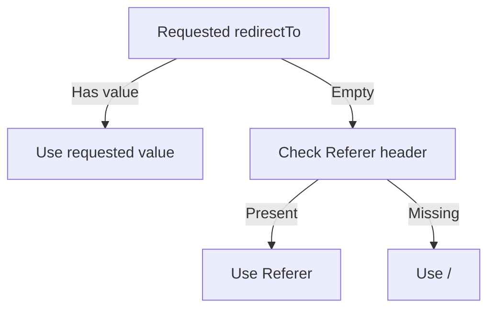

# Security Core And Oauth Bff

## Overview

The **Security Core And Oauth Bff** module provides the foundational security building blocks for the OpenFrame platform. It combines:

- JWT encoding and decoding infrastructure
- RSA key configuration and loading
- PKCE (Proof Key for Code Exchange) utilities
- OAuth2 Backend-for-Frontend (BFF) endpoints
- Redirect resolution and state management

This module acts as the bridge between the platform’s Authorization Server, Gateway, and frontend clients. It centralizes token handling, cookie management, and OAuth flows while remaining configurable and extensible.

---

## Architectural Role in the Platform

At runtime, Security Core And Oauth Bff sits between:

- Frontend clients (browser-based applications)
- The Authorization Server
- The Gateway layer

It is responsible for:

- Initiating OAuth2 authorization flows
- Managing PKCE and state
- Exchanging authorization codes for tokens
- Storing tokens securely in HTTP-only cookies
- Refreshing and revoking tokens
- Providing JWT encoder/decoder beans for internal services

### High-Level Architecture


```mermaid
flowchart LR
    Browser["Browser Client"] -->|"GET /oauth/login"| Bff["OAuth BFF Controller"]
    Bff -->|"Redirect to authorize"| AuthServer["Authorization Server"]
    AuthServer -->|"Callback with code"| Bff
    Bff -->|"Exchange code for tokens"| AuthServer
    Bff -->|"Set HttpOnly Cookies"| Browser

    Browser -->|"API calls with cookies"| Gateway["Gateway Service"]
    Gateway -->|"Validate JWT"| JwtDecoder["JwtDecoder Bean"]
```

---

## Core Components

### 1. JwtSecurityConfig

**Class:** `JwtSecurityConfig`

This Spring configuration class provides the core JWT infrastructure:

- `JwtEncoder` bean using `NimbusJwtEncoder`
- `JwtDecoder` bean using `NimbusJwtDecoder`
- RSA-based signing and verification

#### Responsibilities

- Build a JWK set from configured RSA keys
- Expose a `JwtEncoder` for signing tokens
- Expose a `JwtDecoder` for validating tokens

### JWT Bean Configuration Flow


```mermaid
flowchart TD
    JwtConfig["JwtConfig"] -->|"loadPublicKey()"| PublicKey["RSAPublicKey"]
    JwtConfig -->|"loadPrivateKey()"| PrivateKey["RSAPrivateKey"]

    PublicKey --> RsaKey["RSAKey Builder"]
    PrivateKey --> RsaKey

    RsaKey --> JwkSet["JWKSet"]
    JwkSet --> JwtEncoder["NimbusJwtEncoder"]

    PublicKey --> JwtDecoder["NimbusJwtDecoder"]
```

This design ensures:

- Strong asymmetric cryptography (RSA)
- Compatibility with Spring Security OAuth2 Resource Server
- Clean separation of configuration and usage

---

### 2. JwtConfig

**Class:** `JwtConfig`

`JwtConfig` is a Spring `@ConfigurationProperties` service that binds properties under the `jwt` prefix.

#### Properties

- `publicKey`
- `privateKey`
- `issuer`
- `audience`

#### Key Responsibilities

- Load RSA public key
- Parse and decode PEM-encoded private key
- Produce `RSAPublicKey` and `RSAPrivateKey` instances

The private key loading process:


```mermaid
flowchart TD
    PemString["PEM Private Key"] --> StripHeaders["Remove BEGIN/END markers"]
    StripHeaders --> Base64Decode["Base64 Decode"]
    Base64Decode --> KeySpec["PKCS8EncodedKeySpec"]
    KeySpec --> KeyFactory["KeyFactory RSA"]
    KeyFactory --> RsaPrivate["RSAPrivateKey"]
```

This encapsulation prevents direct cryptographic handling throughout the codebase and centralizes key logic.

---

### 3. SecurityConstants

**Class:** `SecurityConstants`

Defines standardized names used across OAuth flows:

- `authorization` query parameter
- `access_token`
- `refresh_token`
- `Access-Token` header
- `Refresh-Token` header

This prevents string duplication and ensures consistent token propagation between:

- BFF controller
- Cookie service
- Gateway filters

---

### 4. PKCEUtils

**Class:** `PKCEUtils`

Utility class implementing PKCE for secure OAuth2 Authorization Code flows.

#### Provided Methods

- `generateState()` – 128-bit random value
- `generateCodeVerifier()` – 256-bit random value
- `generateCodeChallenge()` – SHA-256 based challenge
- `urlEncode()` – Safe redirect parameter encoding

### PKCE Flow


```mermaid
flowchart TD
    Verifier["Code Verifier (random 32 bytes)"] --> Hash["SHA-256"]
    Hash --> Challenge["Base64URL Encode"]

    Challenge -->|"Sent to Authorization Server"| AuthServer["Authorization Server"]
    Verifier -->|"Stored by BFF"| BffStore["State JWT / Cookie"]
```

This ensures:

- Protection against authorization code interception
- CSRF mitigation via state parameter
- Strong cryptographic randomness via `SecureRandom`

---

## OAuth Backend-For-Frontend (BFF)

### OAuthBffController

**Class:** `OAuthBffController`

This is the central HTTP interface for browser-based authentication.

It is conditionally enabled via:

- `openframe.gateway.oauth.enable=true`

### Exposed Endpoints

| Endpoint | Method | Purpose |
|-----------|--------|----------|
| `/oauth/login` | GET | Start OAuth flow |
| `/oauth/continue` | GET | Continue flow without clearing session |
| `/oauth/callback` | GET | Handle authorization code |
| `/oauth/refresh` | POST | Refresh tokens |
| `/oauth/logout` | GET | Revoke refresh token and clear cookies |
| `/oauth/dev-exchange` | GET | Exchange development ticket |

---

## End-to-End Login Flow


```mermaid
sequenceDiagram
    participant Browser
    participant BFF as OAuth BFF Controller
    participant Auth as Authorization Server

    Browser->>BFF: GET /oauth/login
    BFF->>Auth: Redirect with state and PKCE challenge
    Auth->>Browser: Login UI
    Auth->>BFF: Callback with code and state
    BFF->>Auth: Exchange code for tokens
    Auth->>BFF: Access and Refresh tokens
    BFF->>Browser: Set HttpOnly cookies and redirect
```

### Key Mechanics

1. State is signed as a JWT.
2. State cookie is stored with configurable TTL.
3. Tokens are returned as HTTP-only cookies.
4. Optional development ticket injection.
5. Errors redirect to configured error URL.

---

## Token Refresh Flow


```mermaid
sequenceDiagram
    participant Browser
    participant BFF
    participant Auth as Authorization Server

    Browser->>BFF: POST /oauth/refresh
    BFF->>Auth: Refresh token request
    Auth->>BFF: New tokens
    BFF->>Browser: Set new cookies
```

Features:

- Supports refresh via cookie or header
- Supports tenant-based lookup
- Returns 401 if token missing or invalid

---

## Logout Flow


```mermaid
sequenceDiagram
    participant Browser
    participant BFF
    participant Auth as Authorization Server

    Browser->>BFF: GET /oauth/logout
    BFF->>Auth: Revoke refresh token
    BFF->>Browser: Clear auth cookies
```

Logout ensures:

- Refresh token revocation
- Cookie invalidation
- Stateless cleanup

---

## Redirect Resolution

### DefaultRedirectTargetResolver

Provides fallback redirect resolution logic:

1. Use explicit `redirectTo` parameter if provided
2. Fallback to `Referer` header
3. Default to `/`


```mermaid
flowchart TD
    Requested["Requested redirectTo"] -->|"Has value"| UseRequested["Use requested value"]
    Requested -->|"Empty"| RefererCheck["Check Referer header"]
    RefererCheck -->|"Present"| UseReferer["Use Referer"]
    RefererCheck -->|"Missing"| DefaultRoot["Use /"]
```

This allows safe continuation after login without tight frontend coupling.

---

## Security Design Principles

Security Core And Oauth Bff follows these principles:

- **Asymmetric cryptography** for JWT signing
- **Short-lived state tokens** for CSRF prevention
- **PKCE enforcement** for public clients
- **HttpOnly cookie storage** for tokens
- **Tenant-aware flows**
- **Reactive non-blocking controllers** using Project Reactor

---

## Configuration Overview

### JWT Properties

```text
jwt.publicKey.value=<PEM_PUBLIC_KEY>
jwt.privateKey.value=<PEM_PRIVATE_KEY>
jwt.issuer=openframe
jwt.audience=openframe-api
```

### OAuth BFF Properties

```text
openframe.gateway.oauth.enable=true
openframe.gateway.oauth.state-cookie-ttl-seconds=180
openframe.gateway.oauth.dev-ticket-enabled=true
openframe.auth.error-url=/auth/error
```

---

## Extension Points

Security Core And Oauth Bff is designed to be extended:

- Replace `RedirectTargetResolver`
- Customize cookie behavior via `CookieService`
- Extend `OAuthBffService`
- Plug in alternative key loading mechanisms

---

## Summary

The **Security Core And Oauth Bff** module provides:

- JWT cryptographic infrastructure
- OAuth2 BFF endpoints
- PKCE and CSRF protection
- Token refresh and revocation logic
- Redirect safety and cookie management

It is a foundational module that secures the entire OpenFrame request lifecycle, enabling multi-tenant, OAuth2-compliant, and browser-safe authentication flows.