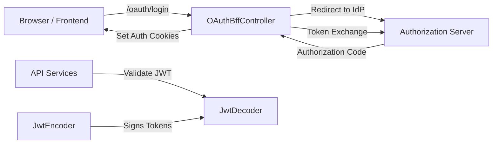
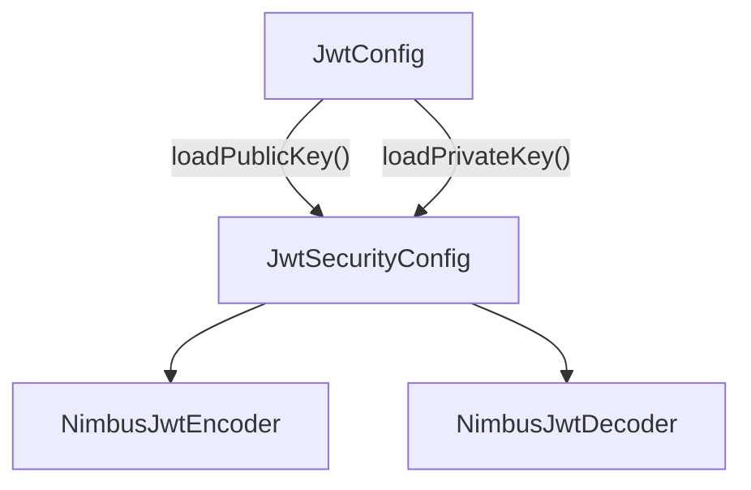
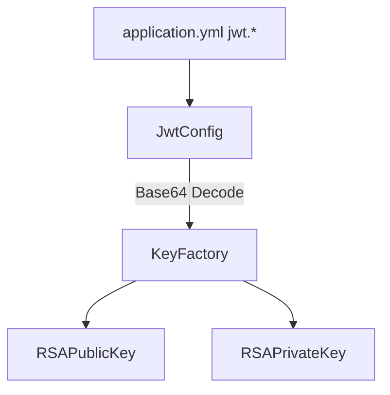
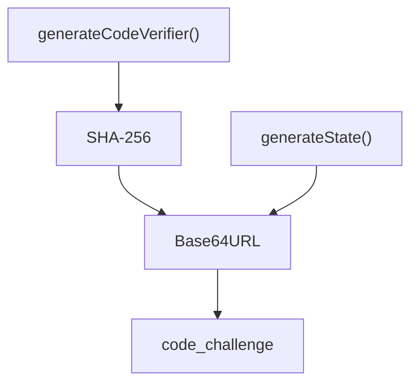
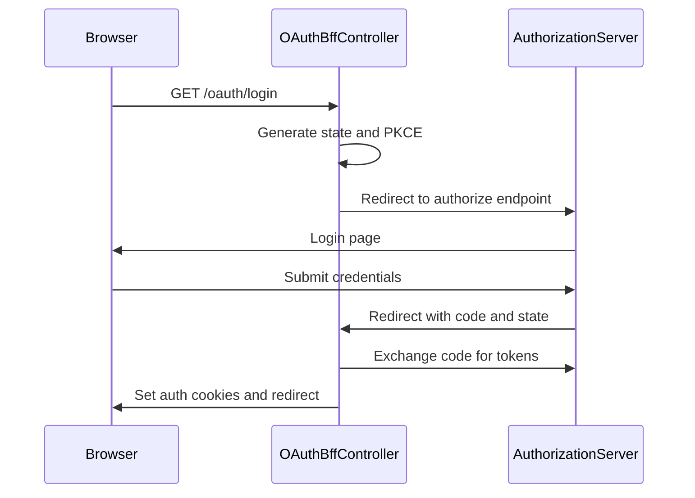
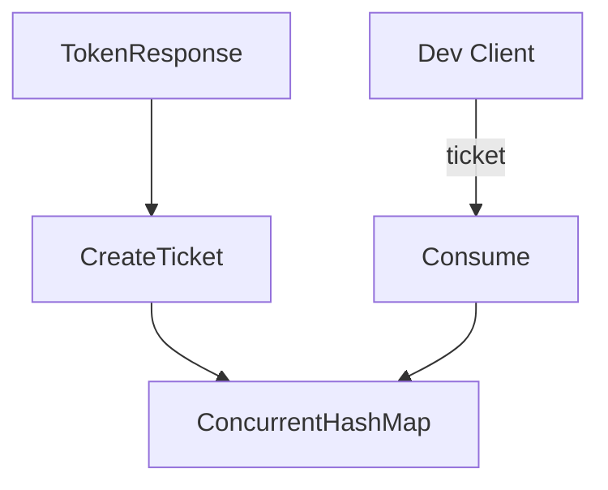
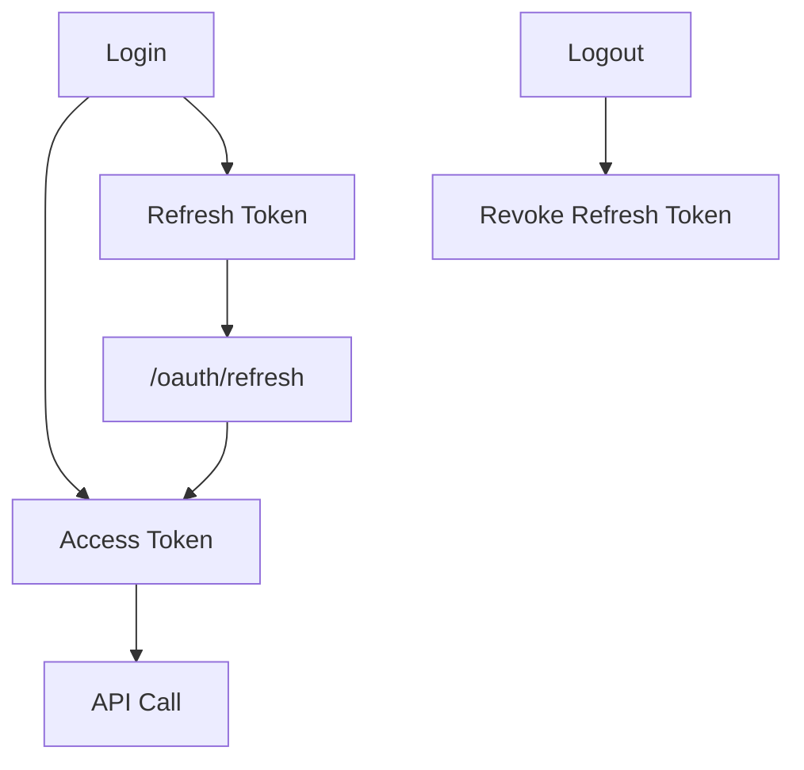

# Security Oauth And Jwt

## Overview

The **Security Oauth And Jwt** module provides the foundational security building blocks for the OpenFrame platform. It is responsible for:

- JWT encoding and decoding using RSA keys
- OAuth2 login and token lifecycle management (Authorization Code + PKCE)
- Backend-for-Frontend (BFF) OAuth orchestration
- Secure cookie handling for access and refresh tokens
- Development ticket exchange for local or debug scenarios

This module acts as the glue between:

- The Authorization Server
- The Gateway Service
- API Services
- Frontend applications (via BFF endpoints)

It centralizes token generation, validation, and OAuth flow coordination while remaining reusable across services.

---

## Architectural Context

At a high level, Security Oauth And Jwt sits between client-facing services and the Authorization Server.



### Key Responsibilities

1. **JWT Infrastructure** – RSA-based signing and verification
2. **OAuth BFF Flow** – Secure Authorization Code + PKCE orchestration
3. **Token Storage Strategy** – HttpOnly cookies and optional dev headers
4. **PKCE & State Security** – CSRF mitigation and proof-of-possession

---

## Module Components

The module is divided into two main areas:

- Core JWT configuration (security-core)
- OAuth BFF orchestration (security-oauth)

---

# JWT Infrastructure

## JwtSecurityConfig

**Component:** `JwtSecurityConfig`

This configuration class wires the Spring Security JWT encoder and decoder.

### Responsibilities

- Creates a `JwtEncoder` using an RSA key pair
- Creates a `JwtDecoder` using the RSA public key
- Uses Nimbus JOSE implementation



### Security Model

- **Private key** → used for signing tokens
- **Public key** → used for verifying tokens
- Decoder does not require private key

This separation enables safe public key distribution to downstream services.

---

## JwtConfig

**Component:** `JwtConfig`

Configuration properties bound under the `jwt` prefix.

### Responsibilities

- Loads RSA public key
- Loads RSA private key (PKCS8)
- Exposes issuer and audience
- Converts PEM values to `RSAPublicKey` and `RSAPrivateKey`



### Security Considerations

- Private key material is stripped of headers and whitespace
- Uses Java `KeyFactory` with RSA algorithm
- Designed for externalized secret management

---

## SecurityConstants

Defines shared OAuth and token header names:

- `ACCESS_TOKEN`
- `REFRESH_TOKEN`
- `ACCESS_TOKEN_HEADER`
- `REFRESH_TOKEN_HEADER`
- `AUTHORIZATION_QUERY_PARAM`

This avoids hard-coded strings across services.

---

# PKCE Support

## PKCEUtils

Implements Proof Key for Code Exchange utilities.

### Responsibilities

- Generate cryptographically secure state parameter
- Generate code verifier (256-bit entropy)
- Generate SHA-256 code challenge
- Base64URL encoding (no padding)



### Security Impact

- Protects against authorization code interception
- Mitigates CSRF via state parameter
- Uses `SecureRandom` for entropy

---

# OAuth BFF Layer

The OAuth BFF layer implements a secure Backend-for-Frontend pattern.

## OAuthBffController

Primary entry point for OAuth operations.

Base path: `/oauth`

### Endpoints

| Endpoint | Purpose |
|-----------|----------|
| `/login` | Initiates OAuth login with PKCE + state |
| `/continue` | Continues flow without clearing cookies |
| `/callback` | Handles authorization code exchange |
| `/refresh` | Refreshes access token |
| `/logout` | Revokes refresh token and clears cookies |
| `/dev-exchange` | Exchanges dev ticket for tokens |

---

## OAuth Login Flow



### Security Behavior

- Clears existing auth cookies before login
- Creates signed state JWT
- Stores state in secure cookie
- Validates state during callback
- Exchanges code for tokens
- Stores tokens in HttpOnly cookies

---

## Token Refresh

Flow:

1. Extract refresh token from cookie or header
2. Lookup tenant if required
3. Call OAuth service refresh endpoint
4. Replace cookies

If token missing or invalid → returns 401.

---

## Logout

- Clears auth cookies
- Revokes refresh token
- Returns 204 No Content

Prevents reuse of refresh tokens.

---

## Development Ticket Flow

### InMemoryOAuthDevTicketStore

Used when dev ticket feature is enabled.



### Purpose

- Allows secure token handoff in development
- Avoids exposing cookies in cross-origin environments
- Stores tokens temporarily in memory

This component is conditionally loaded if no other `OAuthDevTicketStore` bean is present.

---

## Redirect Resolution

### DefaultRedirectTargetResolver

Determines final redirect target after login.

Priority order:

1. Explicit `redirectTo` parameter
2. HTTP `Referer` header
3. Fallback to `/`

Designed to prevent redirect confusion and ensure safe defaults.

---

## Forwarded Header Handling

### NoopForwardedHeadersContributor

Provides a no-op implementation when no custom forwarded header contributor exists.

This prevents missing bean errors in reactive environments and allows downstream customization.

---

# Token Lifecycle



---

# Integration Points

Security Oauth And Jwt integrates with:

- Authorization Service (token issuing authority)
- Gateway Service (JWT validation at edge)
- API Services (resource server validation)
- CookieService (secure token storage)

It does not implement user storage or credential validation directly — those responsibilities belong to the Authorization Server module.

---

# Security Design Principles

## 1. Asymmetric Cryptography

- RSA key pair
- Public key distribution allowed
- Private key never exposed

## 2. PKCE Everywhere

- Code verifier (256-bit entropy)
- SHA-256 challenge
- Base64URL without padding

## 3. HttpOnly Cookie Strategy

- Tokens not exposed to JavaScript
- Refresh tokens stored securely
- Cookies cleared on logout

## 4. Reactive and Stateless

- WebFlux compatible
- Stateless JWT validation
- No session storage required

---

# Configuration Summary

Typical configuration properties:

```text
jwt.public-key.value
jwt.private-key.value
jwt.issuer
jwt.audience
openframe.gateway.oauth.enable
openframe.gateway.oauth.state-cookie-ttl-seconds
openframe.gateway.oauth.dev-ticket-enabled
openframe.auth.error-url
```

---

# Summary

The **Security Oauth And Jwt** module provides:

- RSA-based JWT encoding and decoding
- PKCE-secured OAuth2 flows
- Backend-for-Frontend orchestration
- Token lifecycle management
- Development token exchange support

It forms the core security backbone of the OpenFrame platform, ensuring secure, scalable, and standards-compliant authentication across services.