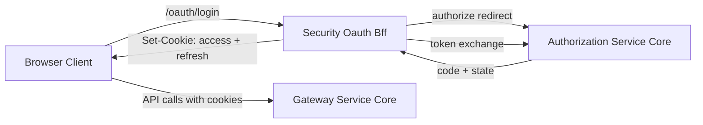
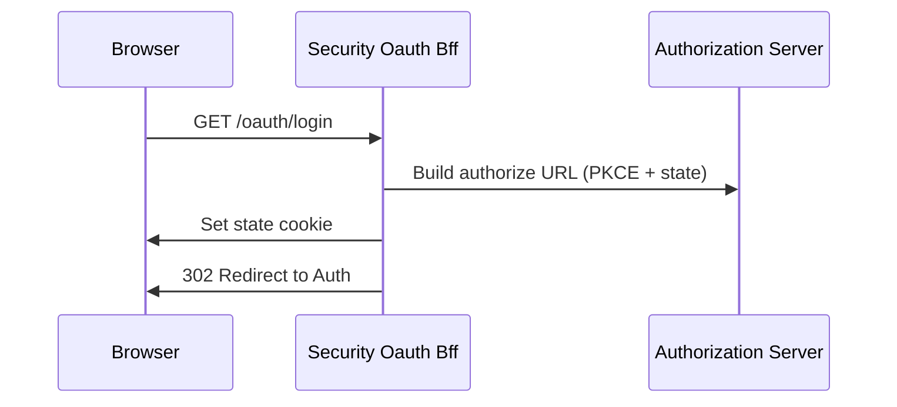
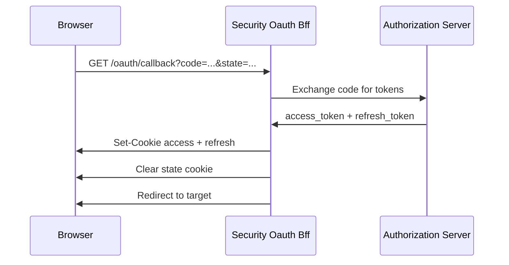
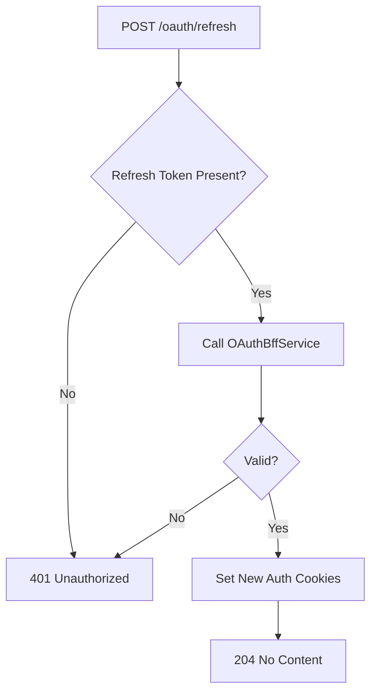
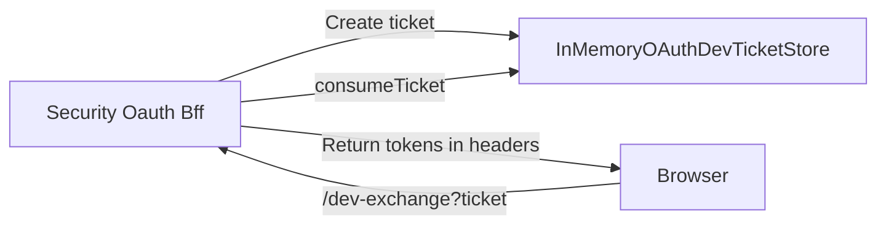

# Security Oauth Bff

## Overview

The **Security Oauth Bff** module implements a Backend-for-Frontend (BFF) layer for OAuth2 and OpenID Connect flows in the OpenFrame platform. It acts as a secure bridge between browser-based clients and the Authorization Server, handling:

- OAuth2 Authorization Code + PKCE flows
- State management and CSRF protection
- Access and refresh token handling via HTTP-only cookies
- Token refresh and revocation
- Optional development ticket exchange for local debugging

This module is reactive (Spring WebFlux) and is conditionally enabled through configuration:

```text
openframe.gateway.oauth.enable=true
```

When enabled, it exposes `/oauth/*` endpoints that orchestrate login, callback handling, refresh, logout, and development exchange flows.

---

## Architectural Role in the Platform

Security Oauth Bff sits between:

- Browser-based frontends (SPA or Web UI)
- Gateway Service Core (routing and edge security)
- Authorization Service Core (OAuth2 Authorization Server)
- Security And Oauth Core (shared JWT, PKCE, constants)

High-level interaction:



### Key Responsibilities

1. Generate OAuth authorize redirects with PKCE and state.
2. Store state in signed JWT cookies.
3. Exchange authorization code for tokens.
4. Set secure HTTP-only authentication cookies.
5. Refresh tokens transparently.
6. Revoke refresh tokens on logout.
7. Support development token exchange via short-lived tickets.

---

## Core Components

The module consists of the following core components:

- `OAuthBffController`
- `InMemoryOAuthDevTicketStore`
- `DefaultRedirectTargetResolver`
- `NoopForwardedHeadersContributor`

Each plays a distinct role in the OAuth lifecycle.

---

# OAuth Flow Lifecycle

## 1. Login Flow

Endpoint:

```text
GET /oauth/login?tenantId={tenant}&redirectTo={url}&provider={provider}
```

### Responsibilities

- Clears existing SAS cookies.
- Builds an authorization redirect URL via `OAuthBffService`.
- Generates a signed state JWT.
- Stores state in a short-lived cookie.
- Redirects to the Authorization Server.

Flow:



### State Handling

- State is wrapped into a JWT.
- TTL controlled by:

```text
openframe.gateway.oauth.state-cookie-ttl-seconds (default 180)
```

This protects against CSRF and replay attacks.

---

## 2. Continue Flow

Endpoint:

```text
GET /oauth/continue
```

This flow is used when:

- The user is already authenticated.
- The system needs to restart the OAuth redirect (e.g., after SSO finalization).

Unlike `/login`, it does **not** clear cookies.

---

## 3. Callback Flow

Endpoint:

```text
GET /oauth/callback?code={code}&state={state}
```

### Responsibilities

- Validates state from cookie.
- Exchanges authorization code for tokens.
- Sets access and refresh cookies.
- Clears state cookie.
- Redirects to resolved target.

Flow:



### Error Handling

If token exchange fails:

- The user is redirected back.
- Query parameters appended:

```text
?error=oauth_failed&message={encoded_message}
```

The redirect target is resolved from:

1. Original state cookie redirect
2. HTTP Referer header
3. Fallback `/`

---

## 4. Refresh Flow

Endpoint:

```text
POST /oauth/refresh
```

Refresh token sources:

- `refresh_token` cookie
- `X-Refresh-Token` header

Behavior:

- If tenantId provided → direct refresh.
- Otherwise → lookup-based refresh.
- Returns `204 No Content` with new cookies.
- Returns `401` if invalid or missing.

Flow:



---

## 5. Logout Flow

Endpoint:

```text
GET /oauth/logout
```

Responsibilities:

- Clears auth cookies.
- Revokes refresh token (tenant-based or lookup).
- Returns `204 No Content`.

This ensures server-side invalidation of refresh tokens.

---

## 6. Development Ticket Exchange

Endpoint:

```text
GET /oauth/dev-exchange?ticket={id}
```

Enabled via:

```text
openframe.gateway.oauth.dev-ticket-enabled=true
```

### Purpose

Allows local development tools to:

- Receive a temporary ticket in redirect.
- Exchange it for real tokens via headers.

Flow:



This avoids exposing tokens in URLs during development.

---

# Component Details

## OAuthBffController

Primary REST controller responsible for:

- `/login`
- `/continue`
- `/callback`
- `/refresh`
- `/logout`
- `/dev-exchange`

Key characteristics:

- Reactive (`Mono<ResponseEntity<?>>`)
- Conditionally enabled via configuration
- Delegates core logic to `OAuthBffService`
- Uses `CookieService` for cookie management

Security constants (headers, cookie names) are reused from shared security modules.

---

## InMemoryOAuthDevTicketStore

Implements `OAuthDevTicketStore`.

### Responsibilities

- Stores `TokenResponse` objects in memory.
- Uses `ConcurrentHashMap`.
- Generates UUID ticket IDs.
- Removes tickets on consumption.

This is a default implementation activated when no other bean exists.

Suitable for:

- Local development
- Single-instance deployments

For distributed systems, a Redis-backed implementation would be preferable.

---

## DefaultRedirectTargetResolver

Resolves the final redirect target after authentication.

Resolution order:

1. Explicit `redirectTo` parameter.
2. HTTP Referer header.
3. `/` fallback.

This avoids null redirects and ensures predictable navigation behavior.

---

## NoopForwardedHeadersContributor

Default no-operation implementation of `ForwardedHeadersContributor`.

Purpose:

- Allows override when reverse proxy headers are required.
- Prevents missing bean errors.

If a custom forwarded header strategy is provided, this bean is ignored.

---

# Security Considerations

## Cookie Strategy

- Access token → HTTP-only cookie.
- Refresh token → HTTP-only cookie.
- State cookie → short-lived JWT.

Benefits:

- Protects tokens from XSS exposure.
- Prevents token storage in localStorage.
- Enables silent refresh patterns.

---

## PKCE and State Protection

The BFF:

- Generates PKCE challenge and verifier.
- Signs state with JWT.
- Validates state on callback.

This protects against:

- CSRF attacks
- Authorization code injection
- Replay attacks

---

## Absolute Redirect Validation

The controller checks whether redirect URLs are absolute (`http://` or `https://`).

If not absolute:

- Falls back to referer or `/`.

This prevents open redirect vulnerabilities.

---

# Configuration Summary

```text
openframe.gateway.oauth.enable=true
openframe.gateway.oauth.state-cookie-ttl-seconds=180
openframe.gateway.oauth.dev-ticket-enabled=true
```

These flags control:

- Module activation
- State expiration window
- Development exchange capability

---

# Summary

Security Oauth Bff is a critical security boundary in the OpenFrame platform. It:

- Encapsulates OAuth2 complexity from frontends.
- Centralizes cookie-based token handling.
- Implements secure redirect and state validation.
- Enables development-friendly token exchange.

By enforcing PKCE, state validation, secure cookies, and controlled redirect resolution, it provides a hardened OAuth integration layer aligned with modern best practices for SPA and microservice architectures.
