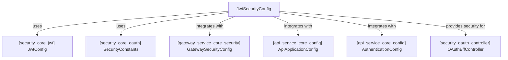
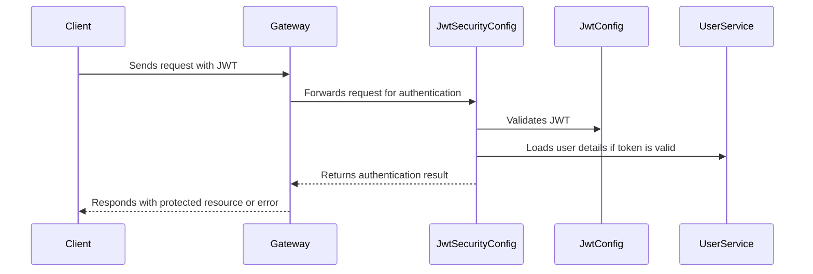

# security_core_config Module Documentation

## Introduction

The `security_core_config` module is responsible for configuring JWT-based security for the application. It provides the foundational security configuration required for authentication and authorization using JSON Web Tokens (JWT). This module is a critical part of the system's security infrastructure, ensuring that only authenticated and authorized users can access protected resources.

## Core Component

- **JwtSecurityConfig**: The primary configuration class that sets up JWT security mechanisms, including token validation, authentication filters, and integration with the broader security context of the application.

## Purpose and Core Functionality

The main purpose of the `security_core_config` module is to:

- Define and initialize JWT security settings for the application.
- Integrate JWT authentication with the application's security filter chain.
- Provide configuration hooks for customizing token validation, error handling, and security policies.
- Serve as the entry point for all JWT-related security concerns in the application.

## Architecture and Component Relationships

The `security_core_config` module is designed to work closely with other security-related modules and components, forming a layered security architecture. The following diagram illustrates the high-level architecture and dependencies:

### Component Interaction

- **JwtSecurityConfig** imports and utilizes configuration values from `[security_core_jwt] JwtConfig` and `[security_core_oauth] SecurityConstants` to set up JWT validation and security constants.
- It integrates with the broader application security context, including `[gateway_service_core_security] GatewaySecurityConfig` and `[api_service_core_config] ApiApplicationConfig`, to ensure consistent security policies across the system.
- The configuration provided by `JwtSecurityConfig` is leveraged by controllers such as `[security_oauth_controller] OAuthBffController` to enforce authentication and authorization.

## Data Flow and Process Overview

The following diagram outlines the typical authentication flow involving the `security_core_config` module:

## Integration with the Overall System

The `security_core_config` module is a foundational part of the system's security infrastructure. It works in conjunction with:

- **[security_core_jwt] JwtConfig**: Handles the specifics of JWT token creation, signing, and validation. See [security_core_jwt.md](security_core_jwt.md) for details.
- **[security_core_oauth] SecurityConstants**: Provides constants and shared values for OAuth and JWT security. See [security_core_oauth.md](security_core_oauth.md).
- **[gateway_service_core_security] GatewaySecurityConfig**: Integrates JWT security at the API gateway level. See [gateway_service_core_security.md](gateway_service_core_security.md).
- **[api_service_core_config] ApiApplicationConfig** and **AuthenticationConfig**: Provide application-wide configuration and authentication settings. See [api_service_core_config.md](api_service_core_config.md).
- **[security_oauth_controller] OAuthBffController**: Utilizes the security configuration to enforce authentication in OAuth flows. See [security_oauth_controller.md](security_oauth_controller.md).

## References

- [security_core_jwt.md](security_core_jwt.md)
- [security_core_oauth.md](security_core_oauth.md)
- [gateway_service_core_security.md](gateway_service_core_security.md)
- [api_service_core_config.md](api_service_core_config.md)
- [security_oauth_controller.md](security_oauth_controller.md)

## Summary

The `security_core_config` module is essential for establishing JWT-based security in the application. By centralizing JWT configuration and integrating with other security modules, it ensures robust authentication and authorization across the system. For further details on related components, refer to the linked documentation files above.
