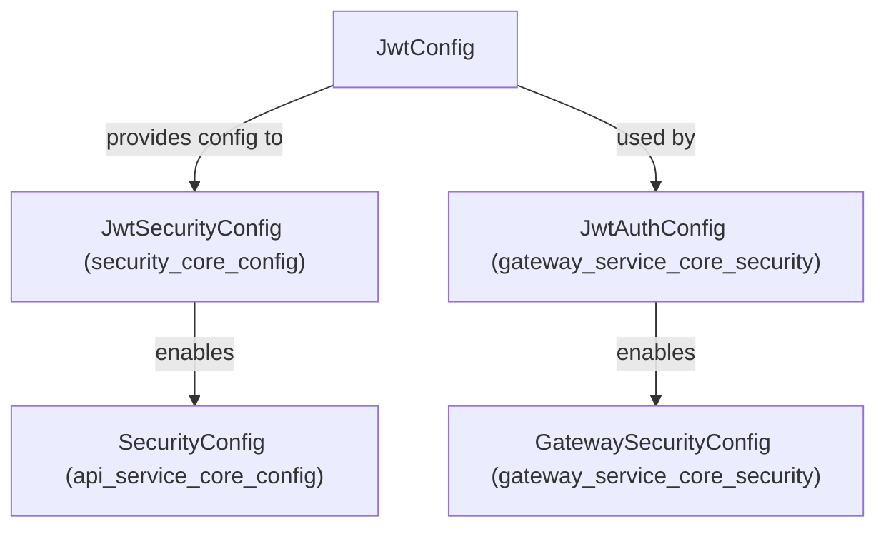
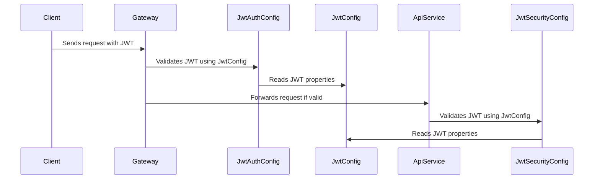

# security_core_jwt Module Documentation

## Introduction

The `security_core_jwt` module provides the foundational configuration and utilities for handling JSON Web Token (JWT) based authentication and authorization within the system. It is a critical part of the security infrastructure, ensuring secure token issuance, validation, and integration with the broader authentication mechanisms.

This module is typically used in conjunction with other security modules such as [`security_core_config`](security_core_config.md) and [`security_core_oauth`](security_core_oauth.md), and is referenced by higher-level security configurations and gateway modules.

---

## Core Functionality

- **JWT Configuration**: Centralizes all JWT-related settings, such as secret keys, token expiration, and signing algorithms.
- **Token Management**: Provides the necessary configuration for token creation and validation, supporting secure stateless authentication.
- **Integration**: Designed to be used by security configuration modules (e.g., [`JwtSecurityConfig`](security_core_config.md)) and gateway security modules (e.g., [`JwtAuthConfig`](gateway_service_core_security.md)).

---

## Architecture Overview

The `security_core_jwt` module is architected to be a low-level provider of JWT configuration, with its main component being `JwtConfig`. It is not responsible for direct token issuance or validation logic, but rather supplies the configuration and properties required by higher-level security modules.

### Component Relationships



- **JwtConfig**: The main configuration bean for JWT properties.
- **JwtSecurityConfig**: Consumes `JwtConfig` to set up JWT authentication in the core API service.
- **JwtAuthConfig**: Consumes `JwtConfig` for JWT authentication in the gateway service.

---

## Data Flow and Process

The following diagram illustrates the typical flow of JWT configuration and usage in the authentication process:



---

## Dependencies and Integration

- **Upstream Dependencies**:
    - [`security_core_config`](security_core_config.md): Consumes `JwtConfig` for API service security.
    - [`gateway_service_core_security`](gateway_service_core_security.md): Consumes `JwtConfig` for gateway security.
- **Related Modules**:
    - [`security_core_oauth`](security_core_oauth.md): Provides OAuth-related security constants and may interact with JWT configuration for hybrid auth scenarios.
    - [`security_core_pkce`](security_core_pkce.md): Handles PKCE utilities, which may be used in conjunction with JWT for enhanced security.

---

## Example Usage

While `security_core_jwt` is not typically used directly by application code, it is referenced by security configuration classes. For example, in a Spring Boot application, you might see:

```java
@Configuration
public class JwtSecurityConfig {
    @Autowired
    private JwtConfig jwtConfig;
    // ... use jwtConfig to configure JWT authentication
}
```

---

## Component Reference

### JwtConfig

The `JwtConfig` component encapsulates all JWT-related configuration properties, such as:
- Secret key
- Token expiration time
- Signing algorithm
- Token issuer and audience

It is typically loaded from application properties or environment variables and injected into security configuration beans.

---

## How It Fits Into the System

The `security_core_jwt` module is a foundational building block for secure, stateless authentication across the platform. By centralizing JWT configuration, it enables consistent and secure token handling in both API and gateway layers, and supports integration with OAuth and PKCE mechanisms for advanced security scenarios.

For more details on how JWT authentication is enforced, see the documentation for [`security_core_config`](security_core_config.md) and [`gateway_service_core_security`](gateway_service_core_security.md).
