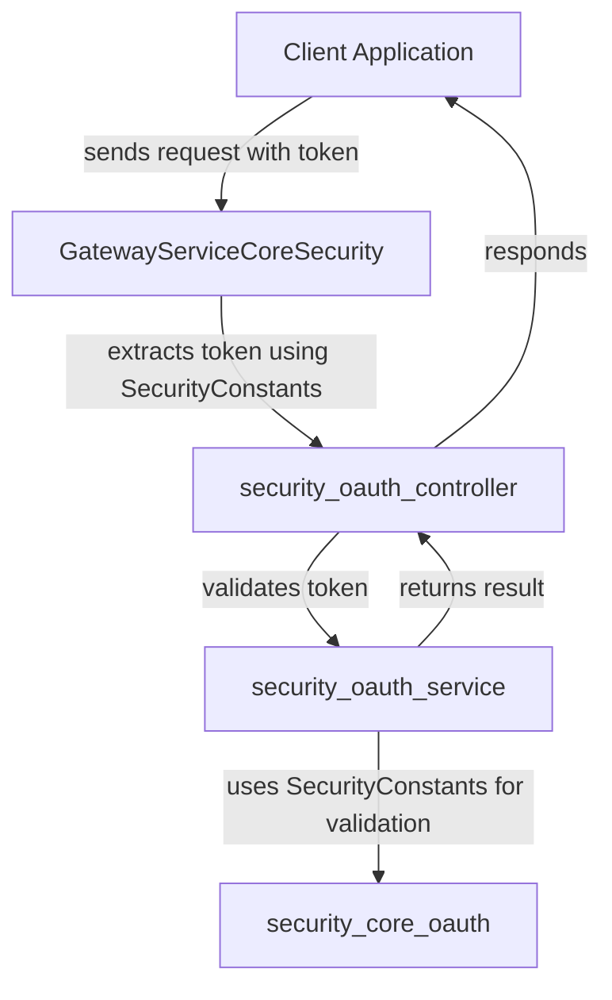

# security_core_oauth Module Documentation

## Introduction

The `security_core_oauth` module provides foundational constants and configuration elements for OAuth-based security within the system. It is a low-level module that defines key security constants used throughout the authentication and authorization flows, especially in modules that implement OAuth 2.0 and OpenID Connect (OIDC) protocols. This module is essential for ensuring consistent security practices and interoperability across the platform's authentication components.

## Core Functionality

- **Centralizes Security Constants:** The module exposes the `SecurityConstants` component, which contains constant values (such as header names, parameter keys, and other identifiers) used in OAuth flows. This ensures that all parts of the system use the same values, reducing the risk of misconfiguration or typographical errors.
- **Supports OAuth and OIDC Flows:** By providing a single source of truth for security-related constants, the module underpins the correct operation of OAuth 2.0 and OIDC authentication and authorization processes.
- **Interoperability:** The constants defined here are referenced by controllers, services, and filters in both the security and authorization modules, ensuring seamless integration.

## Architecture and Component Relationships

The `security_core_oauth` module is a foundational building block in the security subsystem. It is typically imported by higher-level modules that implement actual OAuth logic, such as token issuance, validation, and user authentication.

### Key Component

- **SecurityConstants**: Defines static constant values used throughout the OAuth security flow. These may include:
  - Standard HTTP header names for tokens
  - Parameter names for OAuth requests and responses
  - Error code identifiers
  - Other protocol-specific constants

### Module Dependency Diagram

```mermaid
flowchart TD
    SecurityConstants["SecurityConstants"]
    SecurityCoreOAuth["security_core_oauth"]
    SecurityCoreJwt["security_core_jwt"]
    SecurityCorePkce["security_core_pkce"]
    SecurityOauthController["security_oauth_controller"]
    SecurityOauthService["security_oauth_service"]
    SecurityOauthServiceRedirect["security_oauth_service_redirect"]
    AuthorizationServiceCoreConfig["authorization_service_core_config"]
    AuthorizationServiceCoreSecurity["authorization_service_core_security"]
    AuthorizationServiceCoreSecurityFlow["authorization_service_core_security_flow"]
    GatewayServiceCoreSecurity["gateway_service_core_security"]

    SecurityCoreOAuth --> SecurityConstants
    SecurityCoreJwt --> SecurityCoreOAuth
    SecurityCorePkce --> SecurityCoreOAuth
    SecurityOauthController --> SecurityCoreOAuth
    SecurityOauthService --> SecurityCoreOAuth
    SecurityOauthServiceRedirect --> SecurityCoreOAuth
    AuthorizationServiceCoreConfig --> SecurityCoreOAuth
    AuthorizationServiceCoreSecurity --> SecurityCoreOAuth
    AuthorizationServiceCoreSecurityFlow --> SecurityCoreOAuth
    GatewayServiceCoreSecurity --> SecurityCoreOAuth
```

### Data Flow and Usage

The constants defined in `SecurityConstants` are used in various places throughout the authentication and authorization process. For example:
- **Token Handling:** Controllers and filters use these constants to extract and validate tokens from HTTP requests.
- **OAuth Parameter Parsing:** Services reference these constants to parse and construct OAuth-compliant requests and responses.
- **Error Handling:** Standardized error codes and messages are referenced to ensure consistent error reporting.

#### Example Process Flow: OAuth Token Validation

## Integration with the Overall System

The `security_core_oauth` module is not used in isolation. It is referenced by multiple modules responsible for implementing security, authentication, and authorization. For example:
- [security_core_jwt.md]: Handles JWT-based authentication, referencing OAuth constants for token headers and parameters.
- [security_core_pkce.md]: Implements PKCE (Proof Key for Code Exchange) for OAuth, using constants for parameter names.
- [security_oauth_controller.md]: Exposes endpoints for OAuth flows, relying on standardized constants.
- [security_oauth_service.md]: Manages in-memory ticket stores and token validation, using constants for protocol compliance.
- [authorization_service_core_config.md], [authorization_service_core_security.md], [authorization_service_core_security_flow.md]: Implement advanced authorization server logic, referencing OAuth constants for interoperability.
- [gateway_service_core_security.md]: Enforces security at the gateway level, using constants for token extraction and validation.

For details on how these modules implement OAuth and security logic, refer to their respective documentation files.

## References

- [security_core_jwt.md]
- [security_core_pkce.md]
- [security_oauth_controller.md]
- [security_oauth_service.md]
- [security_oauth_service_redirect.md]
- [authorization_service_core_config.md]
- [authorization_service_core_security.md]
- [authorization_service_core_security_flow.md]
- [gateway_service_core_security.md]

## Summary

The `security_core_oauth` module is a critical part of the platform's security infrastructure, providing the constants and definitions required for secure, standards-compliant OAuth and OIDC flows. By centralizing these values, it ensures consistency, reduces errors, and enables seamless integration across the system's security components.
