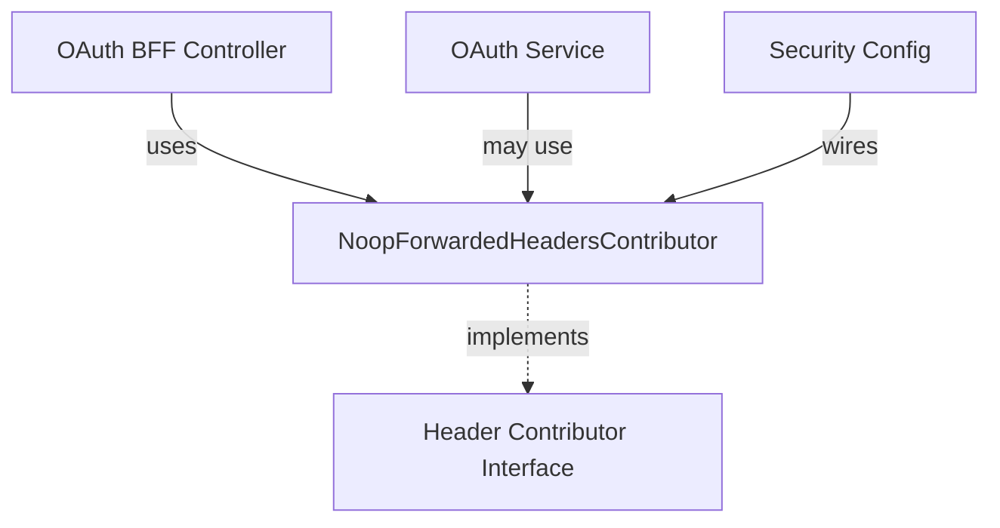
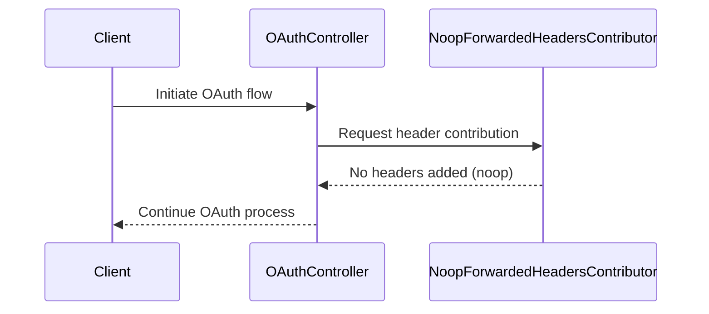

# security_oauth_headers Module Documentation

## Introduction

The `security_oauth_headers` module is a specialized component within the security and authentication subsystem of the platform. Its primary responsibility is to handle HTTP header manipulation and forwarding in the context of OAuth-based authentication flows. This module is designed to work in conjunction with other security and OAuth modules, ensuring that requests are properly augmented with necessary headers for secure and seamless OAuth operations.

## Core Component

### NoopForwardedHeadersContributor

- **Purpose:**
  - The `NoopForwardedHeadersContributor` is a utility or placeholder implementation for header contribution in OAuth flows. As the name suggests, it acts as a no-operation (noop) contributor, meaning it does not modify or add any headers to the outgoing requests.
  - This is typically used in scenarios where header forwarding is either not required or is handled elsewhere in the system, providing a default or fallback implementation to satisfy interface contracts.

- **Usage Context:**
  - Used by the OAuth controller or service layers when a header contributor is required by the framework or dependency injection, but no actual header manipulation is needed.
  - Ensures that the system remains extensible and testable by allowing for easy replacement with real header contributors if/when needed.

## Architecture and Integration

The `security_oauth_headers` module is a small but important part of the broader OAuth and security infrastructure. It interacts with the following modules:

- **[security_oauth_controller](security_oauth_controller.md):**
  - Handles OAuth BFF (Backend For Frontend) controller logic, which may depend on header contributors for forwarding headers during OAuth flows.
- **[security_oauth_service](security_oauth_service.md):**
  - Manages in-memory ticket storage for OAuth development and may interact with header contributors for ticket validation or forwarding.
- **[security_core_oauth](security_core_oauth.md):**
  - Provides security constants and shared logic for OAuth operations.
- **[security_core_config](security_core_config.md):**
  - Contains the main security configuration, which may wire in header contributors as part of the security filter chain.

### High-Level Architecture Diagram

### Data Flow and Process

- When an OAuth-related HTTP request is processed, the system may invoke a header contributor to add or modify headers.
- If the `NoopForwardedHeadersContributor` is in use, it performs no action, allowing the request to proceed unchanged.
- This ensures that the system can be configured flexibly, enabling or disabling header forwarding as needed without code changes.

## Component Interaction Diagram

## Extensibility

- The design allows for easy replacement of the `NoopForwardedHeadersContributor` with a real implementation if header forwarding becomes necessary (e.g., for multi-tenant or proxy scenarios).
- Other modules can provide their own header contributors by implementing the same interface.

## How It Fits Into the System

The `security_oauth_headers` module is a plug-in point in the OAuth security pipeline. It provides a default, non-intrusive implementation for header forwarding, ensuring that the system can operate in environments where such forwarding is not required, while remaining open for extension.

For more details on OAuth flow and security configuration, see:
- [security_oauth_controller.md](security_oauth_controller.md)
- [security_oauth_service.md](security_oauth_service.md)
- [security_core_oauth.md](security_core_oauth.md)
- [security_core_config.md](security_core_config.md)

## Summary

- **Purpose:** Provides a no-operation header contributor for OAuth flows.
- **Integration:** Used by controllers and services that require a header contributor.
- **Extensibility:** Can be replaced with real header contributors as needed.
- **Role:** Ensures flexibility and testability in the security and OAuth subsystem.
