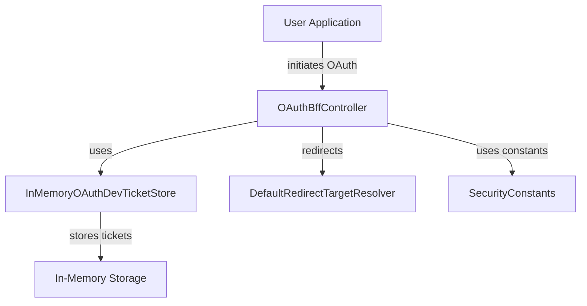
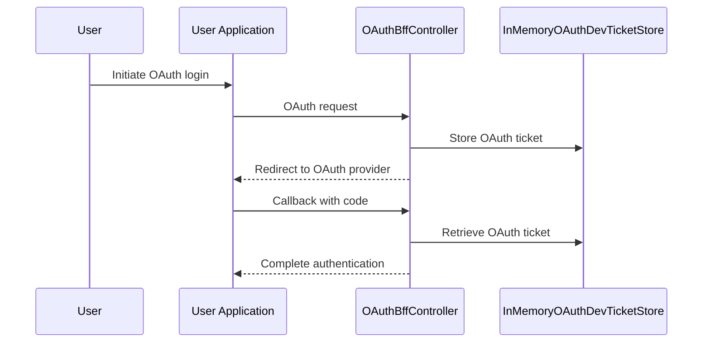

# security_oauth_service Module Documentation

## Introduction

The `security_oauth_service` module provides core service components for handling OAuth-related operations within the security layer of the system. Its primary responsibility is to manage OAuth development tickets in-memory, which are typically used for development and testing scenarios where persistent storage is not required. This module is a part of the broader security and OAuth infrastructure, supporting authentication and authorization flows across the platform.

## Core Component

### InMemoryOAuthDevTicketStore

- **Purpose:**
  - Acts as an in-memory store for OAuth development tickets.
  - Facilitates rapid prototyping and testing of OAuth flows without the need for persistent storage.
  - Useful in development environments where ticket persistence is not critical.
- **Key Responsibilities:**
  - Store, retrieve, and manage OAuth tickets during the authentication process.
  - Provide a lightweight alternative to database-backed ticket stores.

## Architecture and Component Relationships

The `security_oauth_service` module is a focused, low-level service module. It interacts with other modules in the OAuth and security ecosystem, particularly during the OAuth authentication process. The following diagram illustrates its place in the overall OAuth flow:

- **User Application:** Initiates the OAuth flow.
- **OAuthBffController:** Orchestrates the OAuth process, interacts with the ticket store, and manages redirects.
- **InMemoryOAuthDevTicketStore:** Stores OAuth tickets in memory for the duration of the authentication session.
- **DefaultRedirectTargetResolver:** Handles redirect logic post-authentication ([security_oauth_service_redirect.md]).
- **SecurityConstants:** Provides security-related constants ([security_core_oauth.md]).

## Data Flow

The following diagram shows the data flow for a typical OAuth authentication session using the in-memory ticket store:

## Dependencies and Integration

- **Upstream:**
  - [security_oauth_controller.md]: The `OAuthBffController` is the main consumer of the in-memory ticket store, managing OAuth flows and user sessions.
  - [security_oauth_service_redirect.md]: Handles redirect logic after authentication.
  - [security_core_oauth.md]: Provides constants and shared logic for OAuth security.
- **Downstream:**
  - No direct downstream dependencies, as this module is intended for development and is not used in production ticket storage.

## Usage Context

- **Development Environments:**
  - Use the `InMemoryOAuthDevTicketStore` for local development, testing, and prototyping OAuth flows.
  - Not recommended for production due to lack of persistence and scalability.
- **Production Environments:**
  - For production, use a persistent ticket store (e.g., backed by a database or distributed cache) to ensure reliability and scalability.

## Related Modules

- [security_oauth_controller.md]: Contains the `OAuthBffController` which manages OAuth endpoints and interacts with the ticket store.
- [security_oauth_service_redirect.md]: Provides redirect resolution logic for OAuth flows.
- [security_core_oauth.md]: Defines security constants and shared OAuth logic.

## Summary

The `security_oauth_service` module is a specialized service for managing OAuth tickets in-memory, primarily for development and testing. It integrates closely with the OAuth controller and redirect logic, forming a key part of the authentication flow in non-production environments. For more details on the broader OAuth infrastructure, refer to the related module documentation linked above.
