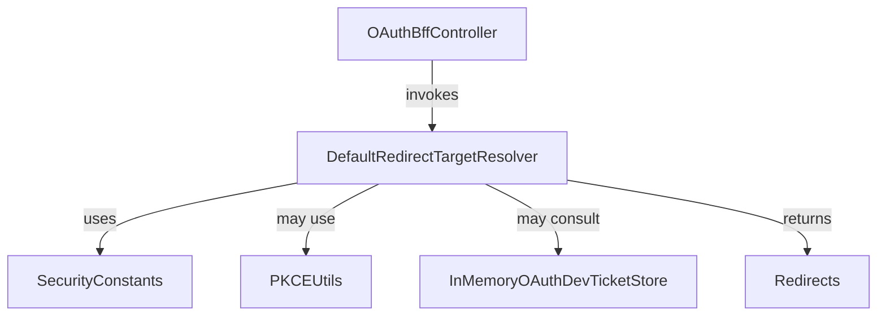
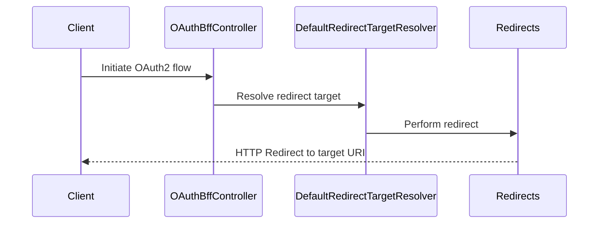

# security_oauth_service_redirect Module Documentation

## Introduction

The `security_oauth_service_redirect` module is responsible for handling OAuth2 redirect target resolution within the authentication and authorization flow of the system. Its primary role is to determine the appropriate redirect targets during OAuth2 authentication, ensuring secure and context-aware redirection for users and clients. This module is a critical part of the security and OAuth infrastructure, supporting both standard and custom redirect logic as required by the system's authentication flows.

## Core Component

- **DefaultRedirectTargetResolver**: The main service responsible for resolving the final redirect URI after OAuth2 authentication or authorization events. It encapsulates the logic for determining where users or clients should be redirected based on the context of the OAuth2 flow, client configuration, and any custom business rules.

## Architecture Overview

The `security_oauth_service_redirect` module operates as a service layer within the broader security and OAuth ecosystem. It interacts closely with controllers, configuration modules, and other OAuth-related services to ensure seamless and secure redirection.

### Component Relationships

- **OAuthBffController** ([security_oauth_controller.md]): Initiates the OAuth2 flow and delegates redirect resolution to the `DefaultRedirectTargetResolver`.
- **SecurityConstants** ([security_core_oauth.md]): Provides constant values and configuration keys used in redirect logic.
- **PKCEUtils** ([security_core_pkce.md]): May be used for Proof Key for Code Exchange (PKCE) validation during redirect resolution.
- **InMemoryOAuthDevTicketStore** ([security_oauth_service.md]): May be consulted for development or testing ticket storage during redirect handling.
- **Redirects** ([authorization_service_core_web.md]): Utility for performing the actual HTTP redirects after resolution.

## Data Flow and Process

The following diagram illustrates the typical data flow for an OAuth2 redirect resolution:

## Integration in the System

The `security_oauth_service_redirect` module is a specialized service within the security and OAuth subsystem. It is invoked by controllers handling OAuth2 authentication and is responsible for ensuring that all redirects are secure, validated, and contextually appropriate. This module is designed to be extensible, allowing for custom redirect logic as required by business or security needs.

## Dependencies and Related Modules

- [security_oauth_controller.md]: For details on how OAuth flows are initiated and handled at the controller level.
- [security_core_oauth.md]: For constants and shared OAuth logic.
- [security_core_pkce.md]: For PKCE-related utilities.
- [security_oauth_service.md]: For development ticket storage and related OAuth services.
- [authorization_service_core_web.md]: For redirect utility logic and web-related helpers.

## Summary

The `security_oauth_service_redirect` module is a key part of the system's OAuth2 authentication flow, providing robust and secure redirect target resolution. By centralizing redirect logic, it ensures consistency, security, and maintainability across the authentication subsystem.
