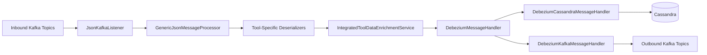
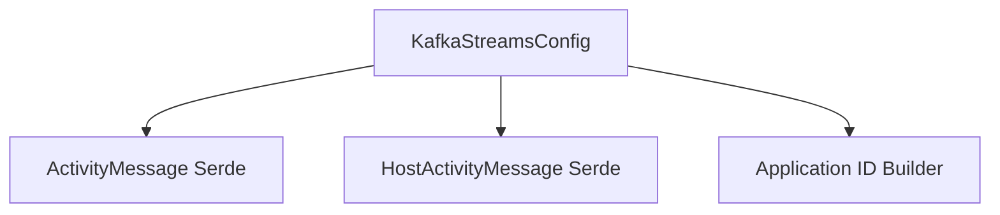
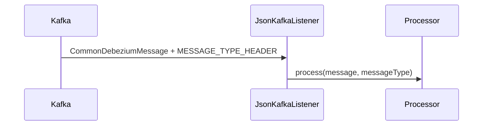
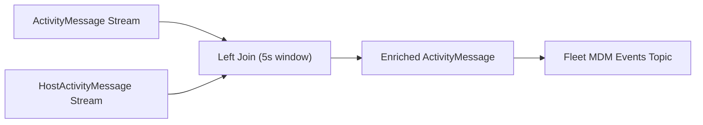
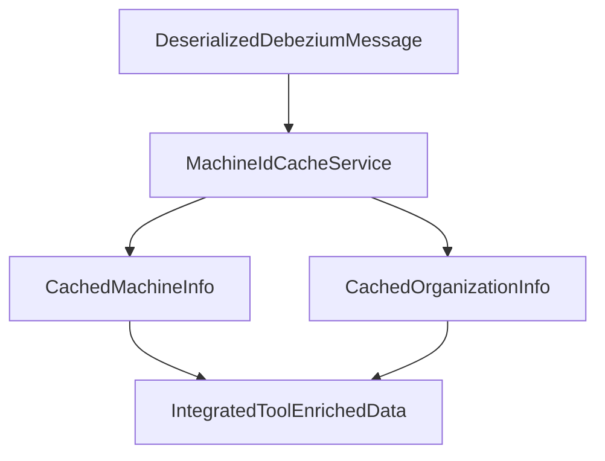
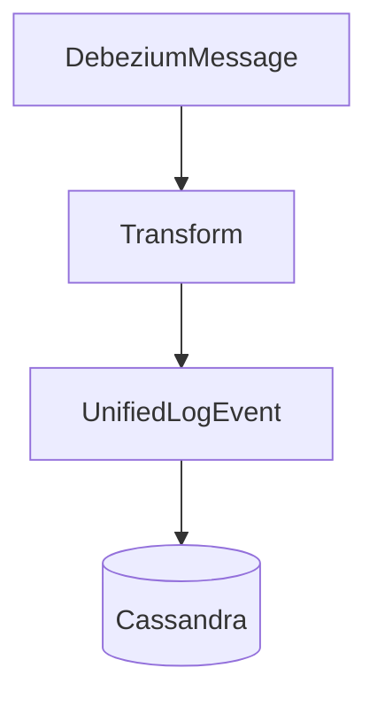
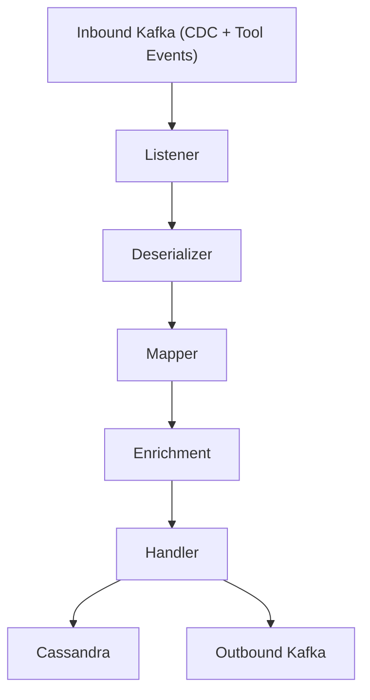

# Stream Processing Core

The **Stream Processing Core** module is the real-time event normalization and enrichment engine of OpenFrame. It consumes change data capture (CDC) events and tool-specific messages from Kafka, transforms them into unified domain events, enriches them with organizational context, and dispatches them to downstream systems such as Cassandra and Kafka topics.

This module is the backbone of OpenFrame’s event-driven architecture, enabling:

- ✅ Unified event modeling across multiple integrated tools (Fleet MDM, Tactical RMM, MeshCentral)
- ✅ Real-time enrichment with machine and organization context
- ✅ Multi-destination publishing (Cassandra + Kafka)
- ✅ Stream-based joins and windowed enrichment (Kafka Streams)

---

## 1. Architectural Overview

The Stream Processing Core sits between inbound Kafka topics (Debezium + tool events) and downstream storage or messaging systems.



### Core Responsibilities

| Layer | Responsibility |
|--------|----------------|
| Listener | Consume raw Debezium/tool messages from Kafka |
| Deserializer | Extract agent, event type, message, timestamp |
| Mapper | Convert tool-specific event types to `UnifiedEventType` |
| Enrichment | Attach machine + organization metadata |
| Handler | Route to Cassandra or Kafka |
| Kafka Streams | Join and enrich related activity streams |

---

## 2. Kafka & Stream Configuration

### 2.1 KafkaConfig

Provides a `Converter<byte[], MessageType>` used to interpret the `MESSAGE_TYPE_HEADER` from Kafka messages.

- Converts raw header bytes into `MessageType`
- Ensures routing to the correct deserializer

### 2.2 KafkaStreamsConfig

Enables and configures Kafka Streams processing:

- `application.id` built using `applicationName` + `clusterId`
- Processing guarantee: `AT_LEAST_ONCE`
- State directory: `/tmp/kafka-streams`
- Custom SerDes for:
  - `ActivityMessage`
  - `HostActivityMessage`



This configuration powers real-time stream joins in the `ActivityEnrichmentService`.

---

## 3. Inbound Event Processing

### 3.1 JsonKafkaListener

The entry point for integrated tool events:

- Listens to multiple inbound topics:
  - MeshCentral events
  - Tactical RMM events
  - Fleet MDM events
  - Fleet MDM query results
- Reads `MESSAGE_TYPE_HEADER`
- Delegates to `GenericJsonMessageProcessor`



---

## 4. Tool-Specific Deserializers

All tool deserializers extend a shared abstraction (`IntegratedToolEventDeserializer`). Each implementation extracts:

- Agent ID
- Source event type
- Tool event ID
- Message / details
- Event timestamp
- Optional result / error payload

### Supported Tools

| Tool | Deserializer | MessageType |
|------|-------------|-------------|
| Fleet MDM | `FleetEventDeserializer` | `FLEET_MDM_EVENT` |
| Fleet Query Results | `FleetQueryResultEventDeserializer` | `FLEET_MDM_QUERY_RESULT_EVENT` |
| MeshCentral | `MeshCentralEventDeserializer` | `MESHCENTRAL_EVENT` |
| Tactical RMM Agent History | `TrmmAgentHistoryEventDeserializer` | `TACTICAL_RMM_AGENT_HISTORY_EVENT` |
| Tactical RMM Audit | `TrmmAuditEventDeserializer` | `TACTICAL_RMM_AUDIT_EVENT` |

### Event Type Mapping

`EventTypeMapper` converts:

```text
IntegratedToolType + sourceEventType → UnifiedEventType
```

This ensures:

- Cross-tool normalization
- Standard severity assignment
- Consistent filtering in downstream APIs

If no mapping exists, `UnifiedEventType.UNKNOWN` is used.

---

## 5. Activity Stream Enrichment (Kafka Streams)

`ActivityEnrichmentService` performs a windowed left join between:

- `activities` topic
- `host_activities` topic

### Join Logic



- Join window: 5 seconds
- Adds `hostId` to activity
- Sets `agentId = hostId`
- Adds Kafka headers:
  - `MESSAGE_TYPE_HEADER`
  - `__TypeId__`

This enables downstream components to treat enriched activities as normal Fleet events.

---

## 6. Data Enrichment Layer

### IntegratedToolDataEnrichmentService

Enhances deserialized messages using Redis-backed cache:

- Looks up `CachedMachineInfo` via `MachineIdCacheService`
- Retrieves:
  - Machine ID
  - Hostname
  - Organization ID
  - Organization Name



If no cache entry exists, enrichment proceeds with partial data.

---

## 7. Message Handlers

All handlers extend:

```text
GenericMessageHandler<T, U, V>
```

Where:

- `U` = `DeserializedDebeziumMessage`
- `V` = `IntegratedToolEnrichedData`
- `T` = destination model

### Operation Mapping

Debezium operation codes:

```text
c → CREATE
r → READ
u → UPDATE
d → DELETE
```

Mapped via `OperationType` and routed accordingly.

---

### 7.1 DebeziumCassandraMessageHandler

Destination: **Cassandra**

Transforms event into `UnifiedLogEvent`:

- Builds composite key
- Sets:
  - tool type
  - unified event type
  - severity
  - organization
  - device ID
  - message
  - details



This is the authoritative storage for unified log events.

---

### 7.2 DebeziumKafkaMessageHandler

Destination: **Kafka (Outbound Integrated Tool Events)**

- Publishes `IntegratedToolEvent`
- Uses `OssTenantRetryingKafkaProducer`
- Message key strategy:
  - `deviceId-toolType`
  - fallback to `userId-toolType`

Only publishes visible events (`message.getIsVisible()`).

---

## 8. Timestamp Handling

`TimestampParser`:

- Parses ISO 8601 timestamps from Debezium
- Converts to epoch milliseconds
- Logs warning on parse failure

This guarantees time consistency across tools.

---

## 9. Cross-Module Dependencies

Stream Processing Core interacts with:

- [Data Kafka Foundation](../data-kafka-foundation/data-kafka-foundation.md)
- [Data Redis Cache](../data-redis-cache/data-redis-cache.md)
- [Data Platform Cassandra and Pinot](../data-platform-cassandra-and-pinot/data-platform-cassandra-and-pinot.md)
- [Data Mongo Domain and Repos](../data-mongo-domain-and-repos/data-mongo-domain-and-repos.md)

These modules provide:

- Kafka producers and tenant routing
- Redis caching services
- Cassandra persistence models
- Domain enums and event definitions

---

## 10. End-to-End Flow Summary



### Key Design Characteristics

- 🔁 Event-driven and reactive
- 🧩 Tool-agnostic unified event model
- 🏢 Multi-tenant aware (cluster ID aware Streams app ID)
- ⚡ Real-time stream joins
- 📦 Pluggable handler architecture

---

# Conclusion

The **Stream Processing Core** module transforms raw integrated tool data into normalized, enriched, and routable unified events.

It provides:

- A consistent event taxonomy
- High-throughput Kafka processing
- Cross-tool normalization
- Context-aware enrichment
- Multi-destination dispatching

Within OpenFrame, this module acts as the **real-time event brain**, enabling dashboards, APIs, compliance engines, and analytics systems to operate on a consistent and enriched stream of operational data.