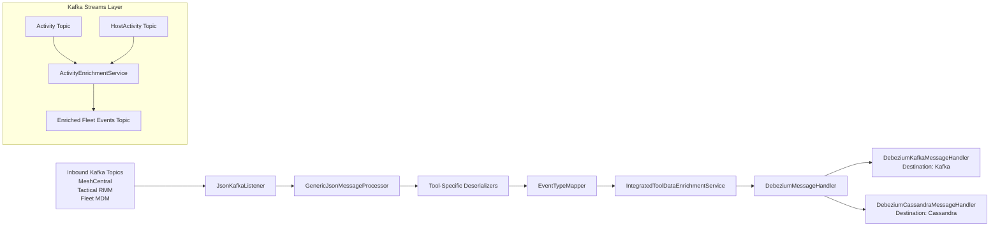
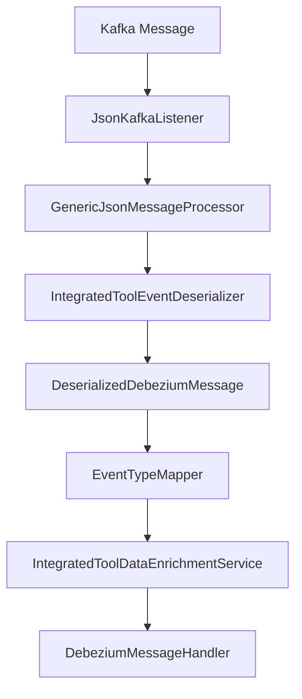
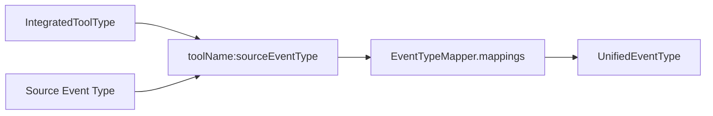
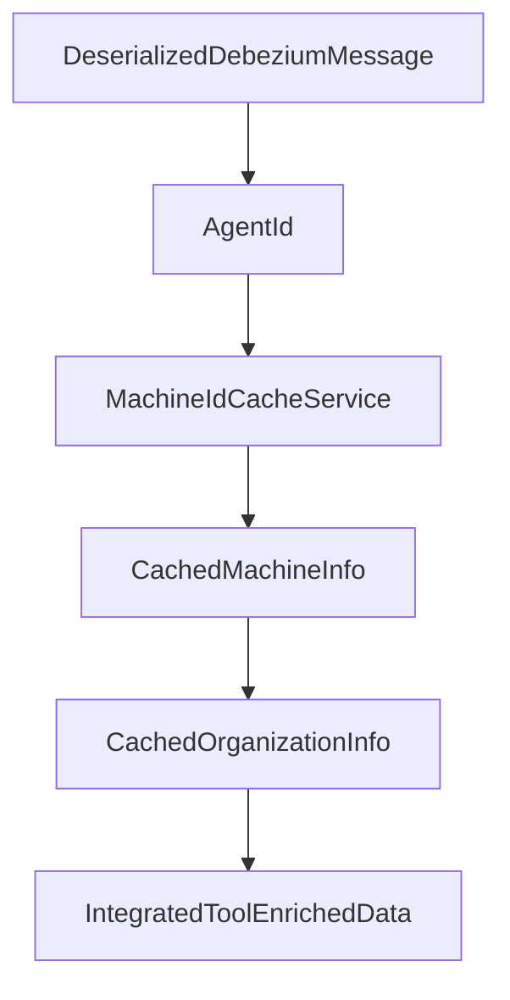
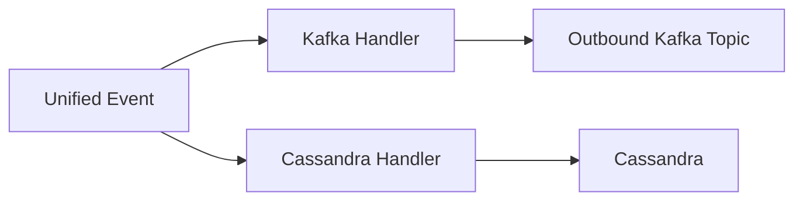
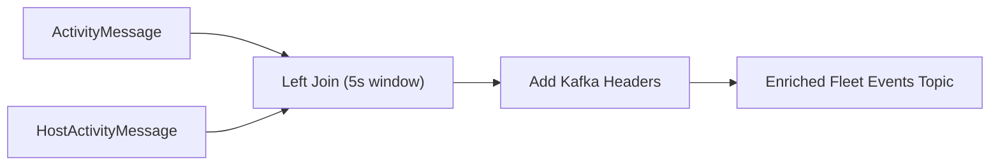
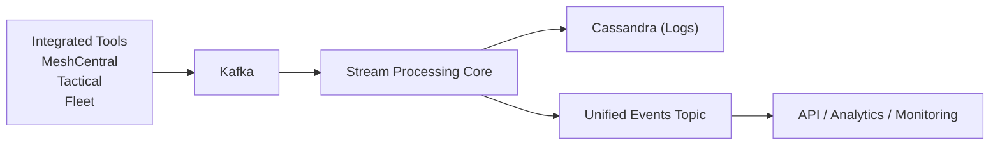

# Stream Processing Core

The **Stream Processing Core** module is the real-time event ingestion and transformation engine of the OpenFrame platform. It consumes change data capture (CDC) events and tool-generated messages from Kafka, normalizes them into a unified event model, enriches them with platform metadata, and forwards them to downstream destinations such as Kafka and Cassandra.

This module is responsible for:

- Ingesting integrated tool events (MeshCentral, Tactical RMM, Fleet MDM)
- Enriching events with device and organization metadata
- Mapping tool-specific event types to unified event types
- Handling Debezium operations (create, read, update, delete)
- Publishing normalized events to Kafka and Cassandra
- Running Kafka Streams topologies for cross-topic enrichment (e.g., Fleet activity ↔ host join)

---

## High-Level Architecture



The module has two main processing modes:

1. **Listener-driven event processing** (Spring Kafka + handlers)
2. **Kafka Streams topology** for stateful joins and event enrichment

---

# Core Processing Flow

## 1. Kafka Listener Layer

The entry point for integrated tool events is:

- `JsonKafkaListener`

It listens to inbound Kafka topics configured via properties:

- MeshCentral events
- Tactical RMM events
- Fleet MDM events
- Fleet query result events

Each message includes a `MessageType` header, which determines which deserializer and processing path to use.



---

## 2. Tool-Specific Deserializers

All integrated tools emit different schemas. The module standardizes them using deserializers extending a common base (`IntegratedToolEventDeserializer`).

### Fleet
- `FleetEventDeserializer`
- `FleetQueryResultEventDeserializer`

Responsibilities:
- Extract `agentId`
- Extract tool-specific event type
- Parse ISO 8601 timestamps using `TimestampParser`
- Build structured `result` and `error` payloads
- Map activity types to human-readable messages via `FleetActivityTypeMapping`

### Tactical RMM
- `TrmmAgentHistoryEventDeserializer`
- `TrmmAuditEventDeserializer`

Responsibilities:
- Resolve internal agent IDs via cache services
- Interpret script execution results
- Extract error and output metadata

### MeshCentral
- `MeshCentralEventDeserializer`

Responsibilities:
- Parse embedded JSON strings
- Extract `etype.action` composite event types
- Normalize timestamp formats

---

# Event Normalization

## Source Event Types → Unified Event Types

The `EventTypeMapper` converts tool-specific event types into platform-wide `UnifiedEventType` values.



If no mapping is found, the event defaults to `UNKNOWN`.

This mapping layer ensures:

- Consistent event taxonomy
- Tool-agnostic analytics
- Standard severity classification

---

# Data Enrichment Layer

## IntegratedToolDataEnrichmentService

After deserialization and normalization, events are enriched using Redis-backed cache services.

Responsibilities:

- Resolve agent ID → internal machine ID
- Resolve organization ID and name
- Attach hostname metadata



If enrichment fails (e.g., unknown agent), processing continues but with partial metadata.

---

# Message Handling Framework

## GenericMessageHandler

The abstract processing pipeline:

```text
handle(message, extraParams)
  → isValidMessage()
  → transform()
  → getOperationType()
  → pushData()
      → handleCreate / handleRead / handleUpdate / handleDelete
```

### DebeziumMessageHandler

Extends `GenericMessageHandler` and maps Debezium operations:

- `c` → CREATE
- `r` → READ
- `u` → UPDATE
- `d` → DELETE

---

# Output Destinations

## Kafka Destination

`DebeziumKafkaMessageHandler`

- Transforms events into `IntegratedToolEvent`
- Publishes to outbound Kafka topic
- Builds partition key from device ID or user ID
- Filters non-visible events via `isValidMessage()`

## Cassandra Destination

`DebeziumCassandraMessageHandler`

- Transforms events into `UnifiedLogEvent`
- Constructs compound primary key
- Persists into Cassandra
- Stores normalized severity, summary, and details



---

# Kafka Streams Topology

## ActivityEnrichmentService

This service builds a Kafka Streams topology that joins:

- Fleet `activities` topic
- Fleet `host_activities` topic

### Purpose

Attach `hostId` and `agentId` to activity events using a time-windowed join.



Key characteristics:

- 5-second join window
- No grace period
- FixedKeyProcessor adds message headers
- Uses custom JSON SerDes

This stream runs under a tenant-scoped `application.id`, derived from:

- `spring.application.name`
- Optional `openframe.cluster-id`

---

# Configuration Components

## KafkaConfig

Defines:

- `Converter<byte[], MessageType>` for Kafka header parsing

## KafkaStreamsConfig

Defines:

- Application ID namespacing
- Stream processing guarantees (at-least-once)
- JSON SerDes for typed Debezium messages
- Producer and consumer tuning properties
- State directory configuration

---

# Key Supporting Utilities

## TimestampParser

- Parses ISO 8601 timestamps
- Returns epoch milliseconds
- Gracefully handles parse failures

## FleetActivityTypeMapping

Maps Fleet activity type strings to human-readable summaries.

## SourceEventTypes

Centralized constants for tool-specific event type definitions.

---

# Multi-Tenant Behavior

The module is designed for OSS tenant isolation:

- Kafka topics are tenant-scoped
- Kafka Streams `application.id` includes cluster ID
- Redis cache resolution is tenant-aware
- Outbound Kafka producers support retry with tenant isolation

---

# How Stream Processing Core Fits in the Platform



The **Stream Processing Core** acts as:

- The normalization layer between raw tool data and the platform
- The real-time event bus publisher
- The persistent log writer
- The bridge between CDC and analytics

It ensures that heterogeneous tool ecosystems produce consistent, searchable, enriched, and auditable event streams across the OpenFrame platform.

---

# Summary

The **Stream Processing Core** module provides:

- Unified event modeling across tools
- Real-time Kafka ingestion and transformation
- Debezium-aware CRUD handling
- Redis-backed metadata enrichment
- Cassandra persistence
- Kafka Streams-based activity joins
- Tenant-aware stream processing

It is the backbone of event-driven processing in the OpenFrame architecture.