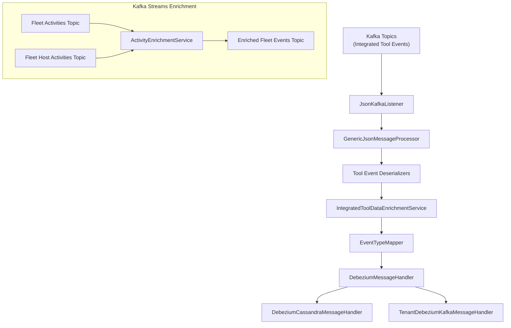
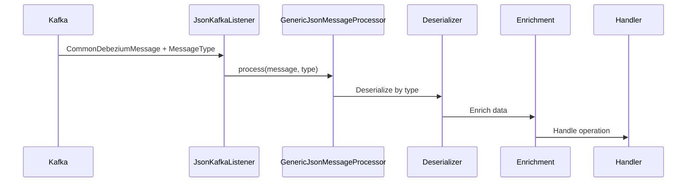
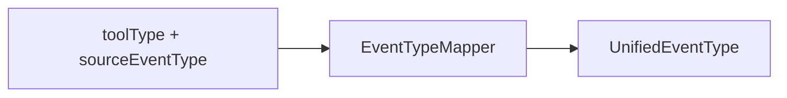
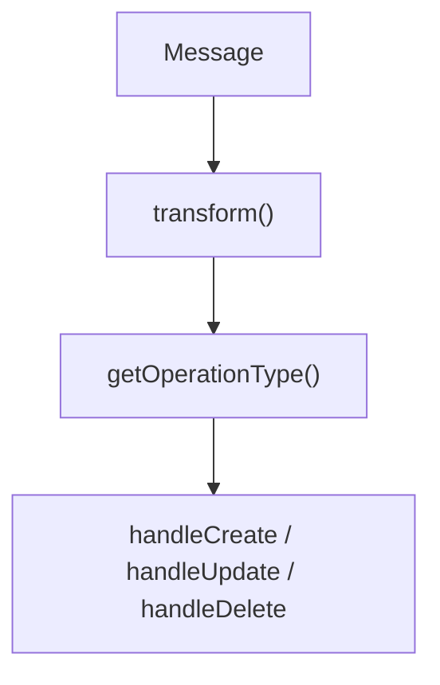
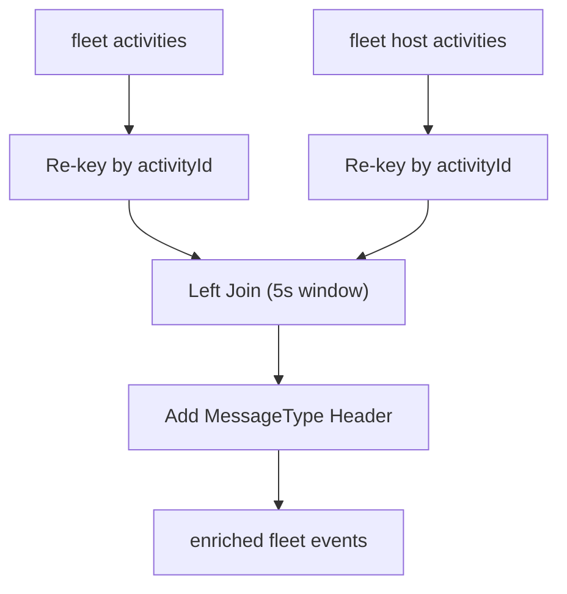

# Stream Processing Core

The **Stream Processing Core** module is the real-time event ingestion and transformation engine of the OpenFrame platform. It consumes Change Data Capture (CDC) events and tool-generated messages from Kafka, normalizes them into a unified event model, enriches them with tenant and device context, and routes them to downstream systems such as Cassandra and Kafka topics.

This module acts as the bridge between:

- Integrated tools (MeshCentral, Tactical RMM, Fleet MDM)
- Kafka (CDC + tool event streams)
- Data enrichment services (Redis, tenant resolution)
- Downstream persistence layers (e.g., Cassandra)
- Unified event taxonomy used across the platform

---

## High-Level Responsibilities

1. **Kafka & Kafka Streams configuration**
2. **Tool-specific event deserialization**
3. **Event normalization into unified types**
4. **Tenant and device enrichment**
5. **Debezium CDC operation handling (C/R/U/D)**
6. **Downstream dispatch to storage or Kafka topics**
7. **Fleet MDM activity stream joins using Kafka Streams**

---

# Architecture Overview

```mermaid
flowchart TD
    KafkaTopics["Kafka Topics\n(Integrated Tool Events)"] --> JsonListener["JsonKafkaListener"]
    JsonListener --> Processor["GenericJsonMessageProcessor"]
    Processor --> Deserializers["Tool Event Deserializers"]
    Deserializers --> Enrichment["IntegratedToolDataEnrichmentService"]
    Enrichment --> Mapping["EventTypeMapper"]
    Mapping --> Handlers["DebeziumMessageHandler"]
    Handlers --> CassandraHandler["DebeziumCassandraMessageHandler"]
    Handlers --> TenantKafkaHandler["TenantDebeziumKafkaMessageHandler"]

    subgraph streams_layer["Kafka Streams Enrichment"]
        Activities["Fleet Activities Topic"] --> Joiner["ActivityEnrichmentService"]
        HostActivities["Fleet Host Activities Topic"] --> Joiner
        Joiner --> EnrichedTopic["Enriched Fleet Events Topic"]
    end
```

The module consists of two main pipelines:

- **Listener-based CDC processing** (via `@KafkaListener`)
- **Kafka Streams topology** for Fleet MDM activity enrichment

---

# Core Processing Flow

## 1. Kafka Consumption

`JsonKafkaListener` listens to multiple inbound topics:

- MeshCentral events
- Tactical RMM events
- Tactical task result events
- Fleet MDM activity events
- Fleet policy membership events
- Fleet query result events

It extracts the `MessageType` header and forwards the payload to a generic processor.

```mermaid
sequenceDiagram
    participant Kafka
    participant Listener as JsonKafkaListener
    participant Processor as GenericJsonMessageProcessor
    participant Deserializer
    participant Enrichment
    participant Handler

    Kafka->>Listener: CommonDebeziumMessage + MessageType
    Listener->>Processor: process(message, type)
    Processor->>Deserializer: Deserialize by type
    Deserializer->>Enrichment: Enrich data
    Enrichment->>Handler: Handle operation
```

---

# Configuration Layer

## KafkaConfig

Provides:

- `Converter<byte[], MessageType>`
- Converts Kafka header bytes into `MessageType` enum

This enables header-driven routing of events.

## KafkaStreamsConfig

Enables Kafka Streams when `kafka.stream.enabled=true`.

Key features:

- Dynamic `application.id` (includes cluster ID if present)
- JSON Serdes for:
  - `ActivityMessage`
  - `HostActivityMessage`
- At-least-once processing
- Stream idle configuration to allow window closing
- Controlled batching and producer tuning

---

# Deserialization Layer

All tool-specific deserializers extend a shared base:

- `IntegratedToolEventDeserializer`

Each implementation extracts:

- Agent ID
- Tool event ID
- Source event type
- Timestamp
- Message
- Details / Result / Error

## Implemented Deserializers

### Fleet MDM

- `FleetEventDeserializer`
- `FleetPolicyActivityDeserializer`
- `FleetPolicyMembershipEventDeserializer`
- `FleetQueryResultEventDeserializer`

Features:

- Policy and query cache lookups
- Conditional cache eviction on policy mutations
- JSON-safe result and error construction
- Activity type to human-readable message mapping

### MeshCentral

- `MeshCentralEventDeserializer`

Features:

- Handles nested JSON strings
- Builds `etype.action` composite event types
- Extracts tenant from `domain` field

### Tactical RMM

- `TrmmAgentHistoryEventDeserializer`
- `TrmmAuditEventDeserializer`
- `TrmmTaskResultEventDeserializer`

Features:

- Agent primary key resolution via cache
- Script/task metadata lookup
- Result and error normalization

---

# Unified Event Mapping

## EventTypeMapper

Maps:

- `(IntegratedToolType, sourceEventType)`

To:

- `UnifiedEventType`

If no mapping exists → defaults to `UNKNOWN`.

```mermaid
flowchart LR
    SourceEvent["toolType + sourceEventType"] --> Mapper["EventTypeMapper"]
    Mapper --> Unified["UnifiedEventType"]
```

This ensures all integrated tool events conform to a consistent taxonomy used by:

- Cassandra storage
- Analytics systems
- Notification services

---

# Data Enrichment

## IntegratedToolDataEnrichmentService

Adds contextual data to deserialized events:

### Machine Enrichment

Uses `MachineIdCacheService`:

- Machine ID
- Hostname
- Organization ID
- Organization Name

### Tenant Resolution

Two modes:

1. **Tenant cluster mode** → Uses `TenantIdProvider`
2. **Shared cluster mode** → Uses `ClusterTenantIdResolver`

This guarantees that every event has a resolved `tenantId`.

---

# Debezium Message Handling

## GenericMessageHandler

Abstract base class implementing:

- Transform → Push flow
- Operation routing (CREATE / READ / UPDATE / DELETE)

```mermaid
flowchart TD
    Message --> Transform["transform()"]
    Transform --> Operation["getOperationType()"]
    Operation --> Dispatch["handleCreate / handleUpdate / handleDelete"]
```

## DebeziumMessageHandler

Adds:

- CDC operation type resolution (`c`, `r`, `u`, `d`)

## DebeziumCassandraMessageHandler

Transforms enriched events into:

- `UnifiedLogEvent`

Writes to:

- Cassandra via `UnifiedLogEventRepository`

The event key includes:

- tenantId
- ingestDay
- toolType
- unifiedEventType
- eventTimestamp
- toolEventId

## TenantDebeziumKafkaMessageHandler

Publishes enriched events to:

- Tenant-scoped outbound Kafka topic

## TenantIdRequiredDebeziumEventValidator

Drops events if:

- `tenantId` is missing or blank

This enforces strict tenant isolation.

---

# Kafka Streams: Fleet Activity Join

## ActivityEnrichmentService

Purpose:

Join Fleet `activities` and `host_activities` topics to attach `hostId` to activities.

### Join Strategy

- Left join
- 5-second window
- Activity ID used as join key

```mermaid
flowchart TD
    ActivitiesTopic["fleet activities"] --> ReKey["Re-key by activityId"]
    HostActivitiesTopic["fleet host activities"] --> ReKeyHost["Re-key by activityId"]
    ReKey --> Join["Left Join (5s window)"]
    ReKeyHost --> Join
    Join --> HeaderAdd["Add MessageType Header"]
    HeaderAdd --> OutputTopic["enriched fleet events"]
```

Additional behavior:

- Dynamically resolves message type:
  - `FLEET_MDM_EVENT`
  - `FLEET_MDM_POLICY_ACTIVITY_EVENT`
- Adds Kafka headers before publishing

---

# Timestamp Handling

## TimestampParser

Utility for parsing ISO-8601 timestamps produced by Debezium.

- Converts to epoch milliseconds
- Logs warnings for invalid formats

Ensures consistent event-time semantics across tools.

---

# Operational Modes

The module adapts to deployment mode:

| Mode | Behavior |
|------|----------|
| Tenant cluster | Direct tenant resolution via provider |
| Shared SaaS cluster | Tenant resolved from tool-specific domain |
| Cassandra enabled | Writes to Cassandra |
| Kafka Streams enabled | Activity enrichment topology activated |

---

# Integration Points with Other Modules

The Stream Processing Core interacts with:

- **Eventing and Messaging (Kafka/NATS)** for topic configuration and producers
- **Data Model and Repositories (Mongo/Cassandra)** for unified event storage
- **Security (OAuth/JWT)** for tenant context propagation
- **Analytics (Pinot)** which consumes unified events

It acts as the real-time ingestion backbone of the OpenFrame ecosystem.

---

# Summary

The **Stream Processing Core** module provides:

- Multi-tool event ingestion
- Unified taxonomy mapping
- Strict tenant isolation
- Real-time enrichment via Redis and caches
- Kafka Streams-based correlation
- Cassandra persistence
- Forwarding to outbound Kafka topics

It transforms heterogeneous integrated-tool events into a normalized, enriched, multi-tenant event stream that powers analytics, logging, automation, and auditing across the platform.
