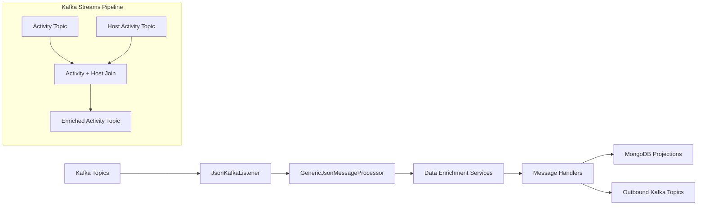
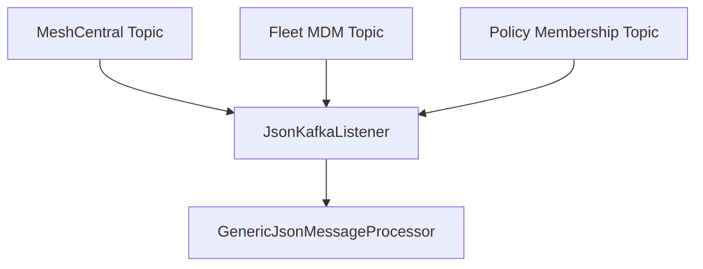
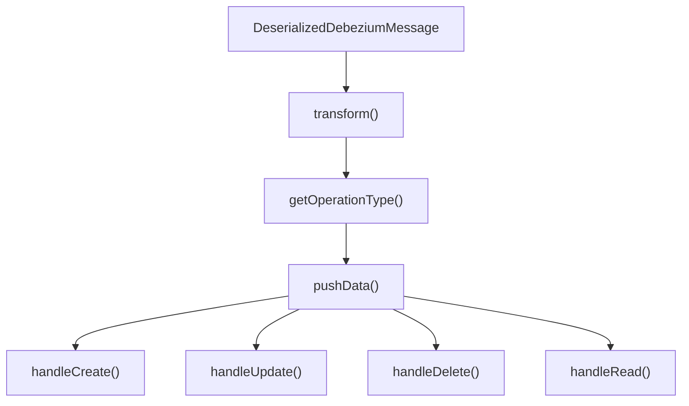
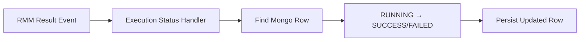
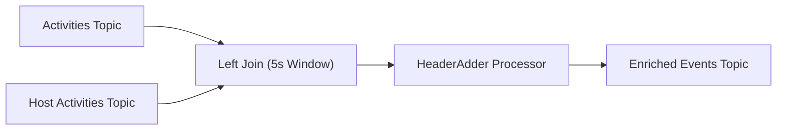
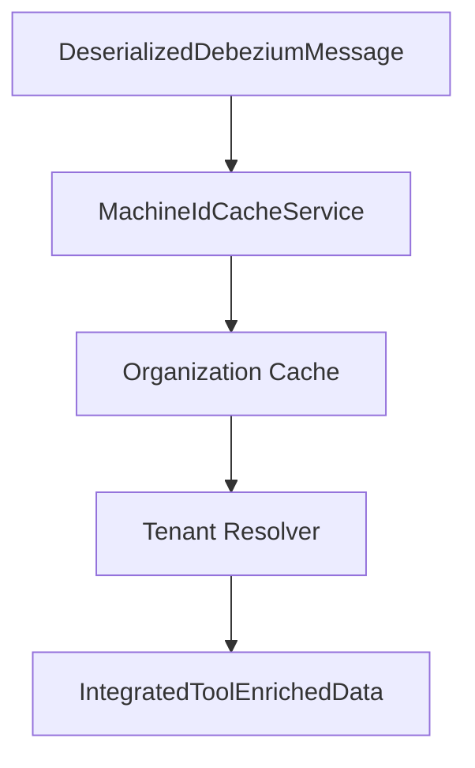

# Stream Processing Core

## Overview

The **Stream Processing Core** module is responsible for ingesting, enriching, transforming, and projecting event-driven data across the OpenFrame platform using Kafka and Kafka Streams.

It acts as the real-time backbone between:

- Integrated tools (MeshCentral, Fleet, etc.)
- Native RMM execution pipelines
- MongoDB persistence layers
- Redis-based machine and organization caches
- Downstream analytics and event consumers

The module consumes Debezium-style change events, enriches them with machine and tenant context, maps external event types into unified platform event types, and updates execution state projections in MongoDB.

---

## High-Level Architecture


```mermaid
flowchart LR
    KafkaTopics["Kafka Topics"] --> JsonListener["JsonKafkaListener"]
    JsonListener --> Processor["GenericJsonMessageProcessor"]
    Processor --> Enrichment["Data Enrichment Services"]
    Enrichment --> Handlers["Message Handlers"]
    Handlers --> Mongo["MongoDB Projections"]
    Handlers --> OutTopics["Outbound Kafka Topics"]

    subgraph streams["Kafka Streams Pipeline"]
        ActivityStream["Activity Topic"] --> Join["Activity + Host Join"]
        HostStream["Host Activity Topic"] --> Join
        Join --> EnrichedActivity["Enriched Activity Topic"]
    end
```

The module operates in two primary modes:

1. **Event Consumer + Handler Mode** – Kafka listeners process inbound events and dispatch them to handlers.
2. **Kafka Streams Mode** – Stateful stream processing joins and enriches related event streams.

Both modes can run simultaneously depending on configuration.

---

## Core Responsibilities

### 1. Kafka Configuration

#### `KafkaConfig`
- Registers a `Converter<byte[], MessageType>`.
- Converts Kafka header bytes into `MessageType` enums.
- Ensures consistent message routing based on headers.

#### `KafkaStreamsConfig`
- Enables Kafka Streams via `@EnableKafkaStreams`.
- Configures:
  - `application.id` (cluster-aware)
  - Bootstrap servers (tenant or SaaS mode)
  - Serialization (JSON SerDes)
  - Processing guarantee: `AT_LEAST_ONCE`
  - Stream thread count and state directory
- Namespaces stream applications per cluster using `applicationName-clusterId`.

This allows multi-tenant isolation at the Kafka Streams application level.

---

## Event Ingestion Pipeline

### JsonKafkaListener

`JsonKafkaListener` consumes Debezium-style events from multiple inbound topics:

- MeshCentral events
- Fleet MDM events
- Fleet query results
- Fleet policy membership events

It is activated only in **tenant cluster mode**.


```mermaid
flowchart TD
    Topic1["MeshCentral Topic"] --> Listener["JsonKafkaListener"]
    Topic2["Fleet MDM Topic"] --> Listener
    Topic3["Policy Membership Topic"] --> Listener
    Listener --> Processor["GenericJsonMessageProcessor"]
```

Each message includes a `MESSAGE_TYPE_HEADER`, which is converted into a `MessageType` enum and passed downstream.

---

## Generic Message Handling Framework

### GenericMessageHandler

An abstract base class that standardizes event handling:

- Validates incoming messages
- Transforms data
- Determines `OperationType` (CREATE, READ, UPDATE, DELETE)
- Dispatches to operation-specific handlers


```mermaid
flowchart TD
    Incoming["DeserializedDebeziumMessage"] --> Transform["transform()"]
    Transform --> OpType["getOperationType()"]
    OpType --> Dispatch["pushData()"]
    Dispatch --> Create["handleCreate()"]
    Dispatch --> Update["handleUpdate()"]
    Dispatch --> Delete["handleDelete()"]
    Dispatch --> Read["handleRead()"]
```

This abstraction ensures consistent event lifecycle handling across domains.

---

## Execution Status Projection Handlers

Two specialized handlers update MongoDB projections for execution history.

### ScriptExecutionStatusUpdateHandler

- Destination: `MONGO_HISTORY`
- Handles `SCRIPT_EXECUTED` events
- Correlation key:
  - `executionId`
  - `machineId`
  - `scriptId`
- Transitions status from `RUNNING` → `SUCCESS` or `FAILED`
- Truncates stdout/stderr safely by UTF-8 byte limit

### CommandExecutionStatusUpdateHandler

- Destination: `MONGO_COMMAND_HISTORY`
- Handles batch command results
- Correlation key:
  - `executionId`
  - `machineId`
- Prevents overwriting terminal states
- Writes execution metadata and truncated output


```mermaid
flowchart LR
    KafkaEvent["RMM Result Event"] --> Handler["Execution Status Handler"]
    Handler --> Lookup["Find Mongo Row"]
    Lookup --> Transition["RUNNING → SUCCESS/FAILED"]
    Transition --> Save["Persist Updated Row"]
```

Kafka is treated as the source of truth. MongoDB acts as a projection layer.

---

## Activity Stream Enrichment (Kafka Streams)

### ActivityEnrichmentService

Builds a Kafka Streams topology that:

1. Reads activity events
2. Reads host activity events
3. Performs a time-windowed left join (5 seconds)
4. Injects `hostId` and `agentId`
5. Adds message headers
6. Publishes enriched activity events


```mermaid
flowchart LR
    Activities["Activities Topic"] --> Join["Left Join (5s Window)"]
    HostActivities["Host Activities Topic"] --> Join
    Join --> AddHeader["HeaderAdder Processor"]
    AddHeader --> Output["Enriched Events Topic"]
```

Policy-related activity types are automatically tagged with a specific `MessageType` header.

This enables downstream services to distinguish between general MDM events and policy activity events.

---

## Data Enrichment Services

Enrichment services attach contextual metadata to events before they reach handlers.

### IntegratedToolDataEnrichmentService

Used for external tool events (MeshCentral, Fleet):

- Resolves machine via `agentId`
- Fetches:
  - machineId
  - hostname
  - organizationId
  - organizationName
- Resolves tenant via:
  - `TenantIdProvider` (tenant cluster)
  - `ClusterTenantIdResolver` (shared cluster)

### RmmEnrichmentService

Used for native OpenFrame RMM events:

- Directly resolves machine by `machineId`
- Skips external tool indirection
- Uses same tenant resolution strategy


```mermaid
flowchart TD
    Event["DeserializedDebeziumMessage"] --> MachineLookup["MachineIdCacheService"]
    MachineLookup --> OrgLookup["Organization Cache"]
    OrgLookup --> TenantResolve["Tenant Resolver"]
    TenantResolve --> Enriched["IntegratedToolEnrichedData"]
```

This ensures every downstream handler receives:

- Tenant context
- Organization metadata
- Machine identity

---

## Unified Event Mapping

### EventTypeMapper

Maps tool-specific event names into a canonical `UnifiedEventType`.

Key format:

```text
{toolDbName}:{sourceEventType}
```

If no mapping exists, `UNKNOWN` is returned.

Supported tools include:

- RMM (native)
- MeshCentral
- Fleet MDM

This abstraction allows:

- Cross-tool analytics
- Consistent audit trails
- Centralized event classification

---

## Multi-Tenant Design

The module supports two deployment modes:

### Tenant Cluster Mode
- One tenant per Kafka cluster
- `TenantIdProvider` supplies tenant ID
- `JsonKafkaListener` active

### Shared Cluster Mode
- Multiple tenants per Kafka cluster
- `ClusterTenantIdResolver` maps cluster identifiers to tenant IDs
- Kafka Streams application ID includes cluster suffix

This ensures logical isolation while maintaining operational efficiency.

---

## Reliability & Guarantees

- Kafka Streams processing guarantee: `AT_LEAST_ONCE`
- Terminal state protection in execution handlers
- UTF-8 safe truncation for large output payloads
- Windowed joins to tolerate event arrival skew
- Replay-friendly architecture (Kafka as source of truth)

---

## How Stream Processing Core Fits the Platform

The **Stream Processing Core** module sits between:

- **Client Agent Service Core** (event producers)
- **Gateway Service Core** (integration ingress)
- **Data Mongo Domain Model** (projections)
- **External REST API Service Core** (event exposure)

It provides:

- Real-time ingestion
- Cross-tool normalization
- Tenant-aware enrichment
- Execution state projection
- Stream-based transformation

Without this module, the platform would lack:

- Real-time activity enrichment
- Reliable execution status transitions
- Unified cross-tool event classification
- Multi-tenant stream isolation

---

## Summary

The **Stream Processing Core** is the event-driven heart of OpenFrame:

- Kafka-powered ingestion
- Stream-based enrichment
- Mongo projection handlers
- Tool-agnostic event normalization
- Multi-tenant isolation support

It ensures that every external or native event becomes:

1. Tenant-aware
2. Machine-aware
3. Organization-aware
4. Canonically typed
5. Persisted consistently

This module enables scalable, replayable, and extensible event-driven behavior across the entire OpenFrame platform.