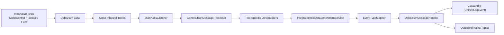
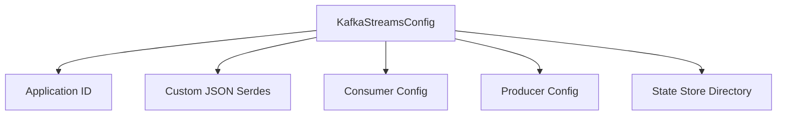
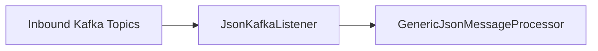
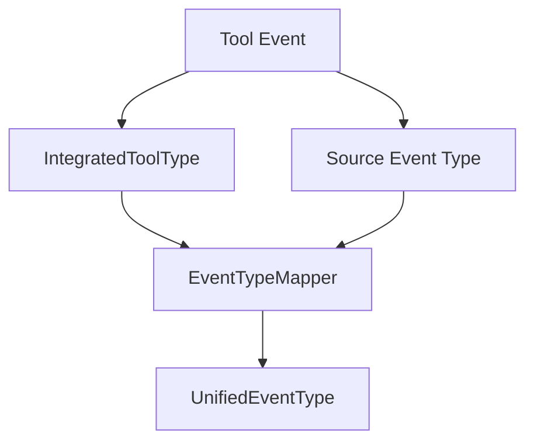
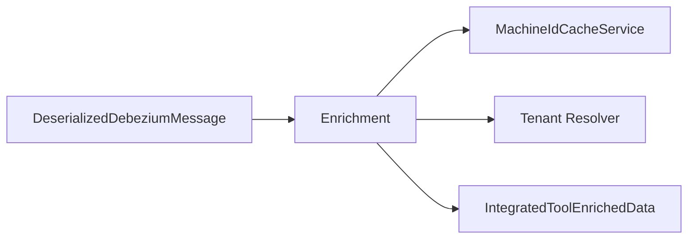
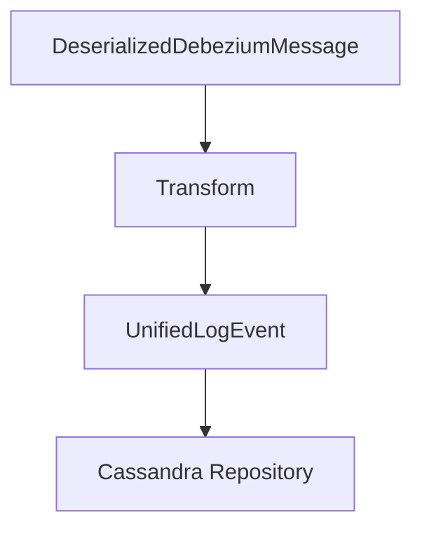
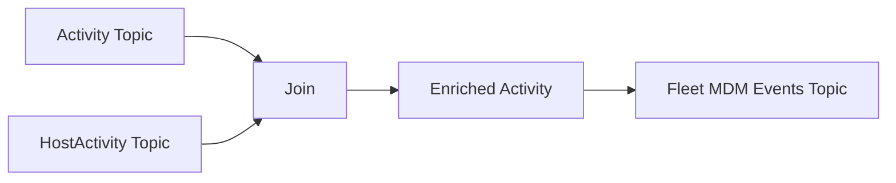
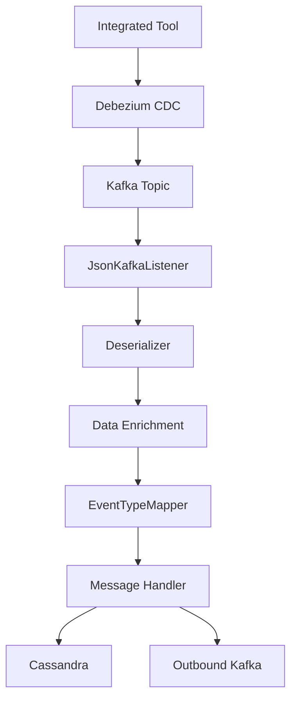

# Stream Processing Kafka

The **Stream Processing Kafka** module is the event ingestion and stream-processing backbone of OpenFrame.  
It consumes Change Data Capture (CDC) events from integrated tools (MeshCentral, Tactical RMM, Fleet MDM), enriches and normalizes them, maps them to a unified event model, and forwards them to downstream systems such as Cassandra and Kafka topics.

This module enables:

- Multi-tenant event ingestion via Kafka
- Debezium-based CDC processing
- Tool-specific event deserialization
- Unified event type mapping
- Machine, organization, and tenant enrichment
- Optional Kafka Streams–based enrichment pipelines
- Cassandra persistence for long-term log storage

---

## 1. Architectural Overview

The Stream Processing Kafka module sits between integrated tools and the unified data layer.

### Core Responsibilities

| Layer | Responsibility |
|--------|---------------|
| Kafka Listener | Consumes multi-topic CDC events |
| Deserializers | Convert tool-specific payloads into normalized structures |
| Enrichment | Resolve tenant, machine, organization metadata |
| Mapping | Convert source event types to `UnifiedEventType` |
| Handlers | Persist to Cassandra or republish to Kafka |
| Kafka Streams | Perform real-time stream joins (Fleet activity enrichment) |

---

## 2. Kafka Configuration Layer

### 2.1 `KafkaConfig`

Provides a `Converter<byte[], MessageType>` to convert Kafka headers into strongly typed `MessageType` enums.

This allows the listener to route events correctly based on header metadata.

### 2.2 `KafkaStreamsConfig`

Enables and configures Kafka Streams processing.

Key configuration aspects:

- Application ID namespaced by cluster ID
- At-least-once processing guarantee
- Explicit key/value Serdes
- Controlled stream threads (1)
- State directory configuration
- Windowing tolerance via `MAX_TASK_IDLE_MS`

---

## 3. Event Ingestion Pipeline

### 3.1 JsonKafkaListener

`JsonKafkaListener` consumes multiple inbound integrated-tool topics:

- MeshCentral events
- Tactical RMM events
- Fleet MDM events
- Fleet query result events
- Fleet policy membership events

It forwards:

- `CommonDebeziumMessage`
- `MessageType` (from header)

To:

- `GenericJsonMessageProcessor`

Activation is conditional on cluster mode (`tenant`), ensuring proper multi-tenant isolation.

---

## 4. Deserialization Layer

All tool-specific deserializers extend a shared base (via `IntegratedToolEventDeserializer`).

They extract:

- Agent ID
- Tool event ID
- Source event type
- Message summary
- Timestamp
- Result / Error payloads

### Supported Tool Deserializers

| Tool | Deserializer |
|------|-------------|
| MeshCentral | `MeshCentralEventDeserializer` |
| Tactical RMM (audit) | `TrmmAuditEventDeserializer` |
| Tactical RMM (history) | `TrmmAgentHistoryEventDeserializer` |
| Tactical RMM (task result) | `TrmmTaskResultEventDeserializer` |
| Fleet MDM (activity) | `FleetEventDeserializer` |
| Fleet MDM (policy activity) | `FleetPolicyActivityDeserializer` |
| Fleet MDM (policy membership) | `FleetPolicyMembershipEventDeserializer` |
| Fleet MDM (query result) | `FleetQueryResultEventDeserializer` |

Each deserializer:

- Extracts structured fields from CDC payload
- Uses `TimestampParser` for ISO-8601 normalization
- Optionally consults cache services
- Produces a unified intermediate event model

---

## 5. Unified Event Type Mapping

### EventTypeMapper

Maps:

- `(IntegratedToolType, sourceEventType)`  
To:
- `UnifiedEventType`

If no mapping exists → defaults to `UNKNOWN`.

This creates a single normalized event vocabulary across all tools.

---

## 6. Data Enrichment Layer

### 6.1 IntegratedToolDataEnrichmentService

Enriches events with:

- Machine ID
- Hostname
- Organization ID
- Organization Name
- Tenant ID

Sources:

- Redis machine cache
- Organization cache
- `TenantIdProvider`
- Optional `ClusterTenantIdResolver`

If machine or tenant cannot be resolved, warnings are logged but processing continues.

---

## 7. Message Handling Layer

### 7.1 GenericMessageHandler

Provides:

- Validation hook
- OperationType routing (CREATE / UPDATE / DELETE / READ)
- Lifecycle dispatch (`handleCreate`, `handleUpdate`, etc.)

### 7.2 DebeziumMessageHandler

Adds Debezium operation extraction logic (`c`, `u`, `d`, `r`).

### 7.3 DebeziumCassandraMessageHandler

Transforms enriched events into `UnifiedLogEvent` and persists them to Cassandra.

Key fields set:

- Tenant ID
- Tool Type
- Unified Event Type
- Event Timestamp
- Severity
- Message
- Details

### 7.4 TenantDebeziumKafkaMessageHandler

Republishes enriched Debezium events to outbound Kafka topics using `OssTenantRetryingKafkaProducer`.

Includes `TenantIdRequiredDebeziumEventValidator` which drops events without tenant context.

---

## 8. Kafka Streams: Fleet Activity Enrichment

`ActivityEnrichmentService` performs stream joins between:

- `fleet-mdm-activities`
- `fleet-mdm-host-activities`

It:

1. Re-keys streams by activity ID
2. Performs a left join (5-second window)
3. Injects `hostId` and `agentId`
4. Adds appropriate `MessageType` headers
5. Publishes enriched events

Window configuration:

- Duration: 5 seconds
- No grace period
- At-least-once semantics

---

## 9. Timestamp Handling

`TimestampParser` standardizes timestamps using:

- `Instant.parse()`
- ISO-8601 format
- Returns epoch milliseconds

Ensures consistent temporal ordering across heterogeneous tools.

---

## 10. Multi-Tenancy Model

Tenant resolution follows two modes:

| Mode | Tenant Resolution |
|------|-------------------|
| Tenant Cluster | `TenantIdProvider` (single tenant per cluster) |
| Shared Cluster | `ClusterTenantIdResolver` maps tool-scoped ID to canonical tenant ID |

Events without tenant ID are rejected by `TenantIdRequiredDebeziumEventValidator`.

---

## 11. End-to-End Event Flow

---

## 12. Design Principles

- **Tool-Agnostic Normalization** – Unified event model across MSP tools
- **Strong Multi-Tenancy Isolation** – Tenant-aware routing and validation
- **Extensibility** – Add new deserializer + mapping without modifying core flow
- **Observability** – Extensive logging on missing mappings or enrichment failures
- **Backpressure Safe** – Kafka-based buffering and retry logic
- **Separation of Concerns** – Listener → Deserializer → Enrichment → Mapping → Handler

---

## 13. How It Fits into OpenFrame

The Stream Processing Kafka module:

- Feeds unified events into Cassandra for analytics and dashboards
- Supplies enriched events to downstream automation services
- Enables audit history for devices, users, scripts, and policies
- Bridges integrated tools into a single normalized event pipeline

It is a foundational infrastructure module powering:

- Device timeline views
- Automation history
- Compliance tracking
- Security monitoring
- Tenant-isolated event analytics

---

# Summary

The **Stream Processing Kafka** module transforms raw integrated-tool CDC events into normalized, enriched, tenant-aware unified events.

Through Kafka, Debezium, enrichment services, mapping logic, and optional Kafka Streams processing, it provides a scalable, extensible, and multi-tenant event ingestion backbone for OpenFrame.