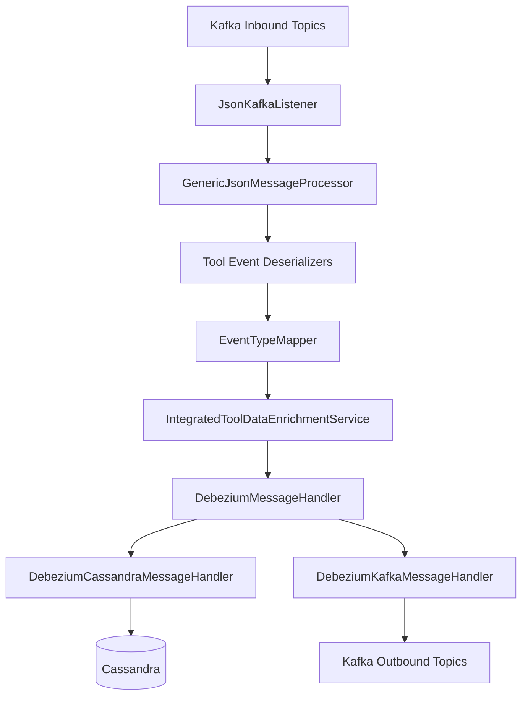
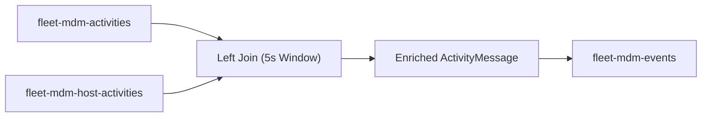
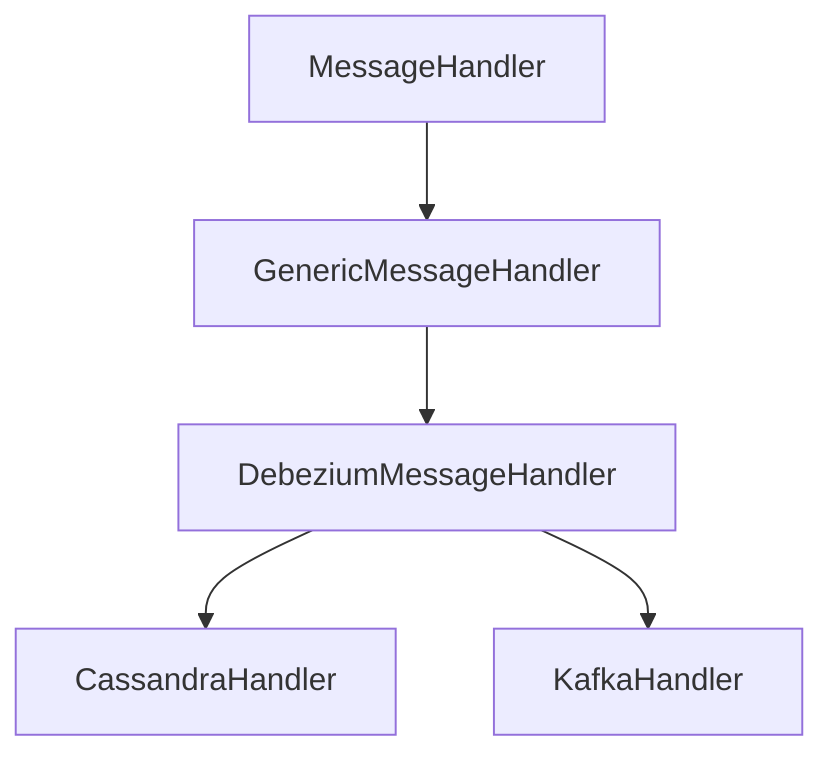
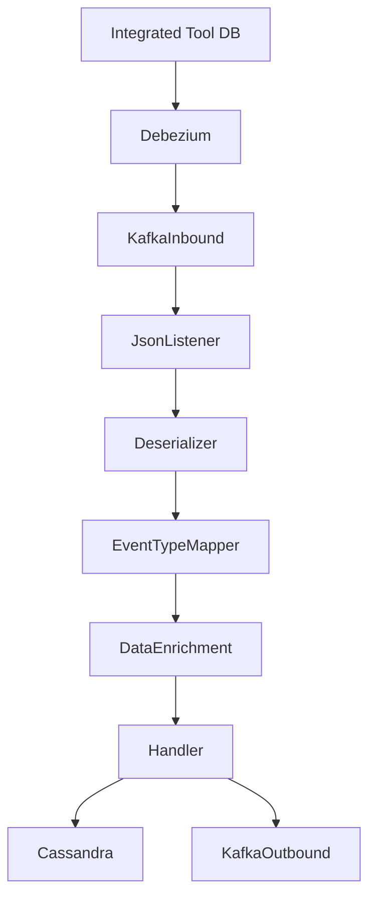

# Stream Processing Service Core

The **Stream Processing Service Core** module is the real-time ingestion, normalization, enrichment, and distribution engine for integrated tool events in the OpenFrame platform.

It consumes Debezium CDC events from Kafka, transforms heterogeneous tool-specific payloads (Fleet MDM, MeshCentral, Tactical RMM) into unified domain events, enriches them with machine and organization metadata, and forwards them to downstream systems such as Kafka topics and Cassandra.

This module is the backbone of real-time observability and unified event intelligence across the OpenFrame ecosystem.

---

## 1. Purpose and Responsibilities

The Stream Processing Service Core is responsible for:

- Consuming CDC events from integrated tools via Kafka
- Deserializing tool-specific payload formats
- Mapping tool-specific event types to unified event types
- Enriching events with machine and organization metadata
- Handling operation types (create, update, delete)
- Publishing normalized events to Kafka
- Persisting unified log events to Cassandra
- Performing stream-time joins for Fleet activity enrichment

---

## 2. High-Level Architecture



### Core Flow

1. Kafka receives Debezium CDC messages.
2. `JsonKafkaListener` consumes messages with `MessageType` header.
3. Tool-specific deserializers extract:
   - Agent ID
   - Source event type
   - Tool event ID
   - Message
   - Timestamp
4. `EventTypeMapper` maps source event type to `UnifiedEventType`.
5. `IntegratedToolDataEnrichmentService` resolves:
   - Machine ID
   - Hostname
   - Organization ID
   - Organization Name
6. `DebeziumMessageHandler` routes based on operation type.
7. Events are persisted to Cassandra or republished to Kafka.

---

## 3. Kafka Integration

### 3.1 Kafka Configuration

`KafkaConfig` defines:

- A `Converter<byte[], MessageType>` to decode message type headers.
- Integration with Spring Kafka listener container factory.

This allows multi-tool topics to be processed generically while still routing correctly by `MessageType`.

---

### 3.2 Kafka Streams Configuration

`KafkaStreamsConfig` configures stream processing for:

- Application ID namespaced by cluster ID
- At-least-once processing guarantee
- Custom SerDes for:
  - `ActivityMessage`
  - `HostActivityMessage`
- Consumer and producer tuning parameters

The application ID is dynamically built using:

```text
applicationName-clusterId
```

This ensures tenant isolation in SaaS environments.

---

## 4. Fleet Activity Enrichment (Kafka Streams)

Fleet MDM emits two related topics:

- Activities
- Host Activities

These must be joined to associate activity records with host IDs.



### Key Characteristics

- Left join with 5-second window
- Uses `ActivityMessage` and `HostActivityMessage`
- Sets `hostId` and `agentId`
- Adds constant Kafka headers:
  - `MESSAGE_TYPE_HEADER`
  - `__TypeId__`

This enrichment ensures Fleet events align with the unified event pipeline.

---

## 5. Tool-Specific Deserialization Layer

All tool deserializers extend a common base (`IntegratedToolEventDeserializer`).

### Implementations

- `FleetEventDeserializer`
- `FleetQueryResultEventDeserializer`
- `MeshCentralEventDeserializer`
- `TrmmAgentHistoryEventDeserializer`
- `TrmmAuditEventDeserializer`

Each implementation:

- Extracts agent ID
- Extracts source event type
- Extracts event timestamp
- Constructs message text
- Optionally extracts result or error JSON
- Declares its `MessageType`

### Example: Tactical Script Execution

- Reads `script_id`
- Resolves script name via cache
- Extracts stdout / stderr
- Produces structured result JSON

---

## 6. Event Type Normalization

`EventTypeMapper` converts:

```text
(toolType, sourceEventType) -> UnifiedEventType
```

Example:

```text
MESHCENTRAL:user.login -> LOGIN
TACTICAL:cmd_run.finished -> COMMAND_RUN_FINISHED
FLEET:created_policy -> POLICY_APPLIED
```

If no mapping exists, it defaults to:

```text
UnifiedEventType.UNKNOWN
```

This guarantees consistent event semantics across tools.

---

## 7. Data Enrichment Layer

`IntegratedToolDataEnrichmentService`:

- Uses `MachineIdCacheService` (Redis-backed)
- Resolves agent ID to machine metadata
- Resolves organization metadata

### Enriched Fields

- `machineId`
- `hostname`
- `organizationId`
- `organizationName`

If no machine is found, the event still flows but without enrichment.

---

## 8. Generic Message Handling Framework

### Class Hierarchy



### Operation Routing

Debezium operation codes:

```text
c -> CREATE
r -> READ
u -> UPDATE
d -> DELETE
```

`GenericMessageHandler` routes to:

- `handleCreate`
- `handleRead`
- `handleUpdate`
- `handleDelete`

This ensures consistent processing logic across destinations.

---

## 9. Cassandra Persistence

`DebeziumCassandraMessageHandler` transforms enriched messages into `UnifiedLogEvent`.

### Key Structure

```text
ingestDay
toolType
eventType
eventTimestamp
toolEventId
```

Stored fields include:

- User ID
- Device ID
- Hostname
- Organization
- Severity
- Message
- Details
- Raw Debezium payload

This provides durable audit storage optimized for time-based querying.

---

## 10. Kafka Republishing

`DebeziumKafkaMessageHandler` publishes normalized `IntegratedToolEvent` objects.

### Broker Key Strategy

```text
deviceId-toolType
userId-toolType
fallback: toolType
```

Messages are only published if:

```text
message.getIsVisible() == true
```

This prevents internal-only events from leaking downstream.

---

## 11. Timestamp Handling

`TimestampParser` converts ISO 8601 strings into epoch milliseconds:

```text
2024-01-01T12:00:00Z -> 1704110400000
```

This standardizes time across all integrated tools.

---

## 12. End-to-End Event Flow



---

## 13. Design Principles

The Stream Processing Service Core follows several key architectural principles:

- **Tool-Agnostic Core** – Tool-specific logic isolated in deserializers.
- **Unified Domain Model** – All events converge into `UnifiedEventType`.
- **Pluggable Destinations** – Handlers abstract storage vs publishing.
- **Tenant Isolation** – Kafka Streams application ID namespacing.
- **Resilient Processing** – At-least-once guarantee.
- **Graceful Degradation** – Events flow even if enrichment fails.

---

## 14. How It Fits Into the Platform

Within the OpenFrame architecture, this module:

- Bridges raw CDC events and the unified event domain.
- Feeds audit logs and monitoring dashboards.
- Powers real-time integrations and automation triggers.
- Supplies downstream services via normalized Kafka topics.

It acts as the **real-time normalization and enrichment engine** for all integrated tools.

---

# Summary

The **Stream Processing Service Core** module transforms heterogeneous, tool-specific CDC events into enriched, unified, and distributed domain events.

It combines:

- Kafka consumers
- Kafka Streams joins
- Tool-specific deserialization
- Event type normalization
- Redis-backed enrichment
- Cassandra persistence
- Kafka republishing

Together, these capabilities provide a scalable and tenant-aware real-time event processing backbone for OpenFrame.