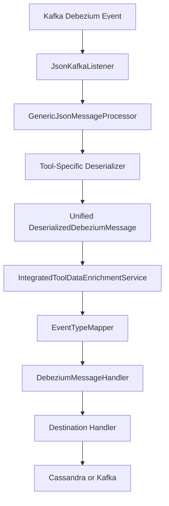
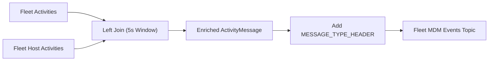
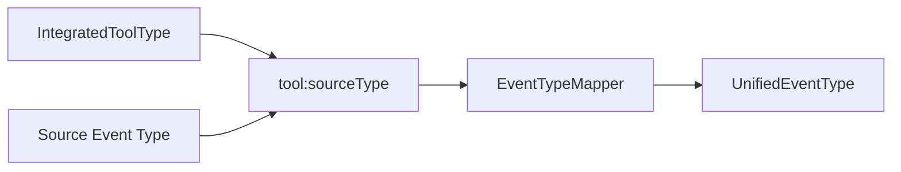
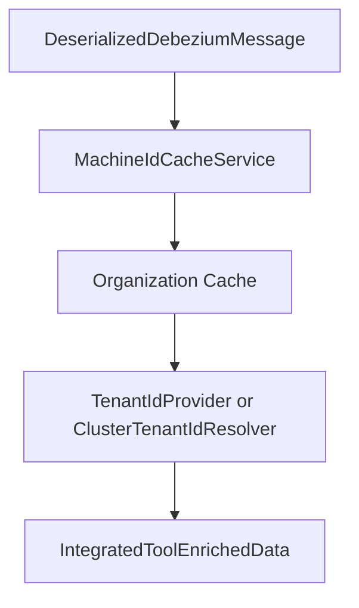

# Stream Service Core Kafka And Handlers

## Overview

The **Stream Service Core Kafka And Handlers** module is the event ingestion, normalization, enrichment, and distribution backbone of the OpenFrame platform.

It is responsible for:

- Consuming Debezium CDC events from integrated tools (MeshCentral, Fleet MDM)
- Deserializing tool-specific payloads into unified internal models
- Enriching events with tenant, organization, and device metadata
- Mapping tool-specific event types to unified event types
- Persisting events (e.g., Cassandra)
- Republishing normalized events to outbound Kafka topics
- Running Kafka Streams pipelines for activity enrichment

This module acts as the **bridge between external tool ecosystems and the unified OpenFrame event model** used across API, analytics, notifications, and management services.

---

## High-Level Architecture

```mermaid
flowchart LR
    subgraph Tools["Integrated Tools"]
        MeshCentral["MeshCentral"]
        Fleet["Fleet MDM"]
    end

    subgraph KafkaIn["Inbound Kafka Topics"]
        InTopics["Debezium Topics"]
    end

    subgraph StreamCore["Stream Service Core Kafka And Handlers"]
        Listener["JsonKafkaListener"]
        Processor["GenericJsonMessageProcessor"]
        Deserializer["Tool Event Deserializers"]
        Enrichment["IntegratedToolDataEnrichmentService"]
        Mapper["EventTypeMapper"]
        Handler["DebeziumMessageHandler"]
        CassandraHandler["DebeziumCassandraMessageHandler"]
        TenantKafkaHandler["TenantDebeziumKafkaMessageHandler"]
    end

    subgraph Storage["Storage & Downstream"]
        Cassandra["Cassandra UnifiedLogEvent"]
        KafkaOut["Outbound Kafka Topics"]
    end

    MeshCentral --> InTopics
    Fleet --> InTopics

    InTopics --> Listener
    Listener --> Processor
    Processor --> Deserializer
    Deserializer --> Enrichment
    Enrichment --> Mapper
    Mapper --> Handler

    Handler --> CassandraHandler
    Handler --> TenantKafkaHandler

    CassandraHandler --> Cassandra
    TenantKafkaHandler --> KafkaOut
```

---

## Processing Flow

The module follows a structured event pipeline:

### Key Stages

1. **Kafka Consumption** – `JsonKafkaListener` consumes multi-topic integrated tool events.
2. **Deserialization** – Tool-specific deserializers convert raw CDC JSON into structured internal messages.
3. **Enrichment** – Tenant, machine, and organization metadata are resolved via Redis cache services.
4. **Type Mapping** – `EventTypeMapper` maps tool-specific source types into `UnifiedEventType`.
5. **Handling & Dispatch** – Generic and specialized handlers route events to storage or outbound topics.

---

## Kafka Configuration Layer

### KafkaConfig

Provides:

- `Converter<byte[], MessageType>` for resolving message type headers.
- Integration with Spring Kafka infrastructure.

This enables dynamic routing of heterogeneous tool events through a unified processing layer.

### KafkaStreamsConfig

Enables Kafka Streams processing when `kafka.stream.enabled=true`.

Key responsibilities:

- Configures `application.id` (namespaced by cluster ID)
- Defines custom `Serde` for:
  - `ActivityMessage`
  - `HostActivityMessage`
- Configures state store, threading, and processing guarantees

Processing guarantee: `AT_LEAST_ONCE`

---

## Kafka Streams: Activity Enrichment

`ActivityEnrichmentService` builds a Kafka Streams topology that:

- Consumes:
  - Fleet activity topic
  - Fleet host activity topic
- Performs a time-windowed left join
- Enriches activity events with host information
- Adds required Kafka headers
- Publishes enriched events back to an inbound topic

This allows Fleet policy and activity events to be normalized before entering the main Debezium event processing path.

---

## Tool-Specific Deserializers

Each integrated tool has a dedicated deserializer extending `IntegratedToolEventDeserializer`.

### Fleet MDM

- `FleetEventDeserializer`
- `FleetPolicyActivityDeserializer`
- `FleetPolicyMembershipEventDeserializer`
- `FleetQueryResultEventDeserializer`

Responsibilities:

- Extract agent ID
- Resolve policy/query metadata via cache services
- Build structured `result` or `error` JSON
- Normalize timestamps using `TimestampParser`
- Assign correct `MessageType`

### MeshCentral

- `MeshCentralEventDeserializer`

Responsibilities:

- Parse nested JSON payloads
- Extract `etype.action` composite source type
- Extract tenant domain for shared cluster resolution

---

## Unified Event Mapping

`EventTypeMapper` maps:

- `IntegratedToolType`
- Source event type string

To:

- `UnifiedEventType`

If no mapping exists, the system falls back to `UNKNOWN`.

This ensures:

- Cross-tool normalization
- Consistent severity assignment
- Unified downstream analytics

---

## Data Enrichment Layer

`IntegratedToolDataEnrichmentService` enriches deserialized events with:

- Machine ID
- Hostname
- Organization ID and name
- Tenant ID

It integrates with:

- Redis cache via `MachineIdCacheService`
- Tenant resolution via `TenantIdProvider`
- Optional `ClusterTenantIdResolver` (shared cluster mode)

This ensures that all downstream consumers receive fully contextualized events.

---

## Message Handling Framework

### GenericMessageHandler

Provides a template pattern:

- Validate message
- Transform to destination model
- Resolve operation type (CREATE, UPDATE, DELETE, READ)
- Route to appropriate handler method

### DebeziumMessageHandler

Specialization for CDC events:

- Extracts operation code from Debezium payload (`c`, `u`, `d`, `r`)
- Maps to `OperationType`

### DebeziumCassandraMessageHandler

Transforms events into `UnifiedLogEvent` and writes to Cassandra.

Responsibilities:

- Construct partition key
- Populate severity and unified type
- Persist to `UnifiedLogEventRepository`

### TenantDebeziumKafkaMessageHandler

Publishes validated events to tenant-scoped outbound Kafka topics using `OssTenantRetryingKafkaProducer`.

---

## Validation Layer

`TenantIdRequiredDebeziumEventValidator` ensures:

- All events have a resolved tenant ID
- Events without tenant context are dropped

This prevents cross-tenant contamination and guarantees multi-tenant isolation.

---

## Timestamp Normalization

`TimestampParser` standardizes ISO-8601 timestamps into epoch milliseconds.

All integrated tools rely on Debezium ISO format, ensuring:

- Consistent event ordering
- Reliable partitioning
- Accurate time-based queries

---

## Multi-Tenant and Cluster Modes

The module supports two deployment modes:

1. **Tenant Cluster Mode**
   - One tenant per Kafka cluster
   - `TenantIdProvider` resolves tenant ID directly

2. **Shared Cluster Mode**
   - Multiple tenants share Kafka
   - `ClusterTenantIdResolver` maps tool-specific domain identifiers to canonical tenant IDs

This design ensures compatibility across SaaS and dedicated deployments.

---

## Integration with Other Modules

This module integrates tightly with:

- Data Mongo domain model (for unified event storage references)
- Data Cassandra repositories (for log persistence)
- Data Kafka configuration and retry (for producer reliability)
- Data Redis cache (for machine and organization lookups)
- Management and API services (downstream consumers of normalized events)

It serves as the **event normalization boundary** between external tools and the internal OpenFrame domain model.

---

## Summary

The **Stream Service Core Kafka And Handlers** module provides:

- Reliable Kafka ingestion
- Tool-specific deserialization
- Unified event type normalization
- Tenant-aware enrichment
- Cassandra persistence
- Kafka republishing
- Kafka Streams activity joins

It is a critical infrastructure layer enabling:

- Cross-tool observability
- Unified audit trails
- Analytics and reporting
- Real-time notification pipelines
- Multi-tenant isolation guarantees

Without this module, the OpenFrame platform would lack a consistent, normalized, and tenant-safe event backbone.