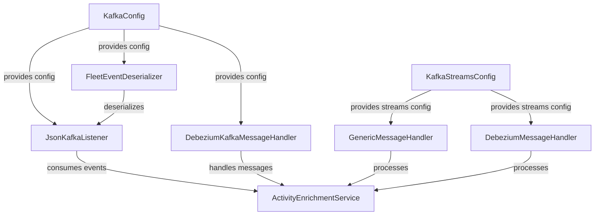
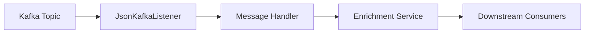
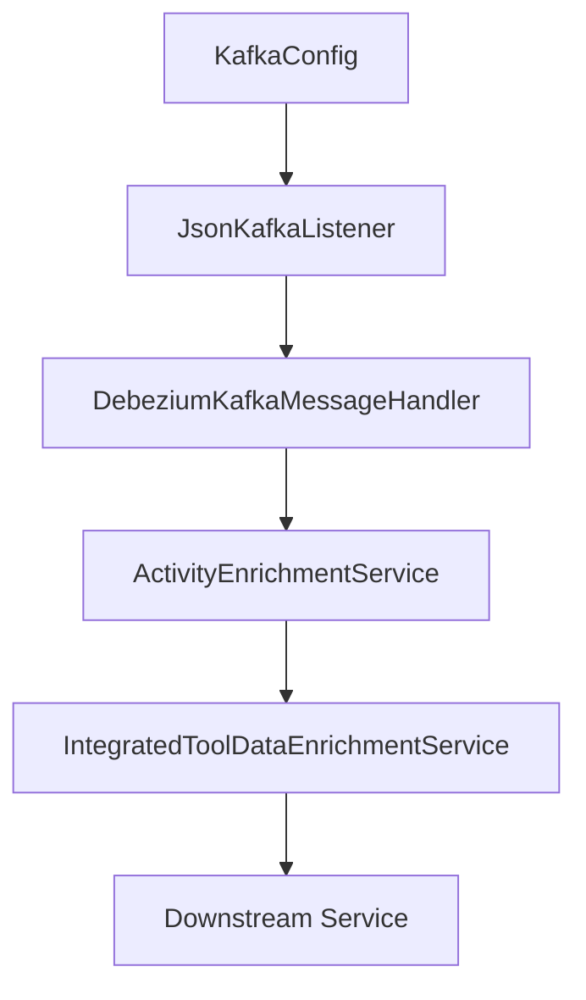

# stream_service_core_config Module Documentation

## Introduction

The `stream_service_core_config` module provides the foundational configuration for Kafka and Kafka Streams integration within the streaming subsystem of the platform. It defines the essential beans and settings required for reliable, scalable, and secure event streaming, processing, and consumption. This module is a critical part of the event-driven architecture, enabling other modules to interact with Kafka topics, process real-time data, and support microservices communication patterns.

## Core Components

- **KafkaConfig**: Configures the core Kafka client properties, including bootstrap servers, serializers, deserializers, and security settings.
- **KafkaStreamsConfig**: Sets up the configuration for Kafka Streams, including topology, state stores, and stream processing parameters.

## Architecture Overview

The `stream_service_core_config` module acts as the backbone for all streaming operations. It is typically used by deserializers, message handlers, listeners, and enrichment services within the streaming domain. The configuration beans defined here are injected into downstream components to enable seamless Kafka and Kafka Streams operations.

### High-Level Architecture

- **KafkaConfig** is consumed by listeners, handlers, and deserializers to connect and interact with Kafka topics.
- **KafkaStreamsConfig** is used by stream processing handlers to define and manage stream topologies.
- Downstream services such as `ActivityEnrichmentService` and `IntegratedToolDataEnrichmentService` (see [stream_service_core_service.md]) rely on these configurations for event enrichment and processing.

## Component Relationships

### Dependencies

- **Deserializers** ([stream_service_core_deserializer.md]): Use `KafkaConfig` for deserialization settings.
- **Handlers** ([stream_service_core_handler.md]): Use both `KafkaConfig` and `KafkaStreamsConfig` for message handling and stream processing.
- **Listeners** ([stream_service_core_listener.md]): Rely on `KafkaConfig` to subscribe and consume Kafka topics.
- **Mapping and Model Modules** ([stream_service_core_mapping.md], [stream_service_core_model_fleet.md]): Indirectly depend on the configuration for event type mapping and activity modeling.
- **Enrichment Services** ([stream_service_core_service.md]): Use the configuration to process and enrich streaming data.

### Data Flow

- Kafka topics are consumed by listeners configured via `KafkaConfig`.
- Listeners pass events to message handlers, which may use stream processing (`KafkaStreamsConfig`).
- Handlers invoke enrichment services for further processing.
- Enriched data is delivered to downstream consumers or persisted.

## Integration with the Overall System

The `stream_service_core_config` module is foundational for all streaming operations. It is referenced by multiple modules in the streaming domain and is essential for:

- Real-time event ingestion and processing
- Microservices communication via Kafka
- Event enrichment and transformation
- Integration with external systems through Kafka topics

For more details on how these configurations are used in practice, see:
- [stream_service_core_deserializer.md]
- [stream_service_core_handler.md]
- [stream_service_core_listener.md]
- [stream_service_core_service.md]

## Process Flow Example

Below is a simplified process flow for event consumption and enrichment using the configuration provided by this module:

## Summary

The `stream_service_core_config` module is a critical enabler for the platform's streaming capabilities. By centralizing Kafka and Kafka Streams configuration, it ensures consistency, reliability, and scalability across all streaming components. Its design allows for easy extension and integration with other modules in the system.
