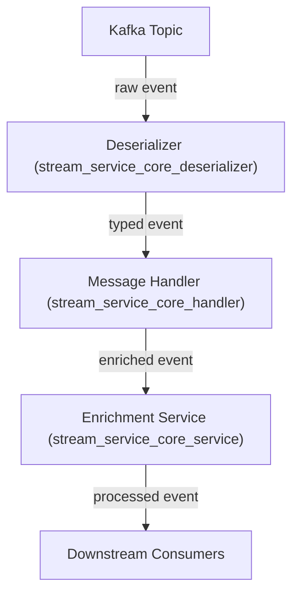
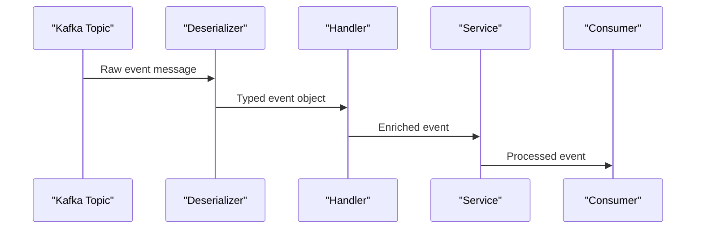

# stream_service_core_deserializer Module Documentation

## Introduction

The `stream_service_core_deserializer` module provides a set of deserializer components responsible for converting raw event data from various streaming sources (such as Kafka topics) into structured, strongly-typed event objects. These deserializers are a critical part of the event ingestion pipeline, enabling downstream processing, enrichment, and analytics by transforming unstructured or semi-structured messages into domain-specific models.

This module is essential for integrating with multiple event sources, including Fleet, MeshCentral, and Tactical RMM, and for supporting a variety of event types such as audit logs, agent histories, and query results.

---

## Core Components

- **FleetEventDeserializer**
- **FleetQueryResultEventDeserializer**
- **MeshCentralEventDeserializer**
- **TrmmAgentHistoryEventDeserializer**
- **TrmmAuditEventDeserializer**

Each deserializer is tailored to a specific event source and event type, ensuring accurate and efficient transformation of incoming data.

---

## Architecture Overview

The deserializer module sits at the heart of the stream processing pipeline, acting as the bridge between raw event ingestion (from Kafka or other streaming platforms) and the internal event handling logic. It is closely integrated with the following modules:

- [stream_service_core_handler.md]: For message handling and further processing
- [stream_service_core_listener.md]: For consuming messages from Kafka topics
- [stream_service_core_mapping.md]: For mapping event types and activity types
- [stream_service_core_model_fleet.md]: For Fleet-specific event models
- [sdk_fleetmdm_model.md], [sdk_tacticalrmm_model.md]: For SDK-level event and agent models

### High-Level Architecture

---

## Component Responsibilities

### FleetEventDeserializer
- Deserializes Fleet event messages from Kafka into structured Fleet event models.
- Works closely with [stream_service_core_model_fleet.md] for domain models.
- Supports event type mapping via [stream_service_core_mapping.md].

### FleetQueryResultEventDeserializer
- Handles deserialization of Fleet query result events.
- Converts query result payloads into [sdk_fleetmdm_model.md] types.

### MeshCentralEventDeserializer
- Processes MeshCentral event messages.
- Transforms raw MeshCentral events into internal representations for further processing.

### TrmmAgentHistoryEventDeserializer
- Deserializes agent history events from Tactical RMM.
- Converts agent history payloads into [sdk_tacticalrmm_model.md] types.

### TrmmAuditEventDeserializer
- Handles audit event deserialization for Tactical RMM.
- Produces structured audit event objects for downstream audit logging and analytics.

---

## Data Flow and Process

The following diagram illustrates the typical data flow for an event through the deserialization pipeline:

---

## Dependencies and Integration Points

- **Event Handlers**: The deserialized objects are passed to handlers in [stream_service_core_handler.md] for business logic and further processing.
- **Kafka Listeners**: [stream_service_core_listener.md] is responsible for consuming messages and invoking the appropriate deserializer.
- **Event Type Mapping**: [stream_service_core_mapping.md] provides mapping logic for event types, ensuring correct deserializer selection and event routing.
- **Domain Models**: Structured event objects are based on models defined in [stream_service_core_model_fleet.md], [sdk_fleetmdm_model.md], and [sdk_tacticalrmm_model.md].

---

## Example Usage Scenario

1. A new event is published to a Kafka topic (e.g., a Fleet activity event).
2. [stream_service_core_listener.md] consumes the message and determines the event type.
3. The appropriate deserializer (e.g., `FleetEventDeserializer`) is invoked to convert the raw message into a typed event object.
4. The typed event is passed to a handler in [stream_service_core_handler.md] for enrichment and business logic.
5. The processed event is made available to downstream consumers or persisted for analytics.

---

## Related Modules

- [stream_service_core_handler.md]: Event message handling and processing
- [stream_service_core_listener.md]: Kafka message consumption
- [stream_service_core_mapping.md]: Event type and activity mapping
- [stream_service_core_model_fleet.md]: Fleet event models
- [sdk_fleetmdm_model.md]: Fleet MDM SDK models
- [sdk_tacticalrmm_model.md]: Tactical RMM SDK models

---

## Summary

The `stream_service_core_deserializer` module is a foundational component in the event streaming architecture, enabling robust, type-safe, and extensible event processing across multiple sources and event types. Its design ensures seamless integration with the broader streaming and enrichment pipeline, supporting scalable and maintainable event-driven systems.
