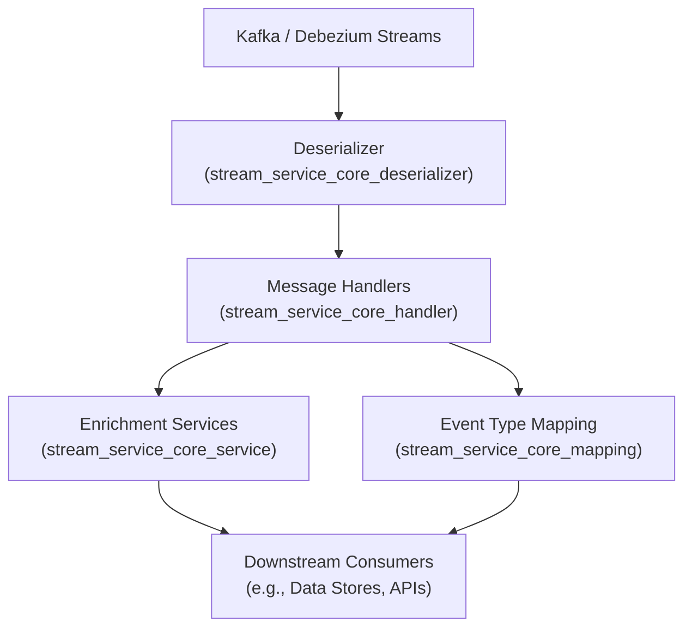

# stream_service_core_handler Module Documentation

## Introduction

The `stream_service_core_handler` module is responsible for handling and processing streaming messages within the system, particularly those originating from Debezium (for change data capture from databases) and Kafka (for distributed event streaming). It provides a set of message handler components that interpret, transform, and route incoming messages for further processing or enrichment. This module is a critical part of the event-driven architecture, enabling real-time data flows and integrations across the platform.

## Core Components

- **DebeziumCassandraMessageHandler**: Handles Debezium messages specifically from Cassandra sources.
- **DebeziumKafkaMessageHandler**: Handles Debezium messages from Kafka topics.
- **DebeziumMessageHandler**: A generic handler for Debezium messages, providing a base for more specialized handlers.
- **GenericMessageHandler**: A flexible handler for processing generic messages that do not fit the Debezium-specific patterns.

## Architecture Overview

The `stream_service_core_handler` module sits at the heart of the streaming data pipeline. It receives deserialized events (see [`stream_service_core_deserializer.md`](stream_service_core_deserializer.md)), processes them according to their type and source, and interacts with enrichment and mapping services (see [`stream_service_core_service.md`](stream_service_core_service.md) and [`stream_service_core_mapping.md`](stream_service_core_mapping.md)).

## Component Relationships and Data Flow

### 1. Message Ingestion
- **Source**: Kafka topics or Debezium connectors emit messages.
- **Listener**: [`JsonKafkaListener`](stream_service_core_listener.md) receives raw messages and passes them to the appropriate deserializer.
- **Deserializer**: Components in [`stream_service_core_deserializer.md`](stream_service_core_deserializer.md) parse the raw messages into structured event objects.

### 2. Message Handling
- **DebeziumCassandraMessageHandler** and **DebeziumKafkaMessageHandler**: Specialized handlers for messages from Cassandra and Kafka, respectively. They extend the base **DebeziumMessageHandler** to implement source-specific logic.
- **GenericMessageHandler**: Used for messages that do not match Debezium patterns or require custom processing.

### 3. Enrichment and Mapping
- Handlers may invoke services from [`stream_service_core_service.md`](stream_service_core_service.md) (e.g., `ActivityEnrichmentService`) to enrich the event data.
- Event types are mapped using [`stream_service_core_mapping.md`](stream_service_core_mapping.md) to ensure consistent downstream processing.

### 4. Downstream Processing
- Enriched and mapped events are forwarded to downstream consumers, such as data stores, APIs, or further processing pipelines.

## Integration with Other Modules

- **Deserialization**: Relies on [`stream_service_core_deserializer.md`](stream_service_core_deserializer.md) for parsing raw messages.
- **Event Mapping**: Uses [`stream_service_core_mapping.md`](stream_service_core_mapping.md) for event type normalization.
- **Enrichment**: Collaborates with [`stream_service_core_service.md`](stream_service_core_service.md) for data enrichment.
- **Listening**: Works in conjunction with [`stream_service_core_listener.md`](stream_service_core_listener.md) for message ingestion.

## Process Flow Example

## Summary

The `stream_service_core_handler` module is a central part of the streaming data infrastructure, providing robust and extensible message handling for real-time event processing. By leveraging specialized handlers, deserializers, enrichment services, and event mapping, it ensures that streaming data is processed efficiently and consistently across the platform.

For more details on related modules, see:
- [stream_service_core_deserializer.md](stream_service_core_deserializer.md)
- [stream_service_core_listener.md](stream_service_core_listener.md)
- [stream_service_core_service.md](stream_service_core_service.md)
- [stream_service_core_mapping.md](stream_service_core_mapping.md)
