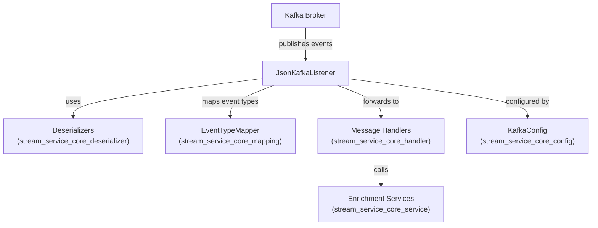
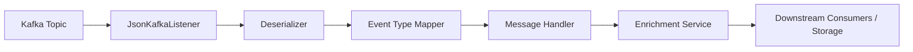

# stream_service_core_listener Module Documentation

## Introduction

The `stream_service_core_listener` module is responsible for consuming and processing streaming data from Kafka topics within the system. It acts as the entry point for ingesting real-time events, deserializing them, and triggering downstream processing and enrichment services. This module is a critical component in the event-driven architecture, enabling the system to react to changes and activities from various sources in near real-time.

## Core Component

- **JsonKafkaListener**: The primary listener class that subscribes to Kafka topics, receives messages, and coordinates their deserialization and further processing.

## Architecture Overview

The `stream_service_core_listener` module is tightly integrated with several other modules to achieve its functionality:

- **Deserialization**: Utilizes deserializers from [`stream_service_core_deserializer.md`] to convert raw Kafka messages into structured event objects.
- **Event Mapping**: Leverages event type mapping utilities from [`stream_service_core_mapping.md`] to interpret and categorize incoming events.
- **Processing Handlers**: Forwards deserialized events to message handlers in [`stream_service_core_handler.md`] for business logic execution.
- **Enrichment Services**: Interacts with enrichment services from [`stream_service_core_service.md`] to augment event data before further use.
- **Kafka Configuration**: Relies on Kafka configuration provided by [`stream_service_core_config.md`].

### High-Level Architecture Diagram

## Component Responsibilities

### JsonKafkaListener

- **Kafka Subscription**: Listens to one or more Kafka topics for incoming event messages.
- **Deserialization**: Uses deserializers (e.g., `FleetEventDeserializer`, `MeshCentralEventDeserializer`) to convert raw JSON messages into domain-specific event objects. See [`stream_service_core_deserializer.md`].
- **Event Type Mapping**: Determines the type and source of each event using mapping utilities. See [`stream_service_core_mapping.md`].
- **Message Handling**: Delegates the processing of events to appropriate message handlers, which may include business logic, data enrichment, and persistence. See [`stream_service_core_handler.md`].
- **Enrichment**: Optionally enriches events with additional data before they are passed downstream. See [`stream_service_core_service.md`].
- **Error Handling**: Handles deserialization and processing errors, potentially forwarding them to a dead-letter queue or logging for further analysis.

### Data Flow Diagram

## Dependencies and Integration

The `stream_service_core_listener` module depends on the following modules for its operation:

- [`stream_service_core_config.md`]: Kafka and stream configuration
- [`stream_service_core_deserializer.md`]: Event deserialization logic
- [`stream_service_core_mapping.md`]: Event type and source mapping
- [`stream_service_core_handler.md`]: Event processing and business logic
- [`stream_service_core_service.md`]: Data enrichment and augmentation

Refer to the respective documentation files for detailed information on each dependency.

## Process Flow

1. **Event Reception**: Kafka publishes an event to a subscribed topic.
2. **Message Consumption**: `JsonKafkaListener` receives the event message.
3. **Deserialization**: The message is deserialized into a structured event object.
4. **Type Mapping**: The event type and source are determined.
5. **Processing**: The event is forwarded to the appropriate handler for business logic execution.
6. **Enrichment**: The event may be enriched with additional data.
7. **Downstream Delivery**: The processed event is made available to downstream consumers or persisted as needed.

## How It Fits Into the System

The `stream_service_core_listener` module is a foundational part of the system's event-driven backbone. By efficiently ingesting and processing real-time events, it enables:

- Real-time monitoring and analytics
- Automated responses to system and device activities
- Data enrichment and transformation pipelines
- Integration with external and internal event sources

It works in concert with other stream service core modules to provide a robust, scalable, and extensible event processing framework.

## References

- [stream_service_core_config.md]
- [stream_service_core_deserializer.md]
- [stream_service_core_handler.md]
- [stream_service_core_mapping.md]
- [stream_service_core_service.md]
