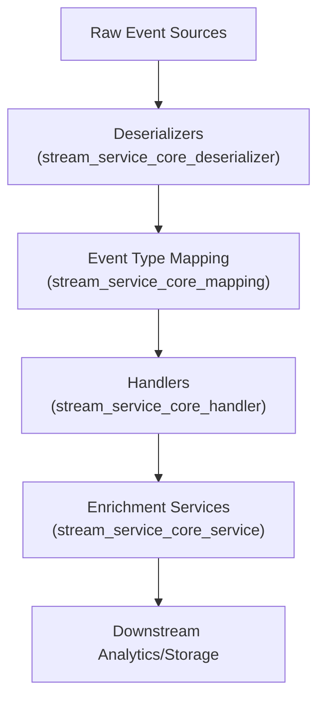
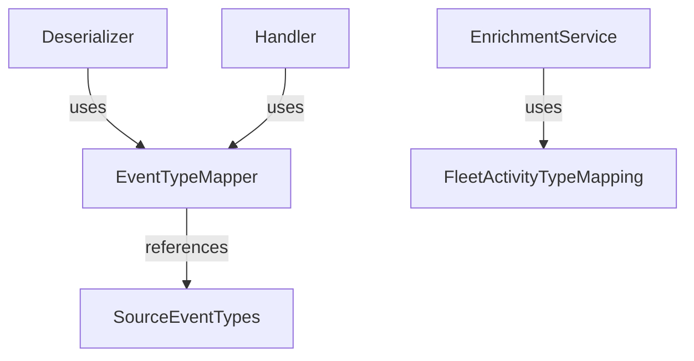

# stream_service_core_mapping Module Documentation

## Introduction

The `stream_service_core_mapping` module is responsible for mapping, translating, and categorizing event types and activity types within the streaming data pipeline. It provides a central mechanism for interpreting raw event data from various sources and mapping them to standardized internal representations. This is essential for downstream processing, enrichment, and analytics within the streaming service architecture.

## Core Components

- **EventTypeMapper**: Handles the mapping between raw event types from different sources and the system's canonical event types.
- **FleetActivityTypeMapping**: Provides mappings specific to fleet-related activity types, enabling consistent interpretation of fleet events.
- **SourceEventTypes**: Defines and categorizes the supported event types from various data sources.

## Module Purpose and Functionality

The primary purpose of this module is to:

- Normalize event types from heterogeneous sources (e.g., Fleet, MeshCentral, TacticalRMM) into a unified set of internal event/activity types.
- Enable downstream services (such as enrichment, analytics, and alerting) to operate on a consistent event taxonomy.
- Serve as a reference point for event type translation logic used by deserializers, handlers, and enrichment services.

## Architecture and Component Relationships

The `stream_service_core_mapping` module acts as a bridge between the deserialization of raw events and the enrichment/processing layers. It is typically used by:

- **Deserializers** (see [stream_service_core_deserializer.md]) to interpret incoming event payloads.
- **Handlers** (see [stream_service_core_handler.md]) to route and process events based on their mapped types.
- **Enrichment Services** (see [stream_service_core_service.md]) to apply business logic based on standardized event/activity types.

### High-Level Architecture



### Component Interaction



## Data Flow

1. **Raw Event Ingestion**: Events are ingested from various sources (e.g., Kafka topics).
2. **Deserialization**: Deserializers parse the raw event payloads and extract event type information.
3. **Event Type Mapping**: The extracted event type is mapped to a canonical type using `EventTypeMapper` and, if fleet-specific, `FleetActivityTypeMapping`.
4. **Processing**: Handlers and enrichment services use the mapped types to apply business logic, enrich data, and route events.
5. **Output**: Processed events are forwarded to analytics, storage, or alerting systems.

## Dependencies and Integration

The `stream_service_core_mapping` module is tightly integrated with the following modules:

- [stream_service_core_deserializer.md]: Consumes mapping logic to interpret event types during deserialization.
- [stream_service_core_handler.md]: Uses mapped event types to determine processing logic.
- [stream_service_core_service.md]: Applies enrichment and business logic based on mapped types.
- [stream_service_core_model_fleet.md]: Defines data models for fleet activities that are mapped by this module.

## Example Usage

```python
from stream_service_core_mapping import EventTypeMapper

def process_event(raw_event):
    canonical_type = EventTypeMapper.map(raw_event['type'], source=raw_event['source'])
    # Use canonical_type for downstream processing
```

## Extensibility

- **Adding New Event Sources**: Extend `SourceEventTypes` and update `EventTypeMapper` to support new event types.
- **Custom Activity Mappings**: Update or extend `FleetActivityTypeMapping` for new fleet activity types.

## Related Documentation

- [stream_service_core_deserializer.md]
- [stream_service_core_handler.md]
- [stream_service_core_service.md]
- [stream_service_core_model_fleet.md]
