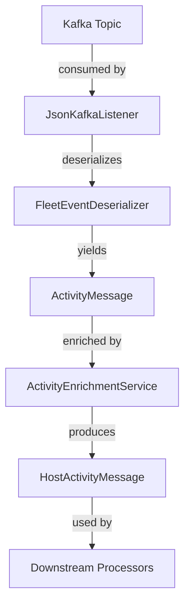
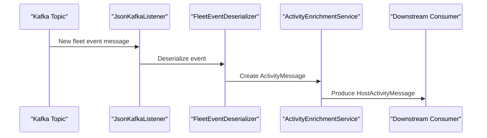
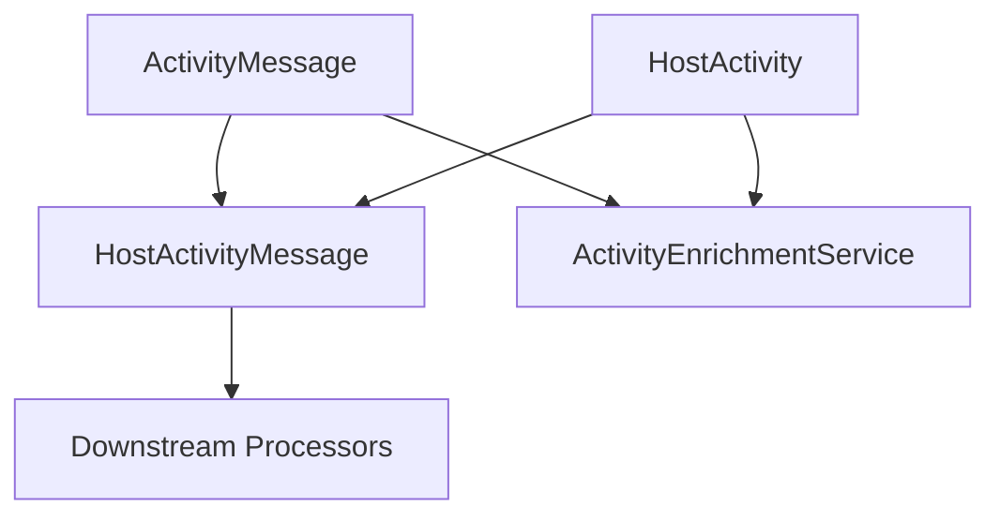

# stream_service_core_model_fleet Module Documentation

## Introduction

The `stream_service_core_model_fleet` module defines the core data models for representing fleet-related activity and event messages within the streaming data pipeline. These models are foundational for the processing, enrichment, and analysis of host and activity data as it flows through the system, particularly in the context of Kafka-based event streaming and integration with external fleet management systems.

This module is a key part of the broader streaming service architecture, providing the canonical representations for host activities and messages that are consumed and produced by various handlers, listeners, and enrichment services.

---

## Core Components

- **ActivityMessage**: Represents a generic activity event within the fleet, encapsulating metadata and event details.
- **HostActivity**: Encapsulates the activity performed by a specific host, including host identifiers and activity details.
- **HostActivityMessage**: Combines host and activity information into a single message structure for streamlined processing.

These models are used throughout the streaming pipeline, including in deserialization, enrichment, and downstream analytics.

---

## Architecture Overview

The following diagram illustrates how the `stream_service_core_model_fleet` models fit into the overall streaming service architecture:



**Key Interactions:**
- The models are deserialized from Kafka events and enriched with additional context before being processed further.
- They serve as the data contract between the streaming infrastructure and downstream consumers.

---

## Component Relationships and Data Flow

### Data Flow Example



### Component Dependency Map



---

## Integration with Other Modules

- **Deserialization**: See [stream_service_core_deserializer.md] for details on how `FleetEventDeserializer` and related deserializers convert raw Kafka messages into `ActivityMessage` and `HostActivityMessage` objects.
- **Enrichment**: The [stream_service_core_service.md] module describes how `ActivityEnrichmentService` and `IntegratedToolDataEnrichmentService` add context and additional data to the core models.
- **Event Handling**: For information on how these models are handled in the streaming pipeline, refer to [stream_service_core_handler.md] and [stream_service_core_listener.md].
- **Mapping**: Event and activity types are mapped using utilities in [stream_service_core_mapping.md].
- **External Models**: Host and query result structures are defined in [sdk_fleetmdm_model.md].

---

## Example Usage

Below is a conceptual example of how these models might be used in the streaming pipeline:

```python
from stream_service_core_model_fleet import ActivityMessage, HostActivity, HostActivityMessage

# Deserialize a raw event into an ActivityMessage
activity_msg = ActivityMessage(
    event_id="evt-123",
    event_type="LOGIN",
    timestamp="2024-06-01T12:00:00Z",
    metadata={"user": "alice"}
)

# Enrich the activity with host information
host_activity = HostActivity(
    host_id="host-456",
    activity=activity_msg
)

# Combine into a HostActivityMessage for downstream processing
host_activity_msg = HostActivityMessage(
    host=host_activity,
    additional_context={"location": "datacenter-1"}
)
```

---

## How This Module Fits Into the System

The `stream_service_core_model_fleet` module is central to the streaming data pipeline, acting as the schema for fleet activity events. It enables:

- **Consistent Data Contracts**: Ensures all services and processors operate on a shared understanding of fleet activity data.
- **Extensibility**: New activity types or host attributes can be added without disrupting the pipeline.
- **Interoperability**: Serves as the bridge between raw event ingestion, enrichment, and downstream analytics or alerting systems.

---

## References

- [stream_service_core_deserializer.md]
- [stream_service_core_service.md]
- [stream_service_core_handler.md]
- [stream_service_core_listener.md]
- [stream_service_core_mapping.md]
- [sdk_fleetmdm_model.md]
