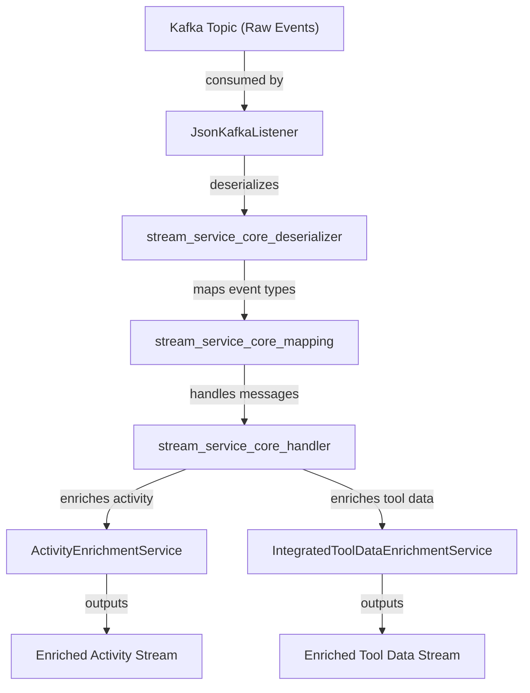
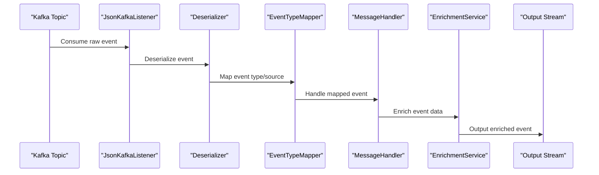

# stream_service_core_service Module Documentation

## Introduction

The `stream_service_core_service` module provides core enrichment services for streaming event data within the platform. Its primary responsibility is to process, enrich, and augment activity and tool-related event streams, enabling downstream consumers to access context-rich, actionable data. This module is a key part of the event streaming and enrichment pipeline, working closely with deserialization, mapping, and handler modules to deliver enhanced event information.

## Core Components

- **ActivityEnrichmentService**: Enriches activity messages with additional context and metadata.
- **IntegratedToolDataEnrichmentService**: Augments tool-related event data with integration-specific information.

## Architecture Overview

The `stream_service_core_service` module is positioned within the streaming data pipeline, interacting with deserializers, handlers, mappers, and utility modules. It receives raw or partially processed event data, applies enrichment logic, and outputs enhanced messages for further processing or storage.

## Component Responsibilities

### ActivityEnrichmentService
- **Purpose**: Enriches activity-related event messages (e.g., host activity, user actions) with additional metadata, such as organization, device, or user context.
- **Inputs**: Activity messages from upstream handlers (see [stream_service_core_handler.md]).
- **Outputs**: Enriched activity messages for downstream consumers or storage.
- **Dependencies**:
  - May utilize mapping utilities from [stream_service_core_mapping.md] and timestamp parsing from [stream_service_core_util.md].
  - Consumes models from [stream_service_core_model_fleet.md].

### IntegratedToolDataEnrichmentService
- **Purpose**: Enriches tool-related event data, adding integration-specific context (e.g., tool type, agent details).
- **Inputs**: Tool event messages from upstream handlers.
- **Outputs**: Enriched tool data messages for further processing.
- **Dependencies**:
  - Leverages mapping and model modules for tool and integration context.
  - May interact with deserializers ([stream_service_core_deserializer.md]) and mapping ([stream_service_core_mapping.md]).

## Data Flow and Process

The enrichment process typically follows these steps:

1. **Event Ingestion**: Raw events are consumed from Kafka topics by the `JsonKafkaListener` ([stream_service_core_listener.md]).
2. **Deserialization**: Events are deserialized into structured objects ([stream_service_core_deserializer.md]).
3. **Event Mapping**: Event types and sources are mapped to internal representations ([stream_service_core_mapping.md]).
4. **Message Handling**: Handlers process the mapped events ([stream_service_core_handler.md]).
5. **Enrichment**: The enrichment services add context and metadata.
6. **Output**: Enriched messages are published to downstream topics or services.

## Module Relationships

- **Upstream**:
  - [stream_service_core_listener.md]: Consumes events from Kafka and triggers the enrichment pipeline.
  - [stream_service_core_deserializer.md]: Converts raw event data into structured objects.
  - [stream_service_core_mapping.md]: Provides event type and source mappings.
  - [stream_service_core_handler.md]: Handles the business logic for incoming events.
- **Downstream**:
  - Enriched event streams are consumed by analytics, monitoring, or storage services (not detailed in this module).

## Extensibility and Integration

- The enrichment services are designed to be extensible, allowing new enrichment strategies or data sources to be integrated as requirements evolve.
- Integration with additional mapping or utility modules is straightforward due to the modular architecture.

## References

- [stream_service_core_deserializer.md]: Event deserialization logic
- [stream_service_core_handler.md]: Event handling and processing
- [stream_service_core_listener.md]: Kafka event listener
- [stream_service_core_mapping.md]: Event type and source mapping
- [stream_service_core_model_fleet.md]: Activity and host models
- [stream_service_core_util.md]: Timestamp and utility functions
