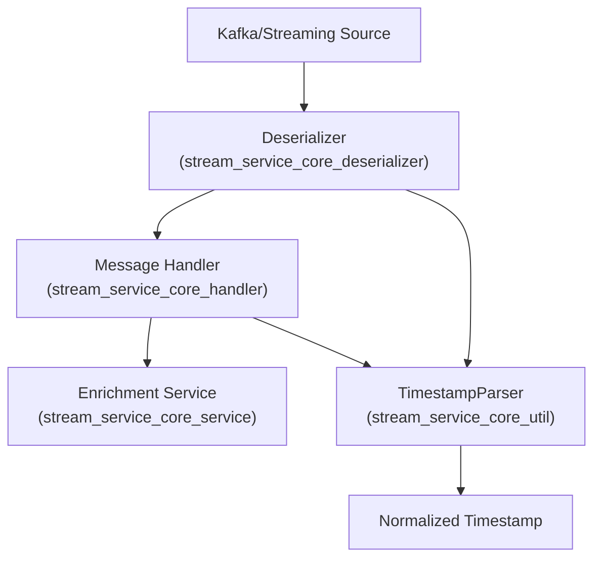
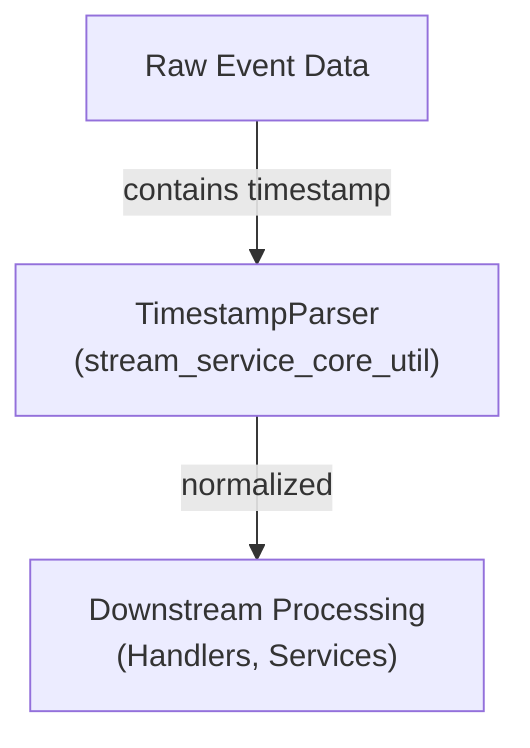

# stream_service_core_util Module Documentation

## Introduction

The `stream_service_core_util` module provides utility functions and helpers for the stream processing services within the platform. Its primary focus is on supporting the parsing and manipulation of timestamps in streaming data pipelines, ensuring consistent and reliable time handling across various event sources and message handlers.

This module is a foundational part of the stream service core, enabling other components—such as deserializers, handlers, listeners, and enrichment services—to process time-based data efficiently and accurately.

## Core Functionality

### Key Component: `TimestampParser`

- **Purpose:**
  - The `TimestampParser` utility is responsible for parsing, validating, and converting timestamp values from various formats commonly encountered in streaming event data.
  - It ensures that all time-related data is normalized to a consistent format, which is critical for event ordering, windowing, and downstream analytics.
- **Typical Use Cases:**
  - Used by deserializers (see [stream_service_core_deserializer.md]) to convert raw event timestamps into standard representations.
  - Utilized by message handlers (see [stream_service_core_handler.md]) to process and enrich events with accurate time information.
  - Supports listeners and enrichment services (see [stream_service_core_listener.md] and [stream_service_core_service.md]) in handling time-based logic.

## Architecture and Component Relationships

The `stream_service_core_util` module is designed to be a lightweight, stateless utility layer. It is invoked by higher-level components in the stream processing pipeline, as illustrated below.

- **Explanation:**
  - Streaming sources (e.g., Kafka) provide raw event data.
  - Deserializers parse the raw data and use `TimestampParser` to extract and normalize timestamps.
  - Message handlers further process the events, again leveraging `TimestampParser` for any additional time parsing or validation.
  - Enrichment services consume the processed events, now with normalized timestamps, for further analytics or storage.

## Data Flow and Process Overview

The following diagram illustrates the typical data flow involving the `TimestampParser` utility:

- **Step 1:** Raw event data (often in JSON or Avro format) contains a timestamp field, which may be in various formats (ISO8601, epoch millis, etc.).
- **Step 2:** `TimestampParser` is called to parse and normalize the timestamp.
- **Step 3:** The normalized timestamp is passed to downstream components for further processing.

## Dependencies and Integration

The `stream_service_core_util` module is tightly integrated with the following modules:

- [stream_service_core_deserializer.md]: Deserializers rely on `TimestampParser` for accurate time extraction.
- [stream_service_core_handler.md]: Handlers use the utility to ensure all event times are consistent.
- [stream_service_core_listener.md]: Listeners may invoke timestamp parsing for event triggers.
- [stream_service_core_service.md]: Enrichment and data processing services depend on normalized timestamps for analytics and reporting.

## Extensibility and Maintenance

- The module is designed for extensibility, allowing new timestamp formats or parsing strategies to be added as needed.
- It is stateless and thread-safe, making it suitable for use in concurrent streaming environments.
- Maintenance typically involves updating parsing logic to support new event sources or time formats.

## Related Documentation

- [stream_service_core_deserializer.md]: Event deserialization and timestamp extraction
- [stream_service_core_handler.md]: Message handling and enrichment
- [stream_service_core_listener.md]: Kafka and event listeners
- [stream_service_core_service.md]: Enrichment and analytics services

## Summary

The `stream_service_core_util` module, with its core `TimestampParser` component, is a critical utility for ensuring reliable and consistent time handling in the platform's streaming data pipelines. By centralizing timestamp parsing logic, it enables robust event processing and analytics across the stream service core.
