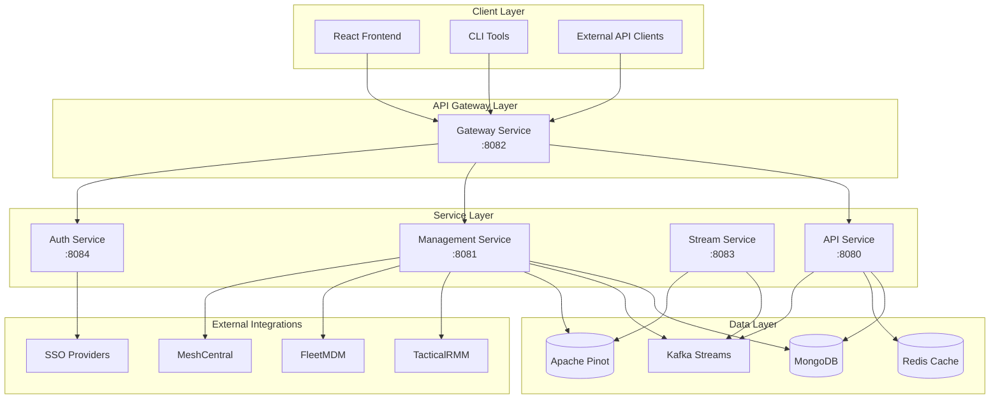
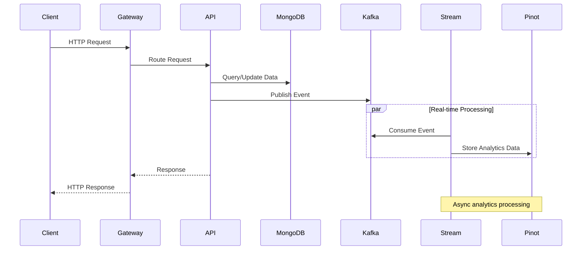
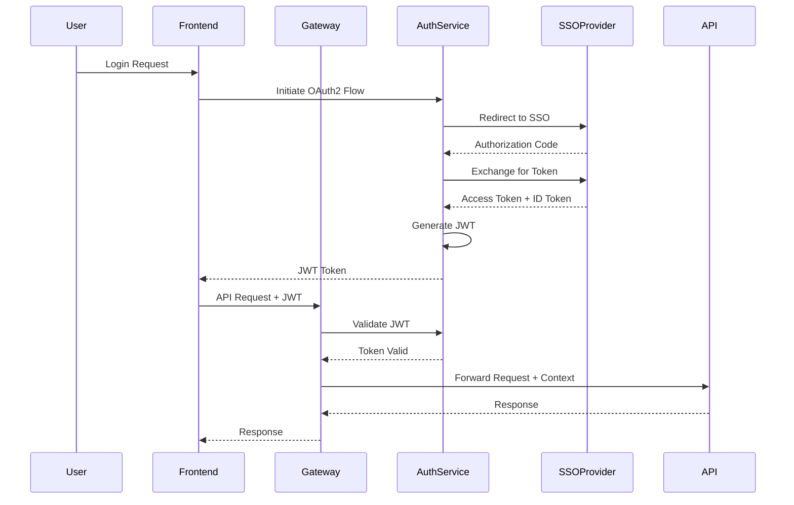
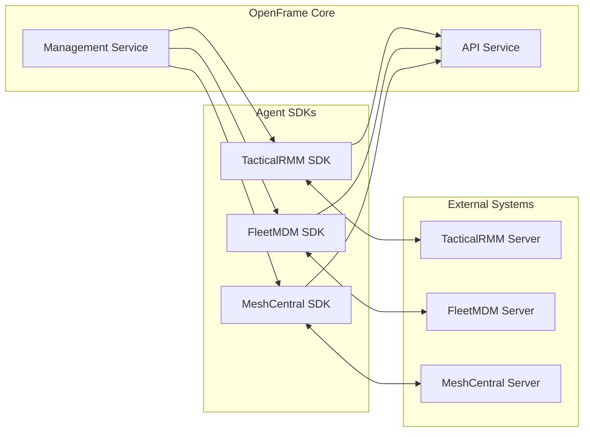

# OpenFrame Architecture Overview

This document provides a comprehensive technical overview of the OpenFrame OSS Library architecture, designed for engineers who need to understand the system's internal structure, design patterns, and component interactions.

## System Architecture

OpenFrame follows a microservices architecture with clear separation of concerns, event-driven communication, and a shared library approach for common functionality.

### High-Level Architecture



## Core Components

### Service Components

| Service | Port | Purpose | Key Responsibilities |
|---------|------|---------|---------------------|
| **API Service** | 8080 | Core business APIs | Device management, GraphQL endpoints, REST APIs |
| **Management Service** | 8081 | System management | Agent configuration, policy management, system initialization |
| **Gateway Service** | 8082 | API Gateway | Request routing, authentication, rate limiting |
| **Stream Service** | 8083 | Event processing | Real-time data processing, event transformation |
| **Auth Service** | 8084 | Authentication | OAuth2, JWT token management, SSO integration |

### Shared Library Components

| Library | Purpose | Key Features |
|---------|---------|--------------|
| **openframe-core** | Common utilities | Configuration, logging, error handling |
| **openframe-data** | Data access layer | Repository abstractions, entity definitions |
| **openframe-data-mongo** | MongoDB integration | MongoDB repositories, indexes, migrations |
| **openframe-data-kafka** | Kafka integration | Event producers, consumers, serialization |
| **openframe-security-core** | Security foundations | JWT handling, authentication filters |
| **openframe-api-lib** | API contracts | DTOs, service interfaces, GraphQL schemas |

## Data Architecture

### Data Flow Patterns



### Database Design

#### MongoDB Collections

```typescript
// Device Collection Schema
interface Device {
  _id: ObjectId;
  machineId: string;           // Unique machine identifier
  organizationId: string;      // Organization reference
  name: string;               // Device display name
  status: DeviceStatus;       // online | offline | maintenance | error
  tags: Record<string, string>; // Flexible key-value metadata
  agents: InstalledAgent[];   // List of installed agents
  metrics: DeviceMetrics;     // Latest performance metrics
  createdAt: Date;
  lastUpdated: Date;
}

// Organization Collection Schema
interface Organization {
  _id: ObjectId;
  name: string;
  contactInformation: ContactInfo;
  address: Address;
  settings: OrganizationSettings;
  createdAt: Date;
  updatedAt: Date;
}

// Event Collection Schema (Time-series)
interface Event {
  _id: ObjectId;
  deviceId: string;
  organizationId: string;
  eventType: string;
  severity: 'info' | 'warning' | 'error' | 'critical';
  payload: Record<string, any>;
  timestamp: Date;
  processed: boolean;
}
```

#### Apache Pinot Analytics Schema

```sql
-- Device metrics table for time-series analytics
CREATE TABLE device_metrics (
  device_id VARCHAR NOT NULL,
  organization_id VARCHAR NOT NULL,
  cpu_usage DOUBLE,
  memory_usage DOUBLE,
  disk_usage DOUBLE,
  network_bytes_in LONG,
  network_bytes_out LONG,
  timestamp TIMESTAMP,
  PRIMARY KEY(device_id, timestamp)
) WITH (
  timeColumnName = 'timestamp',
  timeType = 'TIMESTAMP',
  segmentPushType = 'APPEND',
  segmentPushFrequency = 'DAILY'
);

-- Log events table for log analytics
CREATE TABLE log_events (
  log_id VARCHAR NOT NULL,
  device_id VARCHAR,
  organization_id VARCHAR,
  level VARCHAR,
  message TEXT,
  source VARCHAR,
  timestamp TIMESTAMP,
  PRIMARY KEY(log_id, timestamp)
) WITH (
  timeColumnName = 'timestamp',
  timeType = 'TIMESTAMP'
);
```

### Event-Driven Architecture

#### Event Types and Schemas

```java
// Base event structure
public abstract class BaseEvent {
    private String eventId;
    private String eventType;
    private String organizationId;
    private Instant timestamp;
    private String source;
    private Map<String, String> metadata;
}

// Device events
public class DeviceStatusChangedEvent extends BaseEvent {
    private String deviceId;
    private DeviceStatus previousStatus;
    private DeviceStatus newStatus;
    private String reason;
}

public class DeviceMetricsEvent extends BaseEvent {
    private String deviceId;
    private DeviceMetrics metrics;
}

// System events
public class AgentRegistrationEvent extends BaseEvent {
    private String deviceId;
    private String agentType;
    private String agentVersion;
    private Map<String, String> configuration;
}
```

#### Kafka Topic Structure

| Topic | Partitions | Purpose | Key Strategy |
|-------|------------|---------|--------------|
| **device-events** | 12 | Device state changes | Device ID |
| **metrics-events** | 24 | Performance metrics | Device ID |
| **log-events** | 36 | Application logs | Organization ID |
| **system-events** | 6 | System-level events | Event type |
| **audit-events** | 12 | Security/audit events | Organization ID |

## Security Architecture

### Authentication Flow



### Authorization Model

```java
// Permission-based authorization
public enum Permission {
    // Device permissions
    DEVICE_READ("device:read"),
    DEVICE_WRITE("device:write"),
    DEVICE_DELETE("device:delete"),
    
    // Organization permissions
    ORGANIZATION_ADMIN("organization:admin"),
    ORGANIZATION_READ("organization:read"),
    
    // System permissions
    SYSTEM_ADMIN("system:admin"),
    API_ACCESS("api:access");
    
    private final String permission;
}

// Role definitions
@Entity
public class Role {
    private String name;
    private Set<Permission> permissions;
    private String organizationId; // null for global roles
}

// User role assignments
@Entity
public class UserRole {
    private String userId;
    private String roleId;
    private String organizationId; // Role scope
    private Instant expiresAt;
}
```

## API Design Patterns

### RESTful API Structure

```java
@RestController
@RequestMapping("/api/v1/devices")
@RequiredArgsConstructor
@Validated
public class DeviceController {
    
    private final DeviceService deviceService;
    
    // List devices with filtering and pagination
    @GetMapping
    public ResponseEntity<PagedResponse<DeviceResponse>> getDevices(
            @Valid DeviceFilters filters,
            @Valid CursorPaginationCriteria pagination,
            Authentication authentication) {
        
        String organizationId = extractOrganizationId(authentication);
        
        PagedResponse<DeviceResponse> response = deviceService
            .getDevices(organizationId, filters, pagination);
            
        return ResponseEntity.ok(response);
    }
    
    // Get single device
    @GetMapping("/{deviceId}")
    public ResponseEntity<DeviceResponse> getDevice(
            @PathVariable String deviceId,
            Authentication authentication) {
        
        DeviceResponse device = deviceService
            .getDevice(deviceId, extractOrganizationId(authentication));
            
        return ResponseEntity.ok(device);
    }
    
    // Update device status
    @PatchMapping("/{deviceId}/status")
    @ResponseStatus(HttpStatus.NO_CONTENT)
    public void updateDeviceStatus(
            @PathVariable String deviceId,
            @Valid @RequestBody UpdateDeviceStatusRequest request,
            Authentication authentication) {
        
        deviceService.updateDeviceStatus(
            deviceId, 
            request.getStatus(), 
            extractOrganizationId(authentication)
        );
    }
}
```

### GraphQL Schema Design

```graphql
# Core types
type Device {
  id: ID!
  machineId: String!
  name: String!
  status: DeviceStatus!
  organization: Organization!
  agents: [InstalledAgent!]!
  metrics: DeviceMetrics
  tags: [Tag!]!
  createdAt: DateTime!
  lastUpdated: DateTime!
}

type DeviceMetrics {
  cpuUsage: Float!
  memoryUsage: Float!
  diskUsage: Float!
  networkBytesIn: Long!
  networkBytesOut: Long!
  collectedAt: DateTime!
}

enum DeviceStatus {
  ONLINE
  OFFLINE
  MAINTENANCE
  ERROR
}

# Queries
type Query {
  devices(
    filters: DeviceFilters
    pagination: CursorPaginationInput
  ): DeviceConnection!
  
  device(id: ID!): Device
  
  deviceMetrics(
    deviceId: ID!
    timeRange: TimeRange!
  ): [DeviceMetrics!]!
}

# Mutations
type Mutation {
  updateDeviceStatus(
    deviceId: ID!
    status: DeviceStatus!
  ): Device!
  
  registerDevice(
    input: DeviceRegistrationInput!
  ): Device!
}

# Subscriptions for real-time updates
type Subscription {
  deviceStatusChanged(organizationId: ID!): Device!
  deviceMetricsUpdated(deviceId: ID!): DeviceMetrics!
}
```

## Integration Patterns

### Agent Integration Architecture



### Agent SDK Pattern

```java
// Common agent interface
public interface AgentIntegration {
    String getAgentType();
    AgentConfiguration getConfiguration();
    CompletableFuture<List<Device>> discoverDevices();
    CompletableFuture<Void> deployAgent(String deviceId, AgentConfig config);
    CompletableFuture<AgentStatus> getAgentStatus(String deviceId);
    CompletableFuture<Void> executeCommand(String deviceId, Command command);
}

// TacticalRMM implementation
@Service
@RequiredArgsConstructor
public class TacticalRmmIntegration implements AgentIntegration {
    
    private final TacticalRmmClient tacticalRmmClient;
    private final TacticalRmmConfigurationProperties config;
    
    @Override
    public String getAgentType() {
        return "tacticalrmm";
    }
    
    @Override
    public CompletableFuture<List<Device>> discoverDevices() {
        return tacticalRmmClient.getClients()
            .thenApply(this::convertToDevices);
    }
    
    @Override
    public CompletableFuture<Void> deployAgent(String deviceId, AgentConfig config) {
        return tacticalRmmClient.deployAgent(deviceId, 
            convertToTacticalRmmConfig(config));
    }
    
    // Additional implementation methods...
}
```

## Performance and Scaling

### Caching Strategy

```java
// Multi-level caching approach
@Service
@RequiredArgsConstructor
public class DeviceService {
    
    private final DeviceRepository deviceRepository;
    private final RedisTemplate<String, Object> redisTemplate;
    
    // L1: Application cache (Caffeine)
    @Cacheable(value = "devices", key = "#deviceId")
    public Device getDevice(String deviceId) {
        return deviceRepository.findById(deviceId)
            .orElseThrow(() -> new DeviceNotFoundException(deviceId));
    }
    
    // L2: Redis cache for frequently accessed data
    public List<Device> getActiveDevices(String organizationId) {
        String cacheKey = "active-devices:" + organizationId;
        
        List<Device> cached = (List<Device>) redisTemplate
            .opsForValue().get(cacheKey);
            
        if (cached != null) {
            return cached;
        }
        
        List<Device> devices = deviceRepository
            .findByOrganizationIdAndStatus(organizationId, DeviceStatus.ONLINE);
            
        redisTemplate.opsForValue().set(cacheKey, devices, 
            Duration.ofMinutes(5));
            
        return devices;
    }
}
```

### Database Optimization

#### MongoDB Indexing Strategy

```javascript
// Device collection indexes
db.devices.createIndex({ "organizationId": 1, "status": 1 });
db.devices.createIndex({ "machineId": 1 }, { unique: true });
db.devices.createIndex({ "lastUpdated": -1 });
db.devices.createIndex({ "tags.environment": 1, "tags.location": 1 });

// Event collection indexes (time-series optimized)
db.events.createIndex({ 
  "timestamp": -1, 
  "organizationId": 1, 
  "eventType": 1 
});
db.events.createIndex({ "deviceId": 1, "timestamp": -1 });

// Compound index for common queries
db.devices.createIndex({
  "organizationId": 1,
  "status": 1,
  "lastUpdated": -1
});
```

#### Connection Pooling Configuration

```yaml
# MongoDB connection settings
spring:
  data:
    mongodb:
      uri: mongodb://mongodb:27017/openframe
      options:
        min-connections-per-host: 10
        max-connections-per-host: 100
        max-wait-time: 30000
        server-selection-timeout: 30000
        max-connection-idle-time: 300000
```

### Kafka Optimization

```yaml
# Kafka producer configuration
spring:
  kafka:
    producer:
      bootstrap-servers: kafka:9092
      key-serializer: org.apache.kafka.common.serialization.StringSerializer
      value-serializer: org.springframework.kafka.support.serializer.JsonSerializer
      acks: 1
      retries: 3
      batch-size: 16384
      linger-ms: 5
      buffer-memory: 33554432
      
    consumer:
      bootstrap-servers: kafka:9092
      group-id: openframe-service
      key-deserializer: org.apache.kafka.common.serialization.StringDeserializer
      value-deserializer: org.springframework.kafka.support.serializer.JsonDeserializer
      auto-offset-reset: latest
      enable-auto-commit: false
      fetch-min-size: 1
      fetch-max-wait: 500
```

## Monitoring and Observability

### Application Metrics

```java
// Custom metrics with Micrometer
@Component
@RequiredArgsConstructor
public class DeviceMetrics {
    
    private final MeterRegistry meterRegistry;
    private final Counter deviceRegistrations;
    private final Gauge activeDevicesGauge;
    private final Timer deviceQueryTimer;
    
    @PostConstruct
    public void initializeMetrics() {
        this.deviceRegistrations = Counter.builder("devices.registrations.total")
            .description("Total number of device registrations")
            .tag("service", "api")
            .register(meterRegistry);
            
        this.deviceQueryTimer = Timer.builder("devices.query.duration")
            .description("Time taken to query devices")
            .register(meterRegistry);
            
        this.activeDevicesGauge = Gauge.builder("devices.active.count")
            .description("Number of currently active devices")
            .register(meterRegistry, this, DeviceMetrics::getActiveDeviceCount);
    }
    
    public void recordDeviceRegistration() {
        deviceRegistrations.increment();
    }
    
    public Timer.Sample startDeviceQuery() {
        return Timer.start(meterRegistry);
    }
    
    private double getActiveDeviceCount(DeviceMetrics metrics) {
        // Implementation to get active device count
        return deviceService.getActiveDeviceCount();
    }
}
```

### Distributed Tracing

```java
// Trace propagation across services
@RestController
@RequiredArgsConstructor
public class DeviceController {
    
    private final DeviceService deviceService;
    private final Tracer tracer;
    
    @GetMapping("/{deviceId}")
    public ResponseEntity<DeviceResponse> getDevice(@PathVariable String deviceId) {
        Span span = tracer.nextSpan()
            .name("get-device")
            .tag("device.id", deviceId)
            .start();
            
        try (Tracer.SpanInScope ws = tracer.withSpanInScope(span)) {
            DeviceResponse device = deviceService.getDevice(deviceId);
            span.tag("device.status", device.getStatus().toString());
            return ResponseEntity.ok(device);
        } finally {
            span.end();
        }
    }
}
```

## Deployment Architecture

### Container Architecture

```yaml
# docker-compose.yml for development
version: '3.8'
services:
  api-service:
    build:
      context: ./openframe-api-service-core
      dockerfile: Dockerfile
    ports:
      - "8080:8080"
    environment:
      - SPRING_PROFILES_ACTIVE=docker
      - MONGODB_URI=mongodb://mongodb:27017/openframe
      - KAFKA_BOOTSTRAP_SERVERS=kafka:9092
    depends_on:
      - mongodb
      - kafka
      - redis
    healthcheck:
      test: ["CMD", "curl", "-f", "http://localhost:8080/actuator/health"]
      interval: 30s
      timeout: 10s
      retries: 3

  management-service:
    build:
      context: ./openframe-management-service-core
      dockerfile: Dockerfile
    ports:
      - "8081:8081"
    environment:
      - SPRING_PROFILES_ACTIVE=docker
    depends_on:
      - mongodb
      - kafka

  gateway-service:
    build:
      context: ./openframe-gateway-service-core
      dockerfile: Dockerfile
    ports:
      - "8082:8082"
    environment:
      - SPRING_PROFILES_ACTIVE=docker
    depends_on:
      - api-service
      - management-service

  mongodb:
    image: mongo:5.0
    ports:
      - "27017:27017"
    volumes:
      - mongodb_data:/data/db

  kafka:
    image: confluentinc/cp-kafka:latest
    ports:
      - "9092:9092"
    environment:
      KAFKA_ZOOKEEPER_CONNECT: zookeeper:2181
      KAFKA_ADVERTISED_LISTENERS: PLAINTEXT://kafka:9092
      KAFKA_OFFSETS_TOPIC_REPLICATION_FACTOR: 1

volumes:
  mongodb_data:
```

### Kubernetes Deployment

```yaml
# api-service deployment
apiVersion: apps/v1
kind: Deployment
metadata:
  name: openframe-api-service
  labels:
    app: openframe-api
    version: v1
spec:
  replicas: 3
  selector:
    matchLabels:
      app: openframe-api
  template:
    metadata:
      labels:
        app: openframe-api
        version: v1
    spec:
      containers:
      - name: api-service
        image: openframe/api-service:latest
        ports:
        - containerPort: 8080
        env:
        - name: SPRING_PROFILES_ACTIVE
          value: "kubernetes"
        - name: MONGODB_URI
          valueFrom:
            secretKeyRef:
              name: openframe-secrets
              key: mongodb-uri
        resources:
          requests:
            memory: "512Mi"
            cpu: "250m"
          limits:
            memory: "1Gi"
            cpu: "500m"
        livenessProbe:
          httpGet:
            path: /actuator/health/liveness
            port: 8080
          initialDelaySeconds: 60
          periodSeconds: 10
        readinessProbe:
          httpGet:
            path: /actuator/health/readiness
            port: 8080
          initialDelaySeconds: 30
          periodSeconds: 5
---
apiVersion: v1
kind: Service
metadata:
  name: openframe-api-service
spec:
  selector:
    app: openframe-api
  ports:
  - port: 80
    targetPort: 8080
  type: ClusterIP
```

## Development Patterns

### Dependency Injection Configuration

```java
@Configuration
@EnableConfigurationProperties({
    AgentConfigurationProperties.class,
    ManagementConfigurationProperties.class
})
public class OpenFrameConfiguration {
    
    @Bean
    @ConditionalOnMissingBean
    public EventPublisher eventPublisher(KafkaTemplate<String, Object> kafkaTemplate) {
        return new KafkaEventPublisher(kafkaTemplate);
    }
    
    @Bean
    @Primary
    public AgentIntegrationManager agentIntegrationManager(
            List<AgentIntegration> integrations) {
        return new DefaultAgentIntegrationManager(integrations);
    }
    
    @Bean
    @ConditionalOnProperty(name = "openframe.agents.tacticalrmm.enabled", havingValue = "true")
    public TacticalRmmIntegration tacticalRmmIntegration(
            TacticalRmmClient client,
            TacticalRmmConfigurationProperties config) {
        return new TacticalRmmIntegration(client, config);
    }
}
```

### Error Handling Patterns

```java
// Global exception handler
@ControllerAdvice
@Slf4j
public class GlobalExceptionHandler {
    
    @ExceptionHandler(DeviceNotFoundException.class)
    public ResponseEntity<ErrorResponse> handleDeviceNotFound(
            DeviceNotFoundException ex) {
        log.warn("Device not found: {}", ex.getDeviceId());
        
        ErrorResponse error = ErrorResponse.builder()
            .code("DEVICE_NOT_FOUND")
            .message("Device not found: " + ex.getDeviceId())
            .timestamp(Instant.now())
            .build();
            
        return ResponseEntity.status(HttpStatus.NOT_FOUND).body(error);
    }
    
    @ExceptionHandler(ValidationException.class)
    public ResponseEntity<ErrorResponse> handleValidation(
            ValidationException ex) {
        log.warn("Validation error: {}", ex.getMessage());
        
        ErrorResponse error = ErrorResponse.builder()
            .code("VALIDATION_ERROR")
            .message(ex.getMessage())
            .details(ex.getFieldErrors())
            .timestamp(Instant.now())
            .build();
            
        return ResponseEntity.status(HttpStatus.BAD_REQUEST).body(error);
    }
}

// Custom exceptions with context
public class DeviceNotFoundException extends RuntimeException {
    private final String deviceId;
    
    public DeviceNotFoundException(String deviceId) {
        super("Device not found: " + deviceId);
        this.deviceId = deviceId;
    }
    
    public String getDeviceId() {
        return deviceId;
    }
}
```

## Testing Architecture

### Testing Strategy

```java
// Service layer testing with test slices
@DataMongoTest
@TestPropertySource(properties = {
    "spring.data.mongodb.database=test",
    "logging.level.org.springframework.data.mongodb=DEBUG"
})
class DeviceRepositoryTest {
    
    @Autowired
    private TestEntityManager entityManager;
    
    @Autowired
    private DeviceRepository deviceRepository;
    
    @Test
    void shouldFindDevicesByOrganizationAndStatus() {
        // Given
        String orgId = "test-org-001";
        Device onlineDevice = createTestDevice(orgId, DeviceStatus.ONLINE);
        Device offlineDevice = createTestDevice(orgId, DeviceStatus.OFFLINE);
        
        entityManager.persistAndFlush(onlineDevice);
        entityManager.persistAndFlush(offlineDevice);
        
        // When
        List<Device> devices = deviceRepository
            .findByOrganizationIdAndStatus(orgId, DeviceStatus.ONLINE);
        
        // Then
        assertThat(devices).hasSize(1);
        assertThat(devices.get(0).getStatus()).isEqualTo(DeviceStatus.ONLINE);
    }
}

// Integration testing with test containers
@SpringBootTest(webEnvironment = SpringBootTest.WebEnvironment.RANDOM_PORT)
@TestPropertySource(properties = {"spring.kafka.bootstrap-servers=${spring.embedded.kafka.brokers}"})
@EmbeddedKafka(topics = {"device-events"}, partitions = 1)
@Testcontainers
class DeviceEventIntegrationTest {
    
    @Container
    static MongoDBContainer mongoContainer = new MongoDBContainer("mongo:5.0");
    
    @Autowired
    private DeviceService deviceService;
    
    @Autowired
    private KafkaTemplate<String, Object> kafkaTemplate;
    
    @Test
    void shouldPublishEventWhenDeviceStatusChanges() {
        // Integration test implementation
    }
}
```

## Key Design Patterns

### Repository Pattern Implementation

```java
// Generic repository interface
public interface BaseRepository<T, ID> {
    Optional<T> findById(ID id);
    List<T> findAll();
    T save(T entity);
    void deleteById(ID id);
    boolean existsById(ID id);
}

// Specific repository with custom queries
@Repository
public interface DeviceRepository extends BaseRepository<Device, String> {
    
    Optional<Device> findByMachineId(String machineId);
    
    List<Device> findByOrganizationIdAndStatus(
        String organizationId, 
        DeviceStatus status
    );
    
    @Query("{'organizationId': ?0, 'tags.?1': ?2}")
    List<Device> findByOrganizationAndTag(
        String organizationId, 
        String tagKey, 
        String tagValue
    );
    
    @Aggregation(pipeline = {
        "{ $match: { organizationId: ?0 } }",
        "{ $group: { _id: '$status', count: { $sum: 1 } } }"
    })
    List<DeviceStatusCount> getDeviceStatusCounts(String organizationId);
}
```

### Event Sourcing Pattern

```java
// Event store for audit trail
@Service
@RequiredArgsConstructor
public class EventStore {
    
    private final EventRepository eventRepository;
    private final EventPublisher eventPublisher;
    
    public void saveAndPublish(DomainEvent event) {
        // Save to event store
        EventRecord record = EventRecord.builder()
            .eventId(event.getEventId())
            .eventType(event.getClass().getSimpleName())
            .aggregateId(event.getAggregateId())
            .eventData(serializeEvent(event))
            .timestamp(event.getTimestamp())
            .build();
            
        eventRepository.save(record);
        
        // Publish to event bus
        eventPublisher.publish(event);
    }
    
    public List<DomainEvent> getEvents(String aggregateId) {
        return eventRepository.findByAggregateIdOrderByTimestamp(aggregateId)
            .stream()
            .map(this::deserializeEvent)
            .collect(Collectors.toList());
    }
}
```

---

## Summary

OpenFrame's architecture emphasizes:

- **Modularity**: Clear separation of concerns with shared libraries
- **Scalability**: Event-driven architecture with async processing
- **Extensibility**: Plugin-based agent integration system
- **Observability**: Comprehensive monitoring and tracing
- **Security**: Multi-layered security with OAuth2 and JWT
- **Performance**: Intelligent caching and database optimization

The architecture supports both horizontal and vertical scaling, making it suitable for organizations of any size while maintaining consistency and reliability across all components.

For implementation details of specific components, refer to the source code in the respective module directories and the accompanying developer documentation.