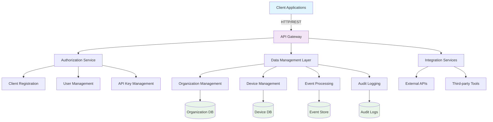
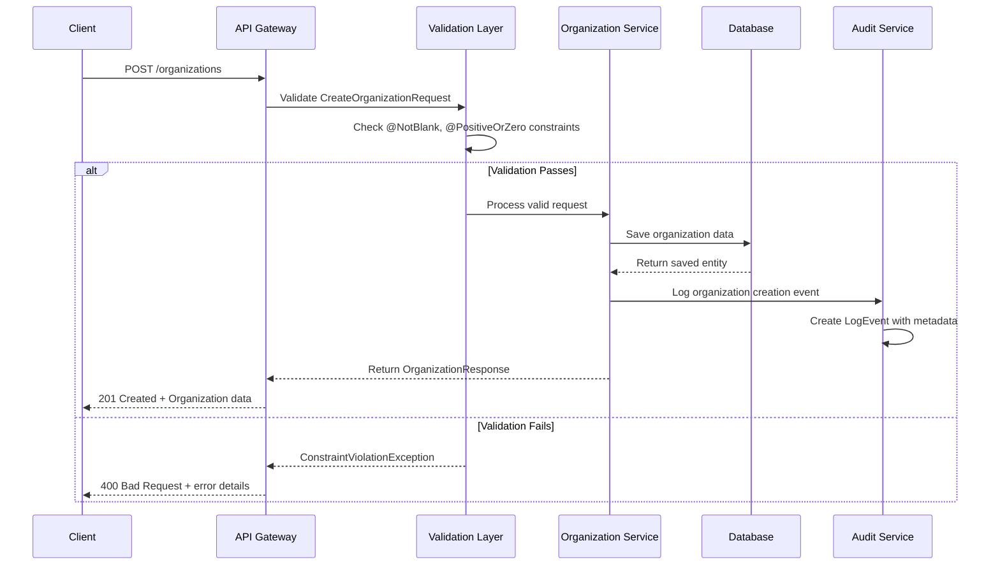
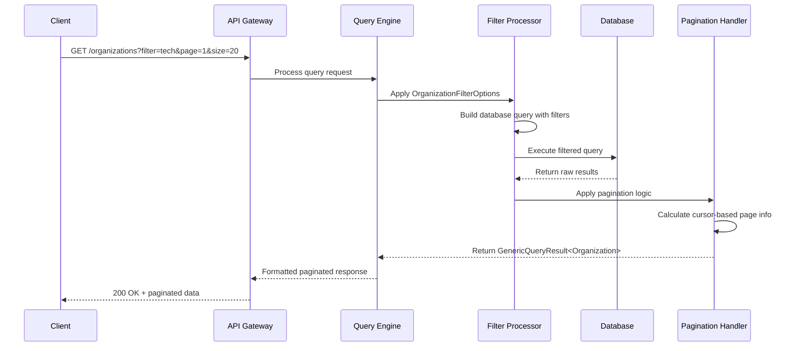
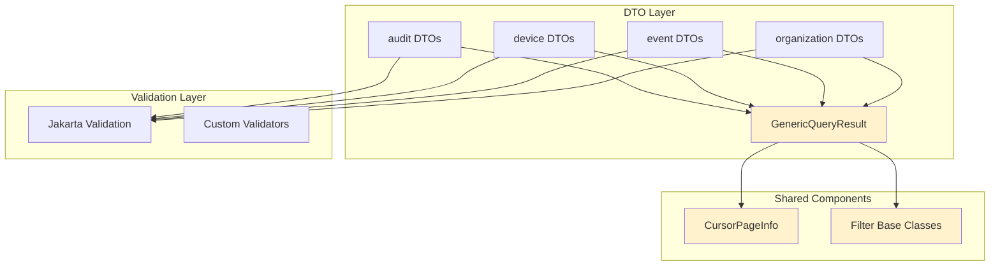
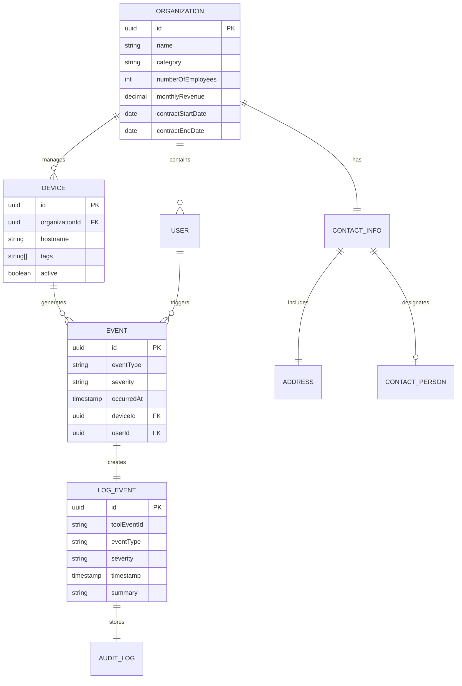
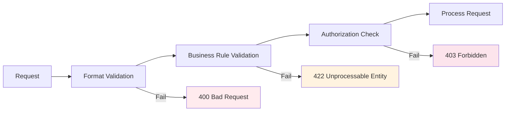

# Architecture Overview - OpenFrame OSS Library

This document provides a comprehensive technical overview of the OpenFrame OSS Library architecture, focusing on system design, component relationships, and data flow patterns.

## High-Level System Architecture

The OpenFrame OSS Library follows a modular, service-oriented architecture designed for scalability and maintainability:



## Core Components and Responsibilities

| Component | Primary Responsibility | Key DTOs | Dependencies |
|-----------|----------------------|----------|-------------|
| **Organization Management** | CRUD operations for organizations, contact management | `CreateOrganizationRequest`, `OrganizationResponse`, `ContactInformationDto` | Database, Validation |
| **Device Management** | Device registration, filtering, lifecycle management | `DeviceFilterOptions`, `DeviceFilters`, `TagFilterOption` | Organization Service |
| **Event Processing** | Real-time event ingestion, filtering, routing | `EventFilterOptions`, `EventFilters` | Audit Service, Database |
| **Audit Logging** | Security audit trails, compliance logging | `LogEvent`, `LogDetails`, `LogFilterOptions` | Event Processing |
| **Query Engine** | Paginated queries, result aggregation | `GenericQueryResult<T>`, `CountedGenericQueryResult<T>` | All domain services |
| **Validation Layer** | Input validation, data integrity | Jakarta Validation annotations | All request DTOs |

## Data Flow Architecture

### Organization Creation Flow



### Query Processing Flow



## Key Design Patterns

### 1. Generic Query Result Pattern

The library uses a consistent approach for all paginated responses:

```java
// Reusable across all domain entities
public class GenericQueryResult<T> {
    private List<T> items;           // Actual data
    private CursorPageInfo pageInfo; // Pagination metadata
}

// Extended version with count information
public class CountedGenericQueryResult<T> extends GenericQueryResult<T> {
    private Long totalCount;         // Total available records
}
```

**Benefits:**
- Consistent API responses across all endpoints
- Type-safe pagination handling
- Reusable cursor-based pagination logic

### 2. Builder Pattern with Records

Modern Java record-based DTOs with builder support:

```java
@Builder
public record CreateOrganizationRequest(
    @NotBlank(message = "Name is required")
    String name,
    
    @PositiveOrZero(message = "Number of employees must be zero or positive")
    Integer numberOfEmployees,
    
    @Valid
    ContactInformationDto contactInformation
) {
    // Immutable by design, validation built-in
}
```

**Benefits:**
- Immutable data structures
- Built-in validation
- Reduced boilerplate code
- Type safety

### 3. Hierarchical Filter Pattern

Structured approach to complex filtering:

```java
// Top-level filter options
OrganizationFilterOptions options = OrganizationFilterOptions.builder()
    .filters(organizationFilters)    // Business logic filters
    .pagination(paginationOptions)   // Technical pagination
    .sorting(sortOptions)           // Result ordering
    .build();

// Domain-specific filters
OrganizationFilters filters = OrganizationFilters.builder()
    .categories(List.of("Technology", "Healthcare"))
    .employeeRange(EmployeeRange.of(10, 500))
    .hasActiveContract(true)
    .build();
```

**Benefits:**
- Separation of concerns between business and technical filters
- Composable filter logic
- Reusable across different query types

## Module Dependencies and Relationships



### Dependency Matrix

| Module | audit | device | event | organization | shared |
|--------|-------|--------|-------|--------------|--------|
| **audit** | - | ❌ | ✅ | ✅ | ✅ |
| **device** | ❌ | - | ❌ | ✅ | ✅ |
| **event** | ✅ | ❌ | - | ✅ | ✅ |
| **organization** | ❌ | ❌ | ❌ | - | ✅ |
| **shared** | ❌ | ❌ | ❌ | ❌ | - |

**Legend:**
- ✅ Depends on
- ❌ No dependency
- `-` Self

## Data Models and Relationships

### Core Entity Relationships



## Performance Considerations

### Query Optimization Strategies

1. **Cursor-based Pagination**: Avoids performance degradation with large datasets
   ```java
   // Efficient for large result sets
   CursorPageInfo pageInfo = CursorPageInfo.builder()
       .hasNextPage(true)
       .startCursor("encoded_cursor_value")
       .endCursor("next_encoded_cursor")
       .build();
   ```

2. **Filter Indexing**: Strategic database indexes for common filter patterns
   ```java
   // These combinations should be indexed
   - organizationId + eventType + timestamp
   - deviceId + active + tags
   - userId + severity + ingestDay
   ```

3. **Batch Processing**: Efficient handling of bulk operations
   ```java
   // Process in configurable batch sizes
   public static final int DEFAULT_BATCH_SIZE = 50;
   public static final int MAX_BATCH_SIZE = 100;
   ```

### Memory Management

| Component | Memory Pattern | Optimization |
|-----------|----------------|-------------|
| **Query Results** | Streaming pagination | Use cursors, not offsets |
| **Filter Processing** | Lazy evaluation | Build queries incrementally |
| **Validation** | Early termination | Fail fast on first constraint violation |
| **Audit Logging** | Asynchronous writes | Buffer events before persistence |

## Security Architecture

### Validation Strategy



### Input Sanitization Layers

1. **Schema Validation**: Jakarta Bean Validation annotations
2. **Business Logic Validation**: Custom validators for domain rules
3. **Database Constraints**: Final safety net at persistence layer

## Error Handling Strategy

### Exception Hierarchy

```java
// Base exception for all OpenFrame errors
public abstract class OpenFrameException extends RuntimeException {
    private final String errorCode;
    private final Map<String, Object> context;
}

// Domain-specific exceptions
public class ValidationException extends OpenFrameException {
    private final Set<ConstraintViolation<?>> violations;
}

public class ResourceNotFoundException extends OpenFrameException {
    private final String resourceType;
    private final String resourceId;
}

public class BusinessRuleViolationException extends OpenFrameException {
    private final String ruleName;
    private final Object attemptedValue;
}
```

### Error Response Format

```json
{
  "error": {
    "code": "VALIDATION_FAILED",
    "message": "Request validation failed",
    "timestamp": "2024-01-15T10:30:00Z",
    "path": "/organizations",
    "details": [
      {
        "field": "name",
        "message": "Name is required",
        "rejectedValue": ""
      }
    ]
  }
}
```

## Extension Points

### Adding New Domain Modules

1. **Create DTO package**: `com.openframe.api.dto.{domain}`
2. **Implement filter patterns**: Extend base filter classes
3. **Add validation annotations**: Use Jakarta Validation
4. **Create query result types**: Use `GenericQueryResult<T>`
5. **Update dependency documentation**: Maintain architecture docs

### Custom Validation Rules

```java
// Custom validator example
@Constraint(validatedBy = OrganizationNameValidator.class)
@Target({ElementType.FIELD})
@Retention(RetentionPolicy.RUNTIME)
public @interface ValidOrganizationName {
    String message() default "Invalid organization name format";
    Class<?>[] groups() default {};
    Class<? extends Payload>[] payload() default {};
}
```

## Monitoring and Observability

### Key Metrics to Track

| Metric Category | Examples | Implementation |
|----------------|----------|----------------|
| **Performance** | Query response times, pagination efficiency | Micrometer metrics |
| **Usage** | API endpoint calls, filter usage patterns | Request logging |
| **Errors** | Validation failures, constraint violations | Exception tracking |
| **Business** | Organization creation rates, device registrations | Event counters |

### Logging Strategy

```java
// Structured logging with context
LogEvent auditEvent = LogEvent.builder()
    .toolEventId("api-" + requestId)
    .eventType("ORGANIZATION_CREATED")
    .severity("INFO")
    .organizationId(result.getId())
    .summary("New organization created: " + result.getName())
    .timestamp(Instant.now())
    .build();
```

## Future Architecture Considerations

1. **Microservice Decomposition**: Split modules into independent services
2. **Event Streaming**: Implement Apache Kafka for real-time event processing  
3. **CQRS Pattern**: Separate read and write models for better scalability
4. **GraphQL Integration**: Add GraphQL support alongside REST APIs
5. **Multi-tenancy**: Enhanced isolation and resource management

This architecture provides a solid foundation for the OpenFrame ecosystem while maintaining flexibility for future growth and requirements.