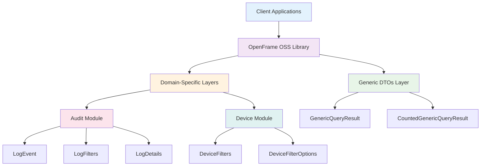
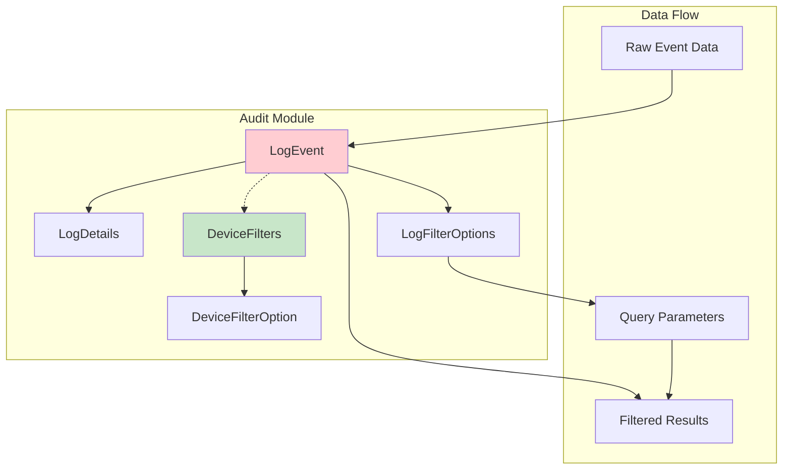
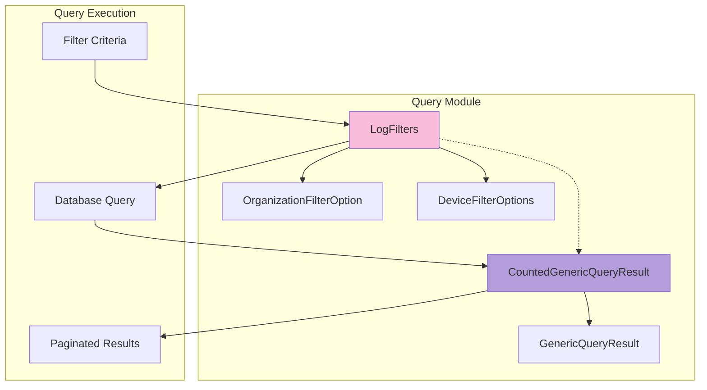
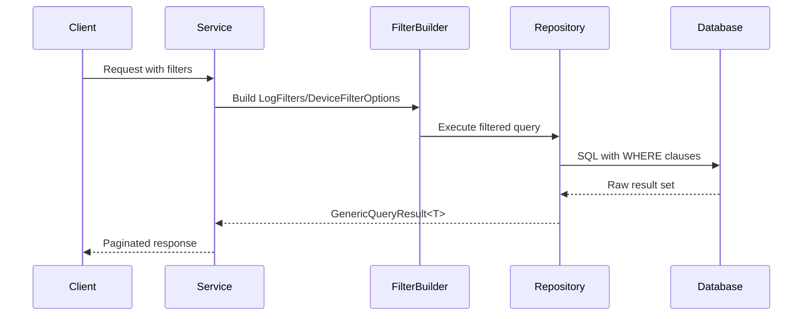
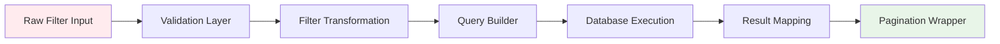
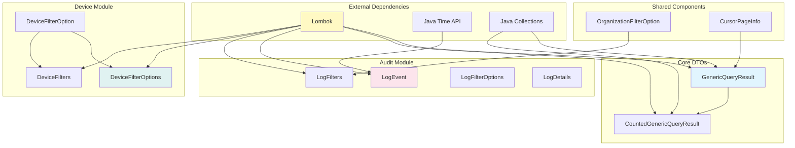

# Architecture Overview - OpenFrame OSS Library

This guide provides a comprehensive technical overview of the OpenFrame OSS Library architecture, including design patterns, data flow, and component relationships.

## High-Level Architecture

The OpenFrame OSS Library follows a **layered DTO architecture** designed for clean separation of concerns in audit logging and device management systems.



## Core Architecture Principles

### 1. Separation of Concerns

| Layer | Responsibility | Components |
|-------|---------------|------------|
| **Generic Layer** | Reusable query and pagination patterns | `GenericQueryResult`, `CountedGenericQueryResult` |
| **Audit Domain** | Audit logging and event management | `LogEvent`, `LogFilters`, `LogDetails` |
| **Device Domain** | Device filtering and management | `DeviceFilters`, `DeviceFilterOptions` |
| **Shared Types** | Common data structures | `OrganizationFilterOption`, `CursorPageInfo` |

### 2. Immutable DTOs with Builder Pattern

All DTOs follow the immutable builder pattern:

```java
// Template Pattern Used Throughout
@Data                    // Lombok: getters, setters, equals, hashCode, toString
@Builder                 // Builder pattern for construction
@NoArgsConstructor      // Required for JSON serialization
@AllArgsConstructor     // Required for builder functionality
public class ExampleDto {
    private final String field1;
    private final List<String> field2;
}
```

### 3. Type Safety with Generics

```java
// Generic base class for all query results
public class GenericQueryResult<T> {
    private List<T> items;              // Type-safe item collections
    private CursorPageInfo pageInfo;    // Consistent pagination
}

// Usage examples:
GenericQueryResult<LogEvent> logResults = ...;
GenericQueryResult<DeviceInfo> deviceResults = ...;
```

## Module Architecture Deep Dive

### Module 1: Audit and Event Management



#### Core Components

**LogEvent**: The central entity representing audit events
```java
@Data
@Builder
public class LogEvent {
    // Identity and categorization
    private String toolEventId;        // Unique event identifier
    private String eventType;          // Event category (LOGIN, SECURITY_ALERT)
    private String toolType;           // Source system identifier
    
    // Severity and context
    private String severity;           // INFO, LOW, MEDIUM, HIGH, CRITICAL
    private Instant timestamp;         // When the event occurred
    private String ingestDay;          // Partitioning field for efficiency
    
    // Actor information
    private String userId;             // Who triggered the event
    private String deviceId;           // Which device was involved
    private String hostname;           // Where it occurred
    
    // Organizational context
    private String organizationId;     // Organization identifier
    private String organizationName;   // Human-readable org name
    
    // Event content
    private String summary;            // Human-readable event description
}
```

**LogFilterOptions**: Query parameters for filtering events
```java
@Data
@Builder
public class LogFilterOptions {
    private List<String> eventTypes;   // Filter by event categories
    private List<String> severities;   // Filter by severity levels
    private List<String> toolTypes;    // Filter by source systems
    private Instant startTime;         // Temporal filtering start
    private Instant endTime;           // Temporal filtering end
}
```

### Module 2: Advanced Filtering and Query Management



#### Component Relationships

**LogFilters**: Comprehensive filtering capability
```java
@Data
@Builder
public class LogFilters {
    private List<String> toolTypes;                    // System filters
    private List<String> eventTypes;                   // Event category filters  
    private List<String> severities;                   // Severity level filters
    private List<OrganizationFilterOption> organizations; // Org-aware filtering
}
```

**DeviceFilterOptions**: Device-specific query parameters
```java
@Data
@Builder
public class DeviceFilterOptions {
    private List<String> statuses;         // ACTIVE, INACTIVE, MAINTENANCE
    private List<String> types;            // LAPTOP, DESKTOP, MOBILE, IOT
    private List<String> osTypes;          // WINDOWS, MACOS, LINUX, ANDROID, IOS
    private List<String> organizationIds;  // Multi-tenant filtering
    private List<String> tagNames;         // Tag-based categorization
}
```

## Data Flow Architecture

### Query Execution Flow



### Filter Processing Pipeline



## Key Design Patterns

### 1. Builder Pattern Implementation

**Standard DTO Builder**:
```java
// Usage pattern for all DTOs
LogEvent event = LogEvent.builder()
    .toolEventId("evt_001")
    .eventType("LOGIN")
    .severity("INFO")
    .userId("user@example.com")
    .timestamp(Instant.now())
    .build();
```

**Inheritance-Aware Builder**:
```java
// For DTOs that extend other classes
@SuperBuilder  // Instead of @Builder for inheritance
public class CountedGenericQueryResult<T> extends GenericQueryResult<T> {
    private int filteredCount;
}
```

### 2. Generic Type System

**Type Safety Across Components**:
```java
// Generic query result pattern
public class QueryService {
    public GenericQueryResult<LogEvent> queryLogs(LogFilters filters) {
        return GenericQueryResult.<LogEvent>builder()
            .items(executeLogQuery(filters))
            .pageInfo(buildPageInfo())
            .build();
    }
    
    public GenericQueryResult<DeviceInfo> queryDevices(DeviceFilterOptions options) {
        return GenericQueryResult.<DeviceInfo>builder()
            .items(executeDeviceQuery(options))  
            .pageInfo(buildPageInfo())
            .build();
    }
}
```

### 3. Filter Composition Pattern

**Composable Filter Building**:
```java
public class FilterComposer {
    public LogFilters buildSecurityFilters() {
        return LogFilters.builder()
            .eventTypes(Arrays.asList("SECURITY_ALERT", "ACCESS_DENIED"))
            .severities(Arrays.asList("HIGH", "CRITICAL"))
            .toolTypes(Arrays.asList("SECURITY_SYSTEM"))
            .build();
    }
    
    public LogFilters combineFilters(LogFilters base, LogFilters additional) {
        return LogFilters.builder()
            .eventTypes(Stream.concat(
                base.getEventTypes().stream(),
                additional.getEventTypes().stream())
                .distinct()
                .collect(Collectors.toList()))
            .severities(mergeLists(base.getSeverities(), additional.getSeverities()))
            .toolTypes(mergeLists(base.getToolTypes(), additional.getToolTypes()))
            .build();
    }
}
```

## Module Dependencies and Relationships

### Dependency Graph



### Integration Points

| Component | Depends On | Used By | Purpose |
|-----------|------------|---------|---------|
| `GenericQueryResult<T>` | `CursorPageInfo` | All query operations | Base pagination wrapper |
| `CountedGenericQueryResult<T>` | `GenericQueryResult<T>` | Count-aware queries | Enhanced result metadata |
| `LogEvent` | Java Time API | Audit systems | Core event representation |
| `LogFilters` | `OrganizationFilterOption` | Query builders | Advanced filtering |
| `DeviceFilterOptions` | Collections API | Device queries | Device-specific filtering |

## Performance Characteristics

### Memory Usage Patterns

**DTO Memory Footprint**:
```java
// Typical memory usage per instance (approximate)
LogEvent:              ~200 bytes  // 12 String fields + 1 Instant
LogFilters:            ~100 bytes  // 4 List references + overhead
DeviceFilterOptions:   ~150 bytes  // 5 List references + overhead
GenericQueryResult:    Variable    // Depends on item count and pagination
```

**Collection Sizing Guidelines**:
```java
// Recommended collection sizes for optimal performance
LogFilters filters = LogFilters.builder()
    .eventTypes(Arrays.asList(...))      // Recommended: < 10 items
    .severities(Arrays.asList(...))      // Recommended: < 5 items  
    .toolTypes(Arrays.asList(...))       // Recommended: < 20 items
    .organizations(Arrays.asList(...))   // Recommended: < 50 items
    .build();
```

### Scalability Considerations

**Pagination Strategy**:
```java
// Efficient pagination for large datasets
public class PaginationService {
    private static final int MAX_PAGE_SIZE = 1000;
    private static final int DEFAULT_PAGE_SIZE = 50;
    
    public GenericQueryResult<LogEvent> getPagedResults(
            LogFilters filters, 
            String cursor, 
            int pageSize) {
        
        pageSize = Math.min(pageSize, MAX_PAGE_SIZE);
        
        return GenericQueryResult.<LogEvent>builder()
            .items(executePagedQuery(filters, cursor, pageSize))
            .pageInfo(buildCursorPageInfo(cursor, pageSize))
            .build();
    }
}
```

## Extension Points and Customization

### Adding New Filter Types

**1. Create the Filter DTO**:
```java
@Data
@Builder
@NoArgsConstructor
@AllArgsConstructor
public class CustomFilterOption {
    private String value;
    private String label;
    private Map<String, Object> metadata; // Extension point
}
```

**2. Extend Existing Filters**:
```java
@Data
@Builder
@NoArgsConstructor  
@AllArgsConstructor
public class ExtendedLogFilters extends LogFilters {
    private List<CustomFilterOption> customFilters;
    private Map<String, String> additionalParameters;
}
```

### Custom Query Results

**Enhanced Result Types**:
```java
@Data
@SuperBuilder
@NoArgsConstructor
@AllArgsConstructor
public class MetricsQueryResult<T> extends CountedGenericQueryResult<T> {
    private Map<String, Long> aggregations;
    private List<String> warnings;
    private Instant queryExecutionTime;
}
```

## Testing Architecture

### Unit Test Patterns

**DTO Testing Strategy**:
```java
@Test
public class LogEventTest {
    
    @Test
    public void testBuilderPattern() {
        LogEvent event = LogEvent.builder()
            .toolEventId("test-001")
            .eventType("TEST")
            .build();
            
        assertThat(event.getToolEventId()).isEqualTo("test-001");
        assertThat(event.getEventType()).isEqualTo("TEST");
    }
    
    @Test
    public void testEqualsAndHashCode() {
        LogEvent event1 = createTestEvent();
        LogEvent event2 = createTestEvent();
        
        assertThat(event1).isEqualTo(event2);
        assertThat(event1.hashCode()).isEqualTo(event2.hashCode());
    }
}
```

### Integration Test Patterns

**Filter Integration Tests**:
```java
@Test
public void testComplexFilterCombination() {
    LogFilters filters = LogFilters.builder()
        .eventTypes(Arrays.asList("LOGIN", "LOGOUT"))
        .severities(Arrays.asList("HIGH"))
        .organizations(Arrays.asList(createOrgFilter("org1")))
        .build();
        
    GenericQueryResult<LogEvent> results = queryService.executeQuery(filters);
    
    assertThat(results.getItems()).hasSize(expectedCount);
    assertThat(results.getPageInfo()).isNotNull();
}
```

## Future Architecture Considerations

### Planned Enhancements

1. **Validation Layer**: Add JSR-303 validation annotations
2. **Serialization Optimization**: Custom JSON serializers for performance
3. **Event Sourcing**: Support for event streaming architectures
4. **Multi-tenancy**: Enhanced organization isolation features
5. **Metrics Integration**: Built-in performance monitoring hooks

### Migration Strategies

**Version Compatibility**:
```java
// Support for backward compatibility
@JsonIgnoreProperties(ignoreUnknown = true)  // Handle new fields gracefully
@JsonInclude(JsonInclude.Include.NON_NULL)   // Optimize JSON size
public class VersionedDto {
    private String version = "1.0";  // API version tracking
    // ... other fields
}
```

---

This architecture overview provides the foundation for understanding and extending the OpenFrame OSS Library. For hands-on development guidance, refer to the [Developer Getting Started Guide](getting-started-dev.md).