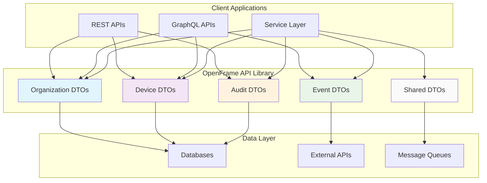
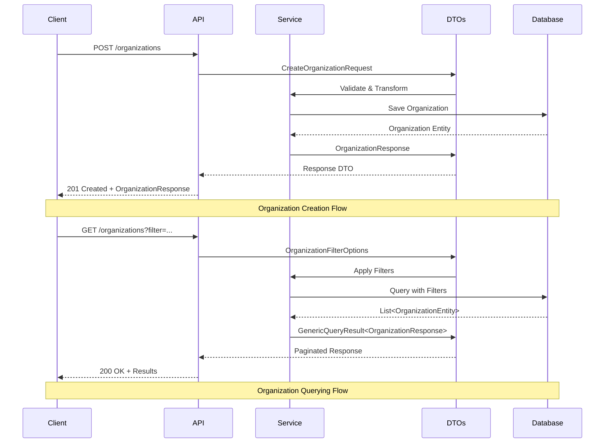
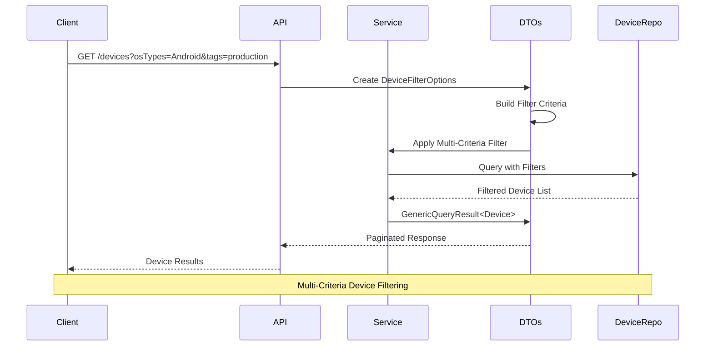
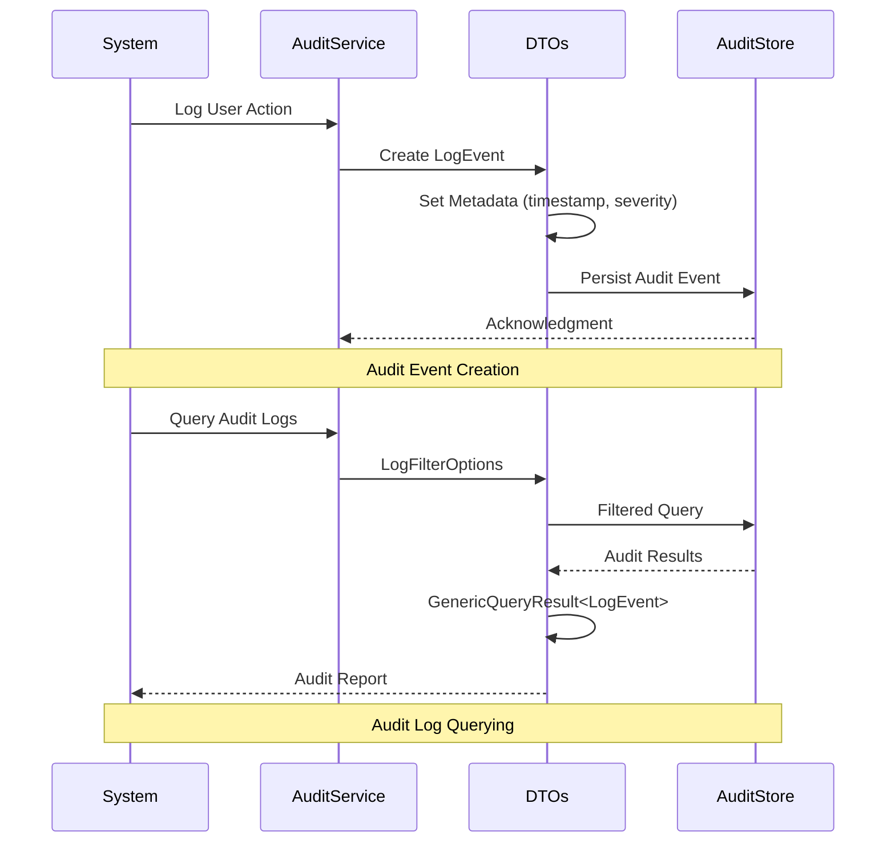
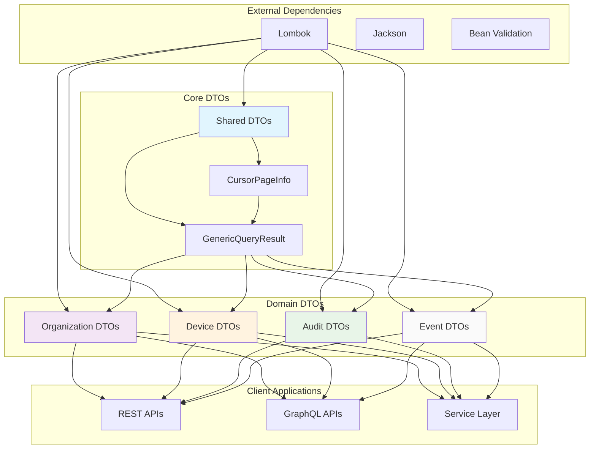

# OpenFrame API Library - Architecture Overview

This document provides a comprehensive technical overview of the OpenFrame API Library architecture, core components, design patterns, and data flow. This guide is intended for engineers who need to understand the internal structure and extend the library.

## High-Level Architecture

The OpenFrame API Library follows a domain-driven design approach with a clear separation of concerns across different business domains. The architecture is designed to be modular, extensible, and maintainable.



## Core Components and Responsibilities

### Component Overview

| Component | Package | Primary Responsibility | Key Classes |
|-----------|---------|----------------------|-------------|
| **Organization Management** | `dto.organization` | Handle organization CRUD operations, contacts, filtering | `OrganizationResponse`, `CreateOrganizationRequest`, `OrganizationFilterOptions` |
| **Device Management** | `dto.device` | Device filtering, status tracking, tag management | `DeviceFilterOptions`, `DeviceFilters`, `TagFilterOption` |
| **Audit & Logging** | `dto.audit` | System audit trails, event logging, compliance tracking | `LogEvent`, `LogDetails`, `LogFilterOptions` |
| **Event Handling** | `dto.event` | Event processing, filtering, and management | `EventFilterOptions`, `EventFilters` |
| **Shared Components** | `dto.shared` & root | Common utilities, pagination, generic responses | `GenericQueryResult`, `CursorPageInfo` |

### 1. Organization Management Domain

**Purpose**: Manages organization lifecycle, contact information, and hierarchical filtering.

**Key Components**:
- **OrganizationResponse**: Complete organization data representation
- **CreateOrganizationRequest**: Organization creation payload
- **OrganizationFilterOptions**: Multi-criteria filtering support
- **ContactInformationDto**: Contact details management
- **AddressDto**: Address standardization

**Responsibilities**:
- Organization CRUD operations
- Contact information management
- Multi-tenant organization filtering
- Address and contact standardization

### 2. Device Management Domain

**Purpose**: Provides comprehensive device filtering and categorization capabilities.

**Key Components**:
- **DeviceFilterOptions**: Primary filtering interface
- **DeviceFilters**: Complex filter combinations
- **TagFilterOption**: Tag-based device categorization
- **DeviceFilterOption**: Individual device targeting

**Responsibilities**:
- Device discovery and filtering
- Tag-based categorization
- Multi-tenant device isolation
- Device status and type filtering

### 3. Audit & Logging Domain

**Purpose**: Ensures comprehensive audit trails and compliance tracking across the system.

**Key Components**:
- **LogEvent**: Central audit event representation
- **LogDetails**: Detailed audit information
- **LogFilterOptions**: Audit query capabilities
- **LogFilters**: Complex audit filtering
- **OrganizationFilterOption**: Tenant-aware audit filtering

**Responsibilities**:
- Security audit trails
- Compliance logging
- System event tracking
- Multi-tenant audit isolation

### 4. Event Handling Domain

**Purpose**: Manages system-wide event processing and filtering.

**Key Components**:
- **EventFilterOptions**: Event query interface
- **EventFilters**: Event filtering logic

**Responsibilities**:
- Event stream filtering
- Event categorization
- Real-time event processing support

### 5. Shared Components

**Purpose**: Provides common utilities and patterns used across all domains.

**Key Components**:
- **GenericQueryResult<T>**: Standardized paginated responses
- **CountedGenericQueryResult<T>**: Paginated responses with total counts
- **CursorPageInfo**: Cursor-based pagination metadata

**Responsibilities**:
- Pagination standardization
- Generic response patterns
- Cross-cutting concerns

## Data Flow Diagrams

### 1. Organization Management Flow



### 2. Device Filtering and Management Flow



### 3. Audit Logging Flow



## Key Design Patterns

### 1. Builder Pattern (Lombok)

**Purpose**: Ensures immutable DTOs with flexible construction.

**Implementation**:
```java
@Data
@Builder
@NoArgsConstructor
@AllArgsConstructor
public class OrganizationResponse {
    private String id;
    private String name;
    private String organizationId;
    // ... other fields
}

// Usage
OrganizationResponse org = OrganizationResponse.builder()
    .id("123")
    .name("Acme Corp")
    .organizationId("ACME001")
    .build();
```

**Benefits**:
- Immutable objects
- Clear object construction
- Optional parameter handling
- Type safety

### 2. Generic DTO Pattern

**Purpose**: Provides type-safe, reusable response structures.

**Implementation**:
```java
@Data
@SuperBuilder
@NoArgsConstructor
@AllArgsConstructor
public class GenericQueryResult<T> {
    private List<T> items;
    private CursorPageInfo pageInfo;
}
```

**Benefits**:
- Type safety across different data types
- Consistent API responses
- Reusable pagination logic
- Reduced code duplication

### 3. Filter Options Pattern

**Purpose**: Provides composable, type-safe filtering capabilities.

**Implementation**:
```java
@Data
@Builder
@NoArgsConstructor
@AllArgsConstructor
public class DeviceFilterOptions {
    private List<String> statuses;
    private List<String> deviceTypes;
    private List<String> osTypes;
    private List<String> organizationIds;
    private List<String> tagNames;
}
```

**Benefits**:
- Composable filter criteria
- Type-safe filter construction
- Clear API contracts
- Extensible filtering logic

### 4. Domain-Driven Design (DDD)

**Purpose**: Organizes code around business domains rather than technical layers.

**Implementation**:
- Package structure reflects business domains
- DTOs encapsulate domain-specific data
- Clear domain boundaries
- Domain-specific validation rules

**Benefits**:
- Better code organization
- Easier maintenance
- Clear business logic separation
- Improved team collaboration

### 5. Data Transfer Object Pattern

**Purpose**: Provides clean data contracts between layers.

**Implementation**:
- Pure data classes with no business logic
- Lombok-generated boilerplate
- Immutable by design
- Validation through construction

**Benefits**:
- Clear layer separation
- Reduced coupling
- Easy serialization/deserialization
- Version-safe data contracts

## Module Dependencies and Relationships

### Dependency Graph



### Inter-Module Relationships

| Module | Dependencies | Used By | Relationship Type |
|--------|-------------|---------|-------------------|
| **Shared DTOs** | Lombok, Jackson | All domain modules | Foundation/Utility |
| **Organization DTOs** | Shared DTOs | REST/GraphQL APIs | Domain/Business |
| **Device DTOs** | Shared DTOs | Device Services | Domain/Business |
| **Audit DTOs** | Shared DTOs, Organization DTOs | Audit Services | Domain/Cross-cutting |
| **Event DTOs** | Shared DTOs | Event Processing | Domain/Integration |

### Circular Dependency Prevention

The architecture prevents circular dependencies through:

1. **Layered Architecture**: Clear dependency direction from domain to shared
2. **Interface Segregation**: Minimal, focused interfaces
3. **Dependency Inversion**: Depend on abstractions, not concretions
4. **Package Structure**: Enforces dependency rules

## Extension Points and Customization

### 1. Adding New Domain DTOs

**Steps to add a new domain**:

1. Create domain package: `com.openframe.api.dto.newdomain`
2. Follow existing patterns:
   ```java
   @Data
   @Builder
   @NoArgsConstructor
   @AllArgsConstructor
   public class NewDomainResponse {
       // Domain-specific fields
   }
   ```
3. Add filter options if needed:
   ```java
   @Data
   @Builder
   @NoArgsConstructor
   @AllArgsConstructor
   public class NewDomainFilterOptions {
       // Filter criteria
   }
   ```
4. Update documentation and tests

### 2. Extending Existing DTOs

**Adding fields to existing DTOs**:

```java
// Before
@Data
@Builder
public class OrganizationResponse {
    private String id;
    private String name;
}

// After - Add new field
@Data
@Builder
public class OrganizationResponse {
    private String id;
    private String name;
    private String newField; // New addition
}
```

**Best practices**:
- Add fields as optional (nullable)
- Maintain backward compatibility
- Update builder patterns
- Add appropriate documentation

### 3. Custom Filter Implementations

**Extending filtering capabilities**:

```java
@Data
@Builder
@NoArgsConstructor
@AllArgsConstructor
public class AdvancedDeviceFilterOptions extends DeviceFilterOptions {
    private LocalDateTime createdAfter;
    private LocalDateTime createdBefore;
    private List<String> customAttributes;
    private Map<String, Object> dynamicFilters;
}
```

### 4. Pagination Enhancements

**Custom pagination implementations**:

```java
@Data
@SuperBuilder
@NoArgsConstructor
@AllArgsConstructor
public class EnhancedPageInfo extends CursorPageInfo {
    private Long totalCount;
    private Integer totalPages;
    private Map<String, Object> aggregations;
}
```

## Performance Considerations

### Memory Optimization

| Pattern | Memory Impact | Recommendation |
|---------|---------------|----------------|
| **Builder Pattern** | Low overhead | Preferred for object creation |
| **Immutable Objects** | Higher initial cost | Better long-term performance |
| **Generic Types** | Type erasure benefits | Use for reusable components |
| **List vs Set** | Depends on use case | List for ordered data, Set for uniqueness |

### Serialization Performance

- **Jackson Integration**: Optimized for JSON serialization
- **Lombok Generated Code**: Minimal runtime overhead
- **Generic DTOs**: Type-safe without boxing overhead

### Best Practices

1. **Use Builders**: More efficient than setters for immutable objects
2. **Avoid Deep Nesting**: Keep DTO structures relatively flat
3. **Lazy Loading**: Don't populate unnecessary fields
4. **Caching**: Cache frequently used filter combinations
5. **Batch Operations**: Use lists instead of individual operations

## Security Considerations

### Data Protection

- **No Business Logic**: DTOs contain only data, no processing logic
- **Immutability**: Prevents accidental data modification
- **Validation at Boundaries**: Validate data when entering/leaving layers
- **Sensitive Data**: Handle PII and sensitive information appropriately

### Multi-Tenant Security

- **Organization Isolation**: Filter options enforce tenant boundaries
- **Audit Trails**: Complete audit logging for security events
- **Access Control**: DTOs support role-based filtering

## Future Extensibility

### Planned Enhancements

1. **Validation Annotations**: Built-in validation support
2. **Custom Serializers**: Domain-specific serialization logic
3. **Event Sourcing**: Event-based DTO patterns
4. **GraphQL Integration**: Enhanced GraphQL-specific DTOs
5. **Reactive Support**: Reactive streams compatibility

### Migration Strategies

- **Versioning**: Semantic versioning for breaking changes
- **Backward Compatibility**: Maintain old DTOs during transitions
- **Deprecation Process**: Clearly mark deprecated APIs
- **Migration Guides**: Provide clear upgrade paths

## Troubleshooting and Debugging

### Common Issues

| Issue | Symptoms | Solution |
|-------|----------|----------|
| **Null Builder Fields** | NullPointerException | Use `@Builder.Default` or null checks |
| **Circular References** | StackOverflowError | Review object relationships |
| **Memory Leaks** | Growing heap usage | Check for retained references |
| **Serialization Errors** | JSON parsing failures | Verify Jackson annotations |

### Debugging Techniques

1. **Enable Debug Logging**: Log DTO creation and transformation
2. **Use IDE Debugger**: Step through builder pattern execution
3. **Unit Testing**: Test DTO construction and validation
4. **Memory Profiling**: Analyze object creation patterns

---

## Conclusion

The OpenFrame API Library architecture provides a solid foundation for building scalable, maintainable applications. The domain-driven design approach, combined with consistent patterns and clear separation of concerns, makes it easy to extend and maintain.

Key architectural strengths:
- **Modularity**: Clear domain boundaries
- **Consistency**: Uniform patterns across modules
- **Extensibility**: Easy to add new domains and features
- **Type Safety**: Strong typing throughout
- **Performance**: Optimized for common use cases

For deeper implementation details, refer to the source code and inline documentation. For specific implementation questions, consult the development team or create issues in the repository.

> **💡 Technical Insight**: The library's architecture prioritizes compile-time safety over runtime flexibility, making it ideal for large-scale applications where type safety and maintainability are crucial.

> **⚠️ Architecture Note**: When extending the library, maintain the existing patterns and conventions to ensure consistency across the codebase.