# Architecture Overview - OpenFrame OSS Library

This document provides a comprehensive technical overview of the OpenFrame OSS Library architecture, designed for engineers working on or integrating with the system.

## High-Level System Architecture

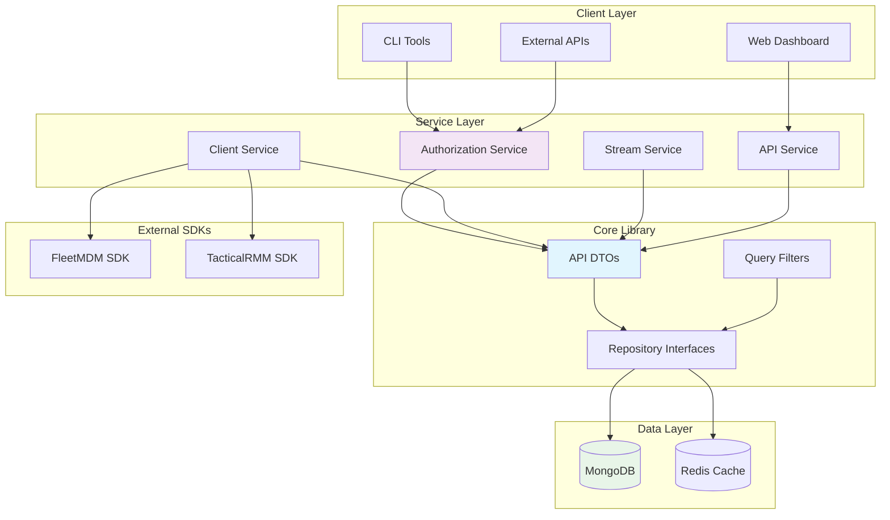

## Core Components and Responsibilities

| Component | Responsibility | Key Classes | Dependencies |
|-----------|---------------|-------------|--------------|
| **API DTOs** | Data transfer between services | `CreateOrganizationRequest`, `DeviceFilterOptions` | Jackson, Validation |
| **Client Service** | Agent registration and management | `AgentRegistrationProcessor`, `ClientRegistrationStrategy` | API DTOs, External SDKs |
| **Authorization Service** | Authentication and OIDC | `BaseOIDCClientRegistrationStrategy` | Spring Security, OAuth2 |
| **Stream Service** | Event processing and messaging | `DeserializedDebeziumMessage` | Kafka, Debezium |
| **Repository Layer** | Data persistence abstraction | `ReactiveOrganizationRepository` | Spring Data MongoDB |
| **External SDKs** | Third-party integrations | `FleetMdmClient`, `TacticalRMMClient` | HTTP clients |

## Data Flow Architecture

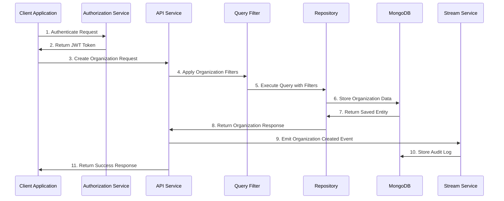

## Module Architecture Deep Dive

### Module 1: Agent Registration & Client Management

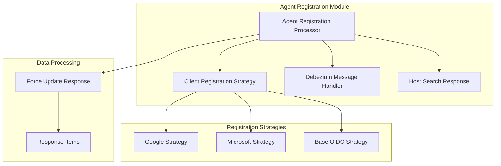

**Key Design Patterns**:
- **Strategy Pattern**: `ClientRegistrationStrategy` implementations for different providers
- **Template Method**: `BaseOIDCClientRegistrationStrategy` provides common OIDC flow
- **Observer Pattern**: Debezium message processing for data changes

### Module 2-5: Data Management and Filtering

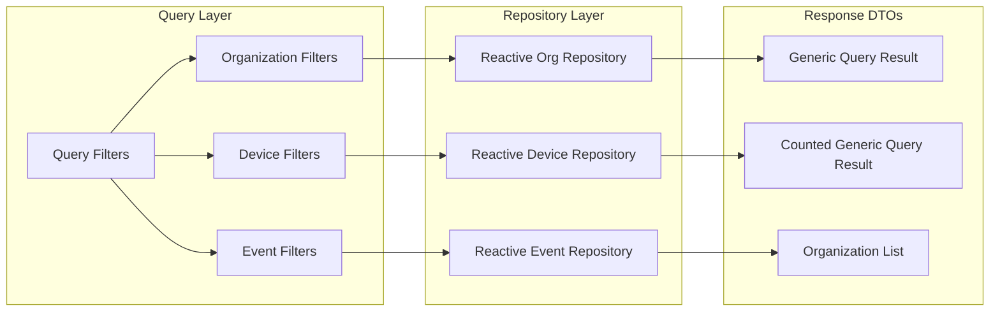

**Key Design Patterns**:
- **Builder Pattern**: All filter options use builder pattern for flexible configuration
- **Generic Types**: `GenericQueryResult<T>` provides type-safe query responses
- **Reactive Programming**: All repositories use Spring WebFlux reactive patterns

### Modules 6-9: Tool Management and Force Operations

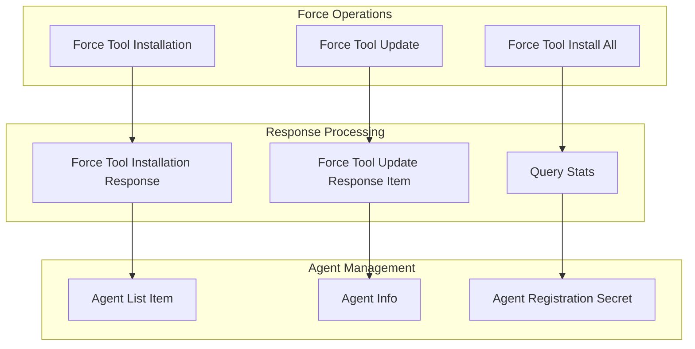

**Key Design Patterns**:
- **Command Pattern**: Force operations encapsulate tool management commands
- **Response Object Pattern**: Standardized response structures for all operations
- **Bulk Operations**: Support for operations across multiple agents/machines

### Modules 10-13: Advanced Features and Integrations

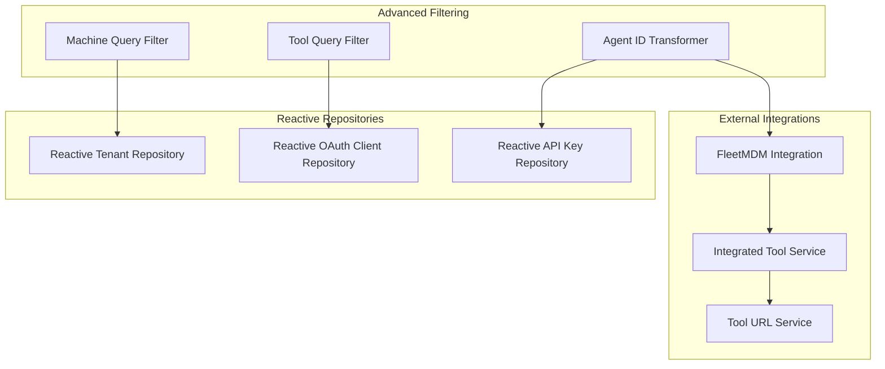

**Key Design Patterns**:
- **Transformer Pattern**: Agent ID transformers for different external systems
- **Repository Pattern**: Consistent data access across all entities
- **Integration Layer**: Clean abstractions for external service communication

## Data Models and Relationships

### Organization Domain Model

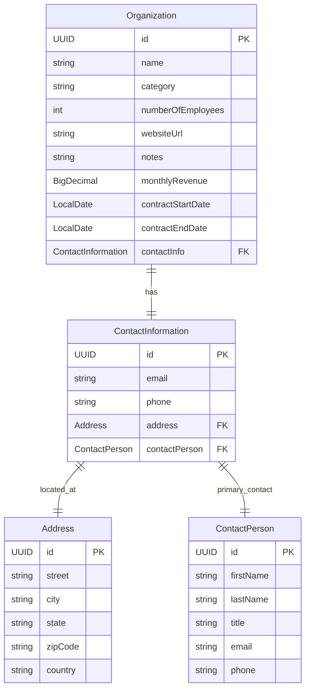

### Device and Event Model

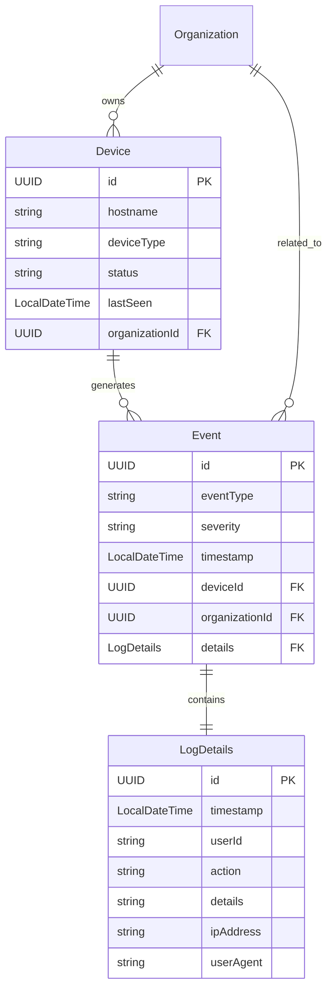

## Key Design Patterns

### 1. Builder Pattern Implementation

```java
// Consistent builder pattern across all DTOs
@Builder
public record CreateOrganizationRequest(
    @NotBlank String name,
    String category,
    @PositiveOrZero Integer numberOfEmployees,
    @Valid ContactInformationDto contactInformation
) {
    // Builder pattern enables fluent API
    public static CreateOrganizationRequestBuilder builder() {
        return new CreateOrganizationRequestBuilder();
    }
}

// Usage example
CreateOrganizationRequest request = CreateOrganizationRequest.builder()
    .name("Tech Corp")
    .category("Technology")
    .numberOfEmployees(100)
    .contactInformation(ContactInformationDto.builder()
        .email("info@techcorp.com")
        .build())
    .build();
```

### 2. Strategy Pattern for Client Registration

```java
public interface ClientRegistrationStrategy {
    ClientRegistration buildClientRegistration(String providerId);
    boolean supports(String providerId);
}

@Component
public class GoogleClientRegistrationStrategy implements ClientRegistrationStrategy {
    @Override
    public ClientRegistration buildClientRegistration(String providerId) {
        return ClientRegistration.withRegistrationId("google")
            .clientId(googleClientId)
            .clientSecret(googleClientSecret)
            .scope("openid", "profile", "email")
            .authorizationUri("https://accounts.google.com/o/oauth2/auth")
            .tokenUri("https://oauth2.googleapis.com/token")
            .build();
    }
    
    @Override
    public boolean supports(String providerId) {
        return "google".equals(providerId);
    }
}
```

### 3. Generic Response Pattern

```java
// Generic response wrapper for consistent API responses
@Data
@SuperBuilder
@NoArgsConstructor
@AllArgsConstructor
public class GenericQueryResult<T> {
    private List<T> items;
    private CursorPageInfo pageInfo;
}

// Specialized counted version for analytics
@Data
@SuperBuilder
@NoArgsConstructor
@AllArgsConstructor
public class CountedGenericQueryResult<T> extends GenericQueryResult<T> {
    private long totalCount;
}
```

### 4. Reactive Repository Pattern

```java
// Consistent reactive repository interface
public interface ReactiveOrganizationRepository 
    extends ReactiveMongoRepository<Organization, UUID>, 
            BaseTenantRepository<Organization> {
    
    Flux<Organization> findByNameContainingIgnoreCase(String name);
    Flux<Organization> findByCategory(String category);
    Mono<Long> countByOrganizationId(UUID organizationId);
}

// Implementation with custom queries
@Repository
public class ReactiveOrganizationRepositoryImpl 
    implements ReactiveOrganizationRepository {
    
    private final ReactiveMongoTemplate mongoTemplate;
    
    public Flux<Organization> findWithFilters(OrganizationFilterOptions filters) {
        Query query = new Query();
        
        if (filters.getNameContains() != null) {
            query.addCriteria(Criteria.where("name")
                .regex(filters.getNameContains(), "i"));
        }
        
        if (filters.getCategory() != null) {
            query.addCriteria(Criteria.where("category")
                .is(filters.getCategory()));
        }
        
        return mongoTemplate.find(query, Organization.class);
    }
}
```

## Module Dependencies and Integration Points

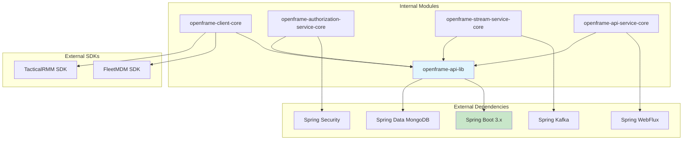

## Security and Authentication Architecture

### OIDC Integration Flow

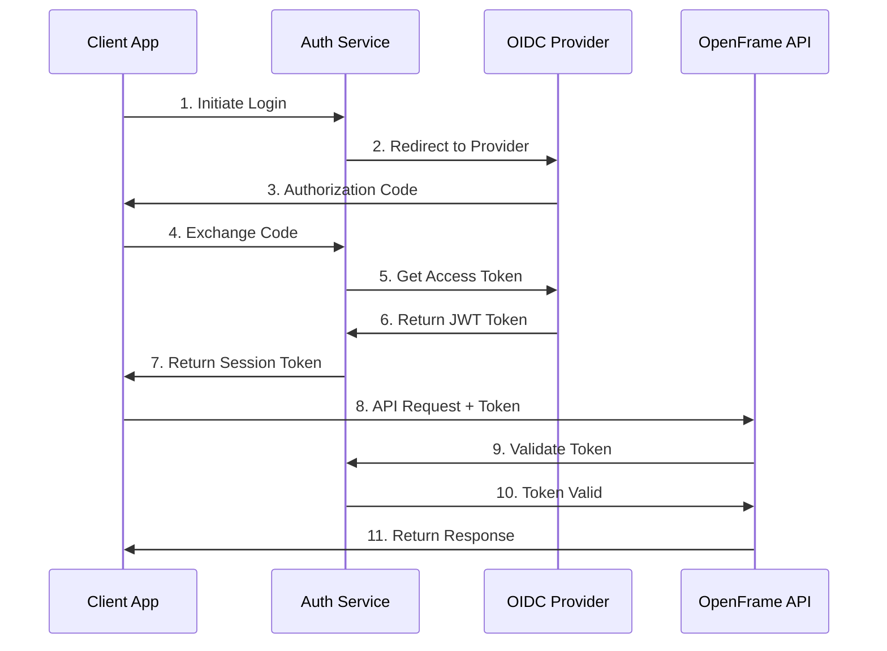

### Authorization Strategy Pattern

```java
@Component
public class BaseOIDCClientRegistrationStrategy {
    
    public ClientRegistration buildClientRegistration(String providerId, OIDCConfig config) {
        return ClientRegistration.withRegistrationId(providerId)
            .clientId(config.getClientId())
            .clientSecret(config.getClientSecret())
            .scope(config.getScopes())
            .authorizationUri(config.getAuthorizationUri())
            .tokenUri(config.getTokenUri())
            .userInfoUri(config.getUserInfoUri())
            .jwkSetUri(config.getJwkSetUri())
            .clientName(providerId)
            .build();
    }
}
```

## Performance and Scalability Considerations

### Reactive Programming Benefits

- **Non-blocking I/O**: WebFlux reactive repositories handle high concurrency
- **Backpressure Support**: Stream processing with controlled flow
- **Memory Efficiency**: Lazy evaluation and streaming responses

### Caching Strategy

```java
@Service
@CacheConfig(cacheNames = "organizations")
public class OrganizationService {
    
    @Cacheable(key = "#id")
    public Mono<OrganizationResponse> findById(UUID id) {
        return repository.findById(id)
            .map(this::toResponse);
    }
    
    @CacheEvict(key = "#result.id")
    public Mono<OrganizationResponse> updateOrganization(UpdateOrganizationRequest request) {
        return repository.save(toEntity(request))
            .map(this::toResponse);
    }
}
```

### Query Optimization

- **Index Strategy**: Compound indexes on frequently queried fields
- **Pagination**: Cursor-based pagination for large datasets  
- **Projection**: Select only required fields in queries
- **Bulk Operations**: Batch processing for tool installations

## Monitoring and Observability

### Logging Integration

```java
@Slf4j
@Component
public class AuditLoggingService {
    
    public void logOrganizationCreated(UUID organizationId, String userId) {
        LogEvent event = LogEvent.builder()
            .eventId(UUID.randomUUID())
            .severity("INFO")
            .category("ORGANIZATION_MANAGEMENT")
            .logDetails(LogDetails.builder()
                .timestamp(LocalDateTime.now())
                .userId(userId)
                .action("ORGANIZATION_CREATED")
                .organizationId(organizationId)
                .build())
            .build();
            
        log.info("Organization created: {}", event);
        eventRepository.save(event).subscribe();
    }
}
```

## Future Architecture Considerations

### Microservices Evolution

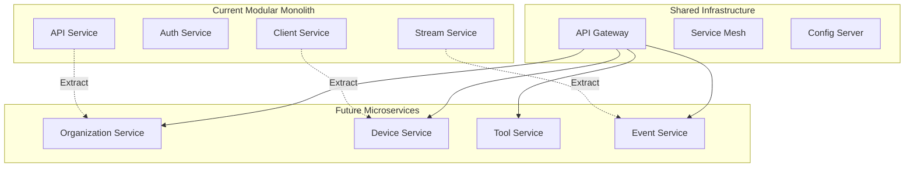

**Next Steps**: As the system grows, consider extracting domain-specific services while maintaining the current DTO contracts for backward compatibility.

This architecture provides a solid foundation for the OpenFrame ecosystem with clear separation of concerns, consistent patterns, and built-in scalability features.