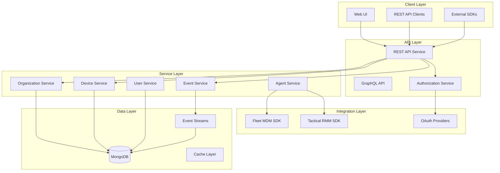
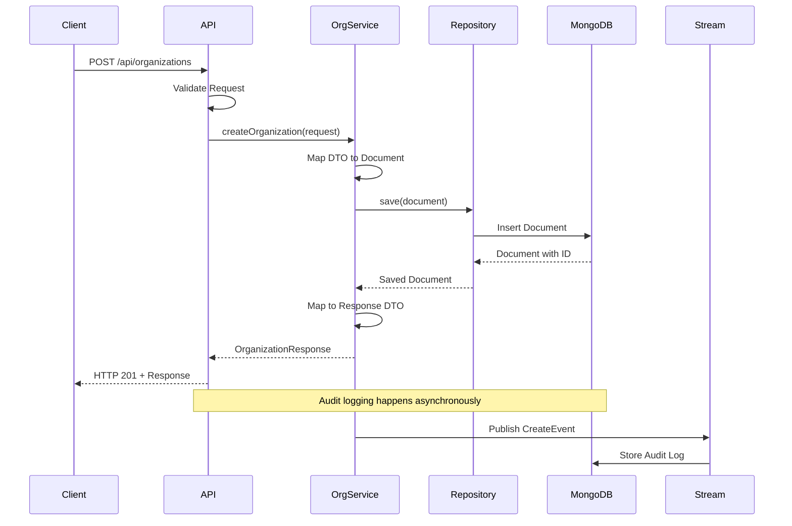
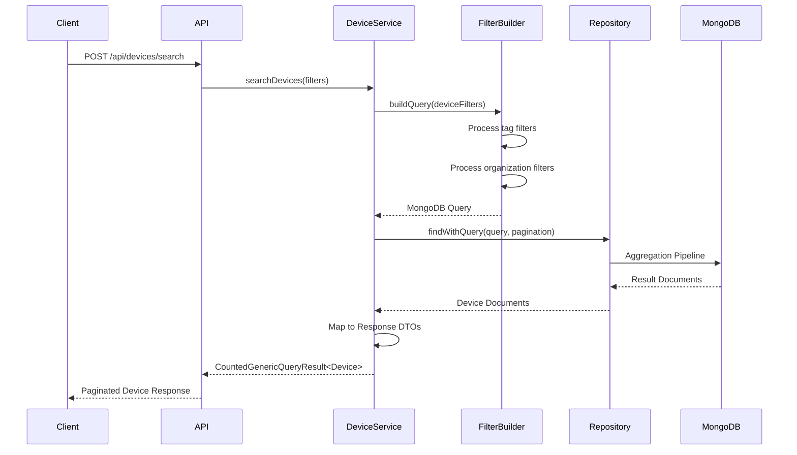
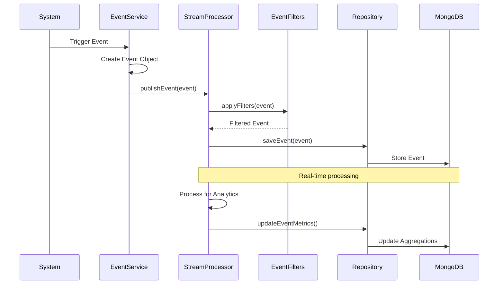
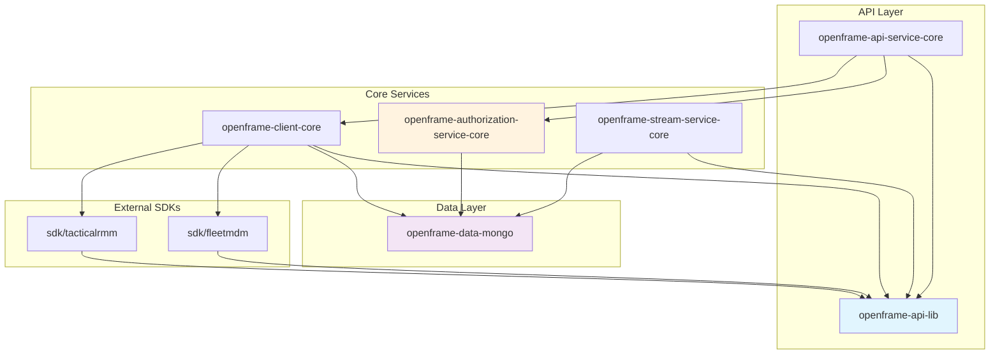
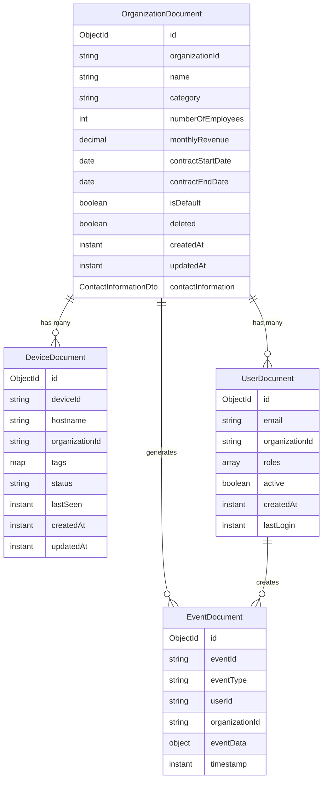
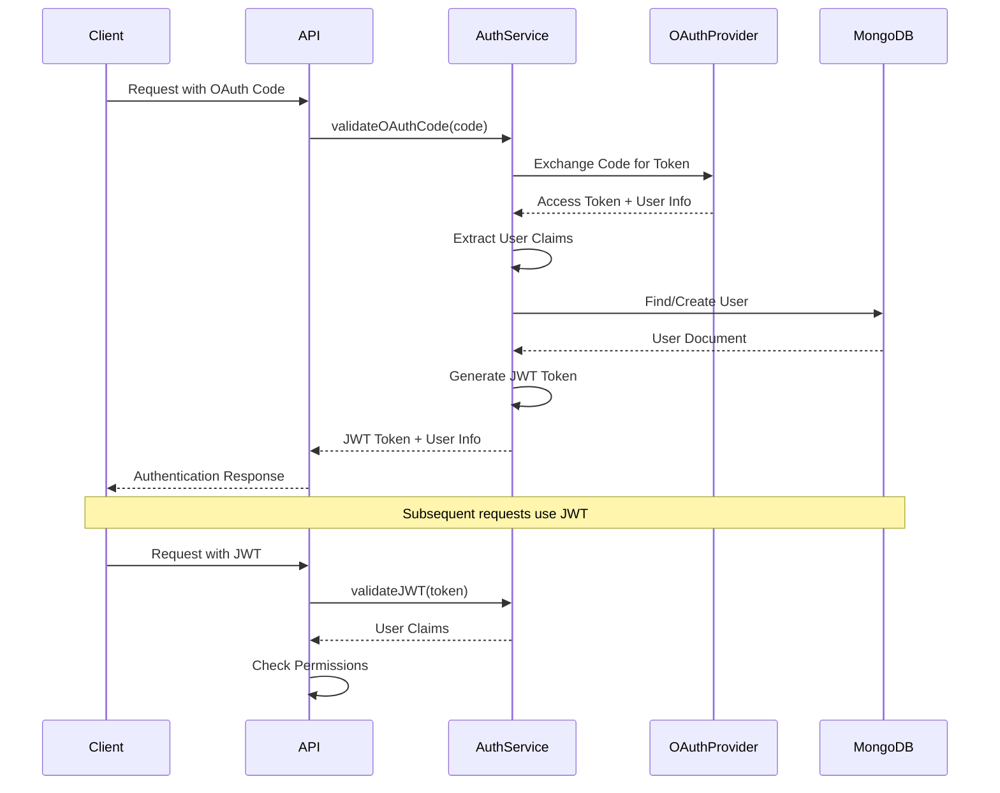
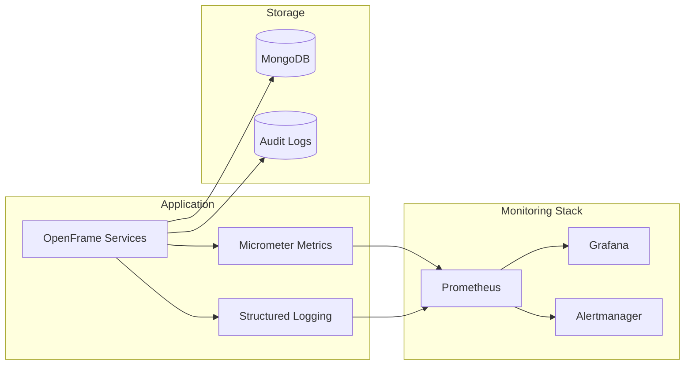

# OpenFrame OSS Library Architecture Overview

This document provides a comprehensive overview of the OpenFrame OSS Library architecture, including component relationships, data flow, and key design patterns.

## High-Level Architecture



## Core Components and Responsibilities

| Component | Module | Primary Responsibilities |
|-----------|--------|------------------------|
| **API Library** | `openframe-api-lib` | Shared DTOs, request/response models, common interfaces |
| **API Service** | `openframe-api-service-core` | REST endpoints, request validation, response formatting |
| **Authorization Service** | `openframe-authorization-service-core` | OAuth integration, JWT tokens, client registration |
| **Client Core** | `openframe-client-core` | Business logic, service orchestration, agent management |
| **Data Layer** | `openframe-data-mongo` | MongoDB repositories, document models, query builders |
| **Stream Service** | `openframe-stream-service-core` | Event processing, Debezium integration, message handling |
| **Fleet MDM SDK** | `sdk/fleetmdm` | Fleet MDM API integration, host management, device queries |
| **Tactical RMM SDK** | `sdk/tacticalrmm` | Tactical RMM integration, agent management, script execution |

## Data Flow Architecture

### Organization Management Flow



### Device Filtering and Query Flow



### Event Processing Flow



## Module Dependency Relationships



## Key Design Patterns

### 1. DTO Pattern with Lombok

**Purpose**: Standardized data transfer between layers
**Implementation**: Extensive use of Lombok annotations for boilerplate reduction

```java
@Data
@Builder
@NoArgsConstructor
@AllArgsConstructor
public class OrganizationResponse {
    private String id;
    private String organizationId;
    private String name;
    private String category;
    private Integer numberOfEmployees;
    private BigDecimal monthlyRevenue;
    private LocalDate contractStartDate;
    private LocalDate contractEndDate;
    private Boolean isDefault;
    private Boolean deleted;
    private Instant createdAt;
    private Instant updatedAt;
    private ContactInformationDto contactInformation;
}
```

### 2. Reactive Repository Pattern

**Purpose**: Non-blocking database operations with Spring Data MongoDB
**Implementation**: Reactive streams for high-throughput operations

```java
public interface ReactiveOrganizationRepository 
    extends ReactiveMongoRepository<OrganizationDocument, ObjectId> {
    
    Mono<OrganizationDocument> findByOrganizationId(String organizationId);
    Flux<OrganizationDocument> findByCategoryOrderByCreatedAtDesc(String category);
    Mono<Boolean> existsByOrganizationId(String organizationId);
}
```

### 3. Strategy Pattern for OAuth

**Purpose**: Support multiple OAuth providers with pluggable strategies
**Implementation**: Abstract base strategy with provider-specific implementations

```java
public abstract class BaseOidcClientRegistrationStrategy {
    public abstract ClientRegistration buildClientRegistration(
        TenantConfigurationDocument config);
}

public class MicrosoftClientRegistrationStrategy 
    extends BaseOidcClientRegistrationStrategy {
    
    @Override
    public ClientRegistration buildClientRegistration(
        TenantConfigurationDocument config) {
        return ClientRegistration.withRegistrationId("microsoft")
            .clientId(config.getClientId())
            .clientSecret(config.getClientSecret())
            .authorizationUri("https://login.microsoftonline.com/common/oauth2/v2.0/authorize")
            .tokenUri("https://login.microsoftonline.com/common/oauth2/v2.0/token")
            .build();
    }
}
```

### 4. Builder Pattern with Generics

**Purpose**: Type-safe query building and result pagination
**Implementation**: Generic builders for consistent API responses

```java
@SuperBuilder
@Data
@NoArgsConstructor
@AllArgsConstructor
public class GenericQueryResult<T> {
    private List<T> items;
    private CursorPageInfo pageInfo;
}

@EqualsAndHashCode(callSuper = true)
@SuperBuilder
@Data
@NoArgsConstructor
@AllArgsConstructor
public class CountedGenericQueryResult<T> extends GenericQueryResult<T> {
    private int filteredCount;
}
```

### 5. Filter Composition Pattern

**Purpose**: Flexible and reusable filtering capabilities
**Implementation**: Composable filter objects with builder patterns

```java
@Data
@Builder
@NoArgsConstructor
@AllArgsConstructor
public class DeviceFilters {
    private List<String> organizationIds;
    private List<DeviceFilterOption> deviceFilterOptions;
    private List<TagFilterOption> tagFilterOptions;
}

@Data
@Builder
@NoArgsConstructor
@AllArgsConstructor
public class TagFilterOption {
    private String key;
    private List<String> values;
}
```

## Data Storage Architecture

### MongoDB Document Structure



### Query Optimization Strategies

| Collection | Index Strategy | Query Pattern |
|------------|---------------|---------------|
| **organizations** | `organizationId` (unique), `category`, `createdAt` | Lookup by ID, filter by category |
| **devices** | `deviceId`, `organizationId + status`, `tags.environment` | Multi-tenant filtering, tag-based queries |
| **events** | `organizationId + timestamp`, `userId + eventType`, `eventType + timestamp` | Time-range queries, user activity tracking |
| **users** | `email` (unique), `organizationId + active`, `lastLogin` | Authentication, org user management |

## Security Architecture

### Authentication Flow



### Authorization Levels

| Level | Scope | Access Pattern |
|-------|-------|---------------|
| **System Admin** | All organizations | Full CRUD on all resources |
| **Organization Admin** | Single organization | Full CRUD within organization |
| **User** | Single organization | Read access + limited updates |
| **Service Account** | API-specific | Programmatic access with scoped permissions |

## Performance Considerations

### Scaling Strategies

1. **Horizontal Scaling**
   - MongoDB sharding on `organizationId`
   - Load balancing across API service instances
   - CDN for static assets

2. **Caching Strategy**
   - Redis for session data and JWT tokens
   - Application-level caching for organization lookups
   - MongoDB query result caching

3. **Database Optimization**
   - Compound indexes for common query patterns
   - Read replicas for analytics queries
   - TTL indexes for temporary data (sessions, tokens)

### Monitoring and Observability



## Development Patterns and Best Practices

### Error Handling Strategy

```java
// Global exception handling
@ControllerAdvice
public class GlobalExceptionHandler {
    
    @ExceptionHandler(OrganizationNotFoundException.class)
    public ResponseEntity<ErrorResponse> handleOrganizationNotFound(
        OrganizationNotFoundException ex) {
        return ResponseEntity.status(HttpStatus.NOT_FOUND)
            .body(ErrorResponse.builder()
                .code("ORGANIZATION_NOT_FOUND")
                .message(ex.getMessage())
                .timestamp(Instant.now())
                .build());
    }
}
```

### Testing Architecture

```mermaid
pyramid
    title Testing Strategy
    
    component "Unit Tests" "65%"
    component "Integration Tests" "25%"
    component "E2E Tests" "10%"
```

| Test Type | Purpose | Tools | Coverage |
|-----------|---------|--------|----------|
| **Unit Tests** | Individual component logic | JUnit 5, Mockito | >80% code coverage |
| **Integration Tests** | Component interaction | TestContainers, MockMvc | API endpoints, database operations |
| **E2E Tests** | Full system workflows | RestAssured, Test fixtures | Critical user journeys |

## Future Architecture Considerations

### Planned Enhancements

1. **Microservices Migration**
   - Break monolith into domain-specific services
   - Event-driven communication between services
   - Service mesh for inter-service communication

2. **Event Sourcing**
   - Implement event sourcing for audit trail
   - CQRS pattern for read/write separation
   - Event replay capabilities for data reconstruction

3. **Multi-tenancy Improvements**
   - Database-per-tenant option
   - Enhanced isolation and security
   - Tenant-specific customizations

This architecture overview provides the foundation for understanding how OpenFrame OSS Library components work together. For implementation details, refer to the individual module documentation in `docs/dev/module_*.md`.