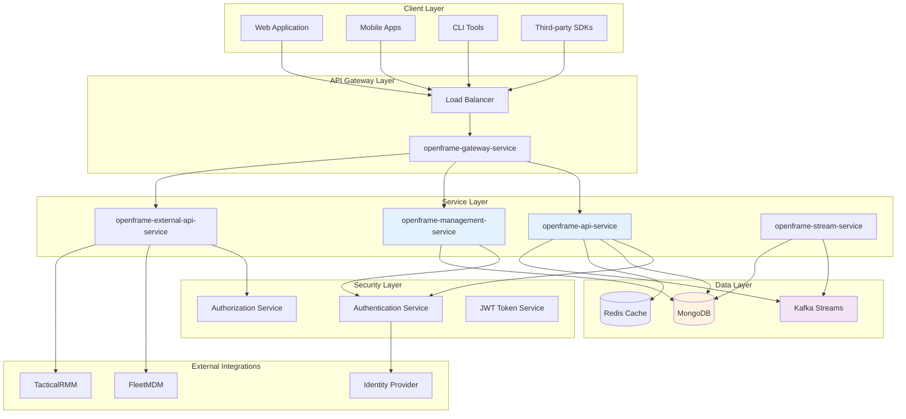
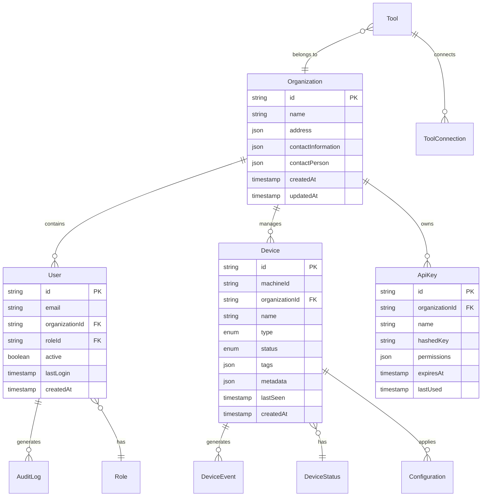
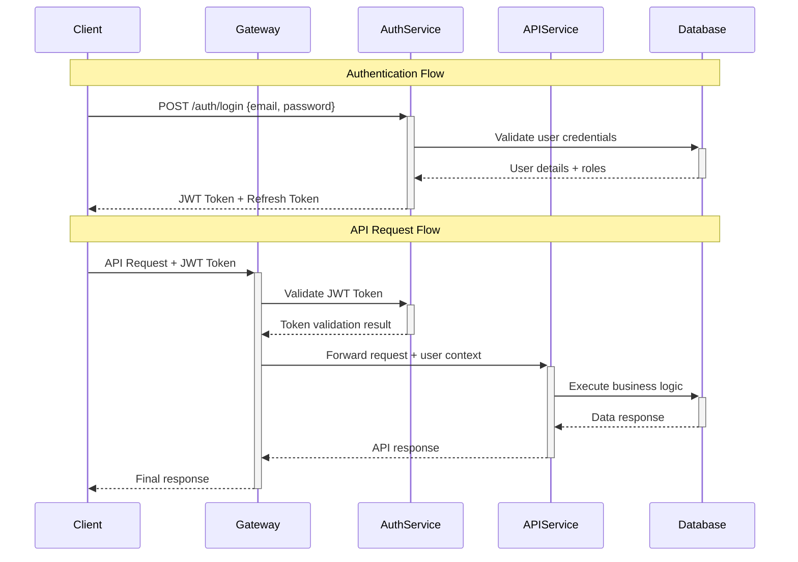
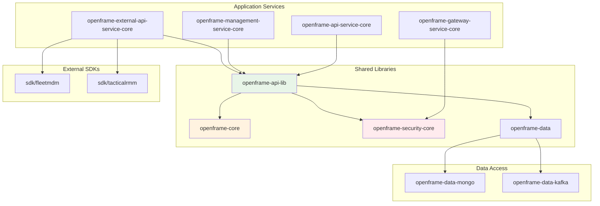
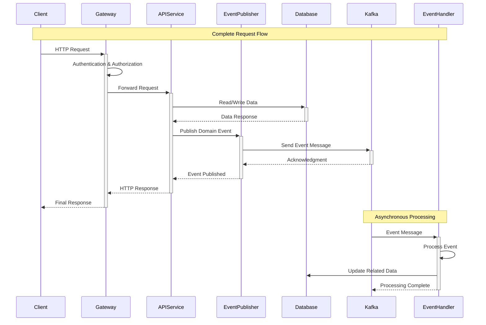

# OpenFrame OSS Architecture Overview

This document provides a comprehensive technical overview of OpenFrame OSS architecture, designed for engineers who need to understand the system design, data flow, and integration patterns.

## High-Level System Architecture



## Core Components

### 1. Service Architecture

| Component | Purpose | Technology Stack | Port | Dependencies |
|-----------|---------|------------------|------|--------------|
| **API Service** | Core business APIs | Spring Boot 3.3, MongoDB | 8080 | openframe-core, security-core |
| **Management Service** | Admin and system management | Spring Boot 3.3, MongoDB | 8082 | openframe-core, security-core |
| **Gateway Service** | API routing and load balancing | Spring Cloud Gateway | 8083 | security-oauth |
| **Stream Service** | Event processing | Spring Boot, Kafka | 8084 | openframe-data-kafka |
| **External API Service** | Third-party integrations | Spring Boot 3.3 | 8085 | SDK modules |

### 2. Data Architecture



### 3. Security Architecture



### 4. Module Dependencies



## Design Patterns and Principles

### 1. Microservices Patterns

**Service Decomposition:**
- **Domain-Driven Design**: Services aligned with business domains (devices, organizations, users)
- **Database per Service**: Each service owns its data and schema
- **API Gateway Pattern**: Centralized routing and cross-cutting concerns
- **Event-Driven Architecture**: Asynchronous communication via Kafka

**Implementation Example:**
```java
// Service interface in openframe-api-lib
public interface DeviceService {
    Device createDevice(CreateDeviceRequest request);
    void updateStatusByMachineId(String machineId, DeviceStatus status);
    Page<Device> findDevices(DeviceFilters filters, Pageable pageable);
}

// Implementation in openframe-api-service-core
@Service
@Transactional
@RequiredArgsConstructor
@Slf4j
public class DeviceServiceImpl implements DeviceService {
    
    private final DeviceRepository deviceRepository;
    private final DeviceEventPublisher eventPublisher;
    private final DeviceMapper deviceMapper;
    
    @Override
    public void updateStatusByMachineId(String machineId, DeviceStatus status) {
        Device device = deviceRepository.findByMachineId(machineId)
            .orElseThrow(() -> new DeviceNotFoundException("Device not found: " + machineId));
            
        DeviceStatus previousStatus = device.getStatus();
        device.updateStatus(status);
        
        Device savedDevice = deviceRepository.save(device);
        
        // Publish domain event
        eventPublisher.publishStatusChanged(
            DeviceStatusChangedEvent.builder()
                .deviceId(device.getId())
                .machineId(machineId)
                .previousStatus(previousStatus)
                .currentStatus(status)
                .timestamp(Instant.now())
                .build()
        );
        
        log.info("Device status updated: {} {} -> {}", machineId, previousStatus, status);
    }
}
```

### 2. Data Access Patterns

**Repository Pattern with MongoDB:**
```java
// Generic repository base
@NoRepositoryBean
public interface BaseRepository<T, ID> extends MongoRepository<T, ID> {
    
    @Query("{ 'organizationId': ?0, 'active': true }")
    List<T> findActiveByOrganizationId(String organizationId);
    
    @Query("{ 'tags': { $in: ?0 } }")
    List<T> findByTags(List<String> tags);
}

// Specific device repository
public interface DeviceRepository extends BaseRepository<Device, String> {
    
    @Query("{ 'machineId': ?0 }")
    Optional<Device> findByMachineId(String machineId);
    
    @Query("{ 'organizationId': ?0, 'status': ?1 }")
    List<Device> findByOrganizationIdAndStatus(String organizationId, DeviceStatus status);
    
    @Aggregation(pipeline = {
        "{ $match: { 'organizationId': ?0 } }",
        "{ $group: { '_id': '$status', 'count': { $sum: 1 } } }"
    })
    List<DeviceStatusSummary> getStatusSummaryByOrganization(String organizationId);
}
```

### 3. Security Patterns

**JWT-based Authentication:**
```java
@Component
@RequiredArgsConstructor
@Slf4j
public class JwtAuthenticationProvider {
    
    private final JwtDecoder jwtDecoder;
    private final UserDetailsService userDetailsService;
    
    public Authentication authenticate(String token) {
        try {
            Jwt jwt = jwtDecoder.decode(token);
            String username = jwt.getClaimAsString("sub");
            
            UserDetails userDetails = userDetailsService.loadUserByUsername(username);
            
            return new JwtAuthenticationToken(jwt, userDetails.getAuthorities());
        } catch (JwtException e) {
            log.warn("Invalid JWT token: {}", e.getMessage());
            throw new AuthenticationException("Invalid token", e);
        }
    }
}
```

**Role-Based Access Control:**
```java
@PreAuthorize("hasRole('ORGANIZATION_ADMIN') or hasPermission(#organizationId, 'ORGANIZATION', 'READ')")
public OrganizationResponse getOrganization(String organizationId) {
    // Implementation
}

@PostAuthorize("hasPermission(returnObject, 'DEVICE', 'READ')")
public Device getDevice(String deviceId) {
    // Implementation
}
```

### 4. Event-Driven Patterns

**Domain Events with Kafka:**
```java
// Event definition
@Data
@Builder
public class DeviceStatusChangedEvent {
    private String deviceId;
    private String machineId; 
    private String organizationId;
    private DeviceStatus previousStatus;
    private DeviceStatus currentStatus;
    private Instant timestamp;
    private Map<String, Object> metadata;
}

// Event publisher
@Component
@RequiredArgsConstructor
@Slf4j
public class DeviceEventPublisher {
    
    private final KafkaTemplate<String, Object> kafkaTemplate;
    
    public void publishStatusChanged(DeviceStatusChangedEvent event) {
        String topic = "device.status.changed";
        String key = event.getMachineId();
        
        kafkaTemplate.send(topic, key, event)
            .thenAccept(result -> log.debug("Event published: {}", event))
            .exceptionally(ex -> {
                log.error("Failed to publish event: {}", event, ex);
                return null;
            });
    }
}

// Event listener
@Component
@KafkaListener(topics = "device.status.changed")
@Slf4j
public class DeviceStatusEventHandler {
    
    private final NotificationService notificationService;
    private final AuditService auditService;
    
    @KafkaHandler
    public void handleStatusChanged(DeviceStatusChangedEvent event) {
        log.info("Processing device status change: {}", event);
        
        // Create audit log
        auditService.logEvent(AuditEvent.builder()
            .eventType("DEVICE_STATUS_CHANGED")
            .organizationId(event.getOrganizationId())
            .resourceId(event.getDeviceId())
            .details(Map.of(
                "machineId", event.getMachineId(),
                "previousStatus", event.getPreviousStatus(),
                "currentStatus", event.getCurrentStatus()
            ))
            .timestamp(event.getTimestamp())
            .build());
        
        // Send notifications for critical status changes
        if (event.getCurrentStatus() == DeviceStatus.OFFLINE) {
            notificationService.sendDeviceOfflineAlert(event);
        }
    }
}
```

## Data Flow Architecture

### 1. Request Processing Flow



### 2. Multi-Tenant Data Isolation

```java
// Organization-aware repository
@Repository
public class OrganizationAwareDeviceRepository {
    
    private final MongoTemplate mongoTemplate;
    private final SecurityContext securityContext;
    
    public List<Device> findDevices(DeviceFilters filters) {
        Query query = new Query();
        
        // Always filter by current user's organization
        String organizationId = securityContext.getCurrentOrganizationId();
        query.addCriteria(Criteria.where("organizationId").is(organizationId));
        
        // Add additional filters
        if (filters.getStatus() != null) {
            query.addCriteria(Criteria.where("status").is(filters.getStatus()));
        }
        
        if (filters.getTags() != null && !filters.getTags().isEmpty()) {
            query.addCriteria(Criteria.where("tags").in(filters.getTags()));
        }
        
        return mongoTemplate.find(query, Device.class);
    }
}
```

### 3. Caching Strategy

```java
@Service
@CacheConfig(cacheNames = "devices")
@RequiredArgsConstructor
@Slf4j
public class CachedDeviceService {
    
    private final DeviceRepository deviceRepository;
    
    @Cacheable(key = "#machineId", unless = "#result == null")
    public Optional<Device> findByMachineId(String machineId) {
        return deviceRepository.findByMachineId(machineId);
    }
    
    @CacheEvict(key = "#device.machineId")
    public Device updateDevice(Device device) {
        return deviceRepository.save(device);
    }
    
    @CacheEvict(allEntries = true)
    public void clearDeviceCache() {
        log.info("Device cache cleared");
    }
}
```

## Performance Characteristics

### 1. Scalability Targets

| Metric | Target | Current | Notes |
|--------|--------|---------|-------|
| **API Throughput** | 10,000 RPS | 2,000 RPS | Horizontal scaling with load balancer |
| **Database Connections** | 1,000 concurrent | 200 concurrent | Connection pooling with HikariCP |
| **Event Processing** | 50,000 events/sec | 5,000 events/sec | Kafka partitioning strategy |
| **Cache Hit Rate** | >90% | 85% | Redis with intelligent cache warming |
| **Response Time P95** | <200ms | <300ms | Optimized queries and indexes |

### 2. Monitoring and Observability

```java
// Custom metrics
@Component
@RequiredArgsConstructor
public class DeviceMetrics {
    
    private final MeterRegistry meterRegistry;
    private final Counter deviceUpdateCounter;
    private final Timer deviceQueryTimer;
    
    @PostConstruct
    public void initMetrics() {
        deviceUpdateCounter = Counter.builder("device.updates.total")
            .description("Total device updates")
            .tag("service", "api")
            .register(meterRegistry);
            
        deviceQueryTimer = Timer.builder("device.query.duration")
            .description("Device query duration")
            .register(meterRegistry);
    }
    
    @EventListener
    public void onDeviceUpdated(DeviceUpdatedEvent event) {
        deviceUpdateCounter.increment(
            Tags.of(
                "organization", event.getOrganizationId(),
                "status", event.getNewStatus().toString()
            )
        );
    }
    
    public void recordQueryTime(Duration duration) {
        deviceQueryTimer.record(duration);
    }
}
```

## Integration Patterns

### 1. External SDK Integration

```java
// Abstract integration pattern
public abstract class ExternalSystemIntegration<T extends ExternalSystemConfig> {
    
    protected final T config;
    protected final RestTemplate restTemplate;
    protected final ObjectMapper objectMapper;
    
    public abstract String getSystemName();
    public abstract boolean isHealthy();
    public abstract void syncDevices(String organizationId);
    
    protected <R> R executeWithRetry(Supplier<R> operation) {
        return Retry.ofDefaults("external-api")
            .executeSupplier(operation);
    }
}

// FleetMDM implementation
@Component
@ConditionalOnProperty("openframe.integrations.fleetmdm.enabled")
@Slf4j
public class FleetMDMIntegration extends ExternalSystemIntegration<FleetMDMConfig> {
    
    @Override
    public void syncDevices(String organizationId) {
        try {
            List<FleetMDMDevice> externalDevices = executeWithRetry(
                () -> fleetMDMClient.getDevices(organizationId)
            );
            
            for (FleetMDMDevice external : externalDevices) {
                Device device = deviceMapper.fromFleetMDM(external);
                deviceService.createOrUpdate(device);
            }
            
            log.info("Synced {} devices from FleetMDM for org {}", 
                    externalDevices.size(), organizationId);
                    
        } catch (Exception e) {
            log.error("Failed to sync devices from FleetMDM for org {}", 
                     organizationId, e);
            throw new ExternalIntegrationException("FleetMDM sync failed", e);
        }
    }
}
```

### 2. API Versioning Strategy

```java
// Version-aware controller
@RestController
@RequestMapping("/api/v1/devices")
@Api(tags = "Device Management", description = "Device operations API v1")
public class DeviceControllerV1 {
    
    @PatchMapping("/{machineId}")
    @ApiVersion("1.0")
    public ResponseEntity<Void> updateDeviceStatus(
        @PathVariable String machineId,
        @RequestBody @Valid UpdateDeviceStatusRequest request) {
        
        deviceService.updateStatusByMachineId(machineId, request.status());
        return ResponseEntity.noContent().build();
    }
}

@RestController  
@RequestMapping("/api/v2/devices")
@Api(tags = "Device Management", description = "Device operations API v2")
public class DeviceControllerV2 {
    
    @PatchMapping("/{machineId}")
    @ApiVersion("2.0")
    public ResponseEntity<DeviceUpdateResponse> updateDeviceStatus(
        @PathVariable String machineId,
        @RequestBody @Valid UpdateDeviceStatusRequestV2 request) {
        
        DeviceUpdateResult result = deviceService.updateDeviceWithMetadata(
            machineId, request.status(), request.metadata());
            
        return ResponseEntity.ok(DeviceUpdateResponse.builder()
            .deviceId(result.getDeviceId())
            .previousStatus(result.getPreviousStatus())
            .currentStatus(result.getCurrentStatus())
            .updateTimestamp(result.getUpdateTimestamp())
            .build());
    }
}
```

---

## Key Design Principles

| Principle | Implementation | Benefits |
|-----------|----------------|----------|
| **Separation of Concerns** | Layered architecture with distinct responsibilities | Maintainable, testable code |
| **Domain-Driven Design** | Services organized around business domains | Clear boundaries, reduced coupling |
| **Event-Driven Architecture** | Asynchronous communication via domain events | Scalability, resilience, loose coupling |
| **Security by Design** | Authentication and authorization at every layer | Comprehensive security posture |
| **Observability First** | Comprehensive logging, metrics, and tracing | Production-ready monitoring |
| **API-First Design** | Well-defined contracts with versioning | Integration-friendly, evolvable |

## Next Steps for Developers

🚀 **Ready to Build?**

1. **Start with Core Services**: Focus on `openframe-api-service-core` for most development
2. **Understand Data Models**: Review the DTOs in `openframe-api-lib` 
3. **Follow Event Patterns**: Use domain events for cross-service communication
4. **Implement Security**: Always consider organization-based data isolation
5. **Add Monitoring**: Include metrics and logging for new features

**Essential Reading:**
- [Spring Boot Documentation](https://spring.io/projects/spring-boot)
- [MongoDB Spring Data](https://spring.io/projects/spring-data-mongodb)
- [Apache Kafka Streams](https://kafka.apache.org/documentation/streams/)
- [Spring Security OAuth2](https://spring.io/projects/spring-security-oauth)

---

*This architecture documentation is living and should be updated as the system evolves. For questions or clarifications, consult the development team or create an issue.*