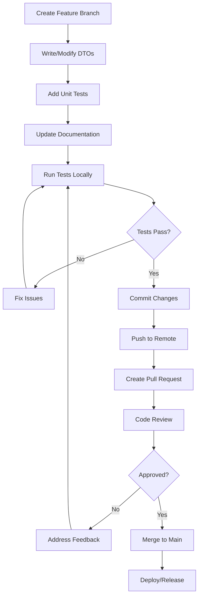

# OpenFrame API Library - Developer Getting Started Guide

Welcome to the OpenFrame API Library development guide! This comprehensive guide will help you set up your development environment, understand the codebase structure, and start contributing to the project.

## Development Environment Setup

### Prerequisites

| Tool | Version | Purpose |
|------|---------|---------|
| Java JDK | 11+ | Primary development language |
| Maven | 3.6+ | Build tool and dependency management |
| Git | Latest | Version control |
| IDE | IntelliJ/Eclipse/VS Code | Code editing and debugging |
| Lombok Plugin | Latest | Code generation support |

### Environment Configuration

**1. Clone the Repository**

```bash
git clone https://github.com/openframe/openframe-oss-lib.git
cd openframe-oss-lib
```

**2. Verify Java Installation**

```bash
java -version
# Should show Java 11 or higher
javac -version
```

**3. Install Maven Dependencies**

```bash
mvn clean install
```

**4. Set Up Your IDE**

**For IntelliJ IDEA:**
- Install Lombok plugin: `Settings → Plugins → Browse → Lombok`
- Enable annotation processing: `Settings → Build → Compiler → Annotation Processors → Enable`

**For Eclipse:**
- Download lombok.jar from https://projectlombok.org/download
- Run `java -jar lombok.jar` and point to Eclipse installation

**For VS Code:**
- Install Extension Pack for Java
- Install Lombok Annotations Support for VS Code

## Repository Structure

The OpenFrame OSS Library follows a modular architecture organized around domain-specific DTOs:

```
openframe-oss-lib/
├── openframe-api-lib/
│   └── src/
│       └── main/
│           └── java/
│               └── com/
│                   └── openframe/
│                       └── api/
│                           └── dto/
│                               ├── audit/              # Audit & logging DTOs
│                               │   ├── LogDetails.java
│                               │   ├── LogEvent.java
│                               │   ├── LogFilterOptions.java
│                               │   ├── LogFilters.java
│                               │   └── OrganizationFilterOption.java
│                               ├── device/             # Device management DTOs
│                               │   ├── DeviceFilterOption.java
│                               │   ├── DeviceFilterOptions.java
│                               │   ├── DeviceFilters.java
│                               │   └── TagFilterOption.java
│                               ├── event/              # Event handling DTOs
│                               │   ├── EventFilterOptions.java
│                               │   └── EventFilters.java
│                               ├── organization/       # Organization DTOs
│                               │   ├── AddressDto.java
│                               │   ├── ContactInformationDto.java
│                               │   ├── ContactPersonDto.java
│                               │   ├── CreateOrganizationRequest.java
│                               │   ├── OrganizationFilterOptions.java
│                               │   ├── OrganizationList.java
│                               │   └── OrganizationResponse.java
│                               ├── shared/             # Shared/common DTOs
│                               │   └── CursorPageInfo.java
│                               ├── CountedGenericQueryResult.java
│                               └── GenericQueryResult.java
├── docs/
│   ├── dev/                   # Developer documentation
│   └── tutorials/             # Tutorial documentation
├── pom.xml                    # Maven build configuration
└── README.md                  # Project overview
```

### Key Directories Explained

- **`dto/audit/`**: Contains DTOs for audit logging, event tracking, and filtering audit records
- **`dto/device/`**: Device management DTOs including filters and device metadata
- **`dto/event/`**: Event handling and event filtering DTOs
- **`dto/organization/`**: Organization management DTOs including CRUD operations and filtering
- **`dto/shared/`**: Common DTOs used across multiple domains (pagination, etc.)

## Development Workflow

The following diagram shows the typical development workflow:



## Build and Test Commands

### Essential Maven Commands

```bash
# Clean and compile
mvn clean compile

# Run all tests
mvn test

# Package the library
mvn package

# Install to local repository
mvn install

# Skip tests during build (for quick compilation)
mvn install -DskipTests

# Run specific test class
mvn test -Dtest=OrganizationResponseTest

# Generate project documentation
mvn javadoc:javadoc

# Check for dependency updates
mvn versions:display-dependency-updates
```

### Testing Commands

```bash
# Run unit tests with coverage
mvn test jacoco:report

# Run integration tests (if available)
mvn verify

# Run tests in debug mode
mvn test -Dmaven.surefire.debug

# Run tests with specific JVM arguments
mvn test -Dtest.args="-Xmx1024m"
```

### Quality Assurance

```bash
# Run code style checks (if configured)
mvn checkstyle:check

# Run static analysis (if configured)
mvn spotbugs:check

# Format code (if formatter is configured)
mvn formatter:format
```

## Code Style and Conventions

### Java Coding Standards

**1. Class and Interface Naming**
```java
// Use PascalCase for classes
public class OrganizationResponse { }

// Use descriptive names
public class LogFilterOptions { }

// DTOs should end with appropriate suffix
public class CreateOrganizationRequest { }  // Request DTOs
public class OrganizationResponse { }       // Response DTOs
public class DeviceFilterOptions { }        // Filter DTOs
```

**2. Field and Method Naming**
```java
// Use camelCase for fields and methods
private String organizationId;
private List<String> tagNames;

// Boolean fields should use 'is' prefix or descriptive names
private Boolean isDefault;
private Boolean deleted;
private Boolean hasNextPage;
```

**3. Lombok Usage Guidelines**
```java
// Standard DTO pattern
@Data                    // Generates getters, setters, toString, equals, hashCode
@Builder                 // Generates builder pattern
@NoArgsConstructor      // Default constructor for frameworks
@AllArgsConstructor     // Constructor with all parameters
public class ExampleDto {
    private String field1;
    private String field2;
}

// For inheritance scenarios, use SuperBuilder
@Data
@SuperBuilder
@NoArgsConstructor
@AllArgsConstructor
public class BaseQueryResult<T> {
    private List<T> items;
}
```

**4. Documentation Standards**
```java
/**
 * Represents filtering options for device queries.
 * 
 * This DTO allows multiple filter criteria to be applied simultaneously
 * when searching for devices in the OpenFrame ecosystem.
 * 
 * @since 1.0.0
 */
@Data
@Builder
@NoArgsConstructor
@AllArgsConstructor
public class DeviceFilterOptions {
    
    /**
     * List of device statuses to filter by.
     * Common values: ACTIVE, INACTIVE, MAINTENANCE, ERROR
     */
    private List<DeviceStatus> statuses;
    
    /**
     * Organization IDs for multi-tenant filtering.
     * If null or empty, no organization filtering is applied.
     */
    private List<String> organizationIds;
}
```

### Package Organization

- Keep related DTOs in the same package
- Use clear package names that reflect the domain
- Avoid deep nesting (max 3-4 levels)
- Group by functional area, not technical structure

## Contributing Guidelines Summary

### Branch Naming Convention

```bash
# Feature branches
feature/add-user-management-dtos
feature/improve-pagination-support

# Bug fixes
fix/null-pointer-in-organization-response
fix/missing-validation-annotations

# Documentation updates
docs/update-api-examples
docs/add-troubleshooting-guide
```

### Commit Message Format

```bash
# Format: <type>(<scope>): <description>
feat(organization): add support for contact information DTO
fix(device): resolve null pointer in filter options
docs(readme): update installation instructions
test(audit): add unit tests for log event DTO
refactor(shared): improve generic query result structure
```

### Pull Request Guidelines

1. **Title**: Clear, descriptive title
2. **Description**: Explain what changes were made and why
3. **Testing**: Describe how changes were tested
4. **Breaking Changes**: Highlight any breaking changes
5. **Documentation**: Update relevant documentation

Example PR template:
```markdown
## Description
Add support for advanced organization filtering with contact information.

## Changes Made
- Added ContactInformationDto class
- Updated OrganizationResponse to include contact information
- Added unit tests for new DTOs

## Testing
- Unit tests pass
- Integration tests updated
- Manual testing performed

## Breaking Changes
None

## Checklist
- [x] Code follows style guidelines
- [x] Unit tests added/updated
- [x] Documentation updated
- [x] No breaking changes introduced
```

## Common Development Errors and Solutions

### Build Issues

| Error | Cause | Solution |
|-------|-------|----------|
| `Cannot find symbol: Builder` | Lombok not configured | Install Lombok plugin in IDE |
| `Package does not exist` | Missing dependency | Run `mvn clean install` |
| `Java version mismatch` | Wrong JDK version | Ensure Java 11+ is used |
| `Compilation failure` | Syntax errors | Check code syntax and imports |

### Runtime Issues

| Error | Cause | Solution |
|-------|-------|----------|
| `NoSuchMethodError` | Version mismatch | Check dependency versions |
| `ClassNotFoundException` | Missing classpath | Verify all dependencies are included |
| `NullPointerException` | Null builder fields | Use proper null checks |

### Debug Tips

**1. Enable Debug Logging**
```xml
<!-- In logback.xml or similar -->
<logger name="com.openframe" level="DEBUG"/>
```

**2. Use IDE Debugger**
- Set breakpoints in DTO builder methods
- Inspect object state during construction
- Step through complex object building

**3. Unit Test Debugging**
```java
@Test
public void debugDtoCreation() {
    OrganizationResponse org = OrganizationResponse.builder()
        .name("Test Org")
        .build();
    
    // Add debug assertions
    assertThat(org.getName()).isNotNull();
    System.out.println("Created: " + org);
}
```

## Working with DTOs

### Best Practices

**1. Always Use Builder Pattern**
```java
// ✅ Good
OrganizationResponse org = OrganizationResponse.builder()
    .id("123")
    .name("Example Corp")
    .build();

// ❌ Avoid
OrganizationResponse org = new OrganizationResponse();
org.setId("123");
org.setName("Example Corp");
```

**2. Handle Optional Fields Properly**
```java
// ✅ Good - handle null values
DeviceFilterOptions filter = DeviceFilterOptions.builder()
    .organizationIds(orgIds != null ? orgIds : Collections.emptyList())
    .statuses(statuses)
    .build();

// ✅ Also good - use Optional
Optional.ofNullable(request.getTagNames())
    .ifPresent(tags -> filter.setTagNames(tags));
```

**3. Implement Proper Validation**
```java
public OrganizationResponse createOrganization(CreateOrganizationRequest request) {
    // Validate required fields
    Objects.requireNonNull(request.getName(), "Organization name is required");
    
    return OrganizationResponse.builder()
        .name(request.getName())
        .createdAt(Instant.now())
        .build();
}
```

### Advanced DTO Patterns

**1. DTO Transformation**
```java
public class OrganizationMapper {
    
    public OrganizationResponse fromEntity(OrganizationEntity entity) {
        return OrganizationResponse.builder()
            .id(entity.getId())
            .name(entity.getName())
            .organizationId(entity.getOrgId())
            .createdAt(entity.getCreatedTimestamp())
            .build();
    }
    
    public OrganizationEntity toEntity(CreateOrganizationRequest request) {
        return OrganizationEntity.builder()
            .name(request.getName())
            .orgId(request.getOrganizationId())
            .createdTimestamp(Instant.now())
            .build();
    }
}
```

**2. Generic DTO Utilities**
```java
public class DtoUtils {
    
    public static <T> GenericQueryResult<T> createEmptyResult() {
        return GenericQueryResult.<T>builder()
            .items(Collections.emptyList())
            .pageInfo(CursorPageInfo.builder()
                .hasNextPage(false)
                .hasPreviousPage(false)
                .build())
            .build();
    }
    
    public static <T> GenericQueryResult<T> createSingleResult(T item) {
        return GenericQueryResult.<T>builder()
            .items(List.of(item))
            .pageInfo(createSimplePageInfo(false, false))
            .build();
    }
}
```

## Next Steps

Now that you have your development environment set up:

1. **Explore the Codebase**: Browse through existing DTOs to understand patterns
2. **Write Unit Tests**: Create tests for any new DTOs you develop
3. **Read Architecture Overview**: Check out the architecture guide for deeper understanding
4. **Join Development Discussions**: Participate in code reviews and technical discussions
5. **Contribute**: Start with small improvements or bug fixes

## Development Resources

### Useful Commands Quick Reference

```bash
# Development workflow
git checkout -b feature/your-feature-name
mvn clean test                    # Test your changes
git add . && git commit -m "feat: your change"
git push origin feature/your-feature-name

# Debugging
mvn test -Dtest=YourTestClass -Dmaven.surefire.debug
mvn dependency:tree              # Check dependencies
mvn help:effective-pom           # View effective POM

# Code quality
mvn clean verify                 # Full build with checks
mvn javadoc:javadoc             # Generate documentation
```

### IDE Configuration Tips

**IntelliJ IDEA:**
- Set up code templates for DTO creation
- Configure auto-import for common packages
- Use "Live Templates" for common Lombok patterns

**Eclipse:**
- Install Lombok properly with the installer
- Configure code formatting to match project style
- Set up Maven integration

> **💡 Pro Tip**: Use your IDE's "Generate" menu to quickly create test methods and boilerplate code.

> **⚠️ Important**: Always run tests locally before pushing changes to ensure code quality.

**Happy coding!** You're now ready to contribute to the OpenFrame API Library. Check out the architecture overview for deeper technical insights.