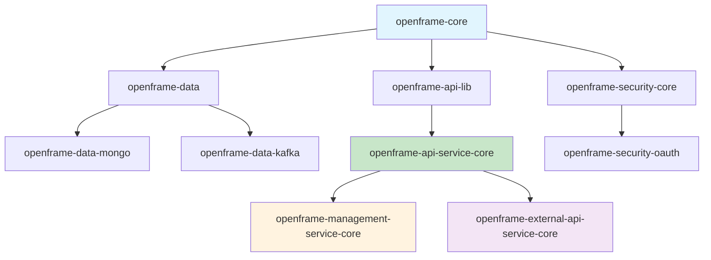

# Developer Getting Started Guide

Welcome to OpenFrame development! This guide will help you set up your development environment and understand the codebase structure.

## Overview

OpenFrame is a modular Spring Boot library collection built with:
- **Java 21** with modern language features
- **Spring Boot 3.3** with Spring Security OAuth2
- **Maven** multi-module project structure
- **MongoDB** for primary data storage
- **Redis** for caching and sessions
- **Apache Kafka** for event streaming
- **GraphQL** and REST APIs

---

## Development Environment Setup

### Prerequisites Table

| Tool | Version | Purpose | Installation Command |
|------|---------|---------|---------------------|
| JDK | 21+ | Runtime | `sdk install java 21.0.1-tem` |
| Maven | 3.8+ | Build tool | `brew install maven` / `apt install maven` |
| IDE | Latest | Development | IntelliJ IDEA / VS Code |
| Docker | 20.10+ | Local services | [Docker Install](https://docs.docker.com/get-docker/) |
| Git | 2.30+ | Version control | `brew install git` / `apt install git` |

### 1. Clone and Fork

```bash
# Fork the repository on GitHub first, then:
git clone https://github.com/YOUR-USERNAME/openframe-oss-lib.git
cd openframe-oss-lib

# Add upstream remote
git remote add upstream https://github.com/flamingo-stack/openframe-oss-lib.git
```

### 2. IDE Setup

#### IntelliJ IDEA Configuration
```bash
# Import as Maven project
# Enable annotation processing for Lombok
# Set Project SDK to Java 21
```

#### VS Code Extensions
- Extension Pack for Java
- Spring Boot Extension Pack
- Lombok Annotations Support
- GraphQL

### 3. Local Development Services

Create a `docker-compose.dev.yml` for local development:

```yaml
version: '3.8'
services:
  mongodb:
    image: mongo:5.0
    ports:
      - "27017:27017"
    environment:
      MONGO_INITDB_DATABASE: openframe_dev
    volumes:
      - mongodb_data:/data/db

  redis:
    image: redis:7-alpine
    ports:
      - "6379:6379"

  kafka:
    image: confluentinc/cp-kafka:latest
    ports:
      - "9092:9092"
    environment:
      KAFKA_ZOOKEEPER_CONNECT: zookeeper:2181
      KAFKA_ADVERTISED_LISTENERS: PLAINTEXT://localhost:9092
      KAFKA_OFFSETS_TOPIC_REPLICATION_FACTOR: 1
    depends_on:
      - zookeeper

  zookeeper:
    image: confluentinc/cp-zookeeper:latest
    ports:
      - "2181:2181"
    environment:
      ZOOKEEPER_CLIENT_PORT: 2181
      ZOOKEEPER_TICK_TIME: 2000

volumes:
  mongodb_data:
```

Start services:
```bash
docker-compose -f docker-compose.dev.yml up -d
```

---

## Repository Structure

```
openframe-oss-lib/
├── 📁 openframe-core/                    # Core utilities and common classes
│   ├── src/main/java/com/openframe/core/
│   │   ├── constants/                    # HTTP headers, constants
│   │   ├── dto/                          # Common DTOs (ErrorResponse, PageResponse)
│   │   ├── exception/                    # Base exceptions
│   │   ├── service/                      # Core services (encryption, proxy)
│   │   └── util/                         # Utilities (SlugUtil)
│   └── pom.xml
├── 📁 openframe-api-lib/                 # Shared API DTOs
│   ├── src/main/java/com/openframe/api/dto/
│   │   ├── organization/                 # Organization DTOs
│   │   ├── device/                       # Device management DTOs
│   │   ├── event/                        # Event DTOs
│   │   ├── audit/                        # Audit log DTOs
│   │   └── shared/                       # Pagination, cursor DTOs
│   └── pom.xml
├── 📁 openframe-data/                    # Data layer abstractions
│   ├── src/main/java/com/openframe/data/
│   │   ├── config/                       # Database configurations
│   │   ├── model/                        # Data models and entities
│   │   ├── mapper/                       # Object mappers
│   │   └── health/                       # Health indicators
│   └── pom.xml
├── 📁 openframe-data-mongo/              # MongoDB implementations
├── 📁 openframe-data-kafka/              # Kafka integrations
├── 📁 openframe-security-core/           # Security abstractions
├── 📁 openframe-security-oauth/          # OAuth2 implementations
├── 📁 openframe-api-service-core/        # Main API service
│   ├── src/main/java/com/openframe/api/
│   │   ├── config/                       # Spring configurations
│   │   ├── controller/                   # REST controllers
│   │   ├── resolver/                     # GraphQL resolvers
│   │   └── service/                      # Business logic
│   └── pom.xml
├── 📁 openframe-management-service-core/ # Management APIs
├── 📁 openframe-external-api-service-core/ # External/public APIs
├── 📁 openframe-gateway-service-core/    # API Gateway
├── 📁 sdk/                              # SDK integrations
│   ├── fleetmdm/                        # Fleet MDM SDK
│   └── tacticalrmm/                     # TacticalRMM SDK
├── pom.xml                              # Parent POM
└── README.md
```

### Module Dependencies



---

## Build and Test Commands

### Building the Project

```bash
# Build all modules
mvn clean install

# Build specific module
cd openframe-api-service-core
mvn clean install

# Skip tests (faster development builds)
mvn clean install -DskipTests

# Build with specific profile
mvn clean install -Pdev
```

### Testing

```bash
# Run all tests
mvn test

# Run tests for specific module
mvn test -pl openframe-api-service-core

# Run integration tests
mvn verify

# Run specific test class
mvn test -Dtest=OrganizationServiceTest

# Generate test coverage report
mvn jacoco:report
```

### Development Servers

```bash
# Run API service in development mode
cd openframe-api-service-core
mvn spring-boot:run -Dspring-boot.run.profiles=dev

# Run with debug port
mvn spring-boot:run -Dspring-boot.run.jvmArguments="-agentlib:jdwp=transport=dt_socket,server=y,suspend=n,address=5005"

# Run management service
cd openframe-management-service-core
mvn spring-boot:run
```

---

## Development Workflow

### Branch Strategy

```mermaid
gitgraph
    commit id: "main"
    branch feature/device-management
    commit id: "Add device DTOs"
    commit id: "Implement device service"
    commit id: "Add tests"
    checkout main
    merge feature/device-management
    commit id: "Release v5.8.3"
    branch hotfix/security-patch
    commit id: "Fix security issue"
    checkout main
    merge hotfix/security-patch
```

### Workflow Steps

1. **Create Feature Branch**
```bash
git checkout -b feature/your-feature-name
```

2. **Make Changes and Test**
```bash
# Make your changes
mvn clean install
mvn test
```

3. **Commit with Conventional Commits**
```bash
git commit -m "feat(api): add device status endpoint"
git commit -m "fix(security): resolve JWT validation issue"
git commit -m "docs(readme): update installation instructions"
```

4. **Push and Create PR**
```bash
git push origin feature/your-feature-name
# Create Pull Request on GitHub
```

---

## Code Style and Conventions

### Java Code Style

#### Naming Conventions
```java
// Classes: PascalCase
public class OrganizationService {}

// Methods and variables: camelCase
private String deviceId;
public void updateDeviceStatus() {}

// Constants: UPPER_SNAKE_CASE
public static final String DEFAULT_ORGANIZATION = "DEFAULT_ORG";

// Packages: lowercase with dots
package com.openframe.api.service;
```

#### Lombok Usage
```java
@Data                    // Use for DTOs
@Builder                 // Use for immutable objects
@NoArgsConstructor      // JPA entities
@AllArgsConstructor     // Builder pattern
@Slf4j                  // Logging

// Example DTO
@Data
@Builder
@NoArgsConstructor
@AllArgsConstructor
public class DeviceResponse {
    private String id;
    private String deviceId;
    private DeviceType deviceType;
    private Instant createdAt;
}
```

#### Exception Handling
```java
// Custom exceptions in core module
public class DeviceNotFoundException extends RuntimeException {
    public DeviceNotFoundException(String deviceId) {
        super("Device not found: " + deviceId);
    }
}

// Service layer error handling
@Service
public class DeviceService {
    public DeviceResponse getDevice(String id) {
        return deviceRepository.findById(id)
            .map(deviceMapper::toResponse)
            .orElseThrow(() -> new DeviceNotFoundException(id));
    }
}
```

### Configuration Patterns

#### Application Properties
```yaml
# Use kebab-case for property names
openframe:
  security:
    jwt:
      cache:
        expire-after: PT1H
        refresh-after: PT30M
        maximum-size: 1000
```

#### Configuration Classes
```java
@Configuration
@EnableConfigurationProperties(OpenFrameProperties.class)
public class ApiApplicationConfig {
    
    @Bean
    @ConditionalOnMissingBean
    public RestTemplate restTemplate() {
        return new RestTemplate();
    }
}
```

---

## Testing Guidelines

### Test Structure

```java
@ExtendWith(MockitoExtension.class)
class OrganizationServiceTest {
    
    @Mock
    private OrganizationRepository organizationRepository;
    
    @InjectMocks
    private OrganizationService organizationService;
    
    @Test
    @DisplayName("Should create organization successfully")
    void shouldCreateOrganizationSuccessfully() {
        // Given
        CreateOrganizationRequest request = CreateOrganizationRequest.builder()
            .name("Test Org")
            .category("Technology")
            .build();
        
        Organization savedOrg = Organization.builder()
            .id("org-123")
            .name("Test Org")
            .build();
        
        when(organizationRepository.save(any())).thenReturn(savedOrg);
        
        // When
        OrganizationResponse response = organizationService.createOrganization(request);
        
        // Then
        assertThat(response.getName()).isEqualTo("Test Org");
        assertThat(response.getId()).isEqualTo("org-123");
        verify(organizationRepository).save(any(Organization.class));
    }
}
```

### Integration Testing

```java
@SpringBootTest(webEnvironment = SpringBootTest.WebEnvironment.RANDOM_PORT)
@Testcontainers
class OrganizationControllerIntegrationTest {
    
    @Container
    static MongoDBContainer mongodb = new MongoDBContainer("mongo:5.0");
    
    @Autowired
    private TestRestTemplate restTemplate;
    
    @DynamicPropertySource
    static void configureProperties(DynamicPropertyRegistry registry) {
        registry.add("spring.data.mongodb.uri", mongodb::getReplicaSetUrl);
    }
    
    @Test
    void shouldCreateOrganization() {
        CreateOrganizationRequest request = CreateOrganizationRequest.builder()
            .name("Integration Test Org")
            .build();
        
        ResponseEntity<OrganizationResponse> response = restTemplate.postForEntity(
            "/api/organizations", request, OrganizationResponse.class);
        
        assertThat(response.getStatusCode()).isEqualTo(HttpStatus.CREATED);
        assertThat(response.getBody().getName()).isEqualTo("Integration Test Org");
    }
}
```

---

## Contributing Guidelines

### Pull Request Process

1. **Fork** the repository
2. **Create** a feature branch
3. **Implement** your changes with tests
4. **Ensure** all tests pass
5. **Update** documentation if needed
6. **Submit** pull request with clear description

### PR Checklist

- [ ] Code follows project conventions
- [ ] Tests added for new functionality
- [ ] All tests pass (`mvn test`)
- [ ] Documentation updated
- [ ] No breaking changes (or clearly documented)
- [ ] Commit messages follow conventional commits

### Code Review Guidelines

- **Security**: Check for potential security issues
- **Performance**: Consider impact on performance
- **Maintainability**: Code should be readable and well-structured
- **Testing**: Adequate test coverage
- **Documentation**: Public APIs should be documented

---

## Common Development Errors and Solutions

| Error | Cause | Solution |
|-------|-------|----------|
| `OutOfMemoryError` during build | Large project, insufficient heap | `export MAVEN_OPTS="-Xmx4g"` |
| Lombok not working | IDE plugin missing | Install Lombok plugin, enable annotation processing |
| MongoDB connection failed | Service not running | `docker-compose up mongodb` |
| Tests fail randomly | Race conditions | Use `@DirtiesContext` or better mocking |
| Build fails with dependency issues | Version conflicts | Check `mvn dependency:tree` |

### Debug Configuration

#### IntelliJ Remote Debug
1. Create Remote JVM Debug configuration
2. Host: localhost, Port: 5005
3. Run service with debug flags
4. Attach debugger

#### Application Debug Logging
```yaml
logging:
  level:
    com.openframe: DEBUG
    org.springframework.security: TRACE
    org.springframework.data.mongodb: DEBUG
```

---

## Performance Considerations

### Database Optimization
- Use appropriate indexes in MongoDB collections
- Implement pagination for large datasets
- Use projection to limit returned fields
- Consider caching frequently accessed data

### API Design
- Use cursor-based pagination for large lists
- Implement proper HTTP caching headers
- Use compression for large responses
- Consider GraphQL for flexible data fetching

### Memory Management
- Monitor heap usage in production
- Use connection pooling for databases
- Implement proper cache eviction policies
- Consider using Virtual Threads (Java 21)

---

## Next Steps

1. **Explore the codebase**: Start with `openframe-core` and `openframe-api-lib`
2. **Run the examples**: Test API endpoints using the provided examples
3. **Read module documentation**: Each module has specific documentation
4. **Join development discussions**: Participate in GitHub issues and discussions
5. **Contribute**: Start with small improvements or bug fixes

## Resources

- **API Documentation**: Generated from OpenAPI specs
- **Architecture Docs**: See `docs/dev/architecture-overview-dev.md`
- **GitHub Issues**: For bugs and feature requests
- **Development Chat**: (if available)

---

*This guide covers the essential development setup. For advanced topics like custom integrations and extending the platform, refer to the architecture documentation.*