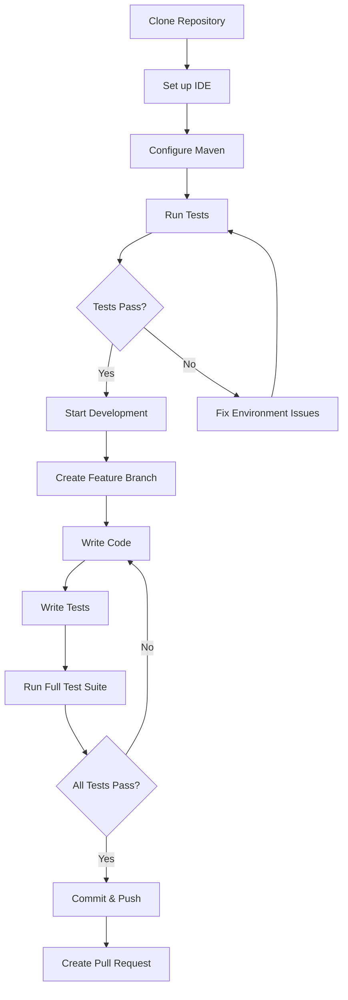

# Developer Getting Started Guide

Welcome to the OpenFrame OSS Library development team! This guide will help you set up your development environment and understand our codebase structure.

## Development Environment Setup

### Prerequisites

Ensure you have these tools installed:

| Tool | Version | Purpose |
|------|---------|---------|
| JDK | 17+ | Runtime and compilation |
| Maven | 3.8+ | Dependency management and builds |
| Git | Latest | Version control |
| Docker | Latest | Container testing (optional) |
| IDE | Latest | IntelliJ IDEA, Eclipse, or VS Code |

### Development Workflow



## Repository Structure

```
openframe-oss-lib/
├── openframe-api-lib/                    # Main API library module
│   └── src/main/java/com/openframe/api/
│       └── dto/                          # Data Transfer Objects
│           ├── audit/                    # Audit and logging DTOs
│           │   ├── LogDetails.java       # Detailed log information
│           │   ├── LogEvent.java         # Core audit event structure
│           │   ├── LogFilterOptions.java # Log filtering configurations
│           │   ├── LogFilters.java       # Log query filters
│           │   └── OrganizationFilterOption.java
│           ├── device/                   # Device management DTOs
│           │   ├── DeviceFilterOption.java
│           │   ├── DeviceFilterOptions.java
│           │   ├── DeviceFilters.java
│           │   └── TagFilterOption.java
│           ├── event/                    # Event management DTOs
│           │   ├── EventFilterOptions.java
│           │   └── EventFilters.java
│           ├── organization/             # Organization DTOs
│           │   ├── AddressDto.java       # Address information
│           │   ├── ContactInformationDto.java
│           │   ├── ContactPersonDto.java
│           │   ├── CreateOrganizationRequest.java
│           │   ├── OrganizationFilterOptions.java
│           │   ├── OrganizationList.java
│           │   └── OrganizationResponse.java
│           ├── CountedGenericQueryResult.java  # Paginated results with counts
│           └── GenericQueryResult.java         # Standard paginated results
├── docs/                                # Documentation
│   ├── dev/                            # Developer documentation
│   └── tutorials/                      # User and developer tutorials
├── pom.xml                             # Maven configuration
└── README.md                           # Project overview
```

## Build and Test Commands

### Essential Commands

```bash
# Clean and compile the project
mvn clean compile

# Run all tests
mvn test

# Run tests with coverage report
mvn test jacoco:report

# Package the library (creates JAR)
mvn package

# Install to local repository
mvn install

# Skip tests during build (for quick iterations)
mvn package -DskipTests

# Run specific test class
mvn test -Dtest=LogEventTest

# Run tests matching pattern
mvn test -Dtest="*FilterTest"
```

### Build Profiles

```bash
# Development profile (includes test dependencies)
mvn clean package -Pdev

# Production profile (optimized build)
mvn clean package -Pprod

# Integration testing profile
mvn clean verify -Pintegration-test
```

## Code Style and Conventions

### Java Code Standards

1. **Package Structure**: Follow the established pattern:
   ```
   com.openframe.api.dto.{domain}/{ClassName}.java
   ```

2. **Naming Conventions**:
   - Classes: `PascalCase` (e.g., `CreateOrganizationRequest`)
   - Methods: `camelCase` (e.g., `getFilterOptions`)
   - Constants: `UPPER_SNAKE_CASE` (e.g., `MAX_PAGE_SIZE`)
   - Fields: `camelCase` (e.g., `organizationId`)

3. **Annotation Usage**:
   ```java
   // Use Lombok for DTOs
   @Data
   @Builder
   @NoArgsConstructor
   @AllArgsConstructor
   public class ExampleDto {
       
       // Validation annotations for requests
       @NotBlank(message = "Field is required")
       private String requiredField;
       
       @PositiveOrZero(message = "Must be zero or positive")
       private Integer count;
   }
   ```

### File Organization

```java
// Standard DTO structure
package com.openframe.api.dto.domain;

// Imports - group by: java.*, javax.*, external libs, internal
import java.time.LocalDate;
import java.util.List;
import jakarta.validation.constraints.NotBlank;
import lombok.Builder;

/**
 * Brief description of the DTO's purpose.
 * 
 * Usage example and any important notes.
 */
@Builder
public record ExampleRequest(
    @NotBlank(message = "Name is required")
    String name,
    
    Integer optionalField
) {
}
```

## Contributing Guidelines

### Branch Naming

```bash
# Feature branches
feature/add-user-management
feature/enhance-audit-logging

# Bug fix branches  
bugfix/fix-pagination-issue
bugfix/validation-error-handling

# Documentation branches
docs/update-api-documentation
docs/add-developer-guides
```

### Commit Message Format

```
type(scope): brief description

Longer explanation if needed

- Bullet point for details
- Another important change

Fixes #123
```

**Types:**
- `feat`: New feature
- `fix`: Bug fix
- `docs`: Documentation changes
- `refactor`: Code refactoring
- `test`: Test improvements
- `chore`: Maintenance tasks

### Pull Request Process

1. **Create feature branch** from `main`
2. **Write comprehensive tests** for new functionality
3. **Update documentation** if APIs change
4. **Run full test suite** locally
5. **Create PR** with detailed description
6. **Address review feedback** promptly

## Common Development Errors and Solutions

### Build Issues

| Error | Cause | Solution |
|-------|-------|----------|
| `ClassNotFoundException` | Missing dependency | Check `pom.xml` and run `mvn clean install` |
| `Test compilation failed` | Java version mismatch | Ensure using JDK 17+ |
| `Could not resolve dependencies` | Network/repository issue | Check Maven settings, try `mvn -U clean install` |

### Code Issues

```java
// ❌ Common mistakes
@Builder
public class BadExample {
    private String name;  // Missing validation
    private int count;    // Should use Integer for nullability
}

// ✅ Correct approach
@Builder
public record GoodExample(
    @NotBlank(message = "Name is required")
    String name,
    
    @PositiveOrZero(message = "Count must be non-negative") 
    Integer count
) {
}
```

### Testing Best Practices

```java
@Test
@DisplayName("Should create organization with valid data")
void shouldCreateOrganizationWithValidData() {
    // Given
    CreateOrganizationRequest request = CreateOrganizationRequest.builder()
        .name("Test Organization")
        .numberOfEmployees(50)
        .build();
    
    // When
    OrganizationResponse result = organizationService.create(request);
    
    // Then
    assertThat(result.getName()).isEqualTo("Test Organization");
    assertThat(result.getNumberOfEmployees()).isEqualTo(50);
}

@Test
@DisplayName("Should throw validation exception for blank name")
void shouldThrowValidationExceptionForBlankName() {
    // Given
    CreateOrganizationRequest request = CreateOrganizationRequest.builder()
        .name("")  // Invalid blank name
        .build();
    
    // When & Then
    assertThatThrownBy(() -> organizationService.create(request))
        .isInstanceOf(ConstraintViolationException.class)
        .hasMessageContaining("Name is required");
}
```

## Debug Tips

### IDE Setup

**IntelliJ IDEA:**
```
- Enable annotation processing: Settings > Build > Compiler > Annotation Processors
- Configure code style: Settings > Editor > Code Style > Java (import team style)
- Set up run configurations for tests and main classes
```

**VS Code:**
```json
// .vscode/launch.json
{
    "type": "java",
    "name": "Debug Tests",
    "request": "launch",
    "mainClass": "org.junit.platform.console.ConsoleLauncher",
    "args": ["--scan-classpath"]
}
```

### Common Debug Scenarios

1. **Validation not working**: Check if `@Valid` annotations are present on nested objects
2. **Lombok issues**: Ensure annotation processing is enabled in IDE
3. **Test failures**: Run `mvn clean test` to ensure clean state
4. **Classpath issues**: Verify `mvn dependency:tree` for conflicts

### Useful Maven Debug Commands

```bash
# Show effective POM
mvn help:effective-pom

# Show dependency tree
mvn dependency:tree

# Show classpath
mvn dependency:build-classpath

# Verbose test output
mvn test -X

# Debug specific test
mvn -Dmaven.surefire.debug test -Dtest=YourTestClass
```

## Working with the Codebase

### Understanding DTOs

The library follows a clear DTO pattern:

1. **Request DTOs** (`CreateOrganizationRequest`): Input validation and data binding
2. **Response DTOs** (`OrganizationResponse`): API response structures  
3. **Filter DTOs** (`OrganizationFilterOptions`): Query filtering and pagination
4. **Result DTOs** (`GenericQueryResult<T>`): Standardized paginated responses

### Key Design Patterns

```java
// Builder Pattern with Records (Modern Java)
@Builder
public record CreateRequest(
    @NotBlank String name,
    Integer count
) {
}

// Generic Results for Reusability
public class GenericQueryResult<T> {
    private List<T> items;
    private CursorPageInfo pageInfo;
}

// Validation Annotations for Data Integrity
public record ValidatedDto(
    @NotBlank @Size(max = 255) String name,
    @PositiveOrZero Integer count,
    @Valid ContactInformationDto contact
) {
}
```

## Next Steps

1. **Set up your environment** using the commands above
2. **Explore the codebase** starting with the DTO packages
3. **Run the tests** to understand expected behavior
4. **Review the [Architecture Overview](./architecture-overview-dev.md)** for system design details
5. **Check existing PRs** to understand the review process

## Resources

- 📚 [Architecture Documentation](./architecture-overview-dev.md)
- 🧪 [Testing Guidelines](./testing-guidelines.md) (if available)
- 📋 [Code Review Checklist](./code-review-checklist.md) (if available)
- 🔗 [Internal APIs](https://internal-docs.openframe.io)
- 💬 [Developer Slack Channel](#dev-team)

Welcome to the team! 🚀