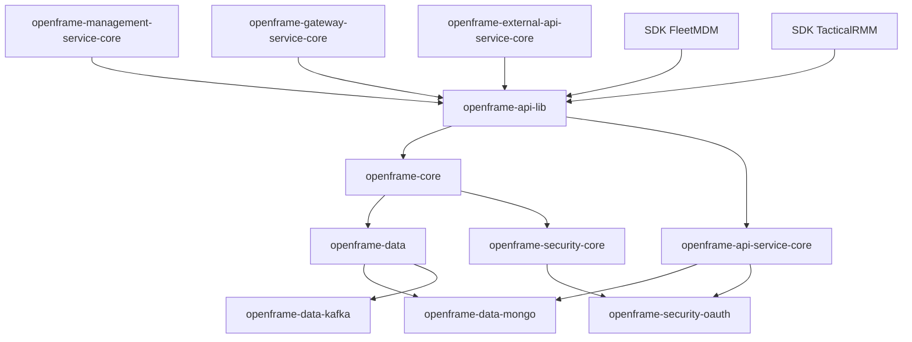
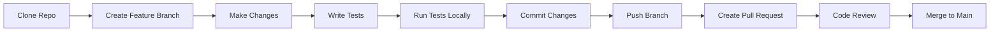

# Developer Getting Started Guide

Welcome to OpenFrame development! This guide will help you set up your development environment, understand the codebase structure, and start contributing to the project.

## Development Environment Setup

### Prerequisites for Development

| Tool | Version | Purpose | Installation |
|------|---------|---------|-------------|
| **Java JDK** | 21+ | Runtime & compilation | [Adoptium](https://adoptium.net/) recommended |
| **Maven** | 3.8+ | Build tool and dependency management | [Maven Download](https://maven.apache.org/download.cgi) |
| **Git** | Latest | Version control | [Git SCM](https://git-scm.com/) |
| **IDE** | Any | IntelliJ IDEA, Eclipse, VS Code | [IntelliJ Community](https://www.jetbrains.com/idea/download/) |
| **Docker** | 20.10+ | Local services (MongoDB, Kafka) | [Docker Desktop](https://www.docker.com/products/docker-desktop/) |
| **Node.js** | 18+ | Frontend tooling (if working on UI) | [Node.js](https://nodejs.org/) |

### Quick Setup Script

```bash
#!/bin/bash
# OpenFrame Development Setup

# Clone repository
git clone https://github.com/flamingo-stack/openframe-oss-lib.git
cd openframe-oss-lib

# Set up development services with Docker
docker-compose -f docker-compose.dev.yml up -d

# Build all modules
mvn clean install -DskipTests

# Run tests
mvn test

echo "✅ Development environment ready!"
```

## Repository Structure

The OpenFrame project follows a multi-module Maven structure:

```
openframe-oss-lib/
├── 📁 openframe-core/                    # Core utilities and shared components
├── 📁 openframe-data/                    # Data access layer abstractions
├── 📁 openframe-data-mongo/              # MongoDB implementations
├── 📁 openframe-data-kafka/              # Kafka messaging components
├── 📁 openframe-security-core/           # Security and authentication
├── 📁 openframe-security-oauth/          # OAuth2 implementations
├── 📁 openframe-api-lib/                 # API DTOs and interfaces
├── 📁 openframe-api-service-core/        # REST API controllers
├── 📁 openframe-authorization-service-core/ # Authorization service
├── 📁 openframe-management-service-core/  # Management operations
├── 📁 openframe-gateway-service-core/     # API gateway
├── 📁 openframe-external-api-service-core/ # Public API endpoints
├── 📁 openframe-stream-service-core/      # Event streaming
├── 📁 openframe-client-core/              # Client libraries
├── 📁 openframe-notification-mail/        # Email notifications
├── 📁 openframe-config-core/              # Configuration management
├── 📁 openframe-idp-configuration/        # Identity provider config
├── 📁 sdk/                               # External SDKs
│   ├── 📁 fleetmdm/                      # FleetMDM integration
│   └── 📁 tacticalrmm/                   # TacticalRMM integration
├── 📄 pom.xml                            # Root Maven configuration
├── 📄 docker-compose.dev.yml             # Development services
└── 📄 README.md                          # Project overview
```

### Module Dependencies



## Build and Development Workflow

### Building the Project

```bash
# Full clean build (recommended for first time)
mvn clean install

# Skip tests for faster builds
mvn clean install -DskipTests

# Build specific module
cd openframe-api-service-core
mvn clean install

# Build with specific profile
mvn clean install -P development
```

### Development Workflow



### Running Services Locally

1. **Start Dependencies**:
```bash
# Using Docker Compose
docker-compose -f docker-compose.dev.yml up -d

# Or manually start services
docker run -d --name mongo -p 27017:27017 mongo:6.0
docker run -d --name nats -p 4222:4222 nats:2.9-alpine
```

2. **Run Core API Service**:
```bash
cd openframe-api-service-core
mvn spring-boot:run -Dspring-boot.run.profiles=development
```

3. **Run Additional Services** (in separate terminals):
```bash
# Management Service
cd openframe-management-service-core
mvn spring-boot:run

# Gateway Service  
cd openframe-gateway-service-core
mvn spring-boot:run
```

### Testing

```bash
# Run all tests
mvn test

# Run tests for specific module
mvn test -pl openframe-api-service-core

# Run integration tests
mvn verify -P integration-tests

# Generate test coverage report
mvn jacoco:report
```

## Code Style and Conventions

### Java Coding Standards

We follow Google Java Style Guide with some modifications:

- **Indentation**: 4 spaces (not 2)
- **Line length**: 120 characters
- **Imports**: No wildcards, organize imports
- **Lombok**: Use `@Data`, `@Builder`, `@RequiredArgsConstructor` appropriately

### Code Formatting

**IntelliJ IDEA Setup**:
1. Install Google Java Format plugin
2. Import `openframe-code-style.xml` (in project root)
3. Enable "Reformat code" on save

**Example code structure**:
```java
@RestController
@RequestMapping("/api/v1/organizations")
@RequiredArgsConstructor
@Slf4j
public class OrganizationController {

    private final OrganizationService organizationService;
    private final OrganizationMapper mapper;

    @PostMapping
    @ResponseStatus(HttpStatus.CREATED)
    public OrganizationResponse createOrganization(
            @Valid @RequestBody CreateOrganizationRequest request) {
        
        log.info("Creating organization: {}", request.name());
        var organization = organizationService.create(request);
        return mapper.toResponse(organization);
    }
}
```

### Package Structure

```java
com.openframe.{module}
├── config/          // Spring configuration classes
├── controller/      // REST controllers
├── service/         // Business logic
├── repository/      // Data access
├── dto/             // Data transfer objects
├── mapper/          // Entity-DTO mappers
├── exception/       // Custom exceptions
└── util/            // Utility classes
```

## Key Components and Patterns

### 1. Service Layer Pattern

```java
@Service
@RequiredArgsConstructor
@Slf4j
public class DeviceService {
    
    private final DeviceRepository deviceRepository;
    private final EventPublisher eventPublisher;
    
    @Transactional
    public Device createDevice(CreateDeviceRequest request) {
        // Validation logic
        validateDeviceRequest(request);
        
        // Business logic
        var device = Device.builder()
            .machineId(request.machineId())
            .organizationId(request.organizationId())
            .status(DeviceStatus.PENDING)
            .build();
            
        device = deviceRepository.save(device);
        
        // Event publishing
        eventPublisher.publishDeviceCreated(device);
        
        return device;
    }
}
```

### 2. GraphQL Data Fetchers

```java
@Component
@RequiredArgsConstructor
public class DeviceDataFetcher {
    
    private final DeviceService deviceService;
    
    @DgsQuery
    public List<Device> devices(@InputArgument DeviceFilters filters,
                               @InputArgument CursorPaginationInput pagination) {
        return deviceService.findDevices(filters, pagination);
    }
    
    @DgsMutation
    public Device updateDeviceStatus(@InputArgument String deviceId,
                                   @InputArgument DeviceStatus status) {
        return deviceService.updateStatus(deviceId, status);
    }
}
```

### 3. Event-Driven Architecture

```java
@Component
@RequiredArgsConstructor
public class DeviceEventHandler {
    
    private final NotificationService notificationService;
    
    @EventListener
    public void handleDeviceOffline(DeviceOfflineEvent event) {
        log.warn("Device {} went offline", event.getDeviceId());
        
        // Send notification
        notificationService.sendAlert(
            AlertType.DEVICE_OFFLINE,
            event.getOrganizationId(),
            event.getDeviceId()
        );
    }
}
```

## Contributing Guidelines

### Branch Naming Convention

- **Feature**: `feature/JIRA-123-add-device-tags`
- **Bugfix**: `bugfix/JIRA-456-fix-auth-timeout`  
- **Hotfix**: `hotfix/JIRA-789-critical-security-fix`
- **Release**: `release/v5.10.0`

### Commit Message Format

```
type(scope): description

[optional body]

[optional footer]
```

**Types**: `feat`, `fix`, `docs`, `style`, `refactor`, `test`, `chore`

**Examples**:
```bash
feat(api): add device filtering by tags
fix(auth): resolve JWT token expiration issue
docs(readme): update installation instructions
```

### Pull Request Process

1. **Create descriptive title**: `feat: Add device bulk operations API`

2. **Fill PR template**:
   - [ ] Description of changes
   - [ ] Breaking changes (if any)
   - [ ] Testing performed
   - [ ] Documentation updated

3. **Ensure CI passes**:
   - [ ] All tests pass
   - [ ] Code coverage meets requirements
   - [ ] No security vulnerabilities
   - [ ] Code style checks pass

4. **Request reviews** from:
   - Code owner for affected modules
   - At least one senior developer
   - Product owner (for user-facing changes)

## Debugging and Common Issues

### Common Development Errors

| Error | Cause | Solution |
|-------|-------|----------|
| `NoSuchBeanDefinitionException` | Missing Spring configuration | Add `@ComponentScan` or `@Configuration` |
| `ClassNotFoundException` | Maven dependency issue | Run `mvn dependency:tree`, fix conflicts |
| `BindException: Address already in use` | Port conflict | Change port or kill existing process |
| `MongoConnectionException` | MongoDB not running | Start MongoDB with Docker Compose |

### Debug Configuration

**application-dev.yml**:
```yaml
logging:
  level:
    com.openframe: DEBUG
    org.springframework.security: DEBUG
    org.springframework.data.mongodb: DEBUG
    
spring:
  jpa:
    show-sql: true
    properties:
      hibernate:
        format_sql: true
```

### Debugging Tips

1. **Use remote debugging**:
```bash
mvn spring-boot:run -Dspring-boot.run.jvmArguments="-Xdebug -Xrunjdwp:transport=dt_socket,server=y,suspend=n,address=5005"
```

2. **Profile performance**:
```bash
mvn spring-boot:run -Dspring.profiles.active=development,profiling
```

3. **Monitor with Actuator endpoints**:
   - Health: `http://localhost:8080/actuator/health`
   - Metrics: `http://localhost:8080/actuator/metrics`
   - Info: `http://localhost:8080/actuator/info`

## Advanced Development Topics

### Custom Security Configuration

```java
@Configuration
@EnableWebSecurity
public class CustomSecurityConfig {
    
    @Bean
    public SecurityFilterChain filterChain(HttpSecurity http) throws Exception {
        return http
            .authorizeHttpRequests(auth -> auth
                .requestMatchers("/api/public/**").permitAll()
                .requestMatchers("/api/admin/**").hasRole("ADMIN")
                .anyRequest().authenticated()
            )
            .oauth2ResourceServer(OAuth2ResourceServerConfigurer::jwt)
            .build();
    }
}
```

### Custom GraphQL Scalars

```java
@Component
public class InstantScalar implements Coercing<Instant, String> {
    
    @Override
    public String serialize(Object dataFetcherResult) {
        return ((Instant) dataFetcherResult).toString();
    }
    
    @Override
    public Instant parseValue(Object input) {
        return Instant.parse(input.toString());
    }
}
```

### Event Publishing

```java
@Component
@RequiredArgsConstructor
public class EventPublisher {
    
    private final KafkaTemplate<String, Object> kafkaTemplate;
    
    public void publishDeviceEvent(DeviceEvent event) {
        kafkaTemplate.send("device-events", event.getDeviceId(), event);
    }
}
```

## Next Steps

Now that you have your development environment set up:

1. **Explore the codebase**: Start with `openframe-core` and `openframe-api-lib`
2. **Read the architecture guide**: [Architecture Overview](architecture-overview-dev.md)
3. **Try making a small change**: Add a new field to an existing DTO
4. **Write tests**: Follow TDD practices for new features
5. **Join development discussions**: Participate in code reviews and design sessions

## Resources

- **Code Style Guide**: `docs/dev/code-style.md`
- **API Documentation**: GraphQL Playground at `http://localhost:8080/graphiql`
- **Architecture Diagrams**: `docs/dev/architecture/`
- **Troubleshooting**: `docs/dev/troubleshooting.md`

Happy coding! 🚀