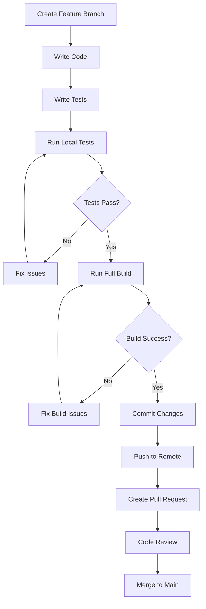

# Developer Getting Started Guide

Welcome to the OpenFrame OSS Library development environment! This guide will help you set up your development environment, understand the codebase, and start contributing effectively.

## Development Environment Setup

### Prerequisites for Development

| Tool | Version | Purpose | Installation |
|------|---------|----------|--------------|
| Java JDK | 17+ (recommended) | Development runtime | [Eclipse Temurin](https://adoptium.net/) |
| Maven | 3.8+ | Build and dependency management | [Maven Install](https://maven.apache.org/install.html) |
| IDE | Latest | Development environment | IntelliJ IDEA or Eclipse |
| Docker | Latest | Local services (MongoDB, etc.) | [Docker Desktop](https://www.docker.com/products/docker-desktop/) |
| Git | Latest | Version control | [Git Download](https://git-scm.com/) |

### Development Setup Steps

**1. Clone and Initialize Repository**
```bash
git clone https://github.com/your-org/openframe-oss-lib.git
cd openframe-oss-lib

# Install dependencies and build all modules
mvn clean install -DskipTests
```

**2. Set up Development Database**
```bash
# Start MongoDB with Docker
docker run -d \
  --name openframe-mongo-dev \
  -p 27017:27017 \
  -e MONGO_INITDB_DATABASE=openframe_dev \
  mongo:5.0

# Verify connection
docker exec -it openframe-mongo-dev mongo --eval "db.runCommand('ping')"
```

**3. IDE Configuration**

For **IntelliJ IDEA**:
```bash
# Import project as Maven project
# File > New > Project from Existing Sources > Select pom.xml

# Set up code style
# File > Settings > Editor > Code Style > Import Scheme > IntelliJ IDEA code style XML
```

For **Eclipse**:
```bash
# Import existing Maven project
# File > Import > Existing Maven Projects > Select root directory
```

**4. Configure Development Properties**

Create `src/main/resources/application-dev.properties`:
```properties
# Development Database
spring.data.mongodb.host=localhost
spring.data.mongodb.port=27017
spring.data.mongodb.database=openframe_dev

# Development Server
server.port=8080
server.servlet.context-path=/api

# Logging for Development
logging.level.com.openframe=DEBUG
logging.level.org.springframework.data.mongodb=DEBUG
logging.level.org.springframework.web=DEBUG

# Development OAuth (Mock/Testing)
spring.security.oauth2.client.registration.microsoft.client-id=dev-client-id
spring.security.oauth2.client.registration.microsoft.client-secret=dev-client-secret

# Hot Reload
spring.devtools.restart.enabled=true
spring.devtools.livereload.enabled=true
```

**5. Run Development Server**
```bash
# Run with development profile
mvn spring-boot:run -Dspring-boot.run.profiles=dev

# Or run specific module
cd openframe-api-service-core
mvn spring-boot:run -Dspring-boot.run.profiles=dev
```

## Repository Structure

```
openframe-oss-lib/
├── openframe-api-lib/                    # Shared DTOs and API models
│   └── src/main/java/com/openframe/api/
│       ├── dto/                          # Data Transfer Objects
│       │   ├── audit/                    # Audit log DTOs
│       │   ├── device/                   # Device-related DTOs  
│       │   ├── event/                    # Event filtering DTOs
│       │   └── organization/             # Organization DTOs
│       └── dto/shared/                   # Common shared DTOs
├── openframe-authorization-service-core/ # OAuth and authentication
│   └── src/main/java/com/openframe/authz/
│       └── service/auth/strategy/        # OAuth client strategies
├── openframe-api-service-core/          # Main REST API service
│   └── src/main/java/com/openframe/api/
├── openframe-client-core/               # Client service logic
│   └── src/main/java/com/openframe/client/
├── openframe-data-mongo/                # MongoDB data layer
│   └── src/main/java/com/openframe/data/
│       ├── document/                     # MongoDB document models
│       ├── reactive/repository/          # Reactive repositories
│       └── service/                      # Data services
├── openframe-stream-service-core/       # Event streaming
│   └── src/main/java/com/openframe/stream/
├── sdk/                                 # External service SDKs
│   ├── fleetmdm/                        # Fleet MDM integration
│   └── tacticalrmm/                     # Tactical RMM integration
├── docs/                                # Documentation
│   ├── dev/                             # Developer documentation
│   └── tutorials/                       # User and dev tutorials
└── pom.xml                             # Root Maven configuration
```

## Development Workflow



## Build and Test Commands

### Essential Development Commands

```bash
# Clean build all modules
mvn clean install

# Run tests only
mvn test

# Run integration tests
mvn integration-test

# Build without tests (faster for development)
mvn clean compile -DskipTests

# Run specific module tests
cd openframe-api-lib
mvn test

# Generate test coverage report
mvn jacoco:report

# Run checkstyle/code quality checks
mvn checkstyle:check
mvn spotbugs:check
```

### Development Testing

```bash
# Run with test profile
mvn spring-boot:run -Dspring-boot.run.profiles=test

# Run specific test class
mvn test -Dtest=OrganizationServiceTest

# Run tests matching pattern
mvn test -Dtest="*Repository*Test"
```

## Code Style and Conventions

### Java Coding Standards

**1. Package Structure**
```java
com.openframe.{module}.{layer}.{feature}

Examples:
- com.openframe.api.dto.organization     // DTOs
- com.openframe.data.repository.user     // Repositories  
- com.openframe.client.service.agent     // Services
```

**2. Class Naming Conventions**
```java
// DTOs
public class OrganizationResponse { }
public class CreateOrganizationRequest { }

// Services
public class OrganizationService { }
public interface UserRepository { }

// Reactive variants
public class ReactiveUserRepository { }
public class ReactiveOrganizationService { }
```

**3. Lombok Usage**
```java
// For DTOs
@Data
@Builder
@NoArgsConstructor
@AllArgsConstructor
public class OrganizationDto {
    private String id;
    private String name;
}

// For entities (be careful with @Data)
@Getter
@Setter
@NoArgsConstructor
@AllArgsConstructor
public class OrganizationDocument {
    private ObjectId id;
    private String organizationId;
}
```

### Database Conventions

**1. MongoDB Document Naming**
```java
@Document(collection = "organizations")
public class OrganizationDocument {
    @Id
    private ObjectId id;
    
    @Indexed(unique = true)
    private String organizationId;  // Business ID
    
    @CreatedDate
    private Instant createdAt;
    
    @LastModifiedDate
    private Instant updatedAt;
}
```

**2. Repository Patterns**
```java
// Reactive repositories
public interface ReactiveOrganizationRepository 
    extends ReactiveMongoRepository<OrganizationDocument, ObjectId> {
    
    Mono<OrganizationDocument> findByOrganizationId(String organizationId);
    Flux<OrganizationDocument> findByCategory(String category);
}
```

## Contributing Guidelines

### Before You Start

1. **Check existing issues**: Look for related issues or feature requests
2. **Discuss major changes**: Create an issue for significant features
3. **Follow branching strategy**: Use `feature/`, `bugfix/`, or `hotfix/` prefixes

### Development Process

**1. Create Feature Branch**
```bash
git checkout -b feature/organization-filtering
```

**2. Implement Changes**
- Write code following established patterns
- Add comprehensive tests
- Update documentation if needed

**3. Testing Requirements**
```bash
# Unit tests for new code
@Test
void shouldCreateOrganizationSuccessfully() {
    // Arrange
    CreateOrganizationRequest request = CreateOrganizationRequest.builder()
        .name("Test Org")
        .organizationId("TEST-001")
        .build();
    
    // Act
    OrganizationResponse response = organizationService.create(request);
    
    // Assert
    assertThat(response.getName()).isEqualTo("Test Org");
    assertThat(response.getOrganizationId()).isEqualTo("TEST-001");
}

# Integration tests for API endpoints
@WebMvcTest
@TestInstance(TestInstance.Lifecycle.PER_CLASS)
class OrganizationControllerIntegrationTest {
    // Test complete request/response cycle
}
```

**4. Documentation Updates**
- Update inline documentation for new DTOs
- Add module documentation for new features
- Update API documentation

### Code Quality Checks

```bash
# Run all quality checks before committing
mvn clean verify

# This runs:
# - Unit tests
# - Integration tests  
# - Checkstyle
# - SpotBugs
# - JaCoCo coverage
```

## Debug Tips and Common Issues

### Common Development Errors

<details>
<summary>MongoDB Connection Issues</summary>

**Error**: `MongoSocketOpenException: Exception opening socket`

**Solutions**:
```bash
# Check if MongoDB is running
docker ps | grep mongo

# Restart MongoDB container
docker restart openframe-mongo-dev

# Check connection string in application-dev.properties
spring.data.mongodb.uri=mongodb://localhost:27017/openframe_dev
```
</details>

<details>
<summary>Maven Build Failures</summary>

**Error**: `Could not resolve dependencies`

**Solutions**:
```bash
# Clear local repository
rm -rf ~/.m2/repository/com/openframe

# Rebuild from scratch
mvn clean install -U

# Build specific module
cd openframe-api-lib
mvn clean install
```
</details>

<details>
<summary>Test Failures in IDE vs Command Line</summary>

**Issue**: Tests pass in IDE but fail in Maven

**Solutions**:
```bash
# Check test resource loading
# Ensure test resources are in src/test/resources

# Run with same profile as IDE
mvn test -Dspring.profiles.active=test

# Check classpath issues
mvn dependency:tree
```
</details>

### Debugging Configuration

**Enable Debug Logging**:
```properties
# Add to application-dev.properties
logging.level.org.springframework.data.mongodb=TRACE
logging.level.org.springframework.web=DEBUG
logging.level.org.springframework.security=DEBUG
```

**Remote Debugging**:
```bash
# Start with debug port
mvn spring-boot:run -Dspring-boot.run.jvmArguments="-Xdebug -Xrunjdwp:transport=dt_socket,server=y,suspend=n,address=5005"

# Connect IDE debugger to localhost:5005
```

### Performance Debugging

```bash
# Profile memory usage
mvn spring-boot:run -Dspring-boot.run.jvmArguments="-XX:+PrintGCDetails -XX:+PrintGCTimeStamps"

# Enable actuator endpoints for monitoring
management.endpoints.web.exposure.include=health,info,metrics,prometheus
```

## Module Integration Patterns

### Working with DTOs

```java
// Converting between DTOs and documents
@Service
public class OrganizationMapper {
    
    public OrganizationResponse toResponse(OrganizationDocument doc) {
        return OrganizationResponse.builder()
            .id(doc.getId().toString())
            .organizationId(doc.getOrganizationId())
            .name(doc.getName())
            .createdAt(doc.getCreatedAt())
            .build();
    }
    
    public OrganizationDocument fromRequest(CreateOrganizationRequest request) {
        return OrganizationDocument.builder()
            .organizationId(request.getOrganizationId())
            .name(request.getName())
            .category(request.getCategory())
            .build();
    }
}
```

### Reactive Programming Patterns

```java
// Reactive service example
@Service
public class ReactiveOrganizationService {
    
    public Mono<OrganizationResponse> findByOrganizationId(String organizationId) {
        return repository.findByOrganizationId(organizationId)
            .map(organizationMapper::toResponse)
            .switchIfEmpty(Mono.error(
                new OrganizationNotFoundException(organizationId)));
    }
    
    public Flux<OrganizationResponse> findByCategory(String category) {
        return repository.findByCategory(category)
            .map(organizationMapper::toResponse);
    }
}
```

## Next Steps for Developers

1. **Explore the codebase**: Start with the API lib DTOs to understand data structures
2. **Read module documentation**: Check `docs/dev/module_*.md` files for detailed information
3. **Set up your first feature**: Pick a small enhancement to get familiar with the workflow
4. **Join the development process**: Participate in code reviews and architectural discussions

For architecture deep-dive, continue to the [Architecture Overview](architecture-overview-dev.md).