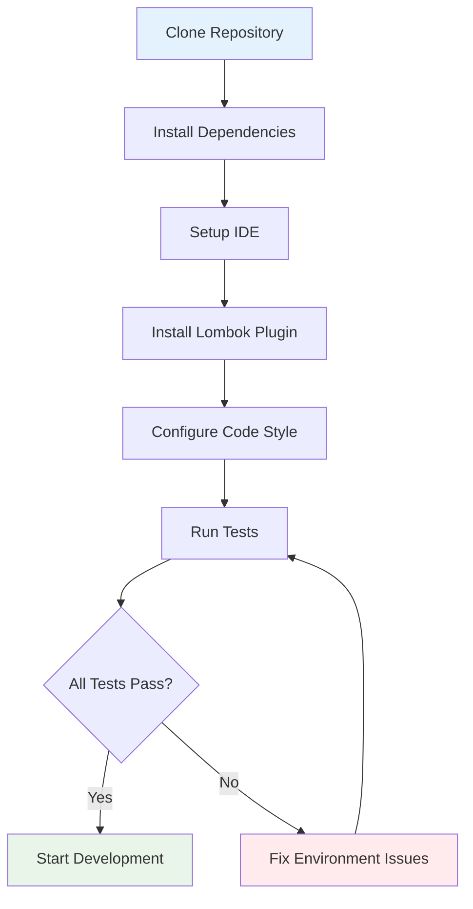

# Developer Getting Started Guide - OpenFrame OSS Library

Welcome to the OpenFrame OSS Library development team! This guide will help you set up your development environment and understand the codebase structure.

## Project Overview

The OpenFrame OSS Library is a Java-based DTO library that provides structured data models for audit logging and device filtering within the OpenFrame ecosystem. It's built using modern Java patterns with Lombok for boilerplate reduction and follows clean architecture principles.

## Development Environment Setup

### Prerequisites for Development

| Tool | Version | Purpose | Installation |
|------|---------|---------|--------------|
| **Java JDK** | 11+ | Runtime and compilation | Download from OpenJDK or Oracle |
| **Maven** | 3.6+ | Build automation | `brew install maven` (macOS) or download from Apache |
| **Git** | 2.20+ | Version control | Built-in on most systems |
| **IDE** | Latest | Development | IntelliJ IDEA (recommended) or Eclipse |
| **Lombok Plugin** | Latest | IDE support for annotations | Install from IDE marketplace |

### Development Workflow Setup



### Step 1: Clone and Build

```bash
# Clone the repository
git clone https://github.com/your-org/openframe-oss-lib.git
cd openframe-oss-lib

# Build and install dependencies
mvn clean install

# Run tests to verify setup
mvn test

# Generate IDE files (if needed)
mvn idea:idea  # For IntelliJ
mvn eclipse:eclipse  # For Eclipse
```

### Step 2: IDE Configuration

#### IntelliJ IDEA Setup
1. Open the project directory in IntelliJ
2. Install the Lombok plugin: `File > Settings > Plugins > Search for "Lombok"`
3. Enable annotation processing: `File > Settings > Build > Compiler > Annotation Processors`
4. Import Maven dependencies: `View > Tool Windows > Maven > Reload`

#### Code Style Configuration
```bash
# The project follows Google Java Style
# Download and import the style guide:
# 1. Download intellij-java-google-style.xml
# 2. File > Settings > Editor > Code Style > Java > Import Scheme
```

## Repository Structure

Here's the complete project structure:

```
openframe-oss-lib/
├── src/
│   └── main/
│       └── java/
│           └── com/
│               └── openframe/
│                   └── api/
│                       └── dto/
│                           ├── GenericQueryResult.java
│                           ├── CountedGenericQueryResult.java
│                           ├── audit/
│                           │   ├── LogEvent.java
│                           │   ├── LogDetails.java
│                           │   ├── LogFilters.java
│                           │   ├── LogFilterOptions.java
│                           │   └── OrganizationFilterOption.java
│                           └── device/
│                               ├── DeviceFilterOption.java
│                               ├── DeviceFilterOptions.java
│                               └── DeviceFilters.java
├── docs/
│   ├── dev/                    # Generated documentation
│   └── tutorials/              # User and dev tutorials
├── pom.xml                     # Maven configuration
└── README.md                   # Project overview
```

### Key Directory Explanations

| Directory | Purpose | Notes |
|-----------|---------|-------|
| `src/main/java/` | Main source code | All production DTOs live here |
| `com.openframe.api.dto` | Root package | Core generic DTOs |
| `com.openframe.api.dto.audit` | Audit logging DTOs | Log events, filters, options |
| `com.openframe.api.dto.device` | Device management DTOs | Device filters and options |
| `docs/dev/` | Auto-generated docs | CodeWiki documentation |
| `docs/tutorials/` | Hand-written guides | User and developer tutorials |

## Build and Test Commands

### Essential Maven Commands

```bash
# Clean and compile
mvn clean compile

# Run all tests
mvn test

# Package the library
mvn package

# Install to local repository
mvn install

# Generate documentation
mvn javadoc:javadoc

# Run specific test class
mvn test -Dtest=LogEventTest

# Skip tests (for quick builds)
mvn package -DskipTests

# Run with debug output
mvn -X clean install
```

### Testing Strategy

```bash
# Run tests with coverage
mvn jacoco:prepare-agent test jacoco:report

# Run integration tests (if present)
mvn failsafe:integration-test

# Check code style violations
mvn checkstyle:check
```

## Code Style and Conventions

### Java Coding Standards

**Class Naming**:
- DTOs: Use descriptive names ending in appropriate suffix (`LogEvent`, `DeviceFilters`)
- Follow PascalCase convention

**Package Structure**:
- `dto.audit.*` - Audit and logging related DTOs
- `dto.device.*` - Device management DTOs  
- `dto.*` - Generic/shared DTOs

**Lombok Usage**:
```java
// Standard DTO pattern
@Data                    // Generates getters, setters, equals, hashCode, toString
@Builder                 // Generates builder pattern
@NoArgsConstructor      // Default constructor for serialization
@AllArgsConstructor     // All-args constructor for builder
public class ExampleDto {
    private String field1;
    private String field2;
}

// For inheritance scenarios
@Data
@SuperBuilder           // Use instead of @Builder for inheritance
@NoArgsConstructor
@AllArgsConstructor
public class BaseDto<T> {
    private List<T> items;
}
```

**Field Conventions**:
- Use camelCase for field names
- Include proper validation annotations when applicable
- Use appropriate Java types (`Instant` for timestamps, `List<>` for collections)

### Documentation Standards

```java
/**
 * Represents a log event in the OpenFrame audit system.
 * 
 * <p>This DTO encapsulates all information related to a single
 * audit event, including metadata about the user, device, and
 * organization context.</p>
 * 
 * @author Developer Name
 * @since 1.0.0
 */
@Data
@Builder
@NoArgsConstructor
@AllArgsConstructor
public class LogEvent {
    /** Unique identifier for the log event */
    private String toolEventId;
    
    /** Type of event (LOGIN, LOGOUT, SECURITY_ALERT, etc.) */
    private String eventType;
    
    // ... other fields
}
```

## Contributing Guidelines

### Development Process

1. **Create Feature Branch**:
   ```bash
   git checkout -b feature/add-new-filter-option
   ```

2. **Make Changes**: 
   - Follow existing patterns in the codebase
   - Add tests for new functionality
   - Update documentation as needed

3. **Test Changes**:
   ```bash
   mvn clean test
   mvn checkstyle:check
   ```

4. **Commit and Push**:
   ```bash
   git add .
   git commit -m "feat: add new device filter option for OS version"
   git push origin feature/add-new-filter-option
   ```

5. **Create Pull Request**: Use the standard PR template

### Commit Message Format

```
<type>(<scope>): <description>

[optional body]

[optional footer]
```

**Types**: `feat`, `fix`, `docs`, `style`, `refactor`, `test`, `chore`

**Examples**:
```bash
git commit -m "feat(audit): add timezone field to LogEvent"
git commit -m "fix(device): correct filter option serialization"
git commit -m "docs(readme): update installation instructions"
```

## Common Development Errors and Solutions

### Issue 1: Lombok Not Working

**Symptoms**: Compilation errors about missing getters/setters

**Solution**:
```bash
# Verify Lombok is in dependencies
mvn dependency:tree | grep lombok

# Ensure annotation processing is enabled
# In IntelliJ: Settings > Build > Compiler > Annotation Processors ✓
```

### Issue 2: Test Failures

**Symptoms**: Tests fail unexpectedly

**Debug Steps**:
```bash
# Run specific test with verbose output
mvn test -Dtest=LogEventTest -X

# Check for dependency conflicts
mvn dependency:analyze

# Clean and rebuild
mvn clean compile test
```

### Issue 3: IDE Issues

**Symptoms**: IDE doesn't recognize generated code

**Solution**:
```bash
# Reimport Maven project
# IntelliJ: Maven tool window > Refresh

# Rebuild project
mvn clean compile
# Then: Build > Rebuild Project
```

## Debug Configuration

### Running with Debug Mode

```bash
# Start Maven with remote debugging
mvn -Dmaven.surefire.debug test

# Or with custom debug port
mvn -Dmaven.surefire.debug="-Xdebug -Xrunjdwp:transport=dt_socket,server=y,suspend=y,address=8000" test
```

### IDE Debug Setup

**IntelliJ IDEA**:
1. Run > Edit Configurations
2. Add New > Remote JVM Debug
3. Set port to 8000
4. Run debug configuration, then run Maven command

## Performance Considerations

### Memory Management
- **DTO Size**: Keep DTOs lightweight, avoid heavy objects
- **Collection Usage**: Use appropriate collection types (`List` vs `Set`)
- **Builder Pattern**: Efficient for object creation

### Best Practices for DTOs

```java
// ✅ Good: Efficient DTO design
@Data
@Builder
public class OptimizedDto {
    private String id;              // Use primitives when possible
    private List<String> tags;      // Specific generic types
    private Instant timestamp;      // Appropriate date handling
}

// ❌ Avoid: Heavy or poorly designed DTOs
public class ProblematicDto {
    private Map<Object, Object> metadata;  // Too generic
    private Date timestamp;                 // Deprecated date class
    private String[] tags;                  // Arrays instead of Lists
}
```

## Next Steps for New Developers

1. **Read Architecture Overview**: Check out [Architecture Overview](architecture-overview-dev.md)
2. **Explore Existing DTOs**: Understand patterns by examining existing classes
3. **Write Your First Test**: Create unit tests for any new DTOs
4. **Review Pull Requests**: Learn from existing code reviews
5. **Join Team Meetings**: Participate in architecture discussions

## Quick Development Checklist

Before submitting any changes:

- [ ] Code follows project style guidelines
- [ ] All tests pass (`mvn test`)
- [ ] New features include unit tests  
- [ ] Documentation is updated
- [ ] Commit messages follow convention
- [ ] No lint/checkstyle violations
- [ ] Branch is up to date with main

## Getting Help

### Internal Resources
- **Architecture Documentation**: `docs/dev/architecture-overview-dev.md`
- **API Documentation**: Generated Javadoc in `target/site/apidocs/`
- **Code Examples**: Check existing DTOs and tests

### Development Tools
- **Maven Central**: Check for dependency updates
- **Code Coverage**: View reports in `target/site/jacoco/`
- **Checkstyle Reports**: Available in `target/checkstyle-result.xml`

---

Welcome to the team! You're now ready to start contributing to the OpenFrame OSS Library. 🚀