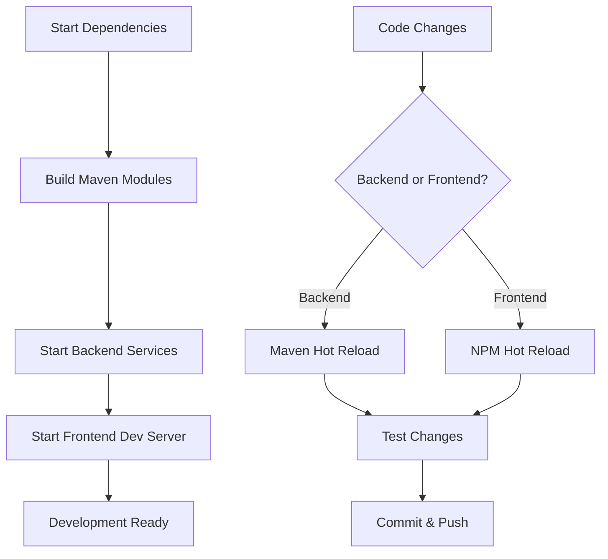

# Developer Getting Started Guide

Welcome to OpenFrame development! This guide will help you set up your development environment, understand the codebase structure, and start contributing to the OpenFrame OSS Library.

## Prerequisites

Ensure you have the following tools installed:

| Tool | Version | Purpose |
|------|---------|---------|
| Java JDK | 21+ | Backend development |
| Maven | 3.8+ | Build automation |
| Node.js | 18+ | Frontend development |
| Docker | 20.10+ | Local services |
| Git | 2.30+ | Version control |
| IDE | IntelliJ/VSCode | Development environment |

## Development Environment Setup

### 1. Clone and Fork the Repository

```bash
# Fork the repository on GitHub first, then clone your fork
git clone https://github.com/YOUR_USERNAME/openframe-oss-lib.git
cd openframe-oss-lib

# Add upstream remote
git remote add upstream https://github.com/flamingo-stack/openframe-oss-lib.git
```

### 2. IDE Configuration

#### IntelliJ IDEA Setup

1. **Import Project**
   - Open IntelliJ IDEA
   - Choose "Open or Import" 
   - Select the `openframe-oss-lib` directory
   - Import as Maven project

2. **Configure Project SDK**
   ```
   File → Project Structure → Project Settings → Project
   Project SDK: Java 21
   Project language level: 21
   ```

3. **Enable Annotation Processing**
   ```
   Settings → Build → Compiler → Annotation Processors
   ☑️ Enable annotation processing
   ```

#### VS Code Setup

Install recommended extensions:
```bash
# Java extensions
code --install-extension vscjava.vscode-java-pack

# Spring Boot extensions  
code --install-extension pivotal.vscode-spring-boot

# TypeScript/React for frontend
code --install-extension ms-vscode.vscode-typescript-next
code --install-extension bradlc.vscode-tailwindcss
```

### 3. Local Development Services

Start required services using Docker Compose:

```bash
# Start development dependencies
docker-compose up -d mongodb kafka redis pinot

# Verify services are running
docker-compose ps
```

### 4. Environment Configuration

Create development configuration:

```bash
# Copy environment template
cp .env.example .env.dev

# Edit development settings
cat > .env.dev << EOF
# Database
MONGODB_HOST=localhost
MONGODB_PORT=27017
MONGODB_DATABASE=openframe_dev

# Kafka
KAFKA_BOOTSTRAP_SERVERS=localhost:9092

# Redis
REDIS_HOST=localhost
REDIS_PORT=6379

# Development flags
SPRING_PROFILES_ACTIVE=dev
LOGGING_LEVEL_ROOT=INFO
LOGGING_LEVEL_COM_OPENFRAME=DEBUG

# Frontend development
NEXT_PUBLIC_API_URL=http://localhost:8080
NEXT_PUBLIC_GRAPHQL_URL=http://localhost:8080/graphql
NEXT_PUBLIC_DEBUG=true
EOF
```

## Repository Structure

The OpenFrame OSS Library follows a modular Maven architecture:

```
openframe-oss-lib/
├── 📁 openframe-core/                    # Core shared libraries
├── 📁 openframe-data/                    # Data access layer
├── 📁 openframe-data-mongo/              # MongoDB implementations  
├── 📁 openframe-data-kafka/              # Kafka streaming
├── 📁 openframe-security-core/           # Security foundations
├── 📁 openframe-security-oauth/          # OAuth2 implementation
├── 📁 openframe-api-lib/                 # API DTOs and interfaces
├── 📁 openframe-api-service-core/        # REST API service
├── 📁 openframe-management-service-core/ # Management APIs
├── 📁 openframe-gateway-service-core/    # API Gateway
├── 📁 openframe-frontend-core/           # React/TypeScript UI
├── 📁 sdk/                              # External SDKs
│   ├── 📁 tacticalrmm/                   # TacticalRMM integration
│   └── 📁 fleetmdm/                      # FleetMDM integration
├── 📄 pom.xml                           # Root Maven configuration
├── 📄 docker-compose.yml                # Development services
└── 📄 package.json                      # Node.js dependencies
```

### Module Responsibilities

| Module | Purpose | Key Components |
|--------|---------|----------------|
| **openframe-core** | Base shared code | Common utilities, configurations |
| **openframe-data** | Data abstraction | Repository interfaces, entities |
| **openframe-data-mongo** | MongoDB layer | MongoDB repositories, configs |
| **openframe-api-service-core** | REST APIs | Controllers, GraphQL resolvers |
| **openframe-management-service-core** | Management APIs | Device management, policies |
| **openframe-security-core** | Security | Authentication, authorization |
| **openframe-frontend-core** | UI Components | React components, design system |

## Build and Test

### Maven Build

```bash
# Clean and compile all modules
mvn clean compile

# Run tests
mvn test

# Build without tests (faster for development)
mvn clean install -DskipTests

# Build specific module
cd openframe-api-service-core
mvn clean install
```

### Frontend Build

```bash
# Navigate to frontend
cd openframe-frontend-core

# Install dependencies
npm install

# Development server
npm run dev

# Build for production
npm run build

# Type checking
npm run type-check
```

### Running Services in Development

#### Development Workflow



#### Start Backend Services

```bash
# Terminal 1: API Service
cd openframe-api-service-core
mvn spring-boot:run -Dspring-boot.run.profiles=dev

# Terminal 2: Management Service  
cd openframe-management-service-core
mvn spring-boot:run -Dspring-boot.run.profiles=dev

# Terminal 3: Gateway Service
cd openframe-gateway-service-core  
mvn spring-boot:run -Dspring-boot.run.profiles=dev
```

#### Start Frontend

```bash
# Terminal 4: Frontend
cd openframe-frontend-core
npm run dev
```

Access points:
- **Frontend**: http://localhost:3000
- **API Service**: http://localhost:8080
- **Management Service**: http://localhost:8081  
- **Gateway**: http://localhost:8082

## Code Style and Conventions

### Java Conventions

#### Project Standards

- **Java Version**: Java 21 with modern features
- **Code Style**: Google Java Style Guide
- **Annotations**: Use Lombok for boilerplate reduction
- **Testing**: JUnit 5 + Mockito for unit tests
- **Documentation**: JavaDoc for public APIs

#### Example Code Structure

```java
/**
 * Service for managing device operations.
 * 
 * @author OpenFrame Team
 * @since 5.9.3
 */
@Service
@RequiredArgsConstructor
@Slf4j
public class DeviceService {
    
    private final DeviceRepository deviceRepository;
    private final EventPublisher eventPublisher;
    
    /**
     * Updates device status by machine ID.
     * 
     * @param machineId the unique machine identifier
     * @param status the new device status
     * @throws DeviceNotFoundException if device not found
     */
    public void updateStatusByMachineId(String machineId, DeviceStatus status) {
        log.debug("Updating device status: {} -> {}", machineId, status);
        
        Device device = deviceRepository.findByMachineId(machineId)
            .orElseThrow(() -> new DeviceNotFoundException(machineId));
            
        device.setStatus(status);
        device.setLastUpdated(Instant.now());
        
        deviceRepository.save(device);
        eventPublisher.publishDeviceStatusChanged(device);
        
        log.info("Device status updated successfully: {}", machineId);
    }
}
```

#### Naming Conventions

| Type | Convention | Example |
|------|------------|---------|
| **Classes** | PascalCase | `DeviceService`, `OrganizationController` |
| **Methods** | camelCase | `findByMachineId()`, `updateDeviceStatus()` |
| **Variables** | camelCase | `machineId`, `deviceRepository` |
| **Constants** | UPPER_SNAKE_CASE | `MAX_RETRY_ATTEMPTS`, `DEFAULT_TIMEOUT` |
| **Packages** | lowercase.dot | `com.openframe.api.service` |

### TypeScript/React Conventions

#### Frontend Standards

- **TypeScript**: Strict mode enabled
- **React**: Function components with hooks
- **Styling**: Tailwind CSS + ODS design tokens
- **State**: React Query for server state
- **Forms**: React Hook Form with validation

#### Example Component Structure

```typescript
/**
 * Device status card component showing real-time device information.
 */
interface DeviceStatusCardProps {
  deviceId: string;
  showActions?: boolean;
  onStatusChange?: (status: DeviceStatus) => void;
}

export const DeviceStatusCard: React.FC<DeviceStatusCardProps> = ({
  deviceId,
  showActions = true,
  onStatusChange
}) => {
  const { data: device, isLoading, error } = useDevice(deviceId);
  
  const updateStatusMutation = useUpdateDeviceStatus({
    onSuccess: (updatedDevice) => {
      onStatusChange?.(updatedDevice.status);
      toast.success('Device status updated successfully');
    },
    onError: (error) => {
      toast.error(`Failed to update device: ${error.message}`);
    }
  });

  if (isLoading) {
    return <DeviceStatusCardSkeleton />;
  }

  if (error || !device) {
    return (
      <Card className="border-destructive">
        <CardContent className="p-4">
          <AlertCircle className="h-5 w-5 text-destructive inline mr-2" />
          Failed to load device information
        </CardContent>
      </Card>
    );
  }

  return (
    <Card className={cn(
      'transition-colors',
      device.status === 'online' && 'border-success',
      device.status === 'offline' && 'border-destructive'
    )}>
      <CardHeader>
        <CardTitle className="flex items-center justify-between">
          <span>{device.name}</span>
          <DeviceStatusBadge status={device.status} />
        </CardTitle>
      </CardHeader>
      
      {/* Component implementation continues... */}
    </Card>
  );
};
```

### Database Conventions

#### MongoDB Document Structure

```java
@Document(collection = "devices")
@Data
@Builder
@NoArgsConstructor
@AllArgsConstructor
public class Device {
    
    @Id
    private String id;
    
    @Indexed(unique = true)
    private String machineId;
    
    @NotNull
    private String name;
    
    @NotNull
    private String organizationId;
    
    @Enumerated(EnumType.STRING)
    private DeviceStatus status;
    
    private Map<String, String> tags;
    
    @CreatedDate
    private Instant createdAt;
    
    @LastModifiedDate
    private Instant lastUpdated;
    
    // Embedded documents
    private DeviceMetrics metrics;
    private List<InstalledAgent> agents;
}
```

## Testing Guidelines

### Unit Testing

#### Backend Testing (Java)

```java
@ExtendWith(MockitoExtension.class)
class DeviceServiceTest {
    
    @Mock
    private DeviceRepository deviceRepository;
    
    @Mock
    private EventPublisher eventPublisher;
    
    @InjectMocks
    private DeviceService deviceService;
    
    @Test
    @DisplayName("Should update device status successfully")
    void shouldUpdateDeviceStatus() {
        // Given
        String machineId = "test-machine-001";
        DeviceStatus newStatus = DeviceStatus.MAINTENANCE;
        Device device = Device.builder()
            .machineId(machineId)
            .status(DeviceStatus.ONLINE)
            .build();
            
        when(deviceRepository.findByMachineId(machineId))
            .thenReturn(Optional.of(device));
        when(deviceRepository.save(any(Device.class)))
            .thenReturn(device);
            
        // When
        deviceService.updateStatusByMachineId(machineId, newStatus);
        
        // Then
        verify(deviceRepository).save(argThat(d -> 
            d.getStatus() == newStatus && 
            d.getLastUpdated() != null
        ));
        verify(eventPublisher).publishDeviceStatusChanged(device);
    }
    
    @Test
    @DisplayName("Should throw exception when device not found")
    void shouldThrowExceptionWhenDeviceNotFound() {
        // Given
        String machineId = "non-existent-machine";
        when(deviceRepository.findByMachineId(machineId))
            .thenReturn(Optional.empty());
            
        // When & Then
        assertThatThrownBy(() -> 
            deviceService.updateStatusByMachineId(machineId, DeviceStatus.OFFLINE)
        ).isInstanceOf(DeviceNotFoundException.class)
         .hasMessage("Device not found: " + machineId);
    }
}
```

#### Frontend Testing (TypeScript)

```typescript
import { render, screen, waitFor } from '@testing-library/react';
import { QueryClient, QueryClientProvider } from '@tanstack/react-query';
import { DeviceStatusCard } from './device-status-card';

// Test utilities
const createTestQueryClient = () => new QueryClient({
  defaultOptions: { queries: { retry: false }, mutations: { retry: false } }
});

const renderWithProviders = (component: React.ReactElement) => {
  const queryClient = createTestQueryClient();
  return render(
    <QueryClientProvider client={queryClient}>
      {component}
    </QueryClientProvider>
  );
};

describe('DeviceStatusCard', () => {
  it('displays device information when loaded', async () => {
    // Mock the API response
    const mockDevice = {
      id: 'device-123',
      name: 'Test Device',
      status: 'online' as const,
      machineId: 'test-machine-001'
    };
    
    // Mock the custom hook
    jest.mocked(useDevice).mockReturnValue({
      data: mockDevice,
      isLoading: false,
      error: null
    });
    
    renderWithProviders(<DeviceStatusCard deviceId="device-123" />);
    
    await waitFor(() => {
      expect(screen.getByText('Test Device')).toBeInTheDocument();
      expect(screen.getByText('online')).toBeInTheDocument();
    });
  });
  
  it('shows loading skeleton while fetching', () => {
    jest.mocked(useDevice).mockReturnValue({
      data: undefined,
      isLoading: true,
      error: null
    });
    
    renderWithProviders(<DeviceStatusCard deviceId="device-123" />);
    
    expect(screen.getByTestId('device-status-skeleton')).toBeInTheDocument();
  });
});
```

### Integration Testing

```java
@SpringBootTest(webEnvironment = SpringBootTest.WebEnvironment.RANDOM_PORT)
@Testcontainers
@TestPropertySource(properties = {
    "spring.data.mongodb.uri=mongodb://localhost:27017/test",
    "spring.kafka.bootstrap-servers=localhost:9092"
})
class DeviceControllerIntegrationTest {
    
    @Container
    static MongoDBContainer mongoContainer = new MongoDBContainer("mongo:5.0");
    
    @Container  
    static KafkaContainer kafkaContainer = new KafkaContainer(
        DockerImageName.parse("confluentinc/cp-kafka:latest")
    );
    
    @Autowired
    private TestRestTemplate restTemplate;
    
    @Test
    void shouldUpdateDeviceStatus() {
        // Integration test implementation
    }
}
```

## Contributing Guidelines

### Branch Management

```bash
# Create feature branch
git checkout -b feature/device-status-improvements

# Create bugfix branch  
git checkout -b bugfix/device-query-performance

# Create hotfix branch
git checkout -b hotfix/security-vulnerability-fix
```

### Commit Message Convention

Follow [Conventional Commits](https://conventionalcommits.org/):

```bash
# Feature additions
git commit -m "feat(devices): add bulk status update API"

# Bug fixes
git commit -m "fix(auth): resolve JWT token expiration issue"

# Documentation
git commit -m "docs(api): update device endpoint documentation"

# Breaking changes
git commit -m "feat(api)!: change device status enum values"
```

### Pull Request Process

1. **Before Creating PR**
   ```bash
   # Sync with upstream
   git fetch upstream
   git rebase upstream/main
   
   # Run tests
   mvn test
   cd openframe-frontend-core && npm test
   
   # Check code style
   mvn checkstyle:check
   npm run lint
   ```

2. **PR Description Template**
   ```markdown
   ## Description
   Brief description of changes
   
   ## Type of Change
   - [ ] Bug fix
   - [ ] New feature  
   - [ ] Breaking change
   - [ ] Documentation update
   
   ## Testing
   - [ ] Unit tests pass
   - [ ] Integration tests pass
   - [ ] Manual testing completed
   
   ## Checklist
   - [ ] Code follows style guidelines
   - [ ] Self-review completed
   - [ ] Documentation updated
   ```

## Common Development Errors

### Maven Issues

| Error | Cause | Solution |
|-------|-------|----------|
| **Package not found** | Missing dependency | `mvn clean install` in dependency module first |
| **Test failures** | Environment issues | Check test containers and database connectivity |
| **Version conflicts** | Dependency mismatch | Use `mvn dependency:tree` to analyze conflicts |

### Spring Boot Issues

```bash
# Common debugging commands

# Check active profiles
curl http://localhost:8080/actuator/env

# Health check
curl http://localhost:8080/actuator/health

# View configuration properties
curl http://localhost:8080/actuator/configprops
```

### Frontend Development Issues

```bash
# Clear Next.js cache
rm -rf .next

# Clear npm cache
npm cache clean --force

# Reinstall dependencies
rm -rf node_modules package-lock.json
npm install

# Type checking
npx tsc --noEmit
```

## Debug Configuration

### IntelliJ Debug Setup

1. **Spring Boot Debug Configuration**
   ```
   Run → Edit Configurations → Add New → Spring Boot
   Main class: com.openframe.api.ApiServiceApplication
   VM options: -Dspring.profiles.active=dev
   Environment variables: Load from .env.dev
   ```

2. **Remote Debug Configuration**
   ```
   Run → Edit Configurations → Add New → Remote JVM Debug
   Host: localhost
   Port: 5005
   ```

### VS Code Debug Setup

Create `.vscode/launch.json`:

```json
{
  "version": "0.2.0",
  "configurations": [
    {
      "type": "java",
      "name": "Debug API Service",
      "request": "launch",
      "mainClass": "com.openframe.api.ApiServiceApplication",
      "args": "--spring.profiles.active=dev",
      "envFile": "${workspaceFolder}/.env.dev"
    },
    {
      "type": "node",
      "name": "Debug Frontend",
      "request": "launch",
      "program": "${workspaceFolder}/openframe-frontend-core/node_modules/.bin/next",
      "args": ["dev"],
      "cwd": "${workspaceFolder}/openframe-frontend-core"
    }
  ]
}
```

## Next Steps

### Explore the Codebase

1. **Start with Core Modules**
   - Review `openframe-core` for shared utilities
   - Examine `openframe-api-lib` for DTOs and interfaces
   - Study `openframe-data` for data models

2. **Understand Service Architecture**
   - Read [Architecture Overview](architecture-overview-dev.md) 
   - Review GraphQL schema definitions
   - Examine REST API controllers

3. **Frontend Components**
   - Explore the design system in `openframe-frontend-core`
   - Review React component patterns
   - Study state management with React Query

### Make Your First Contribution

1. **Good First Issues**
   - Look for `good-first-issue` labels on GitHub
   - Start with documentation improvements
   - Add unit tests for existing code

2. **Development Workflow**
   - Follow the branching strategy
   - Write tests for new features
   - Update documentation as needed

## Resources

- **Architecture Documentation**: [Architecture Overview](architecture-overview-dev.md)
- **API Documentation**: [OpenAPI Specs](../api/)
- **Component Library**: [Storybook Components](http://localhost:6006) (when running)
- **GitHub Repository**: [OpenFrame OSS Lib](https://github.com/flamingo-stack/openframe-oss-lib)

---

**Questions?** Join our [Developer Discord](https://discord.gg/openframe-dev) or open a [GitHub Discussion](https://github.com/flamingo-stack/openframe-oss-lib/discussions) for help with development setup.