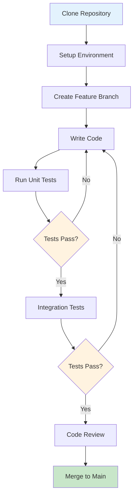

# Developer Getting Started Guide - OpenFrame OSS Library

Welcome to the OpenFrame OSS Library development environment! This guide will help you set up your development environment and understand the codebase structure.

## Development Environment Setup

### Prerequisites

| Tool | Version | Purpose | Installation Command |
|------|---------|---------|---------------------|
| Java JDK | 17+ | Development runtime | `sdk install java 17.0.8-tem` |
| Maven | 3.8+ | Build tool | `sdk install maven 3.9.4` |
| Git | Latest | Version control | Platform-specific installer |
| IDE | IntelliJ/Eclipse | Development environment | IDE-specific setup |
| Docker | Latest | Container runtime | `docker --version` |
| MongoDB Compass | Latest | Database GUI | [Download](https://www.mongodb.com/try/download/compass) |

### Environment Setup Commands

```bash
# Clone the repository
git clone https://github.com/your-org/openframe-oss-lib.git
cd openframe-oss-lib

# Verify Java installation
java -version
# Expected: openjdk version "17.0.x"

# Install dependencies and compile
mvn clean install

# Run tests to verify setup
mvn test

# Start local MongoDB for development
docker run -d --name openframe-mongo \
  -p 27017:27017 \
  -e MONGO_INITDB_ROOT_USERNAME=admin \
  -e MONGO_INITDB_ROOT_PASSWORD=password \
  mongo:6.0
```

## Repository Structure

```
openframe-oss-lib/
├── openframe-api-lib/               # Core API data transfer objects
│   └── src/main/java/com/openframe/api/dto/
│       ├── audit/                   # Audit and logging DTOs
│       ├── device/                  # Device management DTOs
│       ├── event/                   # Event handling DTOs
│       └── organization/            # Organization DTOs
├── docs/
│   ├── dev/                        # CodeWiki developer documentation
│   └── tutorials/                  # User and developer tutorials
├── sdk/                            # External SDK integrations
│   ├── fleetmdm/                   # Fleet MDM SDK
│   └── tacticalrmm/                # Tactical RMM SDK
├── openframe-client-core/          # Client service implementations
├── openframe-api-service-core/     # API service core logic
├── openframe-authorization-service-core/  # Authorization strategies
├── openframe-stream-service-core/  # Stream processing services
└── pom.xml                         # Main Maven configuration
```

## Development Workflow



## Build and Test Commands

### Basic Build Commands

```bash
# Clean and compile everything
mvn clean compile

# Run all tests
mvn test

# Run specific test class
mvn test -Dtest=GenericQueryResultTest

# Run integration tests only
mvn verify -P integration-tests

# Package without running tests (for CI)
mvn package -DskipTests

# Install to local Maven repository
mvn install
```

### Module-Specific Commands

```bash
# Build only the API library
mvn -pl openframe-api-lib clean compile

# Test only device DTOs
mvn test -Dtest="**/device/*Test"

# Generate test coverage report
mvn jacoco:report

# Run static analysis
mvn spotbugs:check pmd:check
```

## Code Style and Conventions

### Java Coding Standards

```java
// ✅ Good: Use meaningful names and proper structure
@Data
@SuperBuilder
@NoArgsConstructor
@AllArgsConstructor
public class DeviceFilterOptions {
    
    @NotNull
    @Size(min = 1, max = 100)
    private String organizationId;
    
    @Valid
    private List<TagFilterOption> tagFilters;
    
    @JsonFormat(pattern = "yyyy-MM-dd'T'HH:mm:ss")
    private LocalDateTime lastSeenAfter;
    
    // Builder pattern with validation
    public static class DeviceFilterOptionsBuilder {
        public DeviceFilterOptionsBuilder addTagFilter(String name, String value) {
            if (this.tagFilters == null) {
                this.tagFilters = new ArrayList<>();
            }
            this.tagFilters.add(TagFilterOption.builder()
                .tagName(name)
                .tagValue(value)
                .build());
            return this;
        }
    }
}
```

### Package Organization Conventions

```java
// DTO packages follow domain structure
com.openframe.api.dto.organization.*    // Organization-related DTOs
com.openframe.api.dto.device.*         // Device management DTOs
com.openframe.api.dto.audit.*          // Audit and logging DTOs
com.openframe.api.dto.event.*          // Event processing DTOs

// Service packages follow layered architecture
com.openframe.client.service.*         // Client-side services
com.openframe.api.service.*            // API service implementations
com.openframe.stream.service.*         // Stream processing services
```

### Testing Conventions

```java
// ✅ Good: Comprehensive test structure
@ExtendWith(MockitoExtension.class)
class OrganizationServiceTest {
    
    @Mock
    private ReactiveOrganizationRepository repository;
    
    @InjectMocks
    private OrganizationService organizationService;
    
    @Test
    @DisplayName("Should create organization with valid request")
    void shouldCreateOrganizationWithValidRequest() {
        // Given
        CreateOrganizationRequest request = CreateOrganizationRequest.builder()
            .name("Test Org")
            .category("Technology")
            .numberOfEmployees(50)
            .build();
            
        // When
        OrganizationResponse response = organizationService.createOrganization(request);
        
        // Then
        assertThat(response.getName()).isEqualTo("Test Org");
        assertThat(response.getCategory()).isEqualTo("Technology");
        verify(repository).save(any(Organization.class));
    }
    
    @Test
    @DisplayName("Should throw validation exception for invalid employee count")
    void shouldThrowValidationExceptionForInvalidEmployeeCount() {
        // Given
        CreateOrganizationRequest request = CreateOrganizationRequest.builder()
            .name("Test Org")
            .numberOfEmployees(-5)  // Invalid negative value
            .build();
            
        // When & Then
        assertThatThrownBy(() -> organizationService.createOrganization(request))
            .isInstanceOf(ConstraintViolationException.class)
            .hasMessageContaining("Number of employees must be zero or positive");
    }
}
```

## Contributing Guidelines Summary

### Branch Naming Convention

```bash
# Feature branches
feature/organization-management-api
feature/device-filtering-enhancements

# Bug fix branches
bugfix/null-pointer-in-query-service
bugfix/validation-error-handling

# Release branches
release/v1.2.0
hotfix/v1.1.1
```

### Commit Message Format

```bash
# Format: <type>(<scope>): <description>
feat(organization): add contact information DTO validation
fix(device): resolve null pointer in filter options
docs(api): update organization creation examples
test(service): add integration tests for agent registration
refactor(dto): simplify query result structure
```

### Pull Request Checklist

- [ ] Unit tests written and passing
- [ ] Integration tests updated if needed
- [ ] Documentation updated (JavaDoc + README)
- [ ] Code follows style guidelines
- [ ] No new compiler warnings
- [ ] Security review completed (for auth changes)

## Common Development Issues and Solutions

### Issue: Maven Build Fails

**Symptoms**: `mvn clean install` fails with dependency errors

**Debug Steps**:
```bash
# Clear local repository
rm -rf ~/.m2/repository/com/openframe
mvn dependency:purge-local-repository

# Verify Maven settings
mvn help:effective-settings

# Check for version conflicts
mvn dependency:tree
```

### Issue: Tests Fail in IDE but Pass in Maven

**Symptoms**: Tests work with `mvn test` but fail in IntelliJ/Eclipse

**Solution**:
```java
// Ensure test resources are in the right place
src/test/resources/
├── application-test.yml
├── logback-test.xml
└── test-data/

// Check IDE annotation processing is enabled
// Settings -> Build -> Compiler -> Annotation Processors -> Enable
```

### Issue: Lombok Not Working

**Symptoms**: Getter/setter methods not found, compilation errors

**Solution**:
```bash
# Install Lombok plugin in IDE
# IntelliJ: File -> Settings -> Plugins -> Search "Lombok"

# Enable annotation processing
# Settings -> Build -> Compiler -> Annotation Processors -> Enable annotation processing

# Verify Lombok version in pom.xml
<dependency>
    <groupId>org.projectlombok</groupId>
    <artifactId>lombok</artifactId>
    <version>1.18.30</version>
    <scope>provided</scope>
</dependency>
```

### Issue: Database Connection in Tests

**Symptoms**: Tests fail with MongoDB connection errors

**Solution**:
```java
// Use @TestConfiguration for test-specific setup
@TestConfiguration
public class TestDatabaseConfig {
    
    @Bean
    @Primary
    public MongoClient testMongoClient() {
        return MongoClients.create("mongodb://localhost:27017/openframe-test");
    }
}

// Or use embedded MongoDB for unit tests
@DataMongoTest
@ImportTestcontainers
class OrganizationRepositoryTest {
    
    @Container
    static MongoDBContainer mongoDBContainer = new MongoDBContainer("mongo:6.0")
        .withExposedPorts(27017);
        
    @DynamicPropertySource
    static void setProperties(DynamicPropertyRegistry registry) {
        registry.add("spring.data.mongodb.uri", mongoDBContainer::getReplicaSetUrl);
    }
}
```

## Debugging Tips

### Enable Detailed Logging

```yaml
# application-dev.yml
logging:
  level:
    com.openframe: DEBUG
    org.springframework.data.mongodb.core.MongoTemplate: DEBUG
    org.springframework.web: DEBUG
  pattern:
    console: "%d{yyyy-MM-dd HH:mm:ss} - %logger{36} - %level - %msg%n"
```

### Using IntelliJ Debugger

```java
// Set breakpoints and use conditional debugging
public GenericQueryResult<Organization> findOrganizations(OrganizationFilterOptions filters) {
    // Set conditional breakpoint: filters.getOrganizationId() != null
    log.debug("Searching organizations with filters: {}", filters);
    
    List<Organization> results = repository.findByFilters(filters);
    
    // Use "Evaluate Expression" to inspect: results.stream().map(Organization::getName).collect(toList())
    return GenericQueryResult.<Organization>builder()
        .items(results)
        .pageInfo(buildPageInfo(results))
        .build();
}
```

### Memory and Performance Monitoring

```bash
# Run with JVM monitoring flags
mvn spring-boot:run -Dspring-boot.run.jvmArguments="-XX:+UseG1GC -Xms512m -Xmx2g -XX:+HeapDumpOnOutOfMemoryError"

# Profile with async-profiler
java -javaagent:async-profiler.jar=start,event=cpu,file=profile.html -jar target/app.jar
```

## Next Steps for New Developers

1. **📚 Read the Documentation**: Review all module documentation in `docs/dev/`
2. **🔧 Set Up Your IDE**: Install required plugins (Lombok, Maven, Git integration)
3. **✅ Run the Test Suite**: Ensure all tests pass in your environment
4. **🏗️ Pick Your First Task**: Start with documentation improvements or small bug fixes
5. **🤝 Join the Team**: Participate in code reviews and team discussions

**Welcome to the team!** You're now ready to contribute to OpenFrame OSS Library. Start with small changes to get familiar with the codebase, then work your way up to larger features.