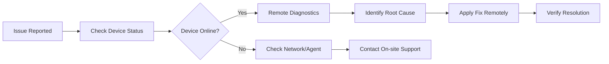

# Common Use Cases for OpenFrame

This guide covers the most common ways to use OpenFrame for device management, monitoring, and automation. Each use case includes step-by-step instructions and practical examples.

## Overview of Use Cases

OpenFrame excels in these key scenarios:

1. **Multi-location Device Monitoring** - Monitor devices across multiple offices or sites
2. **Automated Device Management** - Set up automated tasks and maintenance
3. **Security and Compliance Monitoring** - Track security events and ensure compliance  
4. **Remote Troubleshooting** - Diagnose and resolve device issues remotely
5. **Asset Management** - Track and manage IT assets across your organization
6. **Alert and Notification Management** - Set up intelligent alerting for critical issues
7. **Reporting and Analytics** - Generate insights from device data
8. **API Integration** - Connect OpenFrame with existing business systems

---

## 1. Multi-location Device Monitoring

**Scenario**: You have offices in multiple cities and need centralized monitoring of all devices.

### Setup Steps

1. **Create Location-based Organizations**
   ```
   Dashboard → Organizations → Create Organization
   ```
   - Create separate organizations for each location:
     - `Company-NYC-Office`
     - `Company-LA-Office` 
     - `Company-Remote-Workers`

2. **Configure Location-specific Agents**
   
   For each location, set up appropriate agents:
   
   **TacticalRMM for Office Computers:**
   ```bash
   # Install agent on Windows/Linux workstations
   powershell -c "iex(New-Object Net.WebClient).DownloadString('https://your-openframe-instance.com/agents/tacticalrmm')"
   ```
   
   **FleetMDM for Mobile Devices:**
   ```
   Dashboard → Devices → Add Device → FleetMDM
   ```
   - Configure mobile device enrollment profiles
   - Set location-specific policies

3. **Set Up Location Dashboards**
   
   Create custom dashboards for each location:
   - Filter devices by organization/location
   - Add location-specific widgets
   - Configure location-based alert thresholds

### Best Practices

- **Naming Convention**: Use consistent device naming: `[LOCATION]-[TYPE]-[NUMBER]`
- **Tagging**: Tag devices with location, department, and device type
- **Network Segmentation**: Consider network topology when deploying agents

---

## 2. Automated Device Management

**Scenario**: Automate routine maintenance tasks like updates, cleanups, and security scans.

### Common Automation Tasks

#### Automated Software Updates

1. **Create Update Policies**
   ```
   Dashboard → Policies → Create Policy
   Name: "Critical Security Updates"
   Type: Software Update
   Schedule: Daily at 2 AM
   ```

2. **Configure Update Rules**
   ```json
   {
     "updateTypes": ["security", "critical"],
     "autoReboot": true,
     "maintenanceWindow": {
       "start": "02:00",
       "end": "04:00",
       "timezone": "UTC"
     }
   }
   ```

#### Automated Disk Cleanup

1. **Create Cleanup Scripts**
   ```bash
   # Script for Windows disk cleanup
   cleanmgr /sagerun:1
   ```

2. **Schedule via TacticalRMM Integration**
   ```
   Dashboard → Scripts → Create Script
   Name: "Weekly Disk Cleanup"
   Schedule: Weekly on Sunday 3 AM
   ```

#### Security Compliance Checks

```bash
# Example compliance check script
#!/bin/bash
# Check for required security software
if ! pgrep -x "antivirus" > /dev/null; then
    echo "WARNING: Antivirus not running"
    exit 1
fi
echo "Security check passed"
```

### Setting Up Automation

<details>
<summary><strong>Step-by-Step Automation Setup</strong></summary>

1. **Define Automation Goals**
   - List repetitive tasks currently done manually
   - Identify maintenance windows
   - Determine success/failure criteria

2. **Create Script Templates**
   ```
   Dashboard → Scripts → Templates
   ```
   - Create reusable script templates
   - Test scripts on a small device subset first

3. **Configure Schedules**
   ```
   Dashboard → Schedules → Create Schedule
   ```
   - Set appropriate timing to minimize disruption
   - Configure retry logic for failed executions

4. **Monitor Automation Results**
   ```
   Dashboard → Automation → Execution History
   ```
   - Review execution logs
   - Set up alerts for automation failures
</details>

---

## 3. Security and Compliance Monitoring

**Scenario**: Ensure all devices meet security standards and compliance requirements.

### Security Monitoring Setup

#### 1. Enable Security Event Collection

```
Dashboard → Settings → Event Collection
☑️ Authentication Events
☑️ System Changes  
☑️ Network Activity
☑️ File Access Events
☑️ Process Execution
```

#### 2. Configure Compliance Policies

```json
{
  "passwordPolicy": {
    "minLength": 12,
    "requireComplexity": true,
    "maxAge": 90
  },
  "softwareRestrictions": {
    "blockedApplications": ["p2p-software", "unauthorized-tools"],
    "requiredSoftware": ["antivirus", "backup-client"]
  },
  "networkSecurity": {
    "requireVPN": true,
    "blockedPorts": [23, 135, 139, 445]
  }
}
```

#### 3. Set Up Compliance Dashboards

Create compliance overview dashboards:

| Metric | Target | Current | Status |
|--------|---------|---------|---------|
| Devices with Updated AV | 100% | 98% | ⚠️ |
| Password Policy Compliance | 100% | 95% | ⚠️ |
| System Updates Applied | 100% | 100% | ✅ |
| VPN Usage | 100% | 89% | ❌ |

### Common Compliance Frameworks

<details>
<summary><strong>SOC 2 Compliance Example</strong></summary>

**Requirements Tracking:**

1. **Access Controls**
   ```
   Dashboard → Users → Access Reports
   ```
   - Track user access patterns
   - Monitor privileged account usage
   - Generate access review reports

2. **System Monitoring**
   ```
   Dashboard → Logs → Security Events
   ```
   - Monitor system changes
   - Track administrative actions  
   - Alert on suspicious activities

3. **Data Protection**
   ```
   Dashboard → Devices → Encryption Status
   ```
   - Verify disk encryption
   - Monitor data access patterns
   - Track data transfer activities
</details>

---

## 4. Remote Troubleshooting

**Scenario**: Quickly diagnose and resolve device issues without physical access.

### Remote Troubleshooting Workflow



### Diagnostic Tools Available

#### 1. Real-time Device Information

```
Dashboard → Devices → [Device Name] → Live View
```

**Available Information:**
- CPU, Memory, Disk usage
- Running processes
- Network connections
- System logs
- Installed software

#### 2. Remote Command Execution

```bash
# Example diagnostic commands
# Check disk space
df -h

# Check running services
systemctl status

# Network connectivity test
ping -c 4 google.com
traceroute 8.8.8.8

# Check system logs
tail -f /var/log/syslog
```

#### 3. File System Access

```
Dashboard → Devices → [Device] → File Manager
```
- Browse device file systems
- Upload/download files
- Edit configuration files
- Review log files

### Common Troubleshooting Scenarios

<details>
<summary><strong>Scenario: Slow Performance</strong></summary>

**Steps to Diagnose:**

1. **Check Resource Usage**
   ```
   Dashboard → Device → Performance Tab
   ```
   - Review CPU, RAM, Disk I/O graphs
   - Identify resource bottlenecks

2. **Process Analysis**
   ```bash
   # Via remote command
   top -b -n 1 | head -20
   ```
   - Identify high-resource processes
   - Check for memory leaks

3. **Network Issues**
   ```bash
   # Network speed test
   speedtest-cli
   # Check network connections
   netstat -tulpn
   ```

4. **Apply Fixes**
   - Restart problematic services
   - Clear temporary files
   - Update drivers if needed
</details>

---

## 5. Asset Management

**Scenario**: Track hardware and software assets across your organization.

### Asset Tracking Setup

#### 1. Automatic Asset Discovery

```
Dashboard → Assets → Discovery Settings
☑️ Hardware Inventory
☑️ Software Inventory  
☑️ License Tracking
☑️ Change Detection
```

#### 2. Asset Categories

| Category | Tracked Items | Use Case |
|----------|---------------|----------|
| **Hardware** | CPU, RAM, Storage, Network | Upgrade planning, warranty tracking |
| **Software** | Applications, Licenses | Compliance, cost optimization |
| **Security** | Certificates, Policies | Security audits, renewals |
| **Network** | IP addresses, Ports | Network management, security |

#### 3. Custom Asset Fields

```json
{
  "customFields": {
    "purchaseDate": "2024-01-15",
    "warrantyExpiry": "2027-01-15", 
    "assetTag": "IT-2024-001",
    "location": "NYC-Office-Floor2",
    "owner": "john.doe@company.com",
    "costCenter": "IT-Department"
  }
}
```

### Asset Reports

Generate various asset reports:

```
Dashboard → Reports → Asset Reports
```

**Available Reports:**
- Hardware inventory by location
- Software license compliance
- Warranty expiry notifications
- Asset lifecycle reports
- Cost center allocations

---

## 6. Alert and Notification Management

**Scenario**: Stay informed about critical issues without being overwhelmed by noise.

### Smart Alerting Strategy

#### 1. Alert Severity Levels

| Severity | Examples | Response Time | Notification Method |
|----------|----------|---------------|-------------------|
| **Critical** | System down, Security breach | Immediate | SMS + Email + Slack |
| **High** | High CPU, Disk full | 5 minutes | Email + Slack |
| **Medium** | Update available, Warning | 30 minutes | Email |
| **Low** | Info events, Statistics | Daily digest | Email digest |

#### 2. Configure Alert Rules

```json
{
  "alertRules": [
    {
      "name": "High CPU Usage",
      "condition": "cpu_usage > 90",
      "duration": "5 minutes",
      "severity": "high",
      "notification": ["email", "slack"]
    },
    {
      "name": "Disk Space Critical", 
      "condition": "disk_free < 10%",
      "duration": "immediate",
      "severity": "critical",
      "notification": ["sms", "email", "slack", "webhook"]
    }
  ]
}
```

#### 3. Notification Channels

<details>
<summary><strong>Setting Up Notification Channels</strong></summary>

**Email Configuration:**
```
Dashboard → Settings → Notifications → Email
SMTP Server: smtp.company.com
Port: 587
Security: TLS
```

**Slack Integration:**
```
Dashboard → Settings → Integrations → Slack
Webhook URL: https://hooks.slack.com/services/...
Channel: #it-alerts
```

**SMS Alerts:**
```
Dashboard → Settings → Notifications → SMS
Provider: Twilio/AWS SNS
Phone Numbers: [List of emergency contacts]
```
</details>

---

## 7. Reporting and Analytics

**Scenario**: Generate insights and reports for management and compliance.

### Built-in Reports

#### 1. Operational Reports

```
Dashboard → Reports → Operational
```

**Available Reports:**
- Device uptime statistics
- Performance trends
- Service availability
- User activity reports

#### 2. Security Reports

```
Dashboard → Reports → Security  
```

**Security Metrics:**
- Failed login attempts
- Security event timeline
- Compliance status
- Vulnerability assessments

#### 3. Custom Report Builder

```
Dashboard → Reports → Custom → Create Report
```

**Report Components:**
- Data sources (devices, events, logs)
- Filters and grouping
- Visualization options
- Scheduling and distribution

### Sample Analytics Queries

```sql
-- Device performance trends
SELECT 
  date_trunc('day', timestamp) as day,
  avg(cpu_usage) as avg_cpu,
  avg(memory_usage) as avg_memory
FROM device_metrics 
WHERE timestamp > now() - interval '30 days'
GROUP BY day
ORDER BY day;

-- Security events by type
SELECT 
  event_type,
  count(*) as event_count,
  count(distinct device_id) as affected_devices
FROM security_events
WHERE timestamp > now() - interval '7 days'  
GROUP BY event_type
ORDER BY event_count DESC;
```

---

## 8. API Integration

**Scenario**: Integrate OpenFrame with existing business systems and workflows.

### Common Integration Patterns

#### 1. ITSM Integration (ServiceNow, Jira)

```javascript
// Auto-create tickets for critical alerts
const createTicket = async (alert) => {
  const ticket = await serviceNow.createIncident({
    short_description: alert.title,
    description: alert.description,
    urgency: alert.severity,
    assigned_to: alert.assignee,
    configuration_item: alert.deviceId
  });
  
  // Link back to OpenFrame
  await openframe.updateAlert(alert.id, {
    externalTicketId: ticket.number,
    status: 'escalated'
  });
};
```

#### 2. SIEM Integration (Splunk, ELK)

```bash
# Forward security events to SIEM
curl -X POST https://your-siem-endpoint.com/events \
  -H "Content-Type: application/json" \
  -d '{
    "timestamp": "2024-01-15T10:30:00Z",
    "source": "openframe",
    "event_type": "security_alert",
    "device_id": "device-001",
    "severity": "high",
    "details": {
      "alert_type": "failed_authentication",
      "user": "suspicious_user",
      "ip_address": "192.168.1.100"
    }
  }'
```

#### 3. Automation Platform Integration

<details>
<summary><strong>Ansible Integration Example</strong></summary>

```yaml
# Ansible playbook triggered by OpenFrame webhook
- name: Remediate high CPU usage
  hosts: "{{ target_device }}"
  tasks:
    - name: Restart high-resource services
      service:
        name: "{{ item }}"
        state: restarted
      loop:
        - apache2
        - mysql
      when: cpu_usage > 90

    - name: Clear temp files
      file:
        path: /tmp/*
        state: absent

    - name: Report back to OpenFrame
      uri:
        url: "https://openframe.company.com/api/alerts/{{ alert_id }}/resolve"
        method: POST
        headers:
          Authorization: "Bearer {{ openframe_token }}"
        body_format: json
        body:
          status: "resolved"
          resolution: "Automated remediation completed"
```
</details>

### API Usage Examples

```bash
# Get device list
curl -H "Authorization: Bearer YOUR_API_TOKEN" \
  https://your-openframe.com/api/devices

# Update device status  
curl -X PATCH \
  -H "Authorization: Bearer YOUR_API_TOKEN" \
  -H "Content-Type: application/json" \
  -d '{"status": "maintenance"}' \
  https://your-openframe.com/api/devices/device-123

# Get alert history
curl -H "Authorization: Bearer YOUR_API_TOKEN" \
  "https://your-openframe.com/api/alerts?start=2024-01-01&end=2024-01-31"
```

---

## Tips and Best Practices

### 🎯 **General Best Practices**

- **Start Small**: Begin with a pilot group before rolling out organization-wide
- **Document Everything**: Keep detailed documentation of your configurations
- **Regular Reviews**: Schedule monthly reviews of alerts, policies, and performance
- **User Training**: Ensure team members understand how to use the platform effectively

### 🔧 **Configuration Tips**

- **Naming Conventions**: Use consistent, descriptive names for devices, policies, and alerts
- **Tagging Strategy**: Implement a comprehensive tagging system for easy filtering
- **Backup Configurations**: Regularly export and backup your OpenFrame configurations
- **Test Changes**: Always test policy changes on a small subset before wide deployment

### 🚨 **Alert Management**

- **Avoid Alert Fatigue**: Tune alert thresholds to minimize false positives
- **Escalation Paths**: Define clear escalation procedures for different alert types
- **Maintenance Windows**: Configure maintenance windows to suppress non-critical alerts
- **Regular Review**: Weekly review of alert patterns and adjust thresholds as needed

### 📊 **Performance Optimization**

- **Data Retention**: Configure appropriate data retention policies
- **Index Management**: Optimize database indexes for better query performance  
- **Resource Monitoring**: Monitor OpenFrame itself for resource usage
- **Cleanup Routines**: Set up automated cleanup of old logs and events

---

## Getting Help

- **Community Forum**: [forum.openframe.io](https://forum.openframe.io)
- **Documentation**: [docs.openframe.io](https://docs.openframe.io)
- **GitHub Issues**: [Report bugs](https://github.com/flamingo-stack/openframe-oss-lib/issues)
- **Discord**: [Join our community](https://discord.gg/openframe)

**Need more specific guidance?** Check out our [Developer Tutorials](../dev/) for technical implementation details or contact our support team for enterprise assistance.