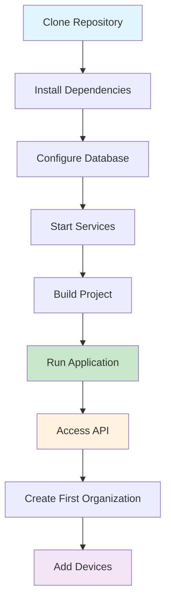

# Getting Started with OpenFrame

Welcome to OpenFrame! This guide will help you get up and running with the OpenFrame platform for device management and monitoring.

## Overview

OpenFrame is a comprehensive platform for managing devices, organizations, and integrating with various tools in your infrastructure. It provides REST APIs, GraphQL endpoints, and comprehensive monitoring capabilities.

## Prerequisites

Before you begin, ensure your system meets these requirements:

| Requirement | Version | Purpose | Installation Link |
|-------------|---------|---------|-------------------|
| Java | 21+ | Runtime environment | [OpenJDK](https://openjdk.org/) |
| Maven | 3.8+ | Build tool | [Maven Install](https://maven.apache.org/install.html) |
| MongoDB | 5.0+ | Primary database | [MongoDB Install](https://docs.mongodb.com/manual/installation/) |
| Redis | 6.0+ | Caching layer | [Redis Install](https://redis.io/docs/getting-started/installation/) |
| Kafka | 3.0+ | Event streaming | [Kafka Install](https://kafka.apache.org/quickstart) |

### Optional Components

| Component | Purpose | Required For |
|-----------|---------|--------------|
| Cassandra | Log storage | Audit logging |
| Apache Pinot | Analytics | Real-time analytics |
| Docker | Containerization | Production deployment |

## Installation

### 1. Clone the Repository

```bash
git clone https://github.com/flamingo-stack/openframe-oss-lib.git
cd openframe-oss-lib
```

### 2. Build the Project

```bash
# Build all modules
mvn clean install

# Skip tests for faster build (development only)
mvn clean install -DskipTests
```

### 3. Configure Your Environment

Create a configuration file for your environment:

```yaml
# application.yml
openframe:
  security:
    jwt:
      cache:
        expire-after: PT1H
        refresh-after: PT30M
        maximum-size: 1000

spring:
  data:
    mongodb:
      uri: mongodb://localhost:27017/openframe
  kafka:
    bootstrap-servers: localhost:9092
    consumer:
      group-id: openframe-group
  redis:
    host: localhost
    port: 6379

logging:
  level:
    com.openframe: DEBUG
```

### 4. Start Required Services

```bash
# Start MongoDB
mongod --dbpath /path/to/data/db

# Start Redis
redis-server

# Start Kafka (if using event streaming)
# In Kafka directory:
bin/zookeeper-server-start.sh config/zookeeper.properties
bin/kafka-server-start.sh config/server.properties
```

### 5. Initialize the Database

```bash
# Run database migrations (if available)
mvn spring-boot:run -Dspring-boot.run.arguments="--spring.profiles.active=setup"
```

## First Steps

### Setup Process Flow



### 1. Start the API Service

```bash
# Navigate to the API service
cd openframe-api-service-core

# Run the service
mvn spring-boot:run
```

The service will start on `http://localhost:8080` by default.

### 2. Verify Installation

Test the health endpoint:

```bash
curl http://localhost:8080/health
```

Expected response:
```json
{
  "status": "UP",
  "components": {
    "mongodb": {"status": "UP"},
    "redis": {"status": "UP"}
  }
}
```

### 3. Create Your First Organization

```bash
# Create an organization
curl -X POST http://localhost:8080/api/organizations \
  -H "Content-Type: application/json" \
  -d '{
    "name": "My Company",
    "category": "Technology",
    "numberOfEmployees": 50,
    "websiteUrl": "https://mycompany.com",
    "contactInformation": {
      "email": "admin@mycompany.com",
      "phoneNumber": "+1-555-0123"
    }
  }'
```

### 4. Register Your First Device

```bash
# Register a device
curl -X POST http://localhost:8080/api/devices \
  -H "Content-Type: application/json" \
  -d '{
    "deviceId": "laptop-001",
    "deviceType": "LAPTOP",
    "osType": "WINDOWS",
    "organizationId": "your-org-id-here"
  }'
```

## Basic Configuration

### Environment Variables

Set these environment variables for production:

```bash
export SPRING_PROFILES_ACTIVE=production
export MONGODB_URI=mongodb://your-mongo-host:27017/openframe
export REDIS_URL=redis://your-redis-host:6379
export KAFKA_BOOTSTRAP_SERVERS=your-kafka-host:9092
```

### Security Configuration

```yaml
openframe:
  security:
    jwt:
      # JWT issuer URL (replace with your OAuth provider)
      issuer-uri: https://your-auth-provider.com
      audience: openframe-api
```

## Common Use Cases

### Device Management
- Register and track devices across your organization
- Monitor device status and health
- Apply tags and filters for device organization

### Organization Management
- Create and manage multiple organizations
- Track organizational metadata and contacts
- Monitor organizational metrics

### Integration
- Connect with existing tools (Fleet, Authentik, databases)
- Stream events to external systems via Kafka
- Access data through REST APIs or GraphQL

## Common Issues and Solutions

| Issue | Symptom | Solution |
|-------|---------|----------|
| Build fails | Maven compilation errors | Check Java version is 21+, run `mvn clean` |
| MongoDB connection | "Connection refused" error | Verify MongoDB is running on correct port |
| Redis connection | Cache errors in logs | Check Redis service and configuration |
| Port conflicts | "Port already in use" | Change server port in application.yml |
| Memory issues | OutOfMemoryError | Increase JVM heap size: `-Xmx2g` |

> **Important**: Always check the application logs in `logs/` directory for detailed error information.

## Next Steps

1. **Explore the API**: Use the interactive API documentation (if available) or test endpoints with curl
2. **Set up monitoring**: Configure log aggregation and monitoring dashboards
3. **Production deployment**: Review security settings and deploy using Docker
4. **Read advanced tutorials**: Check out our device management and integration guides

## Getting Help

- **Documentation**: Check `docs/` directory for detailed module documentation
- **GitHub Issues**: Report bugs or request features
- **Logs**: Enable DEBUG logging for troubleshooting

> **Tip**: Start with a single organization and a few test devices to familiarize yourself with the platform before scaling up.

## Security Considerations

- Change default passwords and API keys
- Configure proper JWT validation
- Use HTTPS in production
- Regularly update dependencies
- Monitor access logs for suspicious activity

---

*This guide covers the basics of getting started with OpenFrame. For detailed configuration options and advanced features, please refer to the module-specific documentation.*