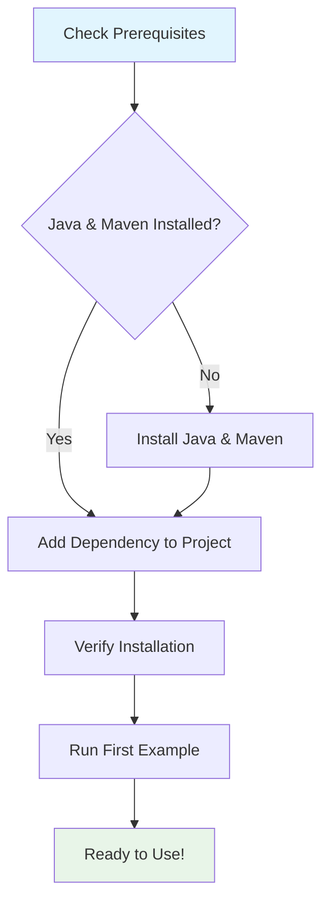

# Getting Started with OpenFrame OSS Library

Welcome to the OpenFrame OSS Library! This guide will help you get up and running with our audit logging and device filtering system.

## What is OpenFrame OSS Library?

OpenFrame OSS Library is a Java-based data transfer object (DTO) library that provides structured ways to manage audit logs and device information. It's designed to help you filter, query, and organize log events and device data efficiently.

## Prerequisites

Before you begin, make sure you have the following installed:

| Requirement | Minimum Version | Recommended | Notes |
|-------------|----------------|-------------|--------|
| Java | 8+ | 17+ | Required for running the library |
| Maven | 3.6+ | 3.8+ | For dependency management |
| IDE | Any | IntelliJ IDEA or Eclipse | For development work |

## Installation Process

Follow this step-by-step process to set up OpenFrame OSS Library:



### Step 1: Add Library Dependency

Add the following dependency to your Maven `pom.xml`:

```xml
<dependency>
    <groupId>com.openframe</groupId>
    <artifactId>openframe-api-lib</artifactId>
    <version>1.0.0</version>
</dependency>
```

Or for Gradle projects, add to your `build.gradle`:

```gradle
implementation 'com.openframe:openframe-api-lib:1.0.0'
```

### Step 2: Verify Installation

Create a simple test to verify the installation works:

```java
import com.openframe.api.dto.audit.LogEvent;
import java.time.Instant;

public class VerifyInstallation {
    public static void main(String[] args) {
        // Create a sample log event
        LogEvent event = LogEvent.builder()
            .toolEventId("test-001")
            .eventType("INFO")
            .severity("LOW")
            .summary("Installation test successful")
            .timestamp(Instant.now())
            .build();
        
        System.out.println("✅ OpenFrame OSS Library is working!");
        System.out.println("Event ID: " + event.getToolEventId());
    }
}
```

## Basic Configuration

### Setting Up Your First Log Event

Here's how to create and use a basic log event:

```java
import com.openframe.api.dto.audit.LogEvent;
import java.time.Instant;

// Create a log event with essential information
LogEvent logEvent = LogEvent.builder()
    .toolEventId("evt_" + System.currentTimeMillis())
    .eventType("USER_ACTION")
    .toolType("WEB_APP")
    .severity("MEDIUM")
    .userId("user123")
    .deviceId("device456")
    .hostname("web-server-01")
    .organizationId("org789")
    .organizationName("ACME Corporation")
    .summary("User logged into the system")
    .timestamp(Instant.now())
    .build();
```

### Setting Up Device Filters

Here's how to create device filters to query specific devices:

```java
import com.openframe.api.dto.device.DeviceFilterOption;
import com.openframe.api.dto.device.DeviceFilters;
import java.util.Arrays;

// Create device filter options
DeviceFilterOption statusFilter = DeviceFilterOption.builder()
    .value("ACTIVE")
    .label("Active Devices")
    .build();

DeviceFilterOption typeFilter = DeviceFilterOption.builder()
    .value("LAPTOP")
    .label("Laptop Computers")
    .build();

// Create a device filter collection
DeviceFilters filters = DeviceFilters.builder()
    .statuses(Arrays.asList(statusFilter))
    .types(Arrays.asList(typeFilter))
    .build();
```

## Your First Steps

### 1. Understanding the Core Components

The library consists of two main modules:

- **Module 1**: Handles individual log events and basic device filtering
- **Module 2**: Provides advanced filtering and query result management

### 2. Creating Your First Query

```java
import com.openframe.api.dto.*;
import com.openframe.api.dto.audit.*;
import java.util.Arrays;

// Set up log filters
LogFilters logFilters = LogFilters.builder()
    .toolTypes(Arrays.asList("WEB_APP", "MOBILE_APP"))
    .eventTypes(Arrays.asList("LOGIN", "LOGOUT"))
    .severities(Arrays.asList("HIGH", "CRITICAL"))
    .build();

// This filter object can now be used with your API endpoints
System.out.println("✅ Log filters configured successfully!");
```

### 3. Working with Query Results

```java
import com.openframe.api.dto.GenericQueryResult;
import com.openframe.api.dto.CountedGenericQueryResult;
import java.util.Arrays;

// Example of how query results are structured
GenericQueryResult<LogEvent> results = GenericQueryResult.<LogEvent>builder()
    .items(Arrays.asList(logEvent)) // Your log events
    .pageInfo(pageInfo) // Pagination details
    .build();

// For counted results (when you need total counts)
CountedGenericQueryResult<LogEvent> countedResults = 
    CountedGenericQueryResult.<LogEvent>builder()
        .items(Arrays.asList(logEvent))
        .pageInfo(pageInfo)
        .filteredCount(1)
        .build();
```

## Common Issues and Solutions

| Issue | Symptoms | Solution |
|-------|----------|----------|
| **Dependency not found** | ClassNotFoundException | Verify Maven/Gradle dependency is correctly added |
| **Lombok errors** | Getter/setter methods missing | Ensure Lombok plugin is installed in your IDE |
| **Timestamp parsing** | Date format exceptions | Use `Instant.now()` or `Instant.parse()` for timestamps |
| **Null pointer exceptions** | NPE on filter operations | Use builder pattern and check for null values |
| **Import errors** | Cannot resolve symbols | Verify package names: `com.openframe.api.dto.*` |

## Next Steps

Now that you have the library set up, you can:

1. **Explore Common Use Cases**: Check out our [Common Use Cases Guide](common-use-cases.md)
2. **Integrate with Your API**: Use the DTOs in your REST endpoints
3. **Set Up Advanced Filtering**: Create complex filter combinations
4. **Handle Pagination**: Work with large datasets using the pagination features

## Getting Help

> **💡 Tip**: Always use the builder pattern when creating DTOs. It ensures all required fields are set and makes your code more readable.

> **⚠️ Warning**: Remember to handle null values when working with filter options, as empty filters may cause unexpected results.

If you encounter any issues:

1. Check that all dependencies are properly imported
2. Verify that you're using the correct package names
3. Ensure your Java version meets the minimum requirements
4. Review the [Common Use Cases Guide](common-use-cases.md) for examples

Welcome to OpenFrame OSS Library! 🎉