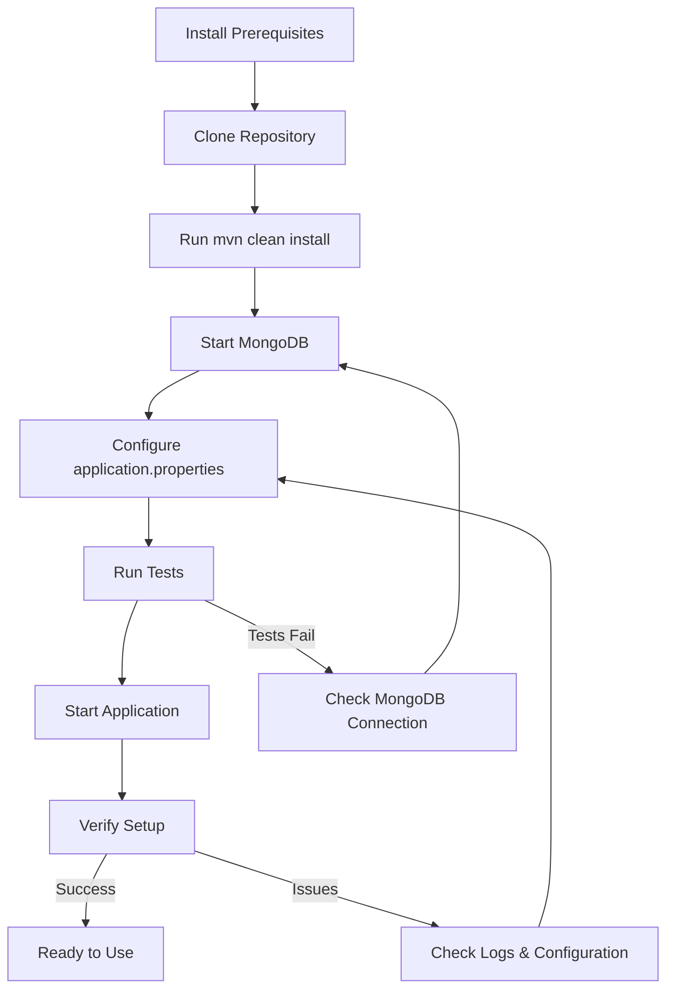

# Getting Started with OpenFrame OSS Library

Welcome to OpenFrame OSS Library! This guide will help you get up and running with the OpenFrame ecosystem for device management, organization handling, and event processing.

## What is OpenFrame OSS Library?

OpenFrame OSS Library is a comprehensive Java-based platform that provides:
- **Device Management**: Monitor and manage devices across your organization
- **Organization Management**: Handle organization data, contacts, and configurations
- **Event Processing**: Track and filter events across your infrastructure
- **Agent Management**: Deploy and manage agents for Fleet MDM and Tactical RMM
- **Authentication**: OAuth-based authentication with multiple providers

## Prerequisites

Before you begin, ensure you have the following installed:

| Requirement | Version | Purpose | Installation Link |
|------------|---------|----------|-------------------|
| Java JDK | 11+ | Runtime environment | [OpenJDK](https://openjdk.org/) |
| Maven | 3.6+ | Build tool | [Maven Download](https://maven.apache.org/download.cgi) |
| MongoDB | 4.4+ | Database | [MongoDB Installation](https://docs.mongodb.com/manual/installation/) |
| Git | Latest | Version control | [Git Download](https://git-scm.com/downloads) |

> **Note**: The system also integrates with external services like Fleet MDM and Tactical RMM, which may require additional setup.

## Installation Steps

### Step 1: Clone the Repository

```bash
git clone https://github.com/your-org/openframe-oss-lib.git
cd openframe-oss-lib
```

### Step 2: Install Dependencies

```bash
mvn clean install
```

This will download all required dependencies and build the project modules.

### Step 3: Configure MongoDB

1. Start your MongoDB instance:
```bash
# On Linux/Mac
sudo systemctl start mongod

# Or using Docker
docker run -d -p 27017:27017 --name mongodb mongo:latest
```

2. Create the application database:
```bash
# Connect to MongoDB
mongo

# Create database
use openframe

# Create a test collection
db.organizations.insertOne({name: "Test Organization"})
```

### Step 4: Basic Configuration

Create an `application.properties` file in your project root:

```properties
# Database Configuration
spring.data.mongodb.host=localhost
spring.data.mongodb.port=27017
spring.data.mongodb.database=openframe

# Server Configuration
server.port=8080

# Logging Configuration
logging.level.com.openframe=INFO
logging.level.org.springframework.data.mongodb=DEBUG
```

### Step 5: Verify Installation

Run a simple test to ensure everything is working:

```bash
mvn test
```

You should see output indicating that tests are passing.

## Setup Process Flow



## First Steps - Creating Your First Organization

Once installation is complete, let's create your first organization:

### 1. Start the Application

```bash
mvn spring-boot:run
```

### 2. Create an Organization via REST API

```bash
curl -X POST http://localhost:8080/api/organizations \
  -H "Content-Type: application/json" \
  -d '{
    "name": "My First Organization",
    "organizationId": "ORG-001",
    "category": "Technology",
    "numberOfEmployees": 50,
    "contactInformation": {
      "email": "admin@example.com",
      "phone": "+1-555-0123"
    }
  }'
```

### 3. List Organizations

```bash
curl http://localhost:8080/api/organizations
```

You should receive a response with your newly created organization.

## Common Issues and Solutions

| Issue | Symptoms | Solution |
|-------|----------|----------|
| MongoDB Connection Failed | `Connection refused` errors | Verify MongoDB is running and accessible |
| Port Already in Use | `Port 8080 already in use` | Change port in application.properties or stop conflicting service |
| Maven Build Fails | Compilation errors | Ensure Java 11+ is installed and JAVA_HOME is set |
| Tests Fail | Test execution errors | Check MongoDB connection and ensure test database is accessible |
| Dependencies Not Found | Missing artifact errors | Run `mvn dependency:resolve` and check internet connection |

> **Important**: If you encounter authentication issues, ensure your MongoDB instance doesn't require authentication, or configure the appropriate credentials in your application.properties.

## What's Next?

Now that you have OpenFrame OSS Library running:

1. **Explore the API**: Visit [Common Use Cases](common-use-cases.md) to learn about typical workflows
2. **Configure Integrations**: Set up Fleet MDM or Tactical RMM integrations
3. **Customize Organizations**: Add more detailed organization information
4. **Set Up Event Monitoring**: Configure event filters and processing
5. **Deploy Agents**: Use the agent management features for device monitoring

## Getting Help

- **Documentation**: Check the `docs/` directory for detailed module documentation
- **API Reference**: Once running, visit `http://localhost:8080/swagger-ui.html` (if configured)
- **Logs**: Check application logs in your console output for debugging information

Congratulations! You now have a working OpenFrame OSS Library installation. Continue to the [Common Use Cases](common-use-cases.md) guide to learn how to use the system effectively.