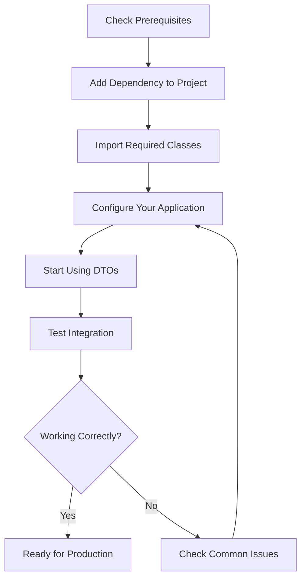

# OpenFrame API Library - Getting Started Guide

Welcome to the OpenFrame API Library! This guide will help you get started with integrating the OpenFrame API Library into your Java applications. The library provides a comprehensive set of Data Transfer Objects (DTOs) for managing devices, organizations, audit logs, and events in the OpenFrame ecosystem.

## Prerequisites

Before you begin, ensure you have the following installed and configured:

| Requirement | Version | Description |
|-------------|---------|-------------|
| Java | 11 or higher | The library requires Java 11+ for compilation and runtime |
| Maven/Gradle | Latest stable | Build tool for dependency management |
| IDE | Any Java IDE | IntelliJ IDEA, Eclipse, or VS Code recommended |
| Network Access | - | Access to Maven repositories for dependency downloads |

## Installation

### Using Maven

Add the following dependency to your `pom.xml`:

```xml
<dependency>
    <groupId>com.openframe</groupId>
    <artifactId>openframe-api-lib</artifactId>
    <version>1.0.0</version>
</dependency>
```

### Using Gradle

Add the following to your `build.gradle`:

```gradle
implementation 'com.openframe:openframe-api-lib:1.0.0'
```

## Setup Process

The following flowchart shows the typical setup process:



## Basic Configuration

### 1. Import Required Classes

Start by importing the DTOs you need in your Java classes:

```java
import com.openframe.api.dto.organization.OrganizationResponse;
import com.openframe.api.dto.device.DeviceFilterOptions;
import com.openframe.api.dto.audit.LogEvent;
import com.openframe.api.dto.GenericQueryResult;
```

### 2. Create Your First Organization Response

Here's a simple example of creating an organization response:

```java
import com.openframe.api.dto.organization.OrganizationResponse;
import java.time.Instant;
import java.time.LocalDate;
import java.math.BigDecimal;

public class QuickStart {
    public void createOrganization() {
        OrganizationResponse organization = OrganizationResponse.builder()
            .id("org-001")
            .name("My Company")
            .organizationId("MYCOMP001")
            .category("Technology")
            .numberOfEmployees(50)
            .websiteUrl("https://mycompany.com")
            .monthlyRevenue(new BigDecimal("25000.00"))
            .contractStartDate(LocalDate.now())
            .contractEndDate(LocalDate.now().plusYears(1))
            .createdAt(Instant.now())
            .isDefault(false)
            .deleted(false)
            .build();
        
        System.out.println("Created organization: " + organization.getName());
    }
}
```

### 3. Working with Device Filters

Filter devices using the DeviceFilterOptions DTO:

```java
import com.openframe.api.dto.device.DeviceFilterOptions;
import java.util.List;

public void filterDevices() {
    DeviceFilterOptions filterOptions = DeviceFilterOptions.builder()
        .organizationIds(List.of("org-001", "org-002"))
        .tagNames(List.of("production", "mobile"))
        .osTypes(List.of("Android", "iOS"))
        .build();
    
    // Use this filter with your device service
    // List<Device> devices = deviceService.findDevices(filterOptions);
}
```

### 4. Creating Audit Log Events

Track system events with LogEvent:

```java
import com.openframe.api.dto.audit.LogEvent;
import java.time.Instant;

public void logSystemEvent() {
    LogEvent logEvent = LogEvent.builder()
        .toolEventId("evt-" + System.currentTimeMillis())
        .eventType("USER_ACTION")
        .toolType("WEB_APP")
        .severity("INFO")
        .userId("user123")
        .organizationId("org-001")
        .organizationName("My Company")
        .summary("User performed important action")
        .timestamp(Instant.now())
        .ingestDay(LocalDate.now().toString())
        .build();
    
    // Send to your logging service
    // auditService.logEvent(logEvent);
}
```

## First Steps - "Hello OpenFrame"

Create a simple application that demonstrates the basic functionality:

```java
package com.example.openframe;

import com.openframe.api.dto.organization.OrganizationResponse;
import com.openframe.api.dto.GenericQueryResult;
import com.openframe.api.dto.shared.CursorPageInfo;
import java.util.List;
import java.time.Instant;

public class HelloOpenFrame {
    public static void main(String[] args) {
        // Create a sample organization
        OrganizationResponse org = OrganizationResponse.builder()
            .id("hello-org")
            .name("Hello OpenFrame Corp")
            .organizationId("HELLO001")
            .createdAt(Instant.now())
            .build();
        
        // Create a generic query result
        CursorPageInfo pageInfo = CursorPageInfo.builder()
            .hasNextPage(false)
            .hasPreviousPage(false)
            .build();
        
        GenericQueryResult<OrganizationResponse> result = 
            GenericQueryResult.<OrganizationResponse>builder()
                .items(List.of(org))
                .pageInfo(pageInfo)
                .build();
        
        System.out.println("✅ OpenFrame API Library is working!");
        System.out.println("Organization: " + result.getItems().get(0).getName());
        System.out.println("Total items: " + result.getItems().size());
    }
}
```

Compile and run this program:

```bash
# Compile
javac -cp "path/to/openframe-api-lib.jar:." HelloOpenFrame.java

# Run
java -cp "path/to/openframe-api-lib.jar:." HelloOpenFrame
```

Expected output:
```
✅ OpenFrame API Library is working!
Organization: Hello OpenFrame Corp
Total items: 1
```

## Common Issues and Solutions

| Issue | Symptom | Solution |
|-------|---------|----------|
| ClassNotFoundException | Class not found errors | Ensure the library is in your classpath |
| NoSuchMethodError | Method not found at runtime | Check Java version compatibility (requires Java 11+) |
| Lombok not working | Builder methods not available | Add Lombok plugin to your IDE or include Lombok in dependencies |
| Compilation errors | Cannot find imports | Verify the library version and that it's properly added to your project |
| NullPointerException | Null values in DTOs | Use the builder pattern and set required fields |

## Next Steps

Now that you have the library set up, you can:

1. **Explore the DTOs**: Browse the available DTOs for organizations, devices, audit logs, and events
2. **Integrate with your API**: Use these DTOs in your REST or GraphQL endpoints
3. **Set up filtering**: Implement advanced filtering using the FilterOptions classes
4. **Add validation**: Implement validation rules for your DTOs
5. **Read the Common Use Cases guide** for practical examples

## Getting Help

> **💡 Tip**: If you encounter issues, first check that all required fields are set when building DTOs using the builder pattern.

> **⚠️ Warning**: Always validate input data before creating DTOs, especially when dealing with user-provided data.

<details>
<summary>Advanced Configuration Options</summary>

### Custom Serialization

If you're using Jackson for JSON serialization, you might want to configure custom serializers:

```java
@JsonComponent
public class OrganizationResponseSerializer extends JsonSerializer<OrganizationResponse> {
    @Override
    public void serialize(OrganizationResponse value, JsonGenerator gen, 
                         SerializerProvider serializers) throws IOException {
        // Custom serialization logic
    }
}
```

### Validation Integration

Integrate with Bean Validation (JSR-303):

```java
import javax.validation.Valid;
import javax.validation.constraints.NotNull;

public class MyService {
    public void processOrganization(@Valid @NotNull OrganizationResponse org) {
        // Processing logic
    }
}
```

</details>

---

**Congratulations!** You've successfully set up the OpenFrame API Library. You're now ready to build robust applications with standardized DTOs for device management, organization handling, and audit logging.