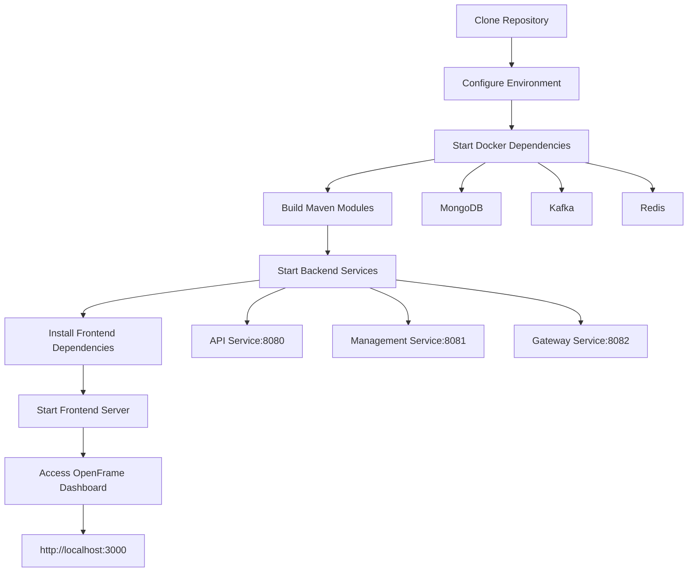

# Getting Started with OpenFrame

Welcome to OpenFrame! This guide will help you set up and start using the OpenFrame platform for device management, monitoring, and automation.

## What is OpenFrame?

OpenFrame is a comprehensive device management and monitoring platform that provides:
- **Device Management**: Monitor and manage devices across your infrastructure
- **Agent Integration**: Support for multiple management agents (TacticalRMM, FleetMDM, MeshCentral)
- **Real-time Monitoring**: Live device status, logs, and events
- **Organization Management**: Multi-tenant organization support
- **API Access**: RESTful APIs for integration with other systems

## Prerequisites

Before you begin, ensure you have the following installed:

| Requirement | Version | Purpose | Installation Guide |
|-------------|---------|---------|-------------------|
| Java JDK | 21+ | Backend services | [Download Oracle JDK](https://www.oracle.com/java/technologies/downloads/) |
| Maven | 3.8+ | Build tool | [Maven Installation Guide](https://maven.apache.org/install.html) |
| Docker | 20.10+ | Container runtime | [Docker Installation](https://docs.docker.com/get-docker/) |
| Docker Compose | 2.0+ | Multi-container management | Included with Docker Desktop |
| MongoDB | 5.0+ | Database | [MongoDB Installation](https://docs.mongodb.com/manual/installation/) |
| Node.js | 18+ | Frontend development | [Node.js Downloads](https://nodejs.org/) |
| npm or yarn | Latest | Package manager | Included with Node.js |

### System Requirements
- **RAM**: 8GB minimum, 16GB recommended
- **Storage**: 10GB free space minimum
- **OS**: Linux, macOS, or Windows with WSL2
- **Network**: Internet access for downloading dependencies

## Installation Steps

### 1. Clone the Repository

```bash
# Clone the main repository
git clone https://github.com/flamingo-stack/openframe-oss-lib.git
cd openframe-oss-lib
```

### 2. Set Up Environment Variables

Create environment configuration files:

```bash
# Copy example environment files
cp .env.example .env
cp docker-compose.override.yml.example docker-compose.override.yml
```

Edit the `.env` file with your configuration:

```bash
# Database Configuration
MONGODB_HOST=localhost
MONGODB_PORT=27017
MONGODB_DATABASE=openframe

# Security Configuration
JWT_SECRET=your-secret-key-here
OAUTH2_CLIENT_ID=your-client-id
OAUTH2_CLIENT_SECRET=your-client-secret

# Service Configuration
API_PORT=8080
MANAGEMENT_PORT=8081
GATEWAY_PORT=8082

# Frontend Configuration
NEXT_PUBLIC_API_URL=http://localhost:8080
NEXT_PUBLIC_APP_URL=http://localhost:3000
```

### 3. Start Dependencies with Docker

```bash
# Start MongoDB, Kafka, and other dependencies
docker-compose up -d mongodb kafka redis
```

### 4. Build the Backend Services

```bash
# Build all Maven modules
mvn clean install -DskipTests

# Or build with tests (recommended for development)
mvn clean install
```

### 5. Start the Services

```bash
# Start the API service
cd openframe-api-service-core
mvn spring-boot:run &

# Start the management service
cd ../openframe-management-service-core
mvn spring-boot:run &

# Start the gateway service
cd ../openframe-gateway-service-core
mvn spring-boot:run &
```

### 6. Set Up the Frontend

```bash
# Navigate to frontend directory
cd openframe-frontend-core

# Install dependencies
npm install

# Start development server
npm run dev
```

## Setup Process Flow



## First Steps

### 1. Access the Dashboard

Once all services are running, access the OpenFrame dashboard at:
```
http://localhost:3000
```

### 2. Create Your First Organization

1. Click **"Create Organization"** on the dashboard
2. Fill in your organization details:
   - **Name**: Your organization name
   - **Contact Person**: Admin contact
   - **Email**: Organization email
   - **Address**: Physical address (optional)

### 3. Register Your First Device

1. Navigate to **Devices** → **Add Device**
2. Choose your agent type:
   - **TacticalRMM**: For Windows/Linux endpoint management
   - **FleetMDM**: For mobile device management
   - **MeshCentral**: For remote access and control
3. Follow the agent-specific installation instructions

### 4. Explore Key Features

| Feature | Location | Description |
|---------|----------|-------------|
| Device Overview | Dashboard → Devices | View all registered devices and their status |
| Event Monitoring | Dashboard → Events | Real-time device events and alerts |
| Log Viewer | Dashboard → Logs | Centralized log viewing and search |
| API Explorer | Settings → API | Test and explore REST API endpoints |
| User Management | Settings → Users | Manage user access and permissions |

## Basic Configuration

### API Keys

Generate API keys for programmatic access:

```bash
# Create API key via REST endpoint
curl -X POST http://localhost:8080/api/keys \
  -H "Content-Type: application/json" \
  -d '{
    "name": "My API Key",
    "permissions": ["device:read", "device:write"]
  }'
```

### Agent Configuration

Configure device agents using the management API:

```bash
# Register TacticalRMM agent
curl -X POST http://localhost:8081/agents/tacticalrmm \
  -H "Content-Type: application/json" \
  -d '{
    "serverUrl": "https://your-rmm-server.com",
    "apiKey": "your-tacticalrmm-api-key",
    "organizationId": "your-org-id"
  }'
```

## Common Issues and Solutions

| Issue | Symptoms | Solution |
|-------|----------|----------|
| **Services Won't Start** | Port binding errors | Check if ports 8080, 8081, 8082 are available |
| **Database Connection Failed** | MongoDB connection errors | Verify MongoDB is running: `docker ps` |
| **Frontend Build Fails** | npm install errors | Clear cache: `npm cache clean --force` |
| **API Not Accessible** | 404/503 errors | Check service logs: `docker-compose logs api-service` |
| **Agent Registration Fails** | Device not appearing | Verify agent configuration and network connectivity |

### Troubleshooting Commands

```bash
# Check service status
docker-compose ps

# View service logs
docker-compose logs -f [service-name]

# Restart specific service
docker-compose restart [service-name]

# Check Java processes
jps -v

# Test API connectivity
curl http://localhost:8080/health
```

## Next Steps

> **Congratulations!** 🎉 You now have OpenFrame running locally.

### What's Next?

1. **Explore the User Guide**: Check out [Common Use Cases](common-use-cases.md) for practical examples
2. **API Integration**: Learn how to integrate with external systems using our REST APIs
3. **Production Deployment**: Review production deployment guidelines
4. **Community Support**: Join our community forums for support and discussions

### Quick Actions

- **Add more devices**: Scale your monitoring by registering additional devices
- **Set up alerts**: Configure notifications for critical device events  
- **Customize dashboards**: Tailor the interface to your monitoring needs
- **Explore integrations**: Connect with external tools and services

## Support

- **Documentation**: [docs.openframe.io](https://docs.openframe.io)
- **GitHub Issues**: [Report bugs and request features](https://github.com/flamingo-stack/openframe-oss-lib/issues)
- **Community**: [Discord Server](https://discord.gg/openframe)

---

**Need help?** If you encounter any issues during setup, please check our [troubleshooting guide](troubleshooting.md) or reach out to the community for assistance.