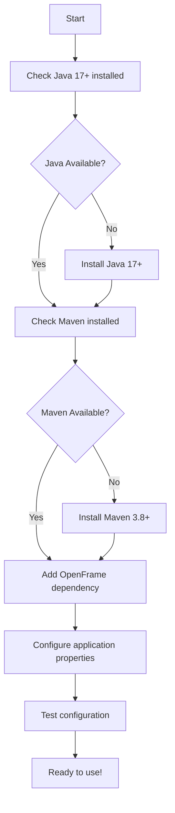

# Getting Started with OpenFrame API Library

Welcome to OpenFrame! This guide will help you get started with using the OpenFrame API Library for managing organizations, devices, events, and audit logs in your applications.

## Prerequisites

Before you begin, ensure you have the following installed:

| Requirement | Version | Purpose | Download Link |
|-------------|---------|---------|---------------|
| Java Development Kit (JDK) | 17 or higher | Runtime environment | [Oracle JDK](https://www.oracle.com/java/technologies/downloads/) or [OpenJDK](https://openjdk.org/) |
| Apache Maven | 3.8+ | Dependency management | [Maven Downloads](https://maven.apache.org/download.cgi) |
| Git | Latest | Version control | [Git Downloads](https://git-scm.com/downloads) |
| IDE (Optional) | Latest | Development environment | [IntelliJ IDEA](https://www.jetbrains.com/idea/) or [VS Code](https://code.visualstudio.com/) |

## Installation Process

Follow this flowchart for a smooth setup:



### Step 1: Add OpenFrame Dependency

Add the OpenFrame API library to your Maven `pom.xml`:

```xml
<dependency>
    <groupId>com.openframe</groupId>
    <artifactId>openframe-api-lib</artifactId>
    <version>1.0.0</version>
</dependency>
```

### Step 2: Configure Your Application

Create an `application.yml` file in your `src/main/resources` directory:

```yaml
openframe:
  api:
    base-url: https://api.openframe.io
    timeout: 30000
  pagination:
    default-page-size: 20
    max-page-size: 100
```

### Step 3: Basic Configuration

Create a simple configuration class:

```java
package com.yourcompany.config;

import org.springframework.boot.context.properties.ConfigurationProperties;
import org.springframework.context.annotation.Configuration;

@Configuration
@ConfigurationProperties(prefix = "openframe")
public class OpenFrameConfig {
    private Api api = new Api();
    private Pagination pagination = new Pagination();
    
    // Getters and setters
    public static class Api {
        private String baseUrl = "https://api.openframe.io";
        private int timeout = 30000;
        // Getters and setters
    }
    
    public static class Pagination {
        private int defaultPageSize = 20;
        private int maxPageSize = 100;
        // Getters and setters
    }
}
```

## First Steps: Creating Your First Organization

Here's a simple example to get you started with creating an organization:

```java
package com.yourcompany.service;

import com.openframe.api.dto.organization.CreateOrganizationRequest;
import com.openframe.api.dto.organization.ContactInformationDto;
import org.springframework.stereotype.Service;

@Service
public class OrganizationService {
    
    public void createFirstOrganization() {
        // Create a basic organization
        CreateOrganizationRequest request = CreateOrganizationRequest.builder()
            .name("My First Organization")
            .category("Technology")
            .numberOfEmployees(10)
            .websiteUrl("https://mycompany.com")
            .contactInformation(ContactInformationDto.builder()
                .email("contact@mycompany.com")
                .phone("+1-555-0123")
                .build())
            .build();
            
        System.out.println("Organization created: " + request.name());
    }
}
```

## Working with Query Results

OpenFrame uses paginated queries for efficient data handling:

```java
package com.yourcompany.service;

import com.openframe.api.dto.GenericQueryResult;
import com.openframe.api.dto.organization.OrganizationResponse;

public class QueryService {
    
    public void handlePaginatedResults() {
        // Example of working with paginated results
        GenericQueryResult<OrganizationResponse> result = getOrganizations();
        
        // Access the data
        List<OrganizationResponse> organizations = result.getItems();
        boolean hasMoreData = result.getPageInfo().isHasNextPage();
        String nextCursor = result.getPageInfo().getEndCursor();
        
        System.out.println("Found " + organizations.size() + " organizations");
        if (hasMoreData) {
            System.out.println("More data available, cursor: " + nextCursor);
        }
    }
}
```

## Common Issues and Solutions

| Issue | Symptom | Solution |
|-------|---------|----------|
| **Dependency conflicts** | ClassNotFoundException or NoSuchMethodError | Ensure you're using compatible versions and check for version conflicts |
| **Validation errors** | ConstraintViolationException | Check that required fields are not null/blank and numeric fields are non-negative |
| **Connection timeouts** | SocketTimeoutException | Increase timeout values in configuration or check network connectivity |
| **Pagination issues** | Empty or unexpected results | Verify cursor values and page size limits |
| **Maven build failures** | Compilation errors | Ensure Java 17+ is being used and all dependencies are resolved |

## Validation Best Practices

When creating requests, remember these validation rules:

> **Important:** All organization names must be non-blank, and numeric fields like `numberOfEmployees` and `monthlyRevenue` must be zero or positive.

```java
// ✅ Good - Valid request
CreateOrganizationRequest valid = CreateOrganizationRequest.builder()
    .name("Valid Company")  // Non-blank required
    .numberOfEmployees(5)   // Positive number
    .monthlyRevenue(new BigDecimal("50000"))  // Positive value
    .build();

// ❌ Bad - Will cause validation errors
CreateOrganizationRequest invalid = CreateOrganizationRequest.builder()
    .name("")  // Blank name - will fail validation
    .numberOfEmployees(-1)  // Negative number - will fail validation
    .build();
```

## Next Steps

<details>
<summary>Advanced Configuration Options</summary>

For production environments, consider these additional configurations:

```yaml
openframe:
  api:
    base-url: https://api.openframe.io
    timeout: 60000
    retry-attempts: 3
    connection-pool:
      max-connections: 100
      connection-timeout: 5000
  logging:
    enable-audit-logs: true
    log-level: INFO
  security:
    enable-ssl-validation: true
```
</details>

Now you're ready to start building with OpenFrame! Check out our [Common Use Cases Guide](./common-use-cases.md) for practical examples of typical workflows.

## Getting Help

- 📖 [API Documentation](https://docs.openframe.io)
- 🐛 [Report Issues](https://github.com/openframe/issues)
- 💬 [Community Forum](https://community.openframe.io)
- 📧 [Support Email](mailto:support@openframe.io)