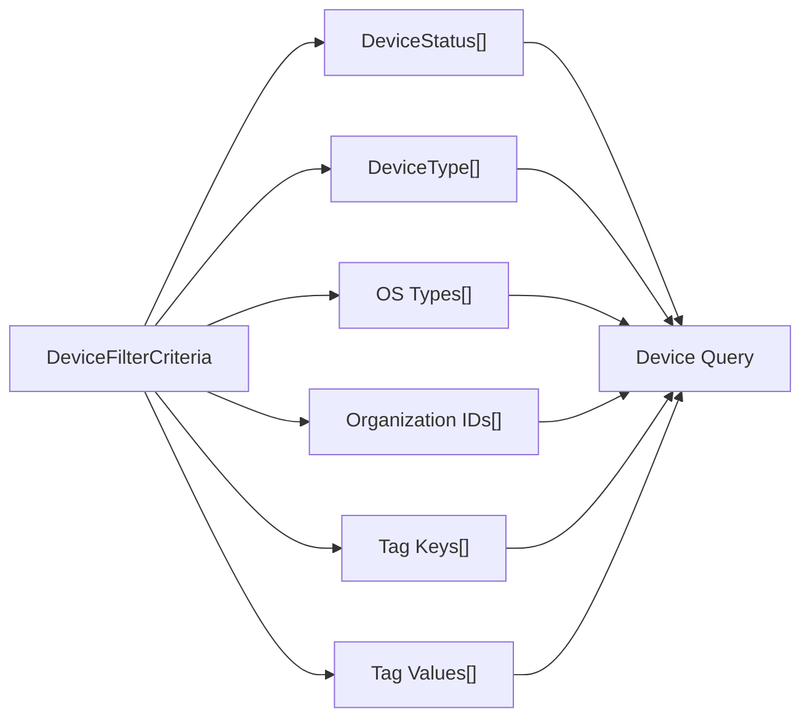

<!-- source-hash: 7c535e9ab81fa7c6d56bc77c87210739 -->
A Data Transfer Object (DTO) that encapsulates filter parameters for querying devices in the OpenFrame platform.

## Key Components

| Field | Type | Description |
|-------|------|-------------|
| `statuses` | `List<DeviceStatus>` | Filter by one or more device status values |
| `deviceTypes` | `List<DeviceType>` | Filter by device type (e.g., workstation, server) |
| `osTypes` | `List<String>` | Filter by operating system type |
| `organizationIds` | `List<String>` | Scope results to specific organizations |
| `tagKeys` | `List<String>` | Filter by tag key names |
| `tagValues` | `List<String>` | Filter by tag value names |

Built with Lombok annotations (`@Data`, `@Builder`, `@NoArgsConstructor`, `@AllArgsConstructor`) for boilerplate-free construction and access.

## Usage Example

```java
// Build a filter to find online Windows workstations in a specific org
DeviceFilterCriteria criteria = DeviceFilterCriteria.builder()
    .statuses(List.of(DeviceStatus.ONLINE))
    .deviceTypes(List.of(DeviceType.WORKSTATION))
    .osTypes(List.of("Windows"))
    .organizationIds(List.of("org-123"))
    .tagKeys(List.of("environment"))
    .tagValues(List.of("production"))
    .build();

// Pass to a device query service
List<Device> devices = deviceService.findByCriteria(criteria);
```

