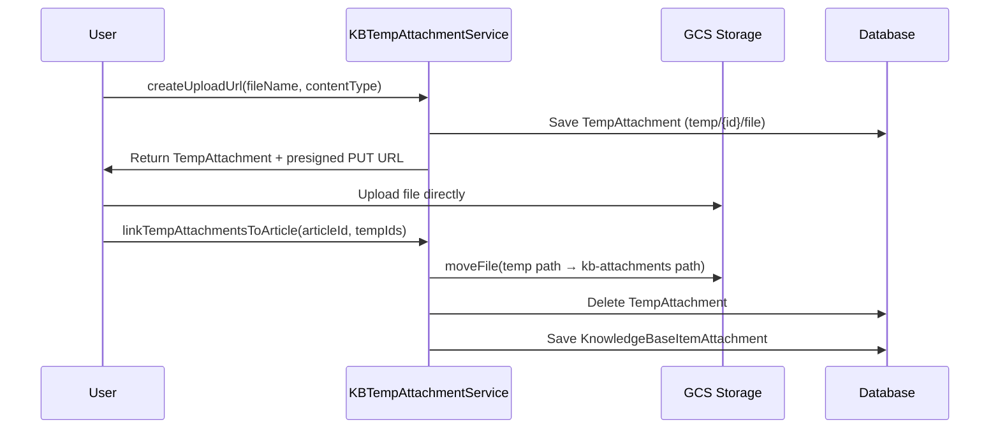

<!-- source-hash: 5cee5bb06bfbbd6548384b67aeb0723b -->
Manages temporary file uploads for Knowledge Base articles before they are permanently saved, mirroring the ticket-based `TempAttachmentService` pattern.

## Key Components

| Method | Description |
|--------|-------------|
| `createUploadUrl()` | Creates a `TempAttachment` record and generates a unique GCS storage path for a pending upload |
| `generateUploadUrl()` | Returns a presigned GCS PUT URL for direct frontend-to-storage upload |
| `deleteTempAttachment()` | Deletes a temp attachment from GCS and the database, enforcing uploader ownership |
| `linkTempAttachmentsToArticle()` | Moves temp files to permanent `kb-attachments/` paths and creates `KnowledgeBaseItemAttachment` records |
| `moveToArticle()` *(private)* | Handles per-file GCS move, temp record cleanup, and permanent attachment creation |

**Configuration property:** `openframe.kb.presigned-url-expiration-minutes` (default: `15`)

## Upload Flow



## Usage Example

```java
// Step 1: Request an upload URL
TempAttachment temp = kbTempAttachmentService.createUploadUrl(
    userId, "diagram.png", "image/png", 204800L
);
String presignedUrl = kbTempAttachmentService.generateUploadUrl(temp);
// Frontend uploads directly to presignedUrl via HTTP PUT

// Step 2: On article save, promote temp files to permanent storage
List<KnowledgeBaseItemAttachment> attachments =
    kbTempAttachmentService.linkTempAttachmentsToArticle(
        articleId,
        List.of(temp.getId()),
        userId
    );
```