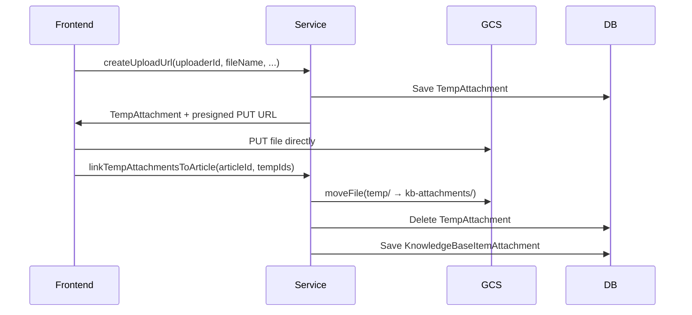

<!-- source-hash: 2436f8dbfe9355840d4a7b609566f4d5 -->
Manages temporary file uploads for Knowledge Base articles before they are permanently saved, mirroring the ticket-based `TempAttachmentService` pattern with GCS-backed presigned URL support.

## Key Components

| Method | Description |
|--------|-------------|
| `createUploadUrl()` | Creates a `TempAttachment` record with a unique GCS temp path and returns it for presigned URL generation |
| `generateUploadUrl()` | Generates a time-limited GCS presigned PUT URL for direct frontend-to-GCS upload |
| `deleteTempAttachment()` | Deletes a temp attachment from GCS and the database, enforcing uploader ownership |
| `linkTempAttachmentsToArticle()` | Promotes temp files to permanent `kb-attachments/` storage, creates `KnowledgeBaseItemAttachment` records, and cleans up temp entries |
| `moveToArticle()` *(private)* | Moves a single file from `temp/{id}/` to `kb-attachments/{articleId}/` via GCS, with per-file error isolation |

## Upload Flow



## Usage Example

```java
// Step 1: Create temp upload record and get presigned URL
TempAttachment temp = knowledgeBaseTempAttachmentService
    .createUploadUrl("user-123", "diagram.png", "image/png", 204800L);

String uploadUrl = knowledgeBaseTempAttachmentService
    .generateUploadUrl(temp);
// Frontend uploads directly to uploadUrl via HTTP PUT

// Step 2: On article save, promote temp files to permanent storage
List<KnowledgeBaseItemAttachment> attachments =
    knowledgeBaseTempAttachmentService.linkTempAttachmentsToArticle(
        "article-456",
        List.of(temp.getId()),
        "user-123"
    );
```

## Configuration

| Property | Default | Description |
|----------|---------|-------------|
| `openframe.kb.presigned-url-expiration-minutes` | `15` | Lifetime of the GCS presigned upload URL |